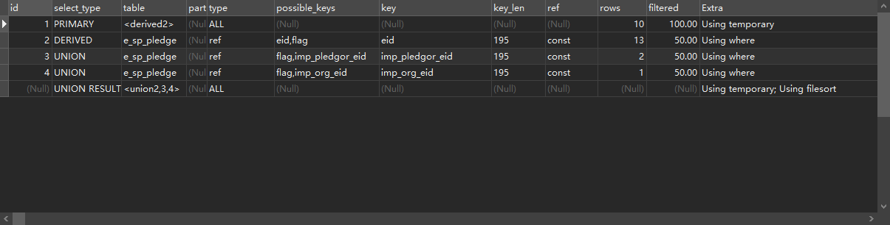
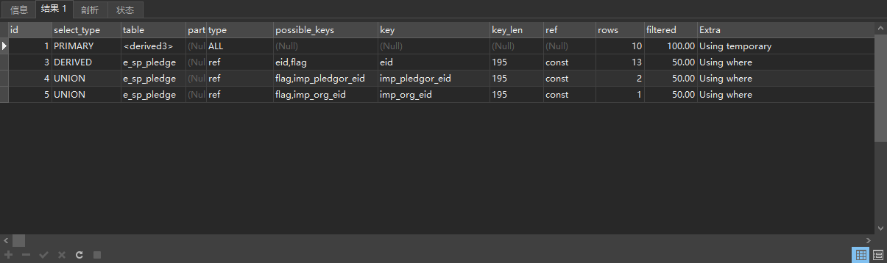
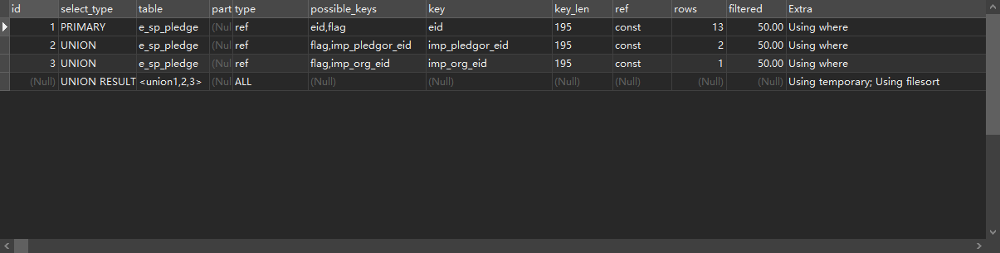
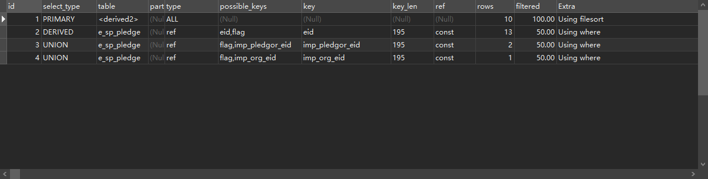

# MySQL-论优化器觉得我不需要排序-21/09/15

版本：8.0.16


语句一：

```sql
EXPLAIN
select * from (
    select id,equpledate,imporgid,1 as impType from e_sp_pledge where eid = 'q6d9931c5b234d3856fa9159956b47b35' and flag = '1' 
    union all 
    select id,equpledate,imporgid,2 as impType from e_sp_pledge where imp_pledgor_eid = 'q6d9931c5b234d3856fa9159956b47b35' and flag = '1' 
    union all 
    select id,equpledate,imporgid,3 as impType from e_sp_pledge where imp_org_eid = 'q6d9931c5b234d3856fa9159956b47b35' and flag = '1' 
    order by equpledate desc
) t_sort group by t_sort.imporgid 
```

语句一执行计划：




语句二：

```sql
EXPLAIN
select * from (
    select * from (select id,equpledate,imporgid,1 as impType from e_sp_pledge where eid = 'q6d9931c5b234d3856fa9159956b47b35' and flag = '1' 
    union all 
    select id,equpledate,imporgid,2 as impType from e_sp_pledge where imp_pledgor_eid = 'q6d9931c5b234d3856fa9159956b47b35' and flag = '1' 
    union all 
    select id,equpledate,imporgid,3 as impType from e_sp_pledge where imp_org_eid = 'q6d9931c5b234d3856fa9159956b47b35' and flag = '1') t 
    order by equpledate desc
) t_sort group by t_sort.imporgid 
```

语句二执行计划：




**我file sort呢？？？**


记录两种排序写法的执行计划

- 一：order by 和 union all 写在同级

```sql
EXPLAIN
select id,equpledate,imporgid,1 as impType from e_sp_pledge where eid = 'q6d9931c5b234d3856fa9159956b47b35' and flag = '1' 
union all 
select id,equpledate,imporgid,2 as impType from e_sp_pledge where imp_pledgor_eid = 'q6d9931c5b234d3856fa9159956b47b35' and flag = '1' 
union all 
select id,equpledate,imporgid,3 as impType from e_sp_pledge where imp_org_eid = 'q6d9931c5b234d3856fa9159956b47b35' and flag = '1' 
order by equpledate desc
```



- 二：作为union作为子查询后排序

  ``` sql
  EXPLAIN
  select * from (
      select id,equpledate,imporgid,1 as impType from e_sp_pledge where eid = 'q6d9931c5b234d3856fa9159956b47b35' and flag = '1' 
      union all 
      select id,equpledate,imporgid,2 as impType from e_sp_pledge where imp_pledgor_eid = 'q6d9931c5b234d3856fa9159956b47b35' and flag = '1' 
      union all 
      select id,equpledate,imporgid,3 as impType from e_sp_pledge where imp_org_eid = 'q6d9931c5b234d3856fa9159956b47b35' and flag = '1'
  ) t order by equpledate desc
  ```

  ​	

