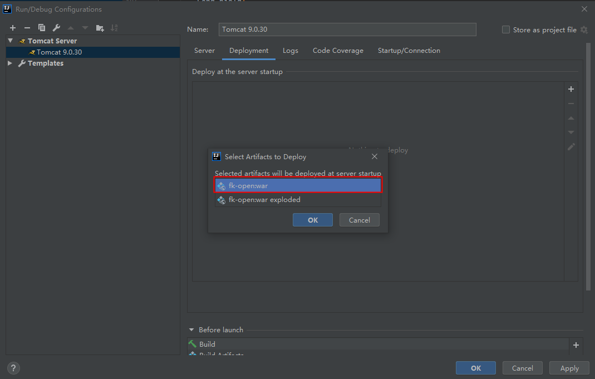

# TomcatDepolyWarClash

使用IDEA中Tomcat部署war包时，端口号不同，但Application Context路径设置为`/`时，第二个部署的应用会把第一个覆盖。

发生这个问题的原因是我部署的时候选择了使用Artifacts 不带exploded的版本进行部署。

这两种部署方式的区别是：

- war：将打出来的war包部署到tomcat的webapps下面
- war exploded：使用项目本地target目录作为应用的根路径

由于我配置的Application Context是`/`所以通过war部署的话会在`tomcat/webapps/Root/`下部署，自然部署两份就会出现覆盖的问题，而用war exploded部署的话只是将`webapps/Root/`指向了项目的`target/`目录，就不会有冲突的问题。