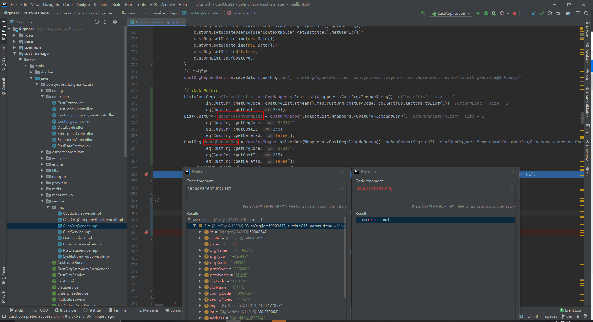
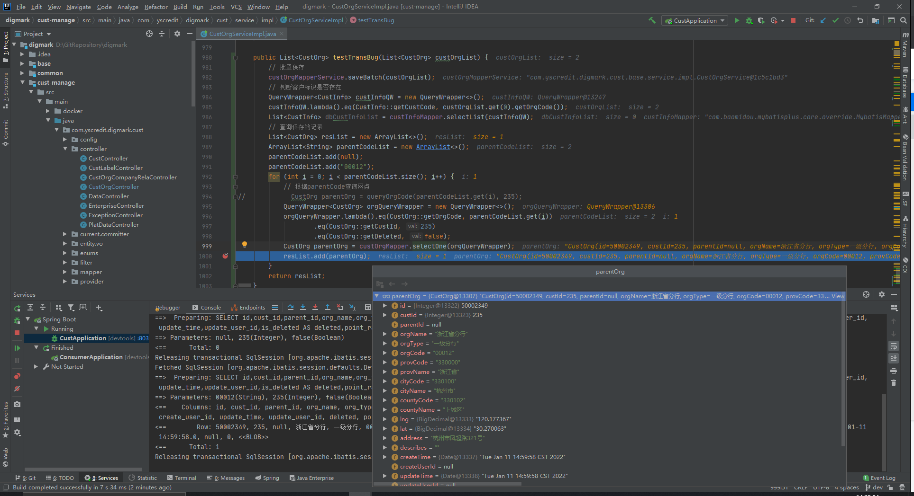

## 描述

类上标注了`@Transactional`注解，业务方法逻辑批量插入数据后，再使用`mybatis-plus`的`selectOne()`方法无法查询出刚刚插入的数据，`selectList()`方法却可以查询出来。

在同一个类中写了一个测试方法，这个测试方法却能够通过`selectOne()`方法查询到插入的结果

## 结论

Mybatis的一级缓存导致同一个事务中，相同条件的查询在第一次查询返回结果后会被缓存下来，后续的相同条件查询都会从这个缓存中返回。