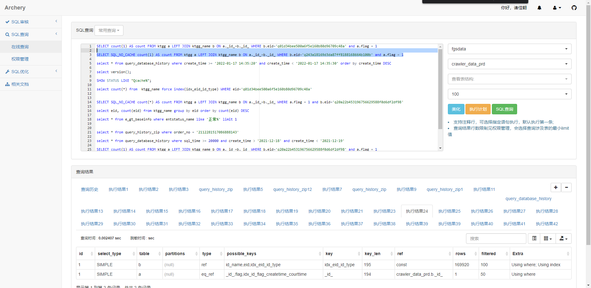
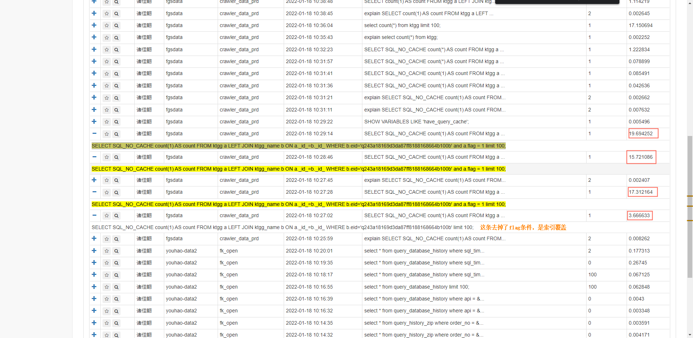
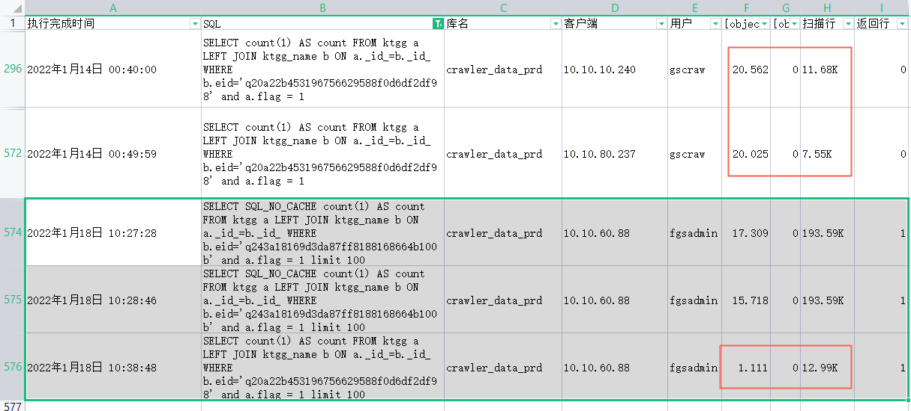
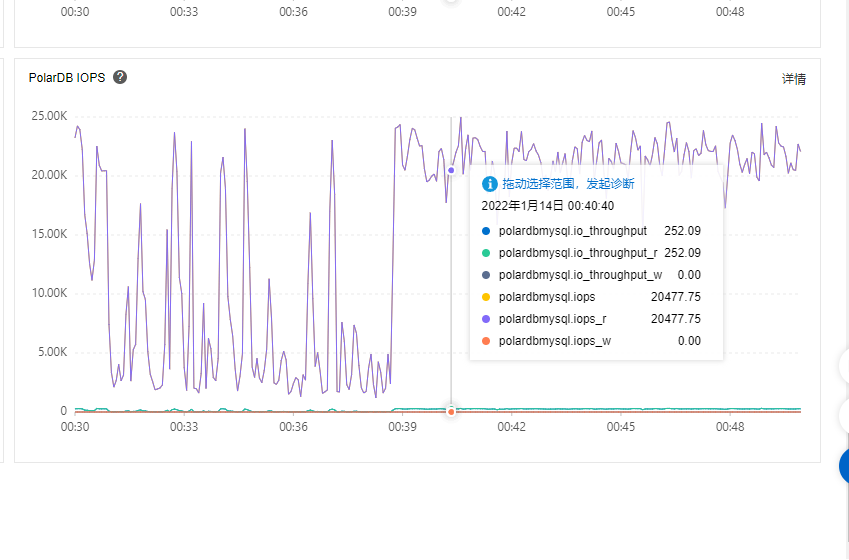

## 序

sql版本：`5.7.28-log

## 问题

### 一、走索引连表统计耗时较长

先看一下执行计划，`ktgg_name`为驱动表，使用`idx_eid_id_type`作为索引，预计扫描`169920`行，实际数据为`96792`行

比较了一下正常查询和去掉flag达到索引覆盖情况下的耗时

`ktgg`表的总量在5100W+，`ktgg_name`表总量在12671W+，正常查询应该在`ktgg`表会做9W6次的回表。

#### 解决方案

`ktgg`表的`_id_`索引再加一个`flag`字段

### 二、慢日志中执行时间长但扫描行数不多

同样的语句，耗时相差巨大。IO的问题？

下面是14号`00:30:00 - 01:00:00`期间的IOPS

运维说机器的上限在36K IOPS。

