# 第10章 复制

MySQL内建的复制功能是构建基于MySQL的大规模、高性能应用的基础，这类应用使用所谓的“水平扩展”的架构。我们可以通过为服务器配置一个或多个备库注1的方式来进行数据同步。复制功能不仅有利于构建高性能的应用，同时也是高可用性、可扩展性、灾难恢复、备份以及数据仓库等工作的基础。事实上，可扩展性和高可用性通常是相关联的话题，我们会在接下来的三章详细阐述。

本章将阐述所有与复制相关的内容，首先简要介绍复制如何工作，然后讨论基本的复制服务搭建，包括与复制相关的配置以及如何管理和优化复制服务器。虽然本书的主题是高性能，但对于复制来说，我们同样需要关注其准确性和可靠性，因此我们也会讲述复制在什么情况下会失败，以及如何使其更好地工作。

## 10.1复制概述
复制解决的基本问题是让一台服务器的数据与其他服务器保持同步。一台主库的数据可以同步到多台备库上，备库本身也可以被配置成另外一台服务器的主库。主库和备库之间可以有多种不同的组合方式。

MySQL 支持两种复制方式：基于行的复制和基于语句的复制。基于语句的复制（也称为逻辑复制）早在MySQL3.23版本中就存在，而基于行的复制方式在5.1版本中才被加进来。这两种方式都是通过在主库上记录二进制日志生“、在备库重放日志的方式来实现异步的数据复制。这意味着，在同一时间点备库上的数据可能与主库存在不一致，并且无法保证主备之间的延迟。一些大的语句可能导致备库产生几秒、几分钟甚至几个小时的延迟。

可能有些地方将会复制备库（replica）称为从库（slave），这里我们尽量避免这种叫法。MySQL 复制大部分是向后兼容的，新版本的服务器可以作为老版本服务器的备库，但反过来，将老版本作为新版本服务器的备库通常是不可行的，因为它可能无法解析新版本所采用的新的特性或语法，另外所使用的二进制文件的格式也可能不相同。例如，不能从MySQL5.1复制到MySQL4.0。在进行大的版本升级前，例如从4.1升级到5.0,或从5.1升级到5.5，最好先对复制的设置进行测试。但对于小版本号升级，如从5.1.51升级到5.1.58，则通常是兼容的。通过阅读每次版本更新的ChangeLog 可以找到不同版本间做了什么修改。

复制通常不会增加主库的开销，主要是启用二进制日志带来的开销，但出于备份或及时从崩溃中恢复的目的，这点开销也是必要的。除此之外，每个备库也会对主库增加一些负载（例如网络1/O开销)，尤其当备库请求从主库读取旧的二进制日志文件时，可能会造成更高的1/O开销。另外锁竞争也可能阻碍事务的提交。最后，如果是从一个高吞吐量（例如5 000或更高的TPS）的主库上复制到多个备库，唤醒多个复制线程发送事件的开销将会累加。

通过复制可以将读操作指向备库来获得更好的读扩展，但对于写操作，除非设计得当，否则并不适合通过复制来扩展写操作。在一主库多备库的架构中，写操作会被执行多次，这时候整个系统的性能取决于写入最慢的那部分。

当使用一主库多备库的架构时，可能会造成一些浪费，因为本质上它会复制大量不必要的重复数据。例如，对于一台主库和10台备库，会有11份数据拷贝，并且这11台服务器的缓存中存储了大部分相同的数据。这和在服务器上有11路RAID1类似。这不是一种经济的硬件使用方式，但这种复制架构却很常见，本章我们将讨论解决这个问题的方法。

### 10.1.1复制解决的问题

下面是复制比较常见的用途：

- 数据分布
  MySQL复制通常不会对带宽造成很大的压力，但在5.1版本引入的基于行的复制会比传统的基于语句的复制模式的带宽压力更大。你可以随意地停止或开始复制，并在不同的地理位置来分布数据备份，例如不同的数据中心。即使在不稳定的网络环境下，远程复制也可以工作。但如果为了保持很低的复制延迟，最好有一个稳定的、低延迟连接。
- 负载均衡
  通过 MySQL 复制可以将读操作分布到多个服务器上，实现对读密集型应用的优化，并且实现很方便，通过简单的代码修改就能实现基本的负载均衡。对于小规模的应用，可以简单地对机器名做硬编码或使用DNS轮询（将一个机器名指向多个IP地址)。当然也可以使用更复杂的方法，例如网络负载均衡这一类的标准负载均衡解决方案，能够很好地将负载分配到不同的MySQL服务器上。Linux虚拟服务器（LinuxVirtual Server，LVS）也能够很好地工作，第11章将详细地讨论负载均衡。
- 备份
  对于备份来说，复制是一项很有意义的技术补充，但复制既不是备份也不能够取代备份。
- 高可用性和故障切换
  复制能够帮助应用程序避免MySQL单点失败，一个包含复制的设计良好的故障切换系统能够显著地缩短岩机时间，我们将在第12章讨论故障切换。
- MySQL升级测试
  这种做法比较普遍，使用一个更高版本的MySQL作为备库，保证在升级全部实例前，查询能够在备库按照预期执行。

### 10.1.2复制如何工作
在详细介绍如何设置复制之前，让我们先看看 MySQL实际上是如何复制数据的。总的来说，复制有三个步骤：

1. 在主库上把数据更改记录到二进制日志（Binary Log）中（这些记录被称为二进制日志事件)。
2. 备库将主库上的日志复制到自己的中继日志（Relay Log）中。
3. 备库读取中继日志中的事件，将其重放到备库数据之上。

以上只是概述，实际上每一步都很复杂，图10-1（P435）更详细地描述了复制的细节。

第一步是在主库上记录二进制日志（稍后介绍如何设置)。在每次准备提交事务完成数据更新前，主库将数据更新的事件记录到二进制日志中。MySQL会按事务提交的顺序而非每条语句的执行顺序来记录二进制日志。在记录二进制日志后，主库会告诉存储引擎可以提交事务了。

下一步，备库将主库的二进制日志复制到其本地的中继日志中。首先，备库会启动一个工作线程，称为1/O线程，IO线程跟主库建立一个普通的客户端连接，然后在主库上启动一个特殊的二进制转储（binlog dump）线程（该线程没有对应的 SQL命令），这个二进制转储线程会读取主库上二进制日志中的事件。它不会对事件进行轮询。如果该线程追赶上了主库，它将进入睡眠状态，直到主库发送信号量通知其有新的事件产生时才会被唤醒，备库I/O线程会将接收到的事件记录到中继日志中。

> NOTE:
>
> MySQL 4.0之前的复制与之后的版本相比改变很大，例如MySQL最初的复制功能没有使用中继日志，所以复制只用到了两个线程，而不是现在的三个线程。目前大部分人都是使用的最新版本，因此在本章我们不会去讨论关于老版本复制的更多细节。

备库的 SQL线程执行最后一步，该线程从中继日志中读取事件并在备库执行，从而实现备库数据的更新。当SQL线程追赶上I/O线程时，中继日志通常已经在系统缓存中，所以中继日志的开销很低。SQL线程执行的事件也可以通过配置选项来决定是否写人其自己的二进制日志中，它对于我们稍后提到的场景非常有用。

图10-1显示了在备库有两个运行的线程，在主库上也有一个运行的线程：和其他普通连接一样，由备库发起的连接，在主库上同样拥有一个线程。

这种复制架构实现了获取事件和重放事件的解耦，允许这两个过程异步进行。也就是说I/O线程能够独立于 SQL线程之外工作。但这种架构也限制了复制的过程，其中最重要的一点是在主库上并发运行的查询在备库只能串行化执行，因为只有一个 SQL线程来重放中继日志中的事件。后面我们将会看到，这是很多工作负载的性能瓶颈所在。虽然有一些针对该问题的解决方案，但大多数用户仍然受制于单线程。

## 10.2配置复制
为MySQL服务器配置复制非常简单。但由于场景不同，基本的步骤还是有所差异。最基本的场景是新安装的主库和备库，总的来说分为以下几步：

1. 在每台注服务器上创建复制账号。
2. 配置主库和备库。
3. 通知备库连接到主库并从主库复制数据。

这里我们假定大部分配置采用默认值即可，在主库和备库都是全新安装并且拥有同样的数据（默认MySQL数据库）时这样的假设是合理的。接下来我们将展示如何一步步配置复制：假设有服务器serverl（IP地址192.168.0.1）和服务器server2（IP地址192.168.0.2)，我们将解释如何给一个已经运行的服务器配置备库，并探讨推荐的复制配置。

### 10.2.1创建复制账号

MySQL会赋予一些特殊的权限给复制线程。在备库运行的IO线程会建立一个到主库的TCP/IP连接，这意味着必须在主库创建一个用户，并赋予其合适的权限。备库I/O线程以该用户名连接到主库并读取其二进制日志。

我们在主库和备库都创建该账号。注意我们把这个账户限制在本地网络，因为这是一个特权账号（尽管该账号无法执行select 或修改数据，但仍然能从二进制日志中获得一些数据)。

> NOTE:
>
> 复制账户事实上只需要有主库上的REPLICATION SLAVE 权限，并不一定需要每一端服务器都有 REPLICATION CLIENT权限，那为什么我们要把这两种权限给主/备库都赋予呢？这有两个原因：
>
> - 用来监控和管理复制的账号需要 REPLICATION CLIENT权限，并且针对这两种目的使用同一个账号更加容易（而不是为某个目的单独创建一个账号）。
> - 如果在主库上建立了账号，然后从主库将数据克隆到备库上时，备库也就设置好了——变成主库所需要的配置。这样后续有需要可以方便地交换主备库的角色。

### 10.2.2配置主库和备库
下一步需要在主库上开启一些设置，假设主库是服务器server1，需要打开二进制日志并指定一个独一无二的服务器 ID（server ID），在主库的 my.cnf文件中增加或修改如下内容：

```text
log_bin = mysql-bin
serVEr _ID = 10

```

实际取值由你决定，这里只是为了简单起见，当然也可以设置更多需要的配置。
必须明确地指定一个唯一的服务器ID，默认服务器ID通常为1（这和版本相关，一些MySQL版本根本不允许使用这个值）。使用默认值可能会导致和其他服务器的ID冲突，因此这里我们选择10来作为服务器ID。一种通用的做法是使用服务器IP地址的末8位，但要保证它是不变且唯一的（例如，服务器都在一个子网里）。最好选择一些有意义的约定并遵循。

如果之前没有在MySQL的配置文件中指定log-bin选项，就需要重新启动 MySQL。为了确认二进制日志文件是否已经在主库上创建，使用SHOW MASTER STATUS命令，检查输出是否与如下的一致。MySQL会为文件名增加一些数字，所以这里看到的文件名和你定义的会有点不一样。

备库上也需要在my.cn中增加类似的配置，并且同样需要重启服务器。

```text
log _bin = mysql-bin
SERVEr id = 2
relay_log = /var/lib/mysql/mysql-relay-bin
log_ slave _updates = 1
read only = 1
```

从技术上来说，这些选项并不总是必要的。其中一些选项我们只是显式地列出了默认值。事实上只有server_id是必需的。这里我们同样也使用了1og_bin，并赋予了一个明确的名字。默认情况下，它是根据机器名来命名的，但如果机器名变化了可能会导致问题。为了简便起见，我们将主库和备库上的1og-bin设置为相同的值。当然如果你愿意的话，也可以设置成别的值。

另外我们还增加了两个配置选项：reay_log（指定中继日志的位置和命名）和1og.slave_updates（允许备库将其重放的事件也记录到自身的二进制日志中），后一个选项会给备库增加额外的工作，但正如后面将会看到的，我们有理由为每个备库设置该选项。有时候只开启了二进制日志，但却没有开启Log_sLave_updates，可能会碰到一些奇怪的现象，例如，当配置错误时可能会导致备库数据被修改。如果可能的话，最好使用read_only配置选项，该选项会阻止任何没有特权权限的线程修改数据（所以最好不要给予用户超出需要的权限)。但read.only选项常常不是很实用，特别是对于那些需要在备库建表的应用。

>  NOTE: 不要在配置文件 my.cnf中设置master_port或master_host这些选项，这是老的配置方式，已经被废弃，它只会导致问题，不会有任何好处。

### 10.2.3启动复制
下一步是告诉备库如何连接到主库并重放其二进制日志。这一步不要通过修改my.cnf来配置，而是使用CHANGE MASTER TO语句，该语句完全替代了my.cnf中相应的设置，并且允许以后指向别的主库时无须重启备库。下面是开始复制的基本命令：

```sql
mysql> CHANGE MASTER TO MASTER HOST='server1',
-> MASTER USER='repl',
-> MASTER PASSWORD='p4ssWord',
-> MASTER_LOG_FILE='mysql-bin.000001',
-> MASTER LOG POS=O;
```

MASTER LOG POS参数被设置为0，因为要从日志的开头读起。当执行完这条语句后，可以通过SHOWSLAVE STATUS语句来检查复制是否正确执行。

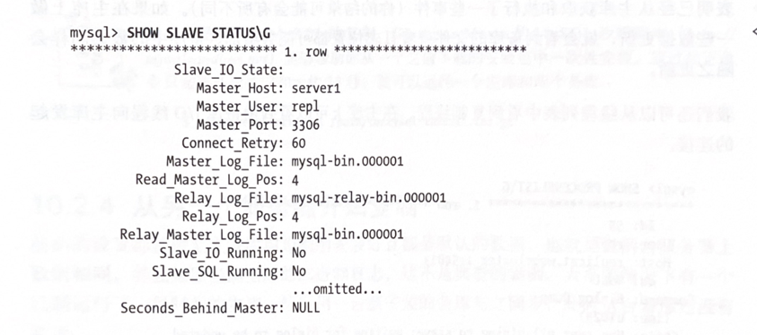

SLave_IO_State、Slave_IO_Running 和 SLave_SOL_Running这三列显示当前备库复制尚未运行。聪明的读者可能已经注意到日志的开头是4而不是0，这是因为0其实不是日志真正开始的位置，它仅仅意味着“在日志文件头"，MySQL知道第一个事件从文件的第4位开始读。

事实上，正如之前从SHOWMASTER STATUS看到的，真正的日志起始位置是98，一旦各库连接到主库运行下面的命令开始复制：

```sql
mysql> START SLAVE;
```

执行该命令没有显示错误，现在我们再用SHOWSLAVE STATUS命令检查：

```sql
mysql> SHOW SLAVE STATUSIG;
```

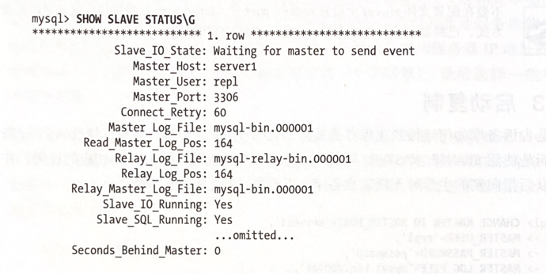

从输出可以看出I/O线程和SQL线程都已经开始运行，Seconds_Behind_Master的值也不再为NULL（稍后再解释Seconds_Behind_Master的含义）。I/O线程正在等待从主库传递过来的事件，这意味着I/O线程已经读取了主库所有的事件。日志位置发生了变化，表明已经从主库获取和执行了一些事件（你的结果可能会有所不同）。如果在主库上做一些数据更新，就会看到备库的文件或者日志位置都可能会增加。备库中的数据同样会随之更新。

我们还可以从线程列表中看到复制线程。在主库上可以看到由备库I/O线程向主库发起的连接。

```mysql
mysql> SHOW PROCESSLISTIG
```

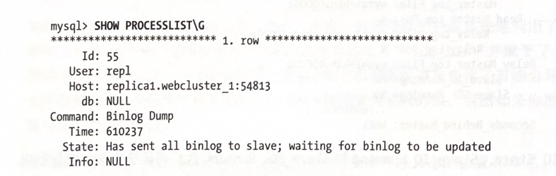

同样，在备库也可以看到两个线程，一个是I/O线程，一个是SQL线程，

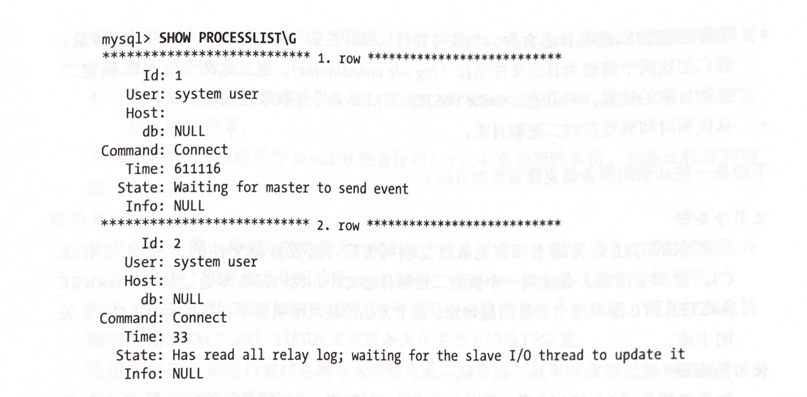

这些简单的输出来自一台已经运行了一段时间的服务器，所以I/O线程在主库和备库上的Time列的值较大。SQL线程在备库已经空闲了33秒。这意味着33秒内没有重放任何事件。

这些线程总是运行在“system user”账号下，其他列的值则不相同。例如，当SQL线程回放事件时，Info列可能显示正在执行的查询。

> 如果只是想实验MySQL的复制，Giuseppe Maxia的MySQL沙箱脚本（htp://]
> mysqLsandbox.net）能够帮助你从一个之前下载的安装包中一次性安装。通过如下命2令只需要几次按键和大约15秒，就可以运行一个主库和两个备库：
> $./set_replication.pl/path/to/mysql-tarball.tar.gz

### 10.2.4从另一个服务器开始复制
前面的设置都是假定主备库均为刚刚安装好且都是默认的数据，也就是说两台服务器上数据相同，并且知道当前主库的二进制日志。这不是典型的案例。大多数情况下有一个已经运行了一段时间的主库，然后用一台新安装的备库与之同步，此时这台备库还没有数据。

有几种办法来初始化备库或者从其他服务器克隆数据到备库。包括从主库复制数据、从另外一台备库克隆数据，以及使用最近的一次备份来启动备库，需要有三个条件来让主库和备库保持同步：

- 在某个时间点的主库的数据快照。
- 主库当前的二进制日志文件，和获得数据快照时在该二进制日志文件中的偏移量，我们把这两个值称为日志文件坐标（logjle coordinates）。通过这两个值可以确定二进制日志的位置。可以通过 SHOW MASTER STATUS 命令来获取这些值。
- 从快照时间到现在的二进制日志。

下面是一些从别的服务器克隆备库的方法：

- 使用冷备份
  最基本的方法是关闭主库，把数据复制到备库（高效复制文件的方法参考附录C)。重启主库后，会使用一个新的二进制日志文件，我们在备库通过执行CHANGEMASTER TO指向这个文件的起始处。这个方法的缺点很明显：在复制数据时需要关闭主库。

- 使用热备份
  如果仅使用了MyISAM表，可以在主库运行时使用mysqLhotcopy或rsync来复制数据，更多细节参阅第15章。

- 使用mysqldump
  如果只包含InnoDB表，那么可以使用以下命令来转储主库数据并将其加载到备库，然后设置相应的二进制日志坐标：

- 使用快照或备份
  只要知道对应的二进制日志坐标，就可以使用主库的快照或者备份来初始化备库（如果使用备份，需要确保从备份的时间点开始的主库二进制日志都要存在)。只需要把备份或快照恢复到备库，然后使用CHANGE MASTER TO指定二进制日志的坐标。第15章会介绍更多的细节，也可以使用LVM快照、SAN快照、EBS快照一任何快照都可以。

- 使用Percona Xtrabackup
  Percona的Xtrabackup是一款开源的热备份工具，多年前我们就介绍过。它能够在备份时不阻塞服务器的操作，因此可以在不影响主库的情况下设置备库。可以通过克隆主库或另一个已存在的备库的方式来建立备库。
  在15章会介绍更多使用PerconaXtrabackup的细节。这里会介绍一些相关的功能。创建一个备份（不管是从主库还是从别的备库)，并将其转储到目标机器，然后根据备份获得正确的开始复制的位置。

  - 如果是从主库获得备份，可以从xtrabackup_binlog_pos_innodb文件中获得复制开始的位置。
  - 如果是从另外的备库获得备份，可以从xtrabackup_slave_info文件中获得复制开始的位置。

  另外，在第15章提到的 InnoDB热备份和MySQL企业版的备份，也是比较好的初始化备库方式。

- 使用另外的备库

  可以使用任何一种提及的克隆或者拷贝技术来从任意一台备库上将数据克隆到另外一台服务器。但是如果使用的是mysqldump，-master-data选项就会不起作用。此外，不能使用SHOW MASTER STATUS来获得主库的二进制日志坐标，而是在获取快照时使用SHOWSLAVESTATUS来获取备库在主库上的执行位置。

  使用另外的备库进行数据克隆最大的缺点是，如果这台备库的数据已经和主库不同步，克隆得到的就是脏数据。

> WARNING: 
>
> 不要使用LOADDATAFROMMASTER或者LOADTABLEFROMMASTER!这些命令过时、缓慢并且非常危险，并且只适用于MyISAM存储引擎。

不管选择哪种技术，都要能熟练运用，要记录详细的文档或编写脚本。因为可能不止一次需要做这样的事情。甚至当错误发生时，也需要能够处理。

### 10.2.5推荐的复制配置

有许多参数来控制复制，其中一些会对数据安全和性能产生影响。稍后我们会解释何种规则在何时会失效。本小节推荐的一种“安全”的配置，可以最小化问题发生的概率。

在主库上二进制日志最重要的选项是sync_binlog：

```text
sync_binlog=1
```

如果开启该选项，MySQL每次在提交事务前会将二进制日志同步到磁盘上，保证在服务器崩溃时不会丢失事件。如果禁止该选项，服务器会少做一些工作，但二进制日志文件可能在服务器崩溃时损坏或丢失信息。在一个不需要作为主库的备库上，该选项带来了不必要的开销。它只适用于二进制日志，而非中继日志。

如果无法容忍服务器崩溃导致表损坏，推荐使用InnoDB。在表损坏无关紧要时，MyISAM 是可以接受的，但在一次备库服务器崩溃重启后，MyISAM表可能已经处于不一致状态。一种可能是语句没有完全应用到一个或多个表上，那么即使修复了表，数据也可能是不一致的。

如果使用 InnoDB，我们强烈推荐设置如下选项：

```text
innodb_flush_logs_at_trx_commit # Flush every log write
innodb_support_xa=1 # MySQL 5.0 and newer only
innodb safe binlog # MySQL 4.1 only, roughly equivalent to
				   # innodb _support _xa
```

这些是 MySQL 5.0及最新版本中的默认配置，我们推荐明确指定二进制日志的名字，以保证二进制日志名在所有服务器上是一致的，避免因为服务器名的变化导致的日志文件名变化。你可能认为以服务器名来命名二进制日志无关紧要，但经验表明，当在服务器间转移文件、克隆新的备库、转储备份或者其他一些你想象不到的场景下，可能会导致很多问题。为了避免这些问题，需要给1og_bin选项指定一个参数。可以随意地给一个绝对路径，但必须明确地指定基本的命名（正如本章之前讨论的)。

通过设置relay_Log可以避免中继日志文件基于机器名来命名，防止之前提到的可能在主库发生的问题。指定绝对路径可以避免多个MySQL版本中存在的Bug，这些Bug可能会导致中继日志在一个意料外的位置创建。skip_sLave_start 选项能够阻止备库在崩溃后自动启动复制。这可以给你一些机会来修复可能发生的问题。如果备库在崩溃后自动启动并且处于不一致的状态，就可能会导致更多的损坏，最后将不得不把所有数据丢弃，并重新开始配置备库。

read_onty选项可以阻止大部分用户更改非临时表，除了复制SQL线程和其他拥有超级权限的用户之外，这也是要尽量避免给正常账号授予超级权限的原因之一。

即使开启了所有我们建议的选项，备库仍然可能在崩溃后被中断，因为master.info和中继日志文件都不是崩溃安全的。默认情况下甚至不会刷新到磁盘，直到MySQL5.5版本才有选项来控制这种行为。如果正在使用MySQL5.5并且不介意额外的fsync（）导致的性能开销，最好设置以下选项：

```text
sync_master _info = 1
sync_relay_log = 1
sync_relay_log_ info = 1
```

如果备库与主库的延迟很大，备库的1/O线程可能会写很多中继日志文件，SQL线程在重放完一个中继日志中的事件后会尽快将其删除（通过relay_Log_purge 选项来控制)。但如果延迟非常严重，1/O线程可能会把整个磁盘撑满。解决办法是配置relay_log_space_limit变量。如果所有中继日志的大小之和超过这个值，I/O线程会停止，等待SQL线程释放磁盘空间。

尽管听起来很美好，但有一个隐藏的问题。如果备库没有从主库上获取所有的中继日志，这些日志可能在主库崩溃时丢失。早先这个选项存在一些Bug，使用率也不高，所以用到这个选项遇到Bug的风险会更高。除非磁盘空间真的非常紧张，否则最好让中继日志使用其需要的磁盘空间，这也是为什么我们没有将relay_Log_space_Limit列入推荐的配置选项的原因。

## 10.3复制的原理

我们已经介绍了复制的一些基本概念，接下来要更深入地了解复制。让我们看看复制究竟是如何工作的，有哪些优点和弱点，最后介绍一些更高级的复制配置选项。

### 10.3.1基于语句的复制
在MySQL 5.0及之前的版本中只支持基于语句的复制（也称为逻辑复制），这在数据库领域是很少见的。基于语句的复制模式下，主库会记录那些造成数据更改的查询，当备库读取并重放这些事件时，实际上只是把主库上执行过的SQL再执行一遍。这种方式既有好处，也有缺点。

最明显的好处是实现相当简单。理论上讲，简单地记录和执行这些语句，能够让主备保持同步。另一个好处是二进制日志里的事件更加紧凑，所以相对而言，基于语句的模式不会使用太多带宽。一条更新好几兆数据的语句在二进制日志里可能只占几十个字节。另外mjsqlbinlog工具（本章多处会提到）是使用基于语句的日志的最佳工具。但事实上基于语句的方式可能并不如其看起来那么便利。因为主库上的数据更新除了执行的语句外，可能还依赖于其他因素。例如，同一条 SQL在主库和备库上执行的时间可能稍微或很不相同，因此在传输的二进制日志中，除了查询语句，还包括了一些元数据信息，如当前的时间戳。即便如此，还存在着一些无法被正确复制的SQL。例如，使用CURRENT_USER(）函数的语句。存储过程和触发器在使用基于语句的复制模式时也可能存在问题。

另外一个问题是更新必须是串行的。这需要更多的锁——有时候要特别关注这一点。另外不是所有的存储引擎都支持这种复制模式。尽管这些存储引擎是包括在MySQL5.5及之前版本中发行的。

可以在 MySQL手册与复制相关的章节中找到基于语句的复制存在的限制的完整列表。

### 10.3.2基于行的复制
MySQL 5.1开始支持基于行的复制，这种方式会将实际数据记录在二进制日志中，跟其他数据库的实现比较相像。它有其自身的一些优点和缺点。最大的好处是可以正确地复制每一行。一些语句可以被更加有效地复制。

由于无须重放更新主库数据的查询，使用基于行的复制模式能够更高效地复制数据。重放一些查询的代价可能会很高。

由于没有哪种模式对所有情况都是完美的，MySQL能够在这两种复制模式间动态切换。默认情况下使用的是基于语句的复制方式，但如果发现语句无法被正确地复制，就切换到基于行的复制模式。还可以根据需要来设置会话级别的变量 binlog_format，控制二进制日志格式。
对于基于行的复制模式，很难进行时间点恢复，但这并非不可能。稍后讲到的日志服务器对此会有帮助。

### 10.3.3基于行或基于语句：哪种更优
我们已经讨论了这两种复制模式的优点和缺点，那么在实际应用中哪种方式更优呢？

理论上基于行的复制模式整体上更优，并且在实际应用中也适用于大多数场景。但这种方式太新了以至于没有将一些特殊的功能加人到其中来满足数据库管理员的操作需求。因此一些人直到现在还没有开始使用。以下详细地述两种方式的优点和缺点，以帮助你决定哪种方式更合适。

- 基于语句的复制模式的优点
  当主备的模式不同时，逻辑复制能够在多种情况下工作。例如，在主备上的表的定义不同但数据类型相兼容、列的顺序不同等情况。这样就很容易先在备库上修改schema，然后将其提升为主库，减少停机时间。基于语句的复制方式一般允许更灵活的操作。
  基于语句的方式执行复制的过程基本上就是执行SQL语句。这意味着所有在服务器上发生的变更都以一种容易理解的方式运行。这样当出现问题时可以很好地去定位。

- 基于语句的复制模式的缺点
  很多情况下通过基于语句的模式无法正确复制，几乎每一个安装的备库都会至少碰到一次。事实上对于存储过程，触发器以及其他的一些语句的复制在5.0和5.1的一系列版本中存在大量的Bug。这些语句的复制的方式已经被修改了很多次，以使其更好地工作。简单地说：如果正在使用触发器或者存储过程，就不要使用基于语句的复制模式，除非能够清楚地确定不会碰到复制问题。

- 基于行的复制模式的优点
  几乎没有基于行的复制模式无法处理的场景。对于所有的SQL构造、触发器、存储过程等都能正确执行。只是当你试图做一些诸如在备库修改表的schema这样的事情时才可能导致复制失败。
  这种方式同样可能减少锁的使用，因为它并不要求这种强串行化是可重复的。
  基于行的复制模式会记录数据变更，因此在二进制日志中记录的都是实际上在主库上发生了变化的数据。你不需要查看一条语句去猜测它到底修改了哪些数据。在某种程度上，该模式能够更加清楚地知道服务器上发生了哪些更改，并且有一个更好的数据变更记录。另外在一些情况下基于行的二进制日志还会记录发生改变之前的数据，因此这可能有利于某些数据恢复。

  在很多情况下，由于无须像基于语句的复制那样需要为查询建立执行计划并执行查询，因此基于行的复制占用更少的CPU。
  最后，在某些情况下，基于行的复制能够帮助更快地找到并解决数据不一致的情况。举个例子，如果是使用基于语句的复制模式，在备库更新一个不存在的记录时不会失败，但在基于行的复制模式下则会报错并停止复制。

- 基于行的复制模式的缺点
  由于语句并没有在日志里记录，因此无法判断执行了哪些 SQL，除了需要知道行的变化外，这在很多情况下也很重要（这可能在未来的MySQL版本中被修复）。
  使用一种完全不同的方式在备库进行数据变更——而不是执行SQL。事实上，执行基于行的变化的过程就像一个黑盒子，你无法知道服务器正在做什么。并且没有很好的文档和解释。因此当出现问题时，可能很难找到问题所在。例如，若备库使用一个效率低下的方式去寻找行记录并更新，你无法观察到这一点。
  如果有多层的复制服务器，并且所有的都被配置成基于行的复制模式，当会话级别的变量@@binlog_format 被设置成STATEMENT时，所执行的语句在源服务器上被记录为基于语句的模式，但第一层的备库可能将其记录成行模式，并传递给其他层的备库。也就是说你期望的基于语句的日志在复制拓扑中将会被切换到基于行的模式。基于行的日志无法处理诸如在备库修改表的schema这样的情况，而基于语句的日志可以。
  在某些情况下，例如找不到要修改的行时，基于行的复制可能会导致复制停止，而基于语句的复制则不会。这也可以认为是基于行的复制的一个优点。该行为可以通过sLave_exec_mode来进行配置。
  这些缺点正在被慢慢解决，但直到写作本书时，它们在大多数生产环境中依然存在。

### 10.3.4复制文件

让我们来看看复制会使用到的一些文件。前面已经介绍了二进制日志文件和中继日志文件，其实还有其他的文件会被用到。不同版本的MySQL默认情况下可能将这些文件放到不同的目录里，大多取决具体的配置选项。可能在data 目录或者包含服务器.pid文件的目录下（对于类UNIX 系统可能是/ar/rum/mysqLd)。它们的详细介绍如下。

- mysql-bin.index
  当在服务器上开启二进制日志时，同时会生成一个和二进制日志同名的但以.index作为后缀的文件，该文件用于记录磁盘上的二进制日志文件。这里的“index”并不是指表的索引，而是说这个文件的每一行包含了二进制文件的文件名。
  你可能认为这个文件是多余的，可以被删除（毕竟MySQL可以在磁盘上找到它需要的文件)。事实上并非如此，MySQL 依赖于这个文件，除非在这个文件里有记录，否则MySQL识别不了二进制日志文件。
- mysql-relay-bin-index
  这个文件是中继日志的索引文件，和mysqL-bin.index的作用类似。
- masterinfo
  这个文件用于保存备库连接到主库所需要的信息，格式为纯文本（每行一个值），不同的MySQL版本，其记录的信息也可能不同。此文件不能删除，否则备库在重启后无法连接到主库。这个文件以文本的方式记录了复制用户的密码，所以要注意此文件的权限控制。
- relay-log.info
  这个文件包含了当前备库复制的二进制日志和中继日志坐标（例如，备库复制在主库上的位置)，同样也不要删除这个文件，否则在备库重启后将无法获知从哪个位置开始复制，可能会导致重放已经执行过的语句。

使用这些文件来记录 MySQL复制和日志状态是一种非常粗糙的方式。更不幸的是，它们不是同步写的。如果服务器断电并且文件数据没有被刷新到磁盘，在重启服务器后，文件中记录的数据可能是错误的。正如之前提到的，这些问题在MySQL5.5里做了改进。

以.index 作为后缀的文件也与设置expire_Logs_days存在交互，该参数定义了 MySQL清理过期日志的方式，如果文件 mysql-bin.index在磁盘上不存在，在某些MySQL版本自动清理就会不起作用，甚至执行PURGEMASTER LOGS语句也没有用。这个问题的解决方法通常是使用 MySQL服务器管理二进制日志，这样就不会产生误解（这意味着不应该使用rm来自己清理日志）

最好能显式地执行一些日志清理策略，比如设置expire_logs_days参数或者其他方式，否则MySQL的二进制日志可能会将磁盘撑满。当做这些事情时，还需要考虑到备份策略。

### 10.3.5发送复制事件到其他备库

Log_slave_updates 选项可以让备库变成其他服务器的主库。在设置该选项后，MySQL会将其执行过的事件记录到它自己的二进制日志中。这样它的备库就可以从其日志中检索并执行事件。图10-2阐述了这一过程。

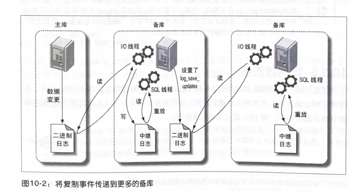

在这种场景下，主库将数据更新事件写人二进制日志，第一个备库提取并执行这个事件。这时候一个事件的生命周期应该已经结束了，但由于设置了Log_sLave_updates，备库会将这个事件写到它自己的二进制日志中。这样第二个备库就可以将事件提取到它的中继日志中并执行。这意味着作为源服务器的主库可以将其数据变化传递给没有与其直接相连的备库上。默认情况下这个选项是被打开的，这样在连接到备库时就不需要重启服务器。

当第一个备库将从主库获得的事件写入到其二进制日志中时，这个事件在备库二进制日志中的位置与其在主库二进制日志中的位置几乎肯定是不相同的，可能在不同的日志文件或文件内不同的位置。这意味着你不能假定所有拥有同一逻辑复制点的服务器拥有相同的日志坐标。稍后我们会提到，这种情况会使某些任务更加复杂，例如，修改一个备库的主库或将备库提升为主库。

除非你已经注意到要给每个服务器分配一个唯一的服务器 ID，否则按照这种方式配置备库会导致一些奇怪的错误，甚至还会导致复制停止。一个更常见的问题是：为什么要指定服务器 ID，难道MySQL在不知道复制命令来源的情况下不能执行吗？为什么MySQL要在意服务器ID是全局唯一的。问题的答案在于MySQL在复制过程中如何防止无限循环。当复制SQL线程读中继日志时，会丢弃事件中记录的服务器ID和该服务器本身ID相同的事件，从而打破了复制过程中的无限循环。在某些复制拓扑结构下打破无限循环非常重要，例如主－主复制结构。

> 如果在设置复制的时候碰到问题，服务器 ID 应该是需要检查的因素之一。当然只检查@Gserver_id是不够的，它有一个默认值，除非在my.cwf文件或通过 SET命令。明确指定它的值，复制才会工作。如果使用SET命令，确保同时也更新了配置文件，否则SET命令的设定可能在服务器重启后丢失。

### 10.3.6复制过滤器

复制过滤选项允许你仅复制服务器上一部分数据，不过这可能没有想象中那么好用。有两种复制过滤方式：在主库上过滤记录到二进制日志中的事件，以及在备库上过滤记录到中继日志的事件。图10-3 显示了这两种类型。

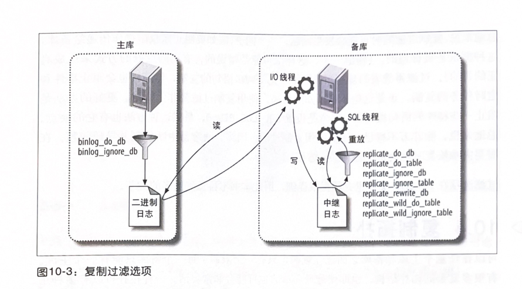

使用选项 binlog_do_db和binlog_ignore_db来控制过滤，稍后我们会解释为什么通常不需要开启它们，除非你乐于向老板解释为什么数据会永久丢失并且无法恢复。

在备库上，可以通过设置 replicate_*选项，在从中继日志中读取事件时进行过滤。你可以复制或忽略一个或多个数据库，把一个数据库重写到另外一个数据库，或使用类似LIKE的模式复制或忽略数据库表。

要理解这些选项，最重要是弄清楚\*do_db和\*ignore_db在主库和备库上的意义，它们可能不会按照你所设想的那样工作。你可能会认为它会根据目标数据库名过滤，但实际上过滤的是当前的默认数据库°。也就是说，如果在主库上执行如下语句：

```mysql
mysql> USE test;
mysql> DELETE FROM sakila.film;
```

\*_do_db和\*_ignore_db都会在数据库 test上过滤 DELETE语句，而不是在 sakila上。这通常不是想要的结果，可能会导致执行或忽略错误的语句。\*_do_db和\*_ignore_db有一些作用，但非常有限。必须要很小心地去使用这些参数，否则很容易造成主备不同步或复制出错。

> binlog_do_db和binlog_ignore_db不仅可能会破坏复制，还可能会导致从某个时间点的备份进行数据恢复时失败。在大多数情况下都不应该使用这些参数。本章稍后部分我们展示了一些使用blackhole表进行复制过滤的方法。

总地来说，复制过滤随时可能会发生问题。举个例子，假如要阻止赋权限操作传递给备库，这种需求是很普遍的。（提醒一下，这样做可能是错误的，有别的更好的方式来达成真正的目的)。过滤系统表的复制当然能够阻止 GRANT 语句的复制，但同样也会阻止事件和定时任务的复制。正是这些不可预知的后果，使用复制过滤要非常慎重。更好的办法是阻止一些特殊的语句被复制，通常是设置 SQL_LOG_BIN=0，虽然这种方法也有它的缺点。总地来说，除非万不得已，不要使用复制过滤，因为它很容易中断复制并导致问题，在需要灾难恢复时也会带来极大的不方便。

过滤选项在MySQL 文档里介绍得很详细，因此本书不再重复更多的细节。

## 10.4复制拓扑

可以在任意个主库和备库之间建立复制，只有一个限制：每一个备库只能有一个主库。有很多复杂的拓扑结构，但即使是最简单的也可能会非常灵活。一种拓扑可以有多种用途。关于使用复制的不同方式可以很轻易地写一本书。

我们已经讨论了如何为主库设置一个备库，本节我们讨论其他比较普遍的拓扑结构以及它们的优缺点。记住下面的基本原则：

- 一个MySQL备库实例只能有一个主库。
- 每个备库必须有一个唯一的服务器ID。
- 一个主库可以有多个备库（或者相应的，一个备库可以有多个兄弟备库)。
- 如果打开了 og_slave_updates 选项，一个备库可以把其主库上的数据变化传播到其他备库。

### 10.4.1一主库多备库

除了我们已经提过的两台服务器的主备结构外，这是最简单的拓扑结构。事实上一主多备的结构和基本配置差不多简单，因为备库之间根本没有交互，它们仅仅是连接到同一个个主库上。

在有少量写和大量读时，这种配置是非常有用的。可以把读分摊到多个备库上，直到备库给主库造成了太大的负担，或者主备之间的带宽成为瓶颈为止。你可以按照之前介绍的方法一次性设置多个备库，或者根据需要增加备库。

尽管这是非常简单的拓扑结构，但它非常灵活，能满足多种需求。下面是它的一些用途：

- 为不同的角色使用不同的备库（例如添加不同的索引或使用不同的存储引擎)。
- 把一台备库当作待用的主库，除了复制没有其他数据传输。
- 将一台备库放到远程数据中心，用作灾难恢复。
- 延迟一个或多个备库，以备灾难恢复。
- 使用其中一个备库，作为备份、培训、开发或者测试使用服务器。

这种结构流行的原因是它避免了很多其他拓扑结构的复杂性。例如：可以方便地比较不同备库重放的事件在主库二进制日志中的位置。换句话说，如果在同一个逻辑点停止所有备库的复制，它们正在读取的是主库上同一个日志文件的相同物理位置。这是个很好的特性，可以减轻管理员许多工作，例如把备库提升为主库。

这种特性只存在于兄弟备库之间。在没有直接的主备或者兄弟关系的服务器上去比较日志文件的位置要复杂很多。之后我们会提到的许多拓扑结构，例如树形复制或分布式主库，很难计算出复制的事件的逻辑顺序。

### 10.4.2主动-主动模式下的主-主复制

主－主复制（也叫双主复制或双向复制）包含两台服务器，每一个都被配置成对方的主库和备库，换句话说，它们是一对主库。

主动-主动模式下主-主复制有一些应用场景，但通常用于特殊的目的。一个可能的应用场景是两个处于不同地理位置的办公室，并且都需要一份可写的数据拷贝。

这种配置最大的问题是如何解决冲突，两个可写的互主服务器导致的问题非常多。这通常发生在两台服务器同时修改一行记录，或同时在两台服务器上向一个包含AUTO_INCREMENT列的表里插入数据。

>MySQL不支持多主库复制
>多主库复制（multisource replication）特指一个备库有多个主库。不管之前你知道什么，但MySQL（和其他数据库产品不一样）现在不支持如图10-6所示的结构，本章稍后我们会向你介绍如何模仿多主库复制。

数据不同步还仅仅是开始。当正常的复制发生错误停止了，但应用仍在同时向两台服务器写入数据，这时候会发生什么呢？你不能简单地把数据从一台服务器复制到另外一台，因为这两台机器上需要复制的数据都可能发生了变化。解决这个问题将会非常困难。

如果足够仔细地配置这种架构，例如很好地划分数据和权限，并且你很清楚自己在做什么，可以避免一些问题。然而这通常很难做好，并且有更好的办法来实现你所需要的。总地来说，允许向两个服务器上写入所带来的麻烦远远大于其带来的好处，但下一节描述的主动－被动模式则会非常有用。

### 10.4.3主动-被动模式下的主－主复制

这是前面描述的主－主结构的变体，它能够避免我们之前讨论的问题。这也是构建容错性和高可用性系统的非常强大的方式，主要区别在于其中的一台服务器是只读的被动服务器。

这种方式使得反复切换主动和被动服务器非常方便，因为服务器的配置是对称的。这使得故障转移和故障恢复很容易。它也可以让你在不关闭服务器的情况下执行维护、优化表、升级操作系统（或者应用程序、硬件等）或其他任务。

例如，执行 ALTER TABLE操作可能会锁住整个表，阻塞对表的读和写，这可能会花费很长时间并导致服务中断。然而在主－主配置下，可以先停止主动服务器上的备库复制线程（这样就不会在被动服务器上执行任何更新），然后在被动服务器上执行ALTER操作，交换角色，最后在先前的主动服务器上启动复制线程。这个服务器将会读取中继日志并执行相同的 ALTER语句。这可能花费很长时间，但不要紧，因为该服务器没有为任何活跃查询提供服务。

主动-被动模式的主-主结构能够帮助回避许多MySQL的问题和限制，此外还有一些工具可以完成这种类型的操作。

让我们看看如何配置主-主服务器对，在两台服务器上执行如下设置后，会使其拥有对称的设置：

1. 确保两台服务器上有相同的数据
2. 启用二进制日志，选择唯一的服务器 ID，并创建复制账号。
3. 启用备库更新的日志记录，后面将会看到，这是故障转移和故障恢复的关键。
4. 把被动服务器配置成只读，防止可能与主动服务器上的更新产生冲突，这一点是可选的。
5. 启动每个服务器的MySQL实例。
6. 将每个主库设置为对方的备库，使用新创建的二进制日志开始工作。

让我们看看主动服务器上更新时会发生什么事情。更新被记录到二进制日志中，通过复制传递给被动服务器的中继日志中。被动服务器执行查询并将其记录到自己的二进制日志中（因为开启了log_sLave_updates选项）。由于事件的服务器ID与主动服务器的相同，因此主动服务器将忽略这些事件。在后面的“修改主库"可了解更多的角色切换相关内容。

设置主动-被动的主－主拓扑结构在某种意义上类似于创建一个热备份，但是可以使用这个“备份”来提高性能，例如，用它来执行读操作、备份、“离线”维护以及升级等。真正的热备份做不了这些事情。然而，你不会获得比单台服务器更好的写性能（稍后会提到)。

当我们讨论使用复制的场景和用途时，还会提到这种复制方式。它是一种非常常见并且重要的拓扑结构。

10.4.4拥有备库的主 - 主结构

另外一种相关的配置是为每个主库增加一个备库，如图10-8所示。

这种配置的优点是增加了冗余，对于不同地理位置的复制拓扑，能够消除站点单点失效的问题。你也可以像平常一样，将读查询分配到备库上。

如果在本地为了故障转移使用主-主结构，这种配置同样有用。当主库失效时，用备库来代替主库还是可行的，虽然这有点复杂。同样也可以把备库指向一个不同的主库，但需要考虑增加的复杂度。

### 10.4.5环形复制
如图10-9 所示，双主结构实际上是环形结构的一种特例。环形结构可以有三个或更多的主库。每个服务器都是在它之前的服务器的备库，是在它之后的服务器的主库。这种结构也称为环形复制（circular replication）。

环形结构没有双主结构的一些优点，例如对称配置和简单的故障转移，并且完全依赖于环上的每一个可用节点，这大大增加了整个系统失效的几率。如果从环中移除一个节点，这个节点发起的事件就会陷入无限循环：它们将永远绕着服务器链循环。因为唯一可以根据服务器ID 将其过滤的服务器是创建这个事件的服务器。总地来说，环形结构非常脆弱，应该尽量避免。

可以通过为每个节点增加备库的方式来减少环形复制的风险，如图10-10所示。但这仅仅防范了服务器失效的危险，断电或者其他一些影响到网络连接的问题都可能破坏整个环。

### 10.4.6主库、分发主库以及备库

我们之前提到当备库足够多时，会对主库造成很大的负载。每个备库会在主库上创建一个线程，并执行 binlog dump 命令。该命令会读取二进制日志文件中的数据并将其发送给备库。每个备库都会重复这样的工作，它们不会共享binlogdump 的资源。

如果有很多备库，并且有大的事件时，例如一次很大的 LOAD DATA INFILE 操作，主库上的负载会显著上升，甚至可能由于备库同时请求同样的事件而耗尽内存并崩溃。另一方面，如果备库请求的数据不在文件系统的缓存中，可能会导致大量的磁盘检索，这同样会影响主库的性能并增加锁的竞争。

因此，如果需要多个备库，一个好办法是从主库移除负载并使用分发主库。分发主库事实上也是一个备库，它的唯一目的就是提取和提供主库的二进制日志。多个备库连接到分发主库，这使原来的主库摆脱了负担。为了避免在分发主库上做实际的查询，可以将它的表修改为blackhole 存储引擎，如图10-11所示。

很难说当备库数据达到多少时需要一个分发主库。按照通用准则，如果主库接近满负载，不应该为其建立10个以上的备库。如果有少量的写操作，或者只复制其中一部分表，主库就可以提供更多的复制。另外，也不一定只使用一个分发主库。如果需要的话，可以使用多个分发主库向大量的备库进行复制，或者使用金字塔状的分发主库。在某些情况下，可以通过设置 sLave_compressed_protocol来节约一些主库带宽。这对跨数据中心复制很有好处。

还可以通过分发主库实现其他目的，例如，对二进制日志事件执行过滤和重写规则。这比在每个备库上重复进行日志记录、重写和过滤要高效得多。

如果在分发主库上使用blackhole表，可以支持更多的备库。虽然会在分发主库执行查询，但其代价非常小，因为blackhole表中没有任何数据。blockhole表的缺点是其存在Bug，例如在某些情况下会忘记将自增ID写入到二进制日志中。所以要小心使用blackhole表。

一个比较常见的问题是如何确保分发服务器上的每个表都是 blackhole 存储引擎。如果有人在主库创建了一个表并指定了不同的存储引擎呢？确实，不管什么时候，在备库上使用不同的存储引擎总会导致同样的问题。常见的解决方案是设置服务器的storage_engine选项：

```text
storage_engine = blackhole
```

这只会影响那些没有指定存储引擎的CREATE TABLE的语句。如果有一个无法控制的应用，这种拓扑结构可能会非常脆弱。可以通过skip_innodb选项禁止InnoDB，将表退化为MyISAM。但你无法禁止 MyISAM 或者 Memory 引擎。

使用分发主库另外一个主要的缺点是无法使用一个备库来代替主库。因为由于分发主库的存在，导致各个备库与原始主库的二进制日志坐标已经不相同。

### 10.4.7树或金字塔形

如果正在将主库复制到大量的备库中。不管是把数据分发到不同的地方，还是提供更高的读性能，使用金字塔结构都能够更好地管理，如图 10-12所示。
这种设计的好处是减轻了主库的负担，就像前一节提到的分发主库一样。它的缺点是中间层出现的任何错误都会影响到多个服务器。如果每个备库和主库直接相连就不会存在这样的问题。同样，中间层次越多，处理故障会更困难、更复杂。

### 10.4.8定制的复制方案

MySQL的复制非常灵活，可以根据需要定制解决方案。典型的定制方案包括组合过滤、分发和向不同的存储引擎复制。也可以使用“黑客手段”，例如，从一个使用blackhole存储引擎的服务器上复制或复制到这样的服务器上（本章已讨论过)。可以根据需要任意设计。这其中最大的限制是合理地监控和管理，以及所拥有资源的约束（网络带宽、CPU能力等)。

- 选择性复制
  为了利用访问局部性原理（locality ofreference)，并将需要读的工作集驻留在内存中，可以复制少量数据到备库中。如果每个备库只拥有主库的一部分数据，并且将读分配给备库，就可以更好地利用备库的内存。并且每个备库也只有主库一部分的写人负载，这样主库的能力更强并能保证备库延迟。
  这个方案有点类似下一章我们会讨论到的水平数据划分，但它的优势在于主库包含了所有的数据集，这意味着无须为了一条写入查询去访问多个服务器。如果读操作无法在备库上找到数据，还可以通过主库来查询。即使不能从备库上读取所有数据，也可以移除大量的主库读负担。
  最简单的方法是在主库上将数据划分到不同的数据库里。然后将每个数据库复制到不同的备库上。例如，若需要将公司的每一个部门的数据复制到不同的备库，可以创建名为SaLes、marketing、procurement 等的数据库，每个备库通过选项 repLicate_witd_dotable选项来限制给定数据库的数据。下面是sales数据库的配置：

  replicate_wild_do_table = sales.%
  也可以通过一台分发主库进行分发。举个例子，如果想通过一个很慢或者非常昂贵的网络，从一台负载很高的数据库上复制一部分数据，就可以使用一个包含blackhole表和过滤规则的本地分发主库，分发主库可以通过复制过滤移除不需要的日志。这可以避免在主库上进行不安全的日志选项设定，并且无须传输所有的数据到远程备库。

- 分离功能
  许多应用都混合了在线事务处理（OLTP）和在线数据分析（OLAP）的查询。OLTP查询比较短并且是事务型的,OLAP查询则通常很大，也很慢，并且不要求绝对最新的数据。这两种查询给服务器带来的负担完全不同，因此它们需要不同的配置，甚至可能使用不同的存储引擎或者硬件。
  一个常见的办法是将OLTP服务器的数据复制到专门为OLAP工作负载准备的备库上。这些备库可以有不同的硬件、配置、索引或者不同的存储引擎。如果决定在备库上执行OLAP查询，就可能需要忍受更大的复制延迟或降低备库的服务质量。这意味着在一个非专用的备库上执行一些任务时，可能会导致不可接受的性能，例如执行一条长时间运行的查询。

  无须做一些特殊的配置，除了需要选择忽略主库上的一些数据，前提是能获得明显的提升。即使通过复制过滤器过滤掉一小部分的数据也会减少1/O和缓存活动。

- 数据归档
  可以在备库上实现数据归档，也就是说可以在备库上保留主库上删除过的数据，在主库上通过delete 语句删除数据是确保delete 语句不传递到备库就可以实现。有两种通常的办法：一种是在主库上选择性地禁止二进制日志，另一种是在备库上使用replicate_ignore_db规则（是的，两种方法都很危险）。
  第一种方法需要先将SQL_LOG_BIN设置为0，然后再进行数据清理。这种方法的好处是不需要在备库进行任何配置，由于 SQL语句根本没有记录到二进制日志中，效率会稍微有所提升。最大缺点也正因为没有将在主库的修改记录下来，因此无法使用二进制日志来进行审计或者做按时间点的数据恢复。另外还需要 SUPER权限。
  第二种方法是在清理数据之前对主库上特定的数据库使用USE语句。例如，可以创建一个名为 purge的数据库，然后在备库的 my.crf文件里设置repLicate_ignore_db=purge并重启服务器。备库将会忽略使用了USE语句指定的数据库。这种方法没有第一种方法的缺点，但有另一个小小的缺点：备库需要去读取它不需要的事件。另外，也可能有人在 purge 数据库上执行非清理查询，从而导致备库无法重放该事件。
  Percona Toolkit 中的pt-archiver支持以上两种方式。

  > 第三种办法是利用 binlog_ignore_db来过滤复制事件。但正如之前提到的，这是一种很危险的操作。

- 将备库用作全文检索
  许多应用要求合并事务和全文检索。然而在写作本书时，仅有MyISAM支持全文检索，但是 MyISAM不支持事务（在MySQL5.6有一个实验室预览版本实现了InnoDB的全文检索，但尚未GA)。一个普遍的做法是配置一台备库，将某些表设置为 MyISAM存储引擎，然后创建全文索引并执行全文检索查询。这避免了在主库上同时使用事务型和非事务型存储引擎所带来的复制问题，减轻了主库维护全文索引的负担。

- 只读备库
  许多机构选择将备库设置为只读，以防止在备库进行的无意识修改导致复制中断。可以通过设置read_only选项来实现。它会禁止大部分写操作，除了复制线程和拥有超级权限的用户以及临时表操作。只要不给也不应该给普通用户超级权限，这应该是很完美的方法。

- 模拟多主库复制

  当前 MySQL不支持多主库复制（一个备库拥有多个主库)。但是可以通过把一台备库轮流指向多台主库的方式来模拟这种结构。例如，可以先将备库指向主库A，运行片刻，再将其指向主库B并运行片刻，然后再次切换回主库A。这种办法的效果取决于数据以及两台主库导致备库所需完成的工作量。如果主库的负载很低，并且主库之间不会产生更新冲突，就会工作得很好。
  需要做一些额外的工作来为每个主库跟踪二进制日志坐标。可能还需要保证备库的1/O线程在每一次循环提取超过需要的数据，否则可能会因为每次循环反复地提取和抛弃大量数据导致主库的网络流量和开销明显增大。
  还可以使用主-主（或者环形）复制结构以及使用blackhole 存储引擎表的备库来进行模拟，如图10-13所示。

  在这种配置中，两台主库拥有自己的数据，但也包含了对方的表，但是对方的表使用blackhole 存储引擎以避免在其中存储实际数据。备库和其中任意一个主库相连都可以。备库不使用blackhole存储引擎，因此其对两个主库而言都是有效的。
  事实上并不一定需要主－主拓扑结构来实现，可以简单地将server1复制到server2,再从 server2复制到备库。如果在server2上为从 server1上复制的数据使用blackhole存储引擎，就不会包含任何 server1的数据，如图10-14 所示。

  这些配置方法常常会碰到一些常见的问题，例如，更新冲突或者建表时明确指定存储引擎。
  另外一个选择是使用 Continuent的TungstenReplicator，我们会在本章稍后部分讨论。

- 创建日志服务器
  使用MySQL复制的另一种用途就是创建没有数据的日志服务器。它唯一的目的就是更加容易重放并且/或者过滤二进制日志事件。就如本章稍后所述，它对崩溃后重启复制很有帮助。同时对基于时间点的恢复也很有帮助，在第15章我们会讨论。
  假设有一组二进制日志或中继日志—可能从备份或者一台崩溃的服务器上获取—希望能够重放这些日志中的事件，可以通过mysqlbinlog工具从其中提取出事件，但更加方便和高效的方法是配置一个没有任何数据的MySQL实例并使其认为这些二进制日志是它拥有的。如果只是临时需要，可以从http://mysqLsandbox.net上获得一个MySQL沙箱脚本来创建日志服务器。因为无须执行二进制日志，日志服务器也就不需要任何数据。它的目的仅仅是将数据提供给别的服务器（但复制账户还是需要的)。
  我们来看看该策略是如何工作的（稍后会展示一些相关应用）。假设日志被命名为somelog-bin.000001、somelog-bin.000002，等等，将这些日志放到日志服务器的日志文件夹中，假设为/αr/log/mysql。然后在启动服务器前编辑my.cnf文件，如下所示：

  ```text
  log bin = /var/1og/mysq1/somelog-bin
  log_bin_index = /var/log/mysql/somelog-bin.index
  ```

  服务器不会自动发现日志文件，因此还需要更新日志的索引文件。下面这个命令可以在类UNIX系统上完成。

  ```console 
  #/bin/1s -1 /var/1og/mysql/somelog-bin.[o-9]*>/var/1og/mysq1/somelog-bin.index
  ```

  确保运行 MySQL的账户能够读写日志索引文件。现在可以启动日志服务器并通过SHOWMASTER LOGS 命令来确保其找到日志文件。

  为什么使用日志服务器比用mysqlbinlog来实现恢复更好呢？有以下几个原因：

  - 复制作为应用二进制日志的方法已经被大量的用户所测试，能够证明是可行的。mysqlbinlog并不能确保像复制那样工作，并且可能无法正确生成二进制日志中的数据更新。
  - 复制的速度更快，因为无须将语句从日志导出来并传送给MySQL。
  - 可以很容易观察到复制过程。
  - 能够更方便处理错误。例如，可以跳过执行失败的语句。
  - 更方便过滤复制事件。
  - 有时候mysqlbinlog会因为日志记录格式更改而无法读取二进制日志。

## 10.5复制和容量规划

写操作通常是复制的瓶颈，并且很难使用复制来扩展写操作。当计划为系统增加复制容量时，需要确保进行了正确的计算，否则很容易犯一些复制相关的错误。
例如，假设工作负载为20%的写以及80%的读。为了计算简单，假设有以下前提：

- 读和写查询包含同样的工作量。
- 所有的服务器是等同的，每秒能进行1000次查询。
- 备库和主库有同样的性能特征。
- 可以把所有的读操作转移到备库。

如果当前有一个服务器能支持每秒1000次查询，那么应该增加多少备库才能处理当前两倍的负载，并将所有的读查询分配给备库？

看上去应该增加两个备库并将1600次读操作平分给它们。但是不要忘记，写入负载同样增加到了400次每秒，并且无法在主备服务器之间进行分摊。每个备库每秒必须处理400次写入，这意味着每个备库写入占了40%，只能每秒为600次查询提供服务。因此，需要三台而不是两台备库来处理双倍负载。

如果负载再增加一倍呢？将有每秒800次写人，这时候主库还能处理，但备库的写人同样也提升到80%，这样就需要16台备库来处理每秒3200次读查询。并且如果再增加一点负载，主库也会无法承担。

这远远不是线性扩展，查询数量增加4倍，却需要增加17倍的服务器。这说明当为单台主库增加备库时，将很快达到投入远高于回报的地步。这仅仅是基于上面的假设，还忽略了一些事情，例如，单线程的基于语句的复制常常导致备库容量小于主库。真实的复制配置比我们的理论计算还要更差。

### 10.5.1为什么复制无法扩展写操作
糟糕的服务容量比例的根本原因是不能像分发读操作那样把写操作等同地分发到更多服务器上。换句话说，复制只能扩展读操作，无法扩展写操作。

你可能想知道到底有没有办法使用复制来增加写入能力。答案是否定的，根本不行。对数据进行分区是唯一可以扩展写入的方法，我们在下一章会讲到。

一些读者可能会想到使用主－主拓扑结构（参阅前面介绍的“主动－主动模式下的主-主复制”）并为两个服务器执行写操作。这种配置比主备结构能支持稍微多一点的写入，因为可以在两台服务器之间共享串行化带来的开销。如果每台服务器上执行50%的写入，那复制的执行量也只有50%需要串行化。理论上讲，这比在一台机器上（主库）对100%的写入并发执行，而在另外一台机器（备库）上对100%的写入做串行化要更优。这可能看起来很吸引人，然而这种配置还比不上单台服务器能支持的写入。一个有50%的写入被串行化的服务器性能比一台全部写人都并行化的服务器性能要低。

这是这种策略不能扩展写入的原因。它只能在两台服务器间共享串行化写入的缺点。所以“链中最弱的一环”并不是那么弱，它只提供了比主动－被动复制稍微好点的性能，但是增加了很大的风险，通常不能带来任何好处，具体原因见下一节。

### 10.5.2备库什么时候升始延迟
一个关于备库比较普遍的问题是如何预测备库会在何时跟不上主库。很难去描述备库使用的复制容量为5%与95%的区别，但是至少能够在接近饱和前预警并估计复制冗余容量。

首先应该观察复制延迟的尖刺。如果有复制延迟的曲线图，需要注意到图上的一些短暂的延迟骤升，这时候可能负载加大，备库短时间内无法跟上主库。当负载接近耗尽备库的容量时，会发现曲线上的凸起会更高更宽。前面曲线的上升角度不变，但随后当备库在产生延迟后开始追赶主库时，将会产生一个平缓的斜坡。这些突起的出现和增长是一个警告信息，意味着已经接近容量限制。

为了预测在将来的某个时间点会发生什么，可以人为地制造延迟，然后看多久备库能赶上主库。目的是为了明确地说明曲线上的斜坡的陡度。如果将备库停止一个小时，然后开启并在1小时内追赶上，说明正常情况下只消耗了一半的容量。也就是说，如果中午12:00停止备库复制，在1:00开启，并且在2:00追赶上，备库在一小时内完成了两个小时内所有的变更，说明复制可以在双倍速度下运行。

可以将BUSY_TIME和CONNECTED_TIME的一半（因为备库有两个复制线程）做比较，来观察备库线程实际执行命令所花费的时间。在我们的例子里，备库大约使用了其3%的能力，这并不意味着它不会遇到偶然的延迟尖刺—如果主库运行了一个超过10分钟才完成的变更，可能延迟的时间和变更执行的时间是相同的——但这很好地暗示了备库能够很快从一个延迟尖刺中恢复。

### 10.5.3规划冗余容量
在构建一个大型应用时，有意让服务器不被充分使用，这应该是一种聪明并且划算的方式，尤其在使用复制的时候。有多冗余容量的服务器可以更好地处理负载尖峰，也有更多能力处理慢速查询和维护工作（如 OPTIMIZE TABLE操作），并且能够更好地跟上复制。

试图同时向主－主拓扑结构的两个节点写入来减少复制问题通常是不划算的。分配给每台机器的读负载应该低于50%，否则，如果某台服务器失效，就没有足够的容量了。如果两台服务器都能够独立处理负载，就用不着担心复制的问题了。

构建冗余容量也是实现高可用性的最佳方式之一，当然还有别的方式，例如，当错误发生时让应用在降级模式下运行，第12章会介绍更多的细节。

## 10.6复制管理和维护

配置复制一般来说不会是需要经常做的工作，除非有很多服务器。但是一旦配置了复制，监控和管理复制拓扑应该成为一项日常工作，不管有多少服务器。

这些工作应该尽量自动化，但不一定需要自己写工具来实现：在16章我们讨论了几个MySQL 工具，其中许多都拥有内建的监控复制的能力或插件。

### 10.6.1监控复制
复制增加了MySQL 监控的复杂性。尽管复制发生在主库和备库上，但大多数工作是在备库上完成的，这也正是最常出问题的地方。是否所有的备库都在工作？最慢的备库延迟是多大？MySQL本身提供了大量可以回答上述问题的信息，但要实现自动化监控过程以及使复制更健壮还是需要用户做更多的工作。

在主库上，可以使用SHOW MASTER STATUS命令来查看当前主库的二进制日志位置和配置(详细参阅前面介绍的“配置主库和备库”部分）。还可以查看主库当前有哪些二进制日志是在磁盘上的：

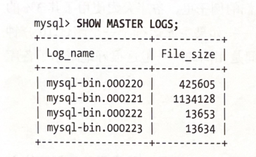

该命令用于给PURGE MASTER LOGS命令决定使用哪个参数。另外还可以通过SHOWBINLOG EVENTS来查看复制事件。例如，在运行前一个命令后，我们在另一个不曾使用过的服务器上创建一个表，因为知道这是唯一改变数据的语句，而且也知道语句在二进制日志中的偏移量是13634，所以我们可以看到如下内容：

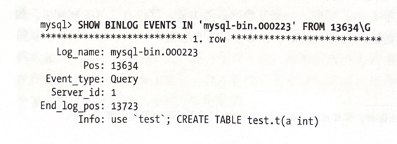

### 10.6.2测量备库延迟

一个比较普遍的问题是如何监控备库落后主库的延迟有多大。虽然SHOW SLAVE STATUS输出的Seconds_behind_master 列理论上显示了备库的延时，但由于各种各样的原因，并不总是准确的：

- 备库 Seconds_behind_master值是通过将服务器当前的时间戳与二进制日志中的事件的时间戳相对比得到的，所以只有在执行事件时才能报告延迟。
- 如果备库复制线程没有运行，就会报延迟为 NULL。
- 一些错误（例如主备的max_aLlowed_packet不匹配，或者网络不稳定）可能中断复制并且/或者停止复制线程，但Seconds_behind_master将显示为0而不是显示错误。
- 即使备库线程正在运行，备库有时候可能无法计算延时。如果发生这种情况，备库会报0或者NULL。
- 一个大事务可能会导致延迟波动，例如，有一个事务更新数据长达一个小时，最后提交。这条更新将比它实际发生时间要晚一个小时才记录到二进制日志中。当备库执行这条语句时，会临时地报告备库延迟为一个小时，然后又很快变成0。
- 如果分发主库落后了，并且其本身也有已经追赶上它的备库，备库的延迟将显示为0，而事实上和源主库之间是有延迟的。

解决这些问题的办法是忽略Seconds_behind_master的值，并使用一些可以直接观察和衡量的方式来监控备库延迟。最好的解决办法是使用heartbeat record，这是一个在主库上会每秒更新一次的时间戳。为了计算延时，可以直接用备库当前的时间戳减去心跳记录的值。这个方法能够解决刚刚我们提到的所有问题，另外一个额外的好处是我们还可以通过时间戳知道备库当前的复制状况。包含在Percona Toolkit里的pt-heartbeat脚本是“复制心跳”最流行的一种实现。

心跳还有其他好处，记录在二进制日志中的心跳记录拥有许多用途，例如在一些很难解决的场景下可以用于灾难恢复。

我们刚刚所描述的几种延迟指标都不能表明备库需要多长时间才能赶上主库。这依赖于许多因素，例如备库的写入能力以及主库持续写入的次数。关于这个话题，详细参阅前面介绍的“何时备库开始延迟”。

### 10.6.3确定主备是否一致
在理想情况下，备库和主库的数据应该是完全一样的。但事实上备库可能发生错误并导致数据不一致。即使没有明显的错误，备库同样可能因为 MySQL自身的特性导致数据不一致，例如MySQL的 Bug、网络中断、服务器崩溃,非正常关闭或者其他一些错误。

按照我们的经验来看，主备一致应该是一种规范，而不是例外，也就是说，检查你的主备一致性应该是一个日常工作，特别是当使用备库来做备份时尤为重要，因为你肯定不希望从一个已经损坏的备库里获得备份数据。

MySQL并没有内建的方法来比较一台服务器与别的服务器的数据是否相同。它提供了一些组件来为表和数据生成校验值，例如 CHECKSUM TABLE。但当复制正在进行时，这种方法是不可行的。

Percona Toolkit 里的 pt-table-checksum 能够解决上述几个问题。其主要特性是用于确认备库与主库的数据是否一致。工作方式是通过在主库上执行 INSERT...SELECT查询。这些查询对数据进行校验并将结果插入到一个表中。这些语句通过复制传递到备库，并在备库执行一遍，然后可以比较主备上的结果是否一样。由于该方法是通过复制工作的，它能够给出一致的结果而无须同时把主备上的表都锁上。

通常情况下可以在主库上运行该工具，参数如下：

$ pt-table-checksum --replicate=test.checksum <master_host>

该命令将检查所有的表，并将结果插入到test.checksum 表中。当查询在备库执行完后，就可以简单地比较主备之间的不同了。pt-table-checksum 能够发现服务器所有的备库，在每台备库上运行查询，并自动地输出结果。在写作本书时，pt-table-checksum是唯一能够有效地比较主备一致性的工具。

### 10.6.4从主库重新同步备库
在你的职业生涯中，也许会不止一次需要去处理未被同步的备库。可能是使用校验工具发现了数据不一致，或是因为已经知道是备库忽略了某条查询或者有人在备库上修改了数据。

传统的修复不一致的办法是关闭备库，然后重新从主库复制一份数据。当备库数据不一致的问题可能导致严重后果时，一旦发现就应该将备库停止并从生产环境移除，然后再从一个备份中克隆或恢复备库。

这种方法的缺点是不太方便，特别是数据量很大时。如果能够找出并修复不一致的数据，要比从其他服务器上重新克隆数据要有效得多。如果发现的不一致并不严重，就可以保持备库在线，并重新同步受影响的数据。

最简单的办法是使用mysqldump转储受影响的数据并重新导人。在整个过程中，如果数据没有发生变化，这种方法会很好。你可以在主库上简单地锁住表然后进行转储，再等待备库赶上主库，然后将数据导人到备库中。(需要等待备库赶上主库，这样就不至于为其他表引入新的不一致，例如那些可能通过和失去同步的表做join后进行数据更新的表)。

虽然这种方法在许多场景下是可行的，但在一个繁忙的服务器上有可能行不通。另外一个缺点是在备库上通过非复制的方式改变数据。通过复制改变备库数据（通过在主库上执行更新）通常是一种安全的技术，因为它避免了竞争条件和其他意料外的事情。如果表很大或者网络带宽受限，转储和重载数据的代价依然很高。当在一个有一百万行的表上只有一千行不同的数据呢？转储和重载表的数据是非常浪费资源的。

pt-table-sync是Percona Toolkit 中的另外一个工具，可以解决该问题。该工具能够高效地查找并解决表之间的不同。它同样通过复制工作，在主库上执行查询，在备库上重新同步，这样就没有竞争条件。它是结合pt-table-checksum生成的checksum表来工作的，所以只能操作那些已知不同步的表的数据块。但该工具不是在所有场景下都有效。为了正确地同步主库和备库，该工具要求复制是正常的，否则就无法工作。pt-table-sync 设计得很高效，但当数据量非常大时效率还是会很低。比较主库和备库上1TB 的数据不可避免地会带来额外的工作。尽管如此，在那些合适的场景中，该工具依然能节约大量的时间和工作。

### 10.6.5改变主库
迟早会有把备库指向一个新的主库的需求。也许是为了更迭升级服务器，或者是主库出现问题时需要把一台备库转换成主库，或者只是希望重新分配容量。不管出于什么原因，都需要告诉其他的备库新主库的信息。

如果这是计划内的操作，会比较容易(至少比紧急情况下要容易)。只需在备库简单地使用CHANGEMASTER TO命令，并指定合适的值。大多数值都是可选的。只需要指定需要改变的项即可。备库将抛弃之前的配置和中继日志并从新的主库开始复制。同样新的参数会被更新到master.info文件中，这样就算重启，备库配置信息也不会丢失。整个过程中最难的是获取新主库上合适的二进制日志位置，这样备库才可以从和老主库相同的逻辑位置开始复制。

把备库提升为主库要更困难一点。有两种场景需要将备库替换为主库，一种是计划内的提升，一种是计划外的提升。

#### 计划内的提升

把备库提升为主库理论上是很简单的。简单来说，有以下步骤：

1. 停止向老的主库写入。
2. 让备库追赶上主库（可选的，会简化下面的步骤)。
3. 将一台备库配置为新的主库。
4. 将备库和写操作指向新的主库，然后开启主库的写入。

但这其中还隐藏着很多细节。一些场景可能依赖于复制的拓扑结构。例如，主－主结构和主－备结构的配置就有所不同.

更深入一点，下面是大多数配置需要的步骤：

1. 停止当前主库上的所有写操作。如果可以，最好能将所有的客户端程序关闭（除了复制连接）。为客户端程序建立一个“do not run”这样的类似标记可能会有所帮助。如果正在使用虚拟IP地址，也可以简单地关闭虚拟IP，然后断开所有的客户端连接以关闭其打开的事务。
2. 通过FLUSH TABLES WITH READ LOCK在主库上停止所有活跃的写人，这一步是可选的。也可以在主库上设置read_only选项。从这一刻开始，应该禁止向即将被替换的主库做任何写人。因为一旦它不是主库，写就意味着数据丢失。注意，即使设
   置read_only也不会阻止当前已存在的事务继续提交。为了更好地保证这一点，可以“kill”所有打开的事务，这将会真正地结束所有写入。
3. 选择一个备库作为新的主库，并确保它已经完全跟上主库（例如，让它执行完所有从主库获得的中继日志)。
4. 确保新主库和旧主库的数据是一致的。可选。
5. 在新主库上执行STOPSLAVE。
6. 在新主库上执行CHANGE MASTER TO MASTER HOST=''，然后再执行 RESET SLAVE，使其断开与老主库的连接，并丢弃 master.injo里记录的信息（如果连接信息记录在my.cuf里，会无法正确工作，这也是我们建议不要把复制连接信息写到配置文件里的原因之一)。
7. 执行SHOWMASTER STATUS记录新主库的二进制日志坐标。
8. 确保其他备库已经追赶上。
9. 关闭旧主库。
10. 在MySQL5.1及以上版本中，如果需要，激活新主库上事件。
11. 将客户端连接到新主库
12. 在每台备库上执行 CHANGE MASTER TO语句，使用之前通过 SHOW MASTER STATUS获得的二进制日志坐标，来指向新的主库。

> 当将备库提升为主库时，要确保备库上任何特有的数据库、表和权限已经被移除。可能还需要修改备库特有的配置选项，例如innodb_flush_Log_at_trx_commit 选项。。同样的，如果是把主库降级为备库，也要保证进行需要的配置。
>
> 如果主备的配置相同，就不需要做任何改变。

#### 计划外的提升

当主库崩溃时，需要提升一台备库来代替它，这个过程可能就不太容易。如果只有一台备库，可以直接使用这台备库。但如果有超过一台的备库，就需要做一些额外的工作。

另外，还有潜在的丢失复制事件的问题。可能有主库上已发生的修改还没有更新到它的任何一台备库上的情况。甚至还可能一条语句在主库上执行了回滚，但在备库上没有回滚，这样备库可能超过主库的逻辑复制位置。如果能在某一点恢复主库的数据，也许就可以取得丢失的语句并手动执行它们。

在以下步骤中，需要确保在计算中使用 Master_Log_File和 Read_Master_Log_Pos的值。以下是对主备拓扑结构中的备库进行提升的过程：

1. 确定哪台备库的数据最新。检查每台备库上 SHOW SLAVE STATUS命令的输出，选择其中 Master_Log_File/read_ Master_Log_Pos 的值最新的那个。
2. 让所有备库执行完所有其从崩溃前的旧主库那获得的中继日志。如果在未完成前修改备库的主库，它会抛弃剩下的日志事件，从而无法获知该备库在什么地方停止。
3. 执行前一小节的5～7步。
4. 比较每台备库和新主库上的 Master_Log_File/Read_Master_Log_Pos 的值。
5. 执行前一小节的10～12步。

正如本章开始我们推荐的，假设已经在所有的备库上开启了log_bin和log_slave_
updates，这样可以帮助你将所有的备库复到一个一致的时间点，如果没有开启这两个选项，则不能可靠地做到这一点。

#### 确定期望的日志位置

如果有备库和新主库的位置不相同，则需要找到该备库最后一条执行的事件在新主库的二进制日志中相应的位置，然后再执行 CHANGE MASTER TO。可以通过mysqlbinlog工具来找到备库执行的最后一条查询，然后在主库上找到同样的查询，进行简单的计算即可得到。

为了便于描述，假设每个日志事件有一个自增的数字ID，最新的备库，也就是新主库，在旧主库崩溃时获得了编号为100的事件，假设有另外两台备库：replica2和repLica3。repLica2已经获取了99号事件，repLica3获取了98号事件。如果把两台备库都指向新主库的同一个二进制日志位置，它们将从101号事件开始复制，从而导致数据不同步。但只要新主库的二进制日志已经通过 Log_sLave_updates 打开，就可以在新主库的二进制日志中找到99号和100号日志，从而将备库恢复到一致的状态。

由于服务器重启，不同的配置，日志轮转或者FLUSH LOGS 命令，同一个事件在不同的服务器上可能有不同的偏移量。找到这些事件可能会耗时很长并且枯燥，但是通常没有难度。通过mysqlbinlog从二进制日志或中继日志中解析出每台备库上执行的最后一个事件，并同样使用该命令解析新主库上的二进制日志，找到相同的查询，mysqlbinlog会打印出该事件的偏移量，在CHANGE MASTER TO命令中使用这个值。

更快的方法是把新主库和停止的备库上的字节偏移量相减，它显示了字节位置的差异。然后把这个值和新主库当前二进制日志的位置相减，就可以得到期望的查询的位置。只需要验证一下就可以据此启动备库。

让我们看看一个相关的例子，假设server1是server2和server3的主库，其中服务器server1 已经崩溃。根据 SHOW SLAVE STATUS 获得 Master_Log_File/Read_Master_LogPos 的值，server2已经执行完了server1上所有的二进制日志，但server3还不是最新数据。图10-15显示了这个场景（日志事件和偏移量仅仅是为了举例）。

正如图10-15所示，我们可以肯定server2已经执行完了主库上的所有二进制日志，因为Master_Log_File 和 Read_Master_Log_Pos 值和 server1上最后的日志位置是相吻合的，因此我们可以将server2提升为新主库，并将 server3设置为server2的备库。

应该在server3上为需要执行的CHANGEMASTERTO语句赋子什么样的参数呢？这里需要做一点点计算和调查。server3在偏移量1493停止，比server2执行的最后一条语句的偏移量1582要小89字节。server2正在向偏移量为8167的二进制日志写人，8167-89=8078，因此理论上我们应该将server3指向 server2的日志的偏移量为8078的位置。最好去确认下这个位置附近的日志事件，以确定在该位置上是否是正确的日志事件，因为可能有别的例外，例如有些更新可能只发生在server2上。

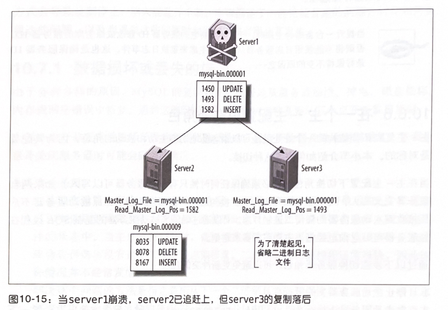

假设我们观察到的事件是一样的，下面这条命令会将server3切换为server2的备库。 

```mysql 
server2> CHANGE MASTER TO MASTER_HOST="server2",MASTER LOG _FILE="mysql-bin.000009",MASTER LOG_POS-8078;
```

如果服务器在它崩溃时已经执行完成并记录了超过一个事件，会怎么样呢？因为
server2仅仅读取并执行到了偏移位置1582，你可能永远地失去了一个事件。但是如果老主库的磁盘没有损坏，仍然可以通过mysqlbinlog或者从日志服务器的二进制日志中找到丢失的事件。

如果需要从老主库上恢复丢失的事件，建议在提升新主库之后且在允许客户端连接之前做这件事情。这样就无须在每台备库上都执行丢失的事件，只需使用复制来完成。但如果崩溃的老主库完全不可用，就不得不等待，稍后再做这项工作。

上述流程中一个可调整的地方是使用可靠的方式来存储二进制日志，如SAN或分布式复制数据库设备（DRBD)。即使主库完全失效，依然能够获得它的二进制日志。也可以设置一个日志服务器，把备库指向它，然后让所有备库赶上主库失效的点。这使得提升一个备库为新的主库没那么重要，本质上这和计划中的提升是相同的。我们将在下一章进一步讨论这些存储选项。

> 当提升一台备库为主库时，千万不要将它的服务器ID修改成原主库的服务器 ID，否则将不能使用日志服务器从一个旧主库来重放日志事件。这也是确保服务器ID最好保持不变的原因之一。

### 10.6.6在一个主-主配置中交换角色

主－主复制拓扑结构的一个好处就是可以很容易地切换主动和被动的角色，因为其配置是对称的。本小节介绍如何完成这种切换。

当在主－主配置下切换角色时，必须确保任何时候只有一个服务器可以写入。如果两台服务器交叉写入，可能会导致写人冲突。换句话说，在切换角色后，原被动服务器不应该接收到主动服务器的任何二进制日志。可以通过确保原被动服务器的复制SQL线程在该服务器可写之前已经赶上主动服务器来避免。

通过以下步骤切换服务器角色，可以避免更新冲突的危险：

1. 停止主动服务器上的所有写入。
2. 在主动服务器上执行 SET GLOBAL read_only=1，同时在配置文件里也设置一下read only，防止重启后失效。但记住这不会阻止拥有超级权限的用户更改数据。如果想阻止所有人更改数据，可以执行FLUSH TABLES WITH READLOCK。如果没有这么做，你必须kill所有的客户端连接以保证没有长时间运行的语句或者未提交的事务。
3. 在主动服务器上执行SHOWMASTERSTATUS并记录二进制日志坐标。
4. 使用主动服务器上的二进制日志坐标在被动服务器上执行 SELECT MASTER_POSWAIT()。该语句将阻塞住，直到复制跟上主动服务器。
5. 在被动服务器上执行 SET GLOBAL read onLy=0，这样就变换成主动服务器。
6. 修改应用的配置，使其写入到新的主动服务器中。

可能还需要做一些额外的工作，包括更改两台服务器的IP地址，这取决于应用的配置，我们将在下一节讨论这个话题

## 10.7复制的问题和解决方案

中断MySQL的复制并不是件难事。因为实现简单，配置相当容易，但也意味着有很多方式会导致复制停止，陷入混乱并中断。本章描述了一些比较普遍的问题，讨论如何重现这些问题，以及当遇到这些问题时如何解决或者阻止其发生。

### 10.7.1数据损坏或丢失的错误
由于各种各样的原因，MySQL的复制并不能很好地从服务器崩溃、掉电、磁盘损坏、内存或网络错误中恢复。遇到这些问题时几乎可以肯定都需要从某个点开始重启复制。大部分由于非正常关机后导致的复制问题都是由于没有把数据及时地刷到磁盘。下面是意外关闭服务器时可能会碰到的情况。

- 主库意外关闭
  如果没有设置主库的sync_binlog 选项，就可能在崩溃前没有将最后的几个二进制日志事件刷新到磁盘中。备库I/O线程因此也可一直处于读不到尚未写入磁盘的事件的状态中。当主库重新启动时，备库将重连到主库并再次尝试去读该事件，但主库会告诉备库没有这个二进制日志偏移量。二进制日志转储线程通常很快，因此这种情况并不经常发生。
  解决这个问题的方法是指定备库从下一个二进制日志的开头读日志。但是一些日志事件将永久地丢失，建议使用Percona Toolkit 中的pt-table-checksum 工具来检查主备一致性，以便于修复。可以通过在主库开启 sync_binlog 来避免事件丢失。即使开启了sync_binlog，MyISAM表的数据仍然可能在崩溃的时候损坏，对于InnoDB事务，如果 innodb_flush_Log_at_trx_commit没有设为1,也可能丢失数据（但数据不会损坏)。

- 备库意外关闭

  当备库在一次非计划中的关闭后重启时，会去读master.info文件以找到上次停止复制的位置。不幸的是，该文件并没有同步写到磁盘，文件中存储的信息可能是错误的。备库可能会尝试重新执行一些二进制日志事件，这可能会导致唯一索引错误。除非能确定备库在哪里停止（通常不太可能)，否则唯一的办法就是忽略那些错误。Percona Toolkit中的pt-slave-restart工具可以帮助完成这一点。如果使用的都是 InnoDB表，可以在重启后观察MySQL 错误日志。InnoDB 在恢复过程中会打印出它的恢复点的二进制日志坐标。可以使用这个值来决定备库指向主库的偏移量。Percona Server 提供了一个新的特性，可以在恢复的过程中自动将这些信息提取出来，并更新master.injo文件，从根本上使得复制能够协调好备库上的事务。
  MySQL5.5也提供了一些选项来控制如何将master.inf和其他文件刷新到磁盘，这有助于减少这些问题。

除了由于MySQL非正常关闭导致的数据丢失外，磁盘上的二进制日志或中继日志文件损坏并不罕见。下面是一些更普遍的场景：

- 主库上的二进制日志损坏
  如果主库上的二进制日志损坏，除了忽略损坏的位置外你别无选择。可以在主库上执行 FLUSH LOGS命令，这样主库会开始一个新的日志文件，然后将备库指向该文件的开始位置。也可以试着去发现损坏区域的结束位置。某些情况下可以通过 SETGLOBAL SQL_SLAVE_SKIP_COUNTER =1来忽略一个损坏的事件。如果有多个损坏的事件，就需要重复该步骤，直到跳过所有损坏的事件。但如果有太多的损坏事件，这么做可能就没有意义了。损坏的事件头会阻止服务器找到下一个事件。这种情况下，可能不得不手动地去找到下一个完好的事件。
- 备库上的中继日志损坏
  如果主库上的日志是完好的，就可以通过CHANGE MASTER TO命令丢弃并重新获取损坏的事件。只需要将备库指向它当前正在复制的位置（ReLay_Master_Log_File/Exec_Master_Log_Pos)。这会导致备库丢弃所有在磁盘上的中继日志。就这一点而言，MySQL5.5做了一些改进，它能够在崩溃后自动重新获取中继日志。
- 二进制日志与InnoDB事务日志不同步
  当主库崩溃时，InnoDB 可能将一个事务标记为已提交，此时该事务可能还没有记录到二进制日志中。除非是某个备库的中继日志已经保存，否则没有任何办法恢复丢失的事务。在MySQL5.0版本可以设置sync_binlog选项来防止该问题，对于更早的MySQL4.1可以设置sync_binlog和safe_binLog 选项。

当一个二进制日志损坏时，能恢复多少数据取决于损坏的类型，有几种比较常见的类型：

- 数据改变，但事件仍是有效的SQL
  不幸的是，MySQL 甚至无法察觉这种损坏。因此最好还是经常检查备库的数据是否正确。在MySQL未来的版本中可能会被修复。

- 数据改变并且事件是无效的SQL
  这种情况可以通过mysqlbinlog提取出事件并看到一些错乱的数据，例如：

  UPDATE TBL SET C0L77777777777777777

  可以通过增加偏移量的方式来尝试找到下一个事件，这样就可以只忽略这个损坏的事件。

- 数据遗漏并且／或者事件的长度是错误的
  这种情况下，mysqlbinlog 可能会发生错误退出或者直接崩溃，因为它无法读取事件，并且找不到下一个事件的开始位置。

- 某些事件已经损坏或被覆盖，或者偏移量已经改变并且下一个事件的起始偏移量也是错误的
  同样的，这种情况下mysqlbinlog也起不了多少作用。

当损坏非常严重，通过mysqlbinlog已经无法获取日志事件时，就不得不进行一些十六进制的编辑或者通过一些烦琐的技术来找到日志事件的边界。这通常并不困难，因为有一些可辨识的标记会分割事件。

有一些可辨别的模式可以帮助定位事件的开头，注意以‘G结尾的字符串在日志事件开头的一个字节后的位置。它们是固定长度的事件头的一部分。

这些值因服务器而异，因此结果也可能取决于解析的日志所在的服务器。简单地分析后应该能够从二进制日志中找到这些模式并找到下一个完整的日志事件偏移量。然后通过mysqlbinlog的--start-position选项来跳过损坏的事件，或者使用CHANGE MASTER TO命令的 MASTER LOG_POS参数。

### 10.7.2使用非事务型表
如果一切正常，基于语句的复制通常能够很好地处理非事务型表。但是当对非事务型表的更新发生错误时，例如查询在完成前被kill，就可能导致主库和备库的数据不一致。

例如，假设更新一个MyISAM表的100 行数据，若查询更新到了其中 50条时有人kil1该查询，会发生什么呢？一半的数据改变了，而另一半则没有，结果是复制必然不同步，因为该查询会在备库重放并更新完100 行数据（MySQL随后会在主库上发现查询引起的错误，而备库上则没有报错，此后复制将会发生错误并中断)。

如果使用的是 MyISAM表，在关闭MySQL之前需要确保已经运行了 STOP SLAVE，否则服务器在关闭时会kil1所有正在运行的查询（包括没有完成的更新)。事务型存储引擎则没有这个问题。如果使用的是事务型表，失败的更新会在主库上回滚并且不会记录到二进制日志中。

### 10.7.3混合事务型和非事务型表
如果使用的是事务型存储引擎，只有在事务提交后才会将查询记录到二进制日志中。因此如果事务回滚，MySQL 就不会记录这条查询，也就不会在备库上重放。

但是如果混合使用事务型和非事务型表，并且发生了一次回滚，MySQL能够回滚事务型表的更新，但非事务型表则被永久地更新了。只要不发生类似查询中途被kill这样的错误，这就不是问题：MySQL此时会记录该查询并记录一条ROLLBACK语句到日志中。结果是同样的语句也在备库执行，所有的都很正常。这样效率会低一点，因为备库需要做一些工作并且最后再把它们丢弃掉。但理论上能够保证主备的数据一致。

目前看来一切很正常。但是如果备库发生死锁而主库没有也可能会导致问题。事务型表的更新会被回滚，而非事务型表则无法回滚，此时备库和主库的数据是不一致的。

防止该问题的唯一办法是避免混合使用事务型和非事务型表。如果遇到这个问题，唯一的解决办法是忽略错误，并重新同步相关的表。

基于行的复制不会受这个问题的影响。因为它记录的是数据的更改，而不是SQL语句。如果一条语句改变了一个MyISAM表和一个InnoDB表的某些行，然后主库上发生了一次死锁，InnoDB表的更新会被回滚，而MyISAM表的更新仍会被记录到日志中并在备库重放。

### 10.7.4不确定语句

当使用基于语句的复制模式时，如果通过不确定的方式更改数据可能会导致主备不一致。例如，一条带 LIMIT的 UPDATE语句更改的数据取决于查找行的顺序，除非能保证主库和备库上的顺序相同。例如，若行根据主键排序，一条查询可能在主库和备库上更新不同的行，这些问题非常微妙并且很难注意到。所以一些人禁止对那些会更新数据的语句使用LIMIT。另外一种不确定的行为是在一个拥有多个唯一索引的表上使用REPLACE或者INSERT IGNORE语句——MySQL在主库和备库上可能会选择不同的索引。

另外还要注意那些涉及 INFORMATION_SCHEMA表的语句。它们很容易在主库和备库上产生不一致，其结果也会不同。最后，需要注意许多系统变量，例如@@server_id和@@hostname，在MySQL5.1之前无法正确地复制。

基于行的复制则没有上述限制。

### 10.7.5库和备库使用不同的存储引擎

正如本章之前提到的，在备库上使用不同的存储引擎，有时候可以带来好处。但是在一些场景下，当使用基于语句的复制方式时，如果备库使用了不同的存储引擎，则可能造成一条查询在主库和备库上的执行结果不同，例如不确定语句（如前一小节提到的）在主备库使用不同的存储引擎时更容易导致问题。

如果发现主库和备库的某些表已经不同步，除了检查更新这些表的查询外，还需要检查两台服务器上使用的存储引擎是否相同。

### 10.7.6备库发生数据改变

基于语句的复制方式前提是确保备库上有和主库相同的数据，因此不应该允许对备库数据的任何更改（比较好的办法是设置read_onty选项）。假设有如下语句：

```mysql 
mysql> INSERT INTO table1 SELECT * FROM table2;
```

如果备库上 table2的数据和主库上不同，该语句会导致table1的数据也会不一致。换句话说，数据不一致可能会在表之间传播。不仅仅是 INSERT..…...SELECT查询，所有类型的查询都可能发生。有两种可能的结果：备库上发生重复索引键冲突错误或者根本不提示任何错误。如果能报告错误还好，起码能够提示你主备数据已经不一致。无法察觉的不一致可能会悄无声息地导致各种严重的问题。

唯一的解决办法就是重新从主库同步数据。

### 10.7.7不唯一的服务器ID

这种问题更加难以捉摸。如果不小心为两台备库设置了相同的服务器ID，看起来似乎没有什么问题，但如果查看错误日志，或者使用innotop查看主库，可能会看到一些古怪的信息。

在主库上，会发现两台备库中只有一台连接到主库（通常情况下所有的备库都会建立连接以等待随时进行复制)。在备库的错误日志中，则会发现反复的重连和连接断开信息，但不会提及被错误配置的服务器ID。

MySQL可能会缓慢地进行正确的复制，也可能无法进行正确复制，这取决于MySQL的版本，给定的备库可能会丢失二进制日志事件，或者重复执行事件，导致重复键错误（或者不可见的数据损坏)。也可能因为备库的互相竞争造成主库的负载升高。如果备库竞争非常激烈，会导致错误日志在很短的时间内急剧增大。

唯一的解决办法是小心设置备库的服务器ID。一个比较好的办法是创建一个主库到备库的服务器 ID 映射表，这样就可以跟踪到备库的ID信息注19。如果备库全在一个子网络内，可以将每台机器IP的后八位作为唯一ID。

### 10.7.8未定义的服务器ID

如果没有在 my.cnf里定义服务器 ID，可以通过 CHANGE MASTER TO来设置备库，但却无法启动复制：

```mysql
mysql> START SLAVE;
ERROR 1200 (HYOOO): The server is not configured as slavej fix in config file or withCHANGE MASTER TO
```

这个报错可能会让人困惑，因为刚刚执行CHANGE MASTER TO设置了备库，并且通过SHOW MASTER STATUS也确认了。执行 SELECT @@server_id也可以获得一个值，但这只是默认值，必须为备库显式地设置服务器 ID。

### 10.7.9对未复制数据的依赖性

如果在主库上有备库不存在的数据库或表，复制会很容易意外中断，反之亦然。假设主库上有一个备库不存在的数据库，命名为scratch。如果在主库上发生对该数据库中表的更新，备库会在尝试重放这些更新时中断。同样的，如果在主库上创建一个备库上已存在的表，复制也可能中断。

没有什么好的解决办法，唯一的办法就是避免在主库上创建备库上没有的表。
这样的表是如何创建的呢？有很多可能的方式，其中一些可能更难防范。例如，假设先在备库上创建一个数据库 scratch，该数据库在主库上不存在，然后因为某些原因切换了主备。当完成这些后，可能忘记了移除scratch数据库以及它的权限。这时候一些人就可以连接到该数据库并执行一些查询，或者一些定期的任务会发现这些表，并在每个表上执行 OPTIMIZE TABLE命令。

当提升备库为主库时，或者决定如何配置备库时，需要注意这一点。任何导致主备不同的行为都会产生潜在的问题。

### 10.7.10丢失的临时表

临时表在某些时候比较有用，但不幸的是，它与基于语句的复制方式是不相容的。如果备库崩溃或者正常关闭，任何复制线程拥有的临时表都会丢失。重启备库后，所有依赖于该临时表的语句都会失败。

当基于语句进行复制时，在主库上并没有安全使用临时表的方法。许多人确实很喜欢临时表，所以很难去说服他们，但这是不可否认的。不管它们的存在多么短暂，都会使得备库的启动和停止以及崩溃恢复变得困难，即使是在一个事务内使用也一样。（如果在备库使用临时表可能问题会少些，但如果备库本身也是一个主库，问题依然存在。

如果备库重启后复制因找不到临时表而停止，可能需要做以下一些事情：可以直接跳过错误，或者手动地创建一个名字和结构相同的表来代替消失的临时表。不管用什么办法，如果写入查询依赖于临时表，都可能造成数据不一致。

避免使用临时表没有看起来那么难，临时表主要有两个比较有用的特性：

- 只对创建临时表的连接可见。所以不会和其他拥有相同名字临时表的连接起冲突。
- 随着连接关闭而消失，所以无须显式地移除它们。

可以保留一个专用的数据库，在其中创建持久表，把它们作为伪临时表，以模拟这些特性。只需要为它们选择一个唯一的名字。还好这很容易做到：简单地将连接ID拼接到表名之后。例如，之前创建临时表的语句为：CREATE TEMPORARY TABLE top_users(...），现在则可以执行CREATE TABLE temp.top_users_1234（．..），其中1234是函数CONNECTIONID（）的返回值。当应用不再使用该伪临时表后，可以将其删除或使用一个清理线程来将其移除。表名中使用连接ID可以用于确定哪些表不再被使用—可以通过 SHOWPROCESSLIST命令来获得活跃连接列表，并将其与表名中的连接ID相比较。

我们已经有人尝试各种方法来解决这个问题，但对于基于语勺的复制并没有安全的临时表创建方使用实体表而非临时表还有别的好处。例如，能够帮助你更容易调试应用程序，因为可以通过别的连接来查看应用正在维护的数据。如果使用的是临时表，可能就没这么容易做到。
但是实体表可能会比临时表多一些开销，例如创建会更慢，因为为这些表分配的.m 文件需要刷新到磁盘。可以通过禁止sync_frm 选项来加速，但这可能会导致潜在的风险。

如果确实需要使用临时表，也应该在关闭备库前确保 SLave_open_temp_tabLes 状态变量值为0。如果不是0，在重启备库后就可能会出现问题。合适的流程是执行 STOP SLAVE,检查变量，然后再关闭备库。如果在停止复制前检查变量，可能会发生竞争条件的风险。

### 10.7.11不复制所有的更新

如果错误地使用SET SQL_LOG_BIN=0或者没有理解过滤规则，备库可能会丢失主库上已经发生的更新。有时候希望利用此特性来做归档，但常常会导致意外并出现不好的结果。例如，假设设置了 repLicate_do_db规则，把sakila数据库的数据复制到某一台备库上。如果在主库上执行如下语句，会导致主备数据不一致：

```mysql 
mysql> USE test;
mysql> UPDATE sakila.actor;
```

其他类型的语句甚至会因为没有复制依赖导致备库复制抛出错误而失败。

### 10.7.12InnoDB加锁读引起的锁争用

正常情况下，InnoDB的读操作是非阻塞的，但在某些情况下需要加锁。特别是在使用基于语句的复制方式时，执行INSERT...SELECT操作会锁定源表上的所有行。MySQL需要加锁以确保该语句的执行结果在主库和备库上是一致的。实际上，加锁导致主库上的语句串行化，以确保和备库上执行的方式相符。

这种设计可能导致锁竞争、阻塞，以及锁等待超时等情况。一种缓解的办法就是避免让事务开启太久以减少阻塞。可以在主库上尽快地提交事务以释放锁。

把大命令拆分成小命令，使其尽可能简短。这也是一种减少锁竞争的有效方法。即使有时很难做到，但也是值得的（使用Percona Toolkit 中的 pt-archiver 工具会很简单）。另一种方法是替换掉 INSERT...SELECT语句，在主库上先执行 SELECT INTO OUTFILE，再执行 LOAD DATA INFILE。这种方法更快，并且不需要加锁。这种方法很特殊，但有时还是有用的。最大的问题是为输出文件选择一个唯一的名字，并在完成后清理掉文件。可以通过之前讨论过的 CONNECTION_ID(）来保证文件名的唯一性，并且可以使用定时任务（UNIX的crontab，Windows平台的计划任务）在连接不再使用这些文件后进行自动清理。

也可以尝试关闭上面的这种锁机制，而不是使用上面的变通方法。有一种方法可以做到，但在大多数场景下并不是好办法，备库可能会在不知不觉间就失去和主库的数据同步。这也会导致在做恢复时二进制日志变得毫无用处。但如果确实觉得这么做的利大于弊，可以使用下面的办法来关闭这种锁机制：

```text
# THIS IS NOT SAFE!
innodb _locks_unsafe_for_binlog = 1
```

这使得查询的结果所依赖的数据不再加锁。如果第二条查询修改了数据并在第一条查询之前先提交。在主库和备库上执行这两条语句的结果可能不相同。对于复制和基于时间点的恢复都是如此。

为了了解锁定读取是如何防止混乱的，假设有两张表：一个没有数据，另一个只有一行数据，值为99。有两个事务更新数据。事务1将第二张表的数据插人到第一张表，事务2更新第二张表（源表)，如图10-16所示。

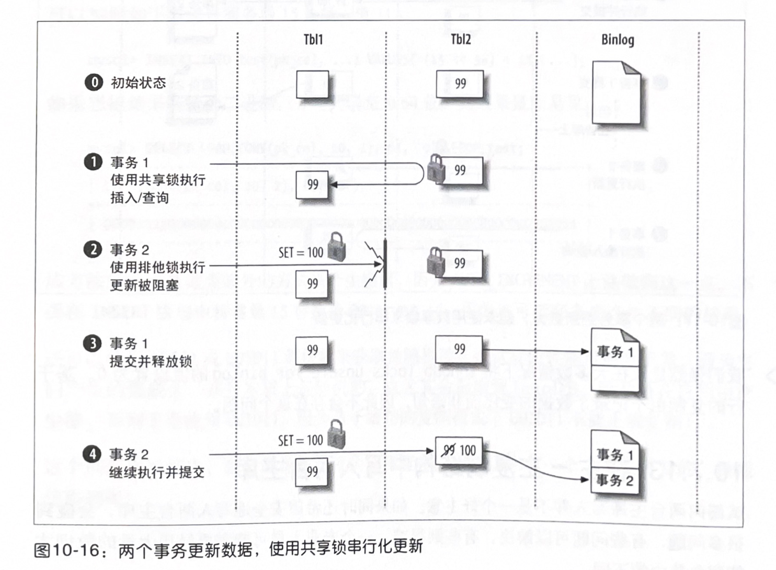

第二步非常重要，事务2尝试去更新源表，这需要在更新的行上加排他锁（写锁)。排他锁与其他锁是不相容的，包括事务1在行记录上加的共享锁。因此事务2需要等待直到事务1完成。事务按照其提交的顺序在二进制日志中记录，所以在备库重放这些事务时产生相同的结果。

但从另一方面来说，如果事务1没有在读取的行上加共享锁，就无法保证了。图10-17显示了在没有锁的情况下可能的事件序列。

如果没有加锁，记录在日志中的事务顺序在主备上可能会产生不同的结果。MySQL会先记录事务2，这会影响到事务1在备库上的结果，而主库上则不会发生，从而导致了主备的数据不一致。

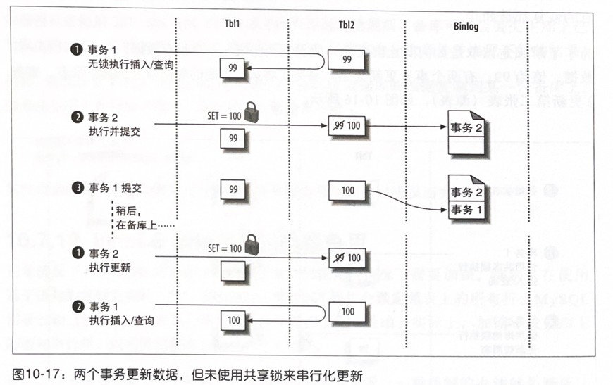

我们强烈建议在大多数情况下将innodb_Locks_unsafe_for_binlog 的值设置为0。基于行的复制由于记录了数据的变化而非语句，因此不会存在这个问题。

### 10.7.13在主-主复制结构中写入两台主库

试图向两台主库写入并不是一个好主意。如果同时还希望安全地写入两台主库，会碰到很多问题，有些问题可以解决，有些则很难。一个专业人员可能需要经历大量的教训才能明白其中的不同。

在MySQL5.0中，有两个变量可以用于帮助解决AUTO_INCREMENT自增主键冲突的问题：auto_increment_increment和 auto_increment_offset。可以通过设置这两个变量来错开主库和备库生成的数字，这样可以避免自增列的冲突。

但是这并不能解决所有由于同时写人两台主库所带来的问题，自增问题只是其中的一小部分。而且这种做法也带来了一些新的问题：

- 很难在复制拓扑间做故障转移。
- 由于在数字之间出现间隙，会引起键空间的浪费。
- 只有在使用了 AUTO_INCREMENT主键的时候才有用。有时候使用 AUTO_INCREMENT列作为主键并不总是好主意。

你也可以自己来生成不冲突的主键值。一种办法是创建一个多个列的主键，第一列使用服务器 ID值。这种办法很好，但却使得主键的值变得更大，会对 InnoDB 二级索引键值产生多重影响。

也可以使用只有一列的主键，在主键的高字节位存储服务器ID。简单的左移位（除法）和加法就可以实现。方法的缺点是需要额外的方式来产生键值，因为AUTO_INCREMENT无法做到这一点。不要在INSERT语句中将常量15替换为@@server_id，因为这可能在备库产生不同的结果。

还可以使用MD5(）或UUID()等函数来获取伪随机数，但这样做性能可能会很差，因为它们产生的值较大，并且本质上是随机的，这尤其会影响到InnoDB（除非是在应用中产生值，否则不要使用 UUID()，因为基于语句的复制模式下 UUID（）不能正确复制）。

这个问题很难解决，我们通常推荐重构应用程序，以保证只有一个主库是可写的。谁能想得到呢？

### 10.7.14过大的复制延迟

复制延迟是一个很普遍的问题。不管怎么样，最好在设计应用程序时能够让其容忍备库出现延迟。如果系统在备库出现延迟时就无法很好地工作，那么应用程序也许就不应该用到复制。但是也有一些办法可以让备库跟上主库。

MySQL单线程复制的设计导致备库的效率相当低下。即使备库有很多磁盘、CPU或者内存，也会很容易落后于主库。因为备库的单线程通常只会有效地使用一个CPU和磁盘。而事实上，备库通常都会和主库使用相同配置的机器。
备库上的锁同样也是问题。其他在备库运行的查询可能会阻塞住复制线程。因为复制是单线程的，复制线程在等待时将无法做别的事情。

复制一般有两种产生延迟的方式：突然产生延迟然后再跟上，或者稳定的延迟增大。前一种通常是由于一条运行很长时间的查询导致的，而后者即使在没有长时间运行的查询时也会出现。

不幸的是，目前我们没那么容易确定备库是否接近其容量上限。正如之前提到的。如果负载总是保持均匀的，备库在负载达到99%时和其负载在10%的时候表现的性能相同，但一旦达到100%时就会突然开始产生延迟。但实际上负载不太可能很稳定，所以当备库接近写容量时，就可能在尖峰负载时看到复制延迟的增加。

当备库无法跟上时，可以记录备库上的查询并使用一个日志分析工具找出哪里慢了。不要依赖于自己的直觉，也不要基于查询在主库上的查询性能进行判断，因为主库和备库性能特征很不相同。最好的分析办法是暂时在备库上打开慢查询日志记录，然后使用第3章讨论的 pt-query-digest 工具来分析。如果打开了Log_sLow_sLave_statements选项，在标准的MySQL慢查询日志能够记录MySQL5.1及更新的版本中复制线程执行的语句，这样就可以找到在复制时哪些语句执行慢了。Percona Server 和MariaDB允许开启或禁止该选项而无须重启服务器。

除了购买更快的磁盘和CPU（固态硬盘能够提供极大的帮助，详细参阅第9章），备库没有太多的调优空间。大部分选项都是禁止某些额外的工作以减少备库的负载。一个简单的办法是配置InnoDB，使其不要那么频繁地刷新磁盘，这样事务会提交得更快些。可以通过设置 innodb_flush_Log_at_trx_commit 的值为2来实现。还可以在备库上禁止二进制日志记录，把innodb_Locks_unsafe_for_binLog设置为1，并把MyISAM的delay_key_write 设置为 ALL。但是这些设置以栖牲安全换取速度。如果需要将备库提升为主库，记得把这些选项设置回安全的值。

#### 不要重复写操作中代价较高的部分

重构应用程序并且/或者优化查询通常是最好的保持备库同步的办法。尝试去最小化系统中重复的工作。任何主库上昂贵的写操作都会在每一个备库上重放。如果可以把工作转移到备库，那么就只有一台备库需要执行，然后我们可以把写的结果回传到主库，例如，通过执行 LOAD DATA INFILE。

#### 在复制之外并行写入

另一种避免备库严重延迟的办法是绕过复制。任何在主库的写入操作必须在备库串行化。因此有理由认为“串行化写入”不能充分利用资源。所有写操作都应该从主库传递到备库吗？如何把备库有限的串行写入容量留给那些真正需要通过复制进行的写入？

这种考虑有助于对写入进行区分。特别是，如果能确定一些写入可以轻易地在复制之外执行，就可以并行化这些操作以利用备库的写入容量。

一个很好的例子是之前讨论过的数据归档。OLTP归档需求通常是简单的单行操作。如果只是把不需要的记录从一个表移到另一个表，就没有必要将这些写入复制到备库。可以禁止归档查询记录到二进制日志中，然后分别在主库和备库上单独执行这些归档查询。自己复制数据到另外一台服务器，而不是通过复制，这听起来有些疯狂，但却对一些应用有意义，特别是如果应用是某些表的唯一更新源。复制的瓶颈通常集中在小部分表上。如果能在复制之外单独处理这些表，就能够显著地加快复制。

#### 为复制线程预取缓存

如果有正确的工作负载，就能通过预先将数据读人内存中，以受益于在备库上的并行I/O所带来的好处。这种方式并不广为人知。大多数人不会使用，因为除非有正确的工作负载特性和硬件配置，否则可能没有任何用处。我们刚刚讨论过的其他几种变通方式通常是更好的选择，并且有更多的方法来应用它们。但是我们知道也有小部分应用会受益于数据预取。

有两种可行的实现方法。一种是通过程序实现，略微比备库 SQL线程提前读取中继日志并将其转换为SELECT语句执行。这会使得服务器将数据从磁盘加载到内存中，这样当SQL线程执行到相应的语句时，就无须从磁盘读取数据。事实上，SELECT语句可以并行地执行，所以可以加速SQL线程的串行1/O。当一条语句正在执行时，下一条语句需要的数据也正在从磁盘加载到内存中。

如果满足下面这些条件，预取可能会有效：

- 复制SQL线程是I/O密集型的，但备库服务器并不是I/O密集型的。一个完全的I/O密集型服务器不会受益于预取，因为它没有多余的磁盘性能来提供预取。
- 备库有多个硬盘驱动器，也许8个或者更多。
- 使用的是InnoDB引擎，并且工作集远不能完全加载到内存中。

一个受益于预读取的例子是随机单行UPDATE语句，这些语句通常在主库上高并发执行。DELETE语句也可能受益于这种方法，但INSERT语句则不太可能会——尤其是当顺序插入时——因为前一次插入已经使索引“预热”了。

如果表上有很多索引，同样无法预取所有将要被修改的数据。UPDATE语句可能需要更新所有索引，但SELECT语句通常只会读取主键和一个二级索引。UPDATE语句依然需要去读取其他索引的数据以进行更新。在多索引表上这种方法的效率会降低。

这种技术并不是“银弹"，有很多原因会导致其不能工作，甚至适得其反。只有在清楚硬件和操作系统的状况时才能尝试这种方法。我们知道有些人利用这种办法将复制速度提升了300%到400%，但我们也尝试过很多次，并发现这种方法常常无法工作。正确地设置参数非常重要，但并没有绝对正确的参数组合。

mk-slave-prefetch是Maatkit 中的一款工具，该工具实现了本节所提到的预取策略。mk-slave-prefetch本身有很多复杂的策略以保证其在尽可能多的场景下工作。但缺点是它实在太复杂并且需要许多专业知识来使用。另一款工具是 Anders Karlsson的slavereadahead工具。

另一种方法在写作本书时还正在开发中，它是在 InnoDB 内部实现的。它可以允许设置事务为特殊的模式，以允许InnoDB执行“假”更新。因此可以使用一个程序来执行这些假更新，这样复制线程就可以更快地执行真正的更新。我们已经在Percona Server中为一个非常流行的互联网网络应用单独开发了该功能。可以去检查一下此特性现在的状态，因为在本书出版时或许已经更新过了。

如果正在考虑这项技术，可以从一个熟悉其工作原理及可用选项的专家那里获得很好的建议。这应该作为其他方案都不可行时最后的解决办法。

### 10.7.15来自主库的过大的包

另一个难以追踪的问题是主库的max_allowed_packet值和备库的不匹配。在这种情况下，主库可能会记录一个备库认为过大的包。当备库获取到该二进制日志事件时，可能会碰到各种各样的问题，包括无限报错和重试，或者中继日志损坏。

### 10.7.16受限制的复制带宽

如果使用受限的带宽进行复制，可以开启备库上的sLave_compressed_protoco选项（在MySQL4.0及新版本中可用)。当备库连接主库时，会请求一个被压缩的连接——和MySQL客户端使用的压缩连接一样。使用的压缩引擎是zlib，我们的测试表明它能将文本类型的数据压缩到大约其原始大小的三分之一。其代价是需要额外的CPU时间，包括在主库上压缩数据和在备库上解压数据。

如果主库和其备库间的连接是慢速连接，可能需要将分发主库和备库分布在同一地点。这样就只有一台服务器通过慢速连接和主库相连，可以减少链路上的带宽负载以及主库的CPU负载。

### 10.7.17磁盘空间不足
复制有可能因为二进制日志、中继日志或临时文件将磁盘撑满。特别是在主库上执行了LOAD DATA INFILE查询并在备库开启了Log_sLave_updates 选项。延迟越严重，接收到但尚未执行的中继日志会占用越多的磁盘空间。可以通过监控磁盘并设置relay_1og_space选项来避免这个问题。

### 10.7.18复制的局限性
MySQL 复制可能失败或者不同步，不管有没有报错，这是因为其内部的限制导致的。大量的 SQL函数和编程实践不能被可靠地复制（本章我们已经讨论了许多这样的例子)。很难确保应用代码里不会出现这样或那样的问题，特别是应用或者团队非常庞大的时候。

另外一个问题是服务器的Bug，虽然听起来很消极，但大多数 MySQL的主版本都存在着历史遗留的复制Bug。特别是每个主版本的第一个版本。诸如存储过程这样的新特性常常会导致更多的问题。

MySQL 复制非常复杂。应用程序越复杂，你就需要越小心。但是如果学会了如何使用，复制会工作得很好。

## 10.8复制有多快

关于复制的一个比较普遍的问题是复制到底有多快？简单来讲，它与MySQL从主库复制事件并在备库重放的速度一样快。如果网络很慢并且二进制日志事件很大，记录二进制日志和在备库上执行的延迟可能会非常明显。如果查询需要执行很长时间而网络很快通常可以认为查询时间占据了更多的复制时间开销。

更完整的答案是计算每一步花费的时间，并找到应用中耗时最多的那一部分。一些读者可能只关注主库上记录事件和将事件复制到中继日志的时间间隔。对于那些想了解更多细节的读者，我们可以做一个快速的实验。

## 10.9MySQL复制的高级特性

Oracle 对MySQL5.5的复制有着明显的改进。更多的特性还在开发中，MySQL5.6将包含这些新特性。一些改进使得复制更加强健，例如，增加了多线程（并行）复制以减少当前单线程复制的瓶颈。另外，还有一些改进增加了一些高级特性，使得复制更加灵活并可控制。我们不会描述太多尚未GA的功能，但会讨论一些MySQL5.5关于复制的改进。

第一个是半同步复制，基于Google多年前所做的工作。这是自MySQL5.1引入行复制后最大的改进。它可以帮助你确保备库拥有主库数据的拷贝，减少了潜在的数据丢失危险。

半同步复制在提交过程中增加了一个延退：当提交事务时，在客户端接收到查询结束反馈前必须保证二进制日志已经传输到至少一台备库上。主库将事务提交到磁盘上之后会增加一些延迟。同样的，这也增加了客户端的延迟，因此其执行大量事务的速度不会比将这些事务传递给备库的速度更快。

关于半同步，有一些普遍的误解，下面是它不会去做的：

- 在备库提示其已经收到事件前，会阻塞主库上的事务提交。事实上在主库上已经完成事务提交，只有通知客户端被延迟了。
- 直到备库执行完事务后，才不会阻塞客户端。备库在接收到事务后发送反馈而非完成事务后发送。
- 半同步不总是能够工作。如果备库一直没有回应已收到事件，会超时并转化为正常的异步复制模式。

尽管如此，这仍然是一个很好用的工具，有助于确保备库提供更好的元余度和持久性。

在性能方面，从客户端的角度来看，增加了事务提交的延时，延时的多少取决于网络传输，数据写入和刷新到备库磁盘的时间（如果开启了配置）以及备库反馈的网络时间。听起来似乎这是累加的，但测试证明这些几乎是不重要的，也许延迟是由其他原因引起的。Giuseppe Maxia发现每次提交大约延时200微秒。对于小事务开销可能会比较明显，这也是预期中的。

事实上半同步复制在某些场景下确实能够提供足够的灵活性以改善性能，在主库关闭sync_binlog的情况下保证更加安全。写入远程的内存（一台备库反馈）比写入本地的磁盘（写入并刷新）要更快。Henrik Ingo 运行了一些性能测试表明，使用半同步复制相比在主库上进行强持久化的性能有两倍的改善。在任何系统上都没有绝对的持久化——只有更加高的持久化层次——并且看起来半同步复制应该是一种比其他替代方案开销更小的系统数据持久化方法。

除了半同步复制，MySQL 5.5还提供了复制心跳，保证备库一直与主库相联系，避免悄无声息地断开连接。如果出现断开的网络连接，备库会注意到丢失的心跳数据。当使用基于行的复制时，还提供了一种改进的能力来处理主库和备库上不同的数据类型。有几个选项可以用于配置复制元数据文件是如何刷新到磁盘以及在一次崩溃后如何处理中继日志，减少了备库崩溃恢复后出现问题的概率。

我们还没有看到 MySQL5.5 对复制的改进大规模地在生产环境进行部署，因此还需要进行更多的研究。

除了上面提到的，这里简要地列出其他一些改进，包括MySQL以及第三方分支，例如Percona Server 及MariaDB：

- Oracle在MySQL5.6实验室版本和开发里程碑版本中有许多的改进。
  - 事务复制状态，即使崩溃也不会导致元数据失去同步（Percona Server 和MariaDB已经以别的形式实现了）。
  - 二进制日志的checksum值，用于检测中继日志中损坏的事件。
  - 备库延迟复制，用于替代Percona Toolkit 中的 pt-slave-delay 工具。
  - 允许基于行的二进制日志事件也包含在主库执行的SQL。
  - 实现多线程复制(并行复制)
- MySQL5.6、Percona Server、Facebook以及 MariaDB 提供了三种修复方法解决了MySQL5.0引人的GROUPCOMMIT的问题。

## 10.10其他复制技术

MySQL内建的复制并不是将数据从一台服务器复制到另外一台服务器的唯一办法，尽管大多数时候是最好的办法。（与PostgreSQL相比,MySQL并没有大量附加的复制选项，可能是因为复制功能在早期就已经引入了)。

我们已经讨论了MySQL复制的一些扩展技术，如Oracle GoldenGate，但对大多数工具我们都不熟悉，因此无法讨论太多。但是有两个我们需要指出来，第一个是PerconaXtraDBCluster 的同步复制，我们会在第12章介绍，因为它比较适合在高可用性这一章讲述。另一个是Continuent 的Tungsten Replicator（http://code.google.com/p/tungsten-replicator/）。

Tungsten是一个用Java编写的开源的中间件复制产品。它的功能和Oracle GoldenGate类似，并且看起来在未来发布的版本中将逐步增加许多复杂的特性。在写作本书时，它已经提供了一些特性，例如，在服务器间复制数据、自动数据分片、在备库并发执行更新（多线程复制）、当主库失败时提升备库、跨平台复制，以及多源复制（多个复制源到一个目标)。它是Tungsten 数据库clustering suite 的开源版本。

Tungsten同样实现了多主库集群，可以把写入指向集群中任意一台服务器。这种架构的实现通常都包含冲突发现与解决。这一点很难做到，并且不总是需要的。Tungsten的实现稍微做了点限制，不是所有的数据都能在所有的节点写人，每个节点被标记为记录系统，以接收特定的数据。例如，在西雅图的办公室可以拥有并写人它的数据，然后复制到休斯敦和巴尔的摩。在休斯敦和巴尔的摩本地可以实现低延迟读数据，但在这里Tungsten 不允许写入数据，这样数据冲突就不存在了。当然休斯敦和巴尔的摩可以更新它们自己的数据，并被复制到其他地点。这种“记录系统”方案解决了人们需要在环形结构中频繁调整内建MySQL 复制的问题。我们之前讨论的环形复制还远远不够安全或强健。

Tungsten Replicator 不仅仅是嵌入或管理 MySQL 复制，而是直接替代它。它通过读取主库的二进制日志来获得数据更新，那里正是内建 MySQL复制工作结束的地方，然后由Tungsten Replicator接管。它读取二进制日志，并抽取出事务，然后在备库执行它们。

该过程比 MySQL 复制本身有更丰富的功能集。实际上，Tungsten Replicator 是第一个提供 MySQL并行复制支持的。虽然我们还没有看到其被应用到生产环境中，但它声称能够提供最多三倍的复制速度改善，具体取决于负载特性。基于该架构以及我们对该产品的了解，这看起来是可信的。

以下是关于Tungsten Replicator中值得欣赏的部分：

- 它提供了内建的数据一致性检查。
- 提供了插件特性，因此你可以编写自己的函数。MySQL 的复制源代码非常难以理解并且很难去修改。即使非常聪明的程序员在试图修改时，也会引人新的Bug。因而能有种途径去修改复制而无须修改MySQL的复制代码，是非常理想的。
- 拥有全局事务ID，能够帮助你了解每个服务器相互之间的状态而无须去匹配二进制日志名和偏移量。
- 它是一个高可用的解决方案，能够快速地将一台备库提升为主库。
- 提供异构数据复制（例如,在MySQL和PostgreSQL之间或者MySQL和Oracle之间）。
- 支持不同版本的 MySQL复制，以防止MySQL复制不能反向兼容。这对某些升级的场景非常有用。当升级运行得不理想时，你可能无法设计一个可行的回滚方案，或者必须升级服务器到一个并不是你期望的版本。
- 并行复制的设计非常适用于共享应用程序或多任务应用程序。
- Java应用能够明确地写入主库并从备库读取。
- 得益于Giuseppe Maxia作为QA主管的大量工作，现在比以往更加简单并且更加容易配置和管理。

以下是它的一些缺点：

- 它比内建的 MySQL 复制更加复杂，有更多可变动的地方需要配置和管理，毕竟它是一个中间件。
- 在你的应用栈中需要多学习和理解一个新的工具。
- 它并不像内建的MySQL复制那样轻量级，并且没有同样的性能。使用TungstenReplicator进行单线程复制比MySQL的单线程复制要慢。
- 作为 MySQL 复制并没有经过广泛的测试和部署，所以 Bug和问题的风险很高。

总而言之，我们很高兴Tungsten Replicator是可用的，并且在积极的开发中，稳定地释放新的特性和功能。拥有一个可替代内建MySQL 复制的选择，这非常棒，使得 MySQL能够适用于更多的应用场景，并且足够灵活，能够满足内建的MySQL复制可能永远无法满足的需求。

## 10.11总结

MySQL 复制是其内建功能中的“瑞士军刀”，显著增加了MySQL的功能和可用性。事实上这也是MySQL这么快就如此流行的关键原因之一。

尽管复制有许多限制和风险，但大多数相对不重要或者对大多数用户而言是可以避免的。许多缺点只在一些高级特性的特殊行为中，这些特性对少数需要的人而言是有帮助的，但大多数人并不会用到。

正因为复制提供了如此重要和复杂的功能，服务器本身不提供所有其他你需要的功能例如，配置、监控、管理和优化。第三方工具可以很好地帮助你。虽然可能有失偏颇，但我们认为最值得关注的工具一定是Percona Toolkit 和Percona XtraBackup，它们能够很好地改进你对复制的使用。在使用别的工具前，建议你先检查它们的测试集合，如果没有正式的、自动化的测试集合，在将其应用到你的数据之前请认真考虑。

对于复制，应该铭记K.I.s.s注2 原则。不要按照想象做事，例如，使用环形复制、黑洞表或者复制过滤，除非确实有需要。使用复制简单地去镜像一份完整的数据拷贝，包括所有的权限。在各方面保持你的主备库相同可以帮助你避免很多问题。
谈到保持主库和备库相同，这里有一个简短但很重要的列表告诉你在使用复制的时候需要做什么：

- 使用PerconaToolkit中的pt-table-checksum以确定备库是主库的真实拷贝。
- 监控复制以确定其正在运行并且没有落后于主库。
- 理解复制的异步本质，并且设计你的应用以避免或容忍从备库读取脏的数据。
- 在一个复制拓扑中不要写入超过一个服务器，把备库配置为只读，并降低权限以阻止对数据的改变。
- 打开本章所讨论的那些明智并且安全的设置。

正如我们将要在第12章讨论的，复制失败是 MySQL故障时间中最普遍的原因之一。为了避免复制的问题，阅读第12章，并尝试应用其给予的建议。你同样也应该通读MySQL手册中关于复制的章节，并了解复制如何工作以及如何去管理它。如果乐于阅读，Charles Bell etal.所著的MySQLHigh Availability（O"Reilly）一书中有许多关于复制内部的有用信息。但你依然需要阅读手册！

