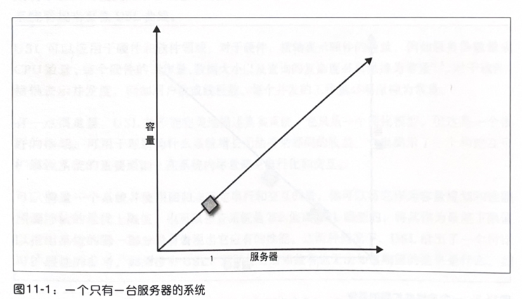
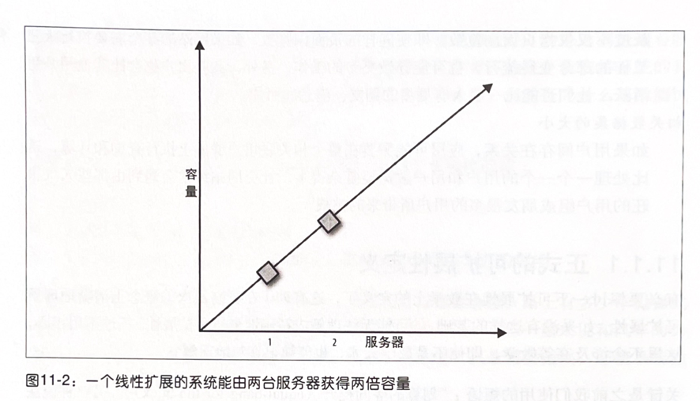
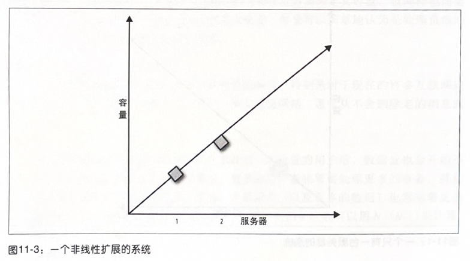
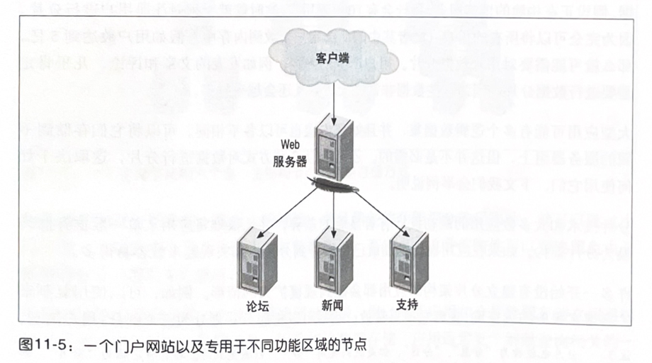
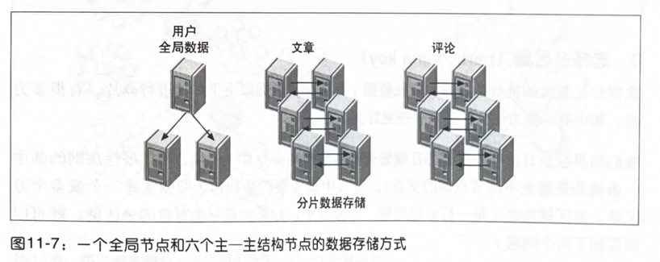
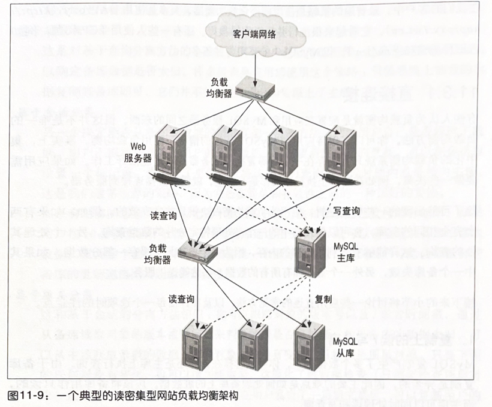

# 第11章 可扩展的MySQL

本章将展示如何构建一个基于 MySQL 的应用，并且当规模变得越来越庞大时，还能保证快速、高效并且经济。

有些应用仅仅适用于一台或少数几台服务器，那么哪些可扩展性建议是和这些应用相关的呢？大多数人从不会维护超大规模的系统，并且通常也无法效仿在主流大公司所使用的策略。本章会涵盖这一系列的策略。我们已经建立或者协助建立了许多应用，包括从单台或少量服务器的应用到使用上千台服务器的应用。选择一个合适的策略能够大大地节约时间和金钱。

MySQL经常被批评很难进行扩展，有些情况下这种看法是正确的，但如果选择正确的架构并很好地实现，就能够非常好地扩展 MySQL。但是扩展性并不是一个很好理解的主题，所以我们先来理清一些容易混淆的地方。

## 11.1 什么是可扩展性

人们常常把诸如“可扩展性”、“高可用性”以及“性能”等术语在一些非正式的场合用作同义词，但事实上它们是完全不同的。在第3章已经解释过，我们将性能定义为响应时间。我们也可以很精确地定义可扩展性，稍后将完整讨论。简要地说，可扩展性表明了当需要增加资源以执行更多工作时系统能够获得划算的等同提升（equal bang for thebuck）的能力。缺乏扩展能力的系统在达到收益递减的转折点后，将无法进一步增长。

容量是一个和可扩展性相关的概念。系统容量表示在一定时间内能够完成的工作量，但容量必须是可以有效利用的。系统的最大吞吐量并不等同于容量。大多数基准测试能从物理学来看，单位时间内做的功称为功率（power），而在计算机领域，“power”是一个被反复够衡量一个系统的最大吞吐量，但真实的系统一般不会使用到极限。如果达到最大吞吐量，则性能会下降，并且响应时间会变得不可接受地大且非常不稳定。我们将系统的真实容量定义为在保证可接受的性能的情况下能够达到的吞吐量。这就是为什么基准测试的结果通常不应该简化为一个单独的数字。

容量和可扩展性并不依赖于性能。以高速公路上的汽车来类比的话：

- 性能是汽车的时速。
- 容量是车道数乘以最大安全时速
- 可扩展性就是在不减慢交通的情况下，能增加更多车和车道的程度。

在这个类比中，可扩展性依赖于多个条件：换道设计得是否合理、路上有多少车抛锚或者发生事故，汽车行驶速度是否不同或者是否频繁变换车道——但一般来说和汽车的引擎是否强大无关。这并不是说性能不重要，性能确实重要，只是需要指出，即使系统性能不是很高也可以具备可扩展性。

从较高层次看，可扩展性就是能够通过增加资源来提升容量的能力。

即使MySQL架构是可扩展的，但应用本身也可能无法扩展，如果很难增加容量，不管原因是什么，应用都是不可扩展的。之前我们从吞吐量方面来定义容量，但同样也需要从较高的层次来看待容量问题。从有利的角度来看，容量可以简单地认为是处理负载的能力，从不同的角度来考虑负载很有帮助。

- 数据量
  应用所能累积的数据量是可扩展性最普遍的挑战，特别是对于现在的许多互联网应用而言，这些应用从不删除任何数据。例如社交网站，通常从不会删除老的消息或评论。
- 用户量
  即使每个用户只有少量的数据，但在累计到一定数量的用户后，数据量也会开始不成比例地增长且速度快过用户数增长。更多的用户意味着要处理更多的事务，并且事务数可能和用户数不成比例。最后，大量用户（以及更多的数据）也意味着更多复杂的查询，特别是查询跟用户关系相关时（用户间的关联数可以用N * （N-1）来计算，这里N表示用户数)。
- 用户活跃度
  不是所有的用户活跃度都相同，并且用户活跃度也不总是不变的。如果用户突然变得活跃，例如由于增加了一个吸引人的新特性，那么负载可能会明显提升。用户活跃度不仅仅指页面浏览数，即使同样的页面浏览数，如果网站的某个需要执行大量工作的部分变得流行，也可能导致更多的工作。另外，某些用户也会比其他用户更活跃：他们可能比一般人有更多的朋友、消息和照片。
- 相关数据集的大小
  如果用户间存在关系，应用可能需要在整个相关联用户群体上执行查询和计算，这比处理一个一个的用户和用户数据要复杂得多。社交网站经常会遇到由那些人气很旺的用户组或朋友很多的用户所带来的挑战注2。

### 11.1.1正式的可扩展性定义

有必要探讨一下可扩展性在数学上的定义了，这有助于在更高层次的概念上清晰地理解可扩展性。如果没有这样的基础，就可能无法理解或精确地表达可扩展性。不过不用担心，这里不会涉及高等数学，即使不是数学天才，也能够很直观地理解它。

关键是之前我们使用的短语：“划算的等同提升（equal bang for the buck)"。另一种说法是，可扩展性是当增加资源以处理负载和增加容量时系统能够获得的投资产出率（ROI）。假设有一个只有一台服务器的系统，并且能够测量它的最大容量，如图11-1所示。



假设现在我们增加一台服务器，系统的能力加倍，如图11-2 所示。



这就是线性扩展。我们增加了一倍的服务器，结果增加了一倍的容量。大部分系统并不是线性扩展的，而是如图11-3所示的扩展方式。



大部分系统都只能以比线性扩展略低的扩展系数进行扩展。越高的扩展系数会导致越大的线性偏差。事实上，多数系统最终会达到一个最大吞吐量临界点，超过这个点后增加投入反而会带来负回报—继续增加更多工作负较，实际上会降低系统的吞吐量。

这怎么可能呢？这些年产生了许多可扩展性模型，它们有着不同程度的良好表现和实用性。我们这里所讲的可扩展性模型是基于某些能够影响系统扩展的内在机制。这就是NeilJ.Gunther 博士提出的通用可扩展性定律（Universal Scalability Law，USL）。Gunther博士将这些详尽地写到了他的书中，包括Guerrila Capacity Planning（Springer)。这里我们不会深人到背后的数学理论中，如果你对此感兴趣，他撰写的书籍以及由他的公司Performance Dynamics 提供的训练课程可能是比较好的资源。

简而言之，USL说的是线性扩展的偏差可通过两个因素来建立模型：无法并发执行的一部分工作，以及需要交互的另外一部分工作。为第一个因素建模就有了著名的Amdahl定律，它会导致吞吐量趋于平缓。如果部分任务无法并行，那么不管你如何分而治之，该任务至少需要串行部分的时间。

增加第二个因素——内部节点间或者进程间的通信—到Amdahl定律就得出了USL。这种通信的代价取决于通信信道的数量，而信道的数量将按照系统内工作者数量的二次方增长。因此最终开销比带来的收益增长得更快，这是产生扩展性倒退的原因。图11-4闻明了目前讨论到的三个概念：线性扩展、Amdahl扩展，以及USL扩展。大多数真实系统看起来更像USL曲线。

USL可以应用于硬件和软件领域。对于硬件，横轴表示硬件的数量，例如服务器数量或CPU数量。每个硬件的工作量、数据大小以及查询的复杂度必须保持为常量。对于软件，横轴表示并发度，例如用户数或线程数。每个并发的工作量必须保持为常量。

有一点很重要，USL并不能完美地描述真实系统，它只是一个简化模型。但这是一个很好的框架，可用于理解为什么系统增长无法带来等同的收益。它也揭示了一个构建高可扩展性系统的重要原则：在系统内尽量避免串行化和交互。

可以衡量一个系统并使用回归来确定串行和交互的量。你可以将它作为容量规划和性能预测评估的最优上限值。也可以检查系统是怎么偏离USL模型的，将其作为最差下限值以指出系统的哪一部分没有表现出它应有的性能。这两种情况下，USL给出了一个讨论可扩展性的参考。如果没有USL，那即使盯着系统看也无法知道期望的结果是什么。如果想深人了解这个主题，最好去看一下对应的书籍。Gunther 博士已经写得很清楚，因此我们不会再深入讨论下去。


另外一个理解可扩展性问题的框架是约束理论，它解释了如何通过减少依赖事件和统计变化（statistical variation）来改进系统的吞吐量和性能。这在Eliyahu M.Goldratt 所撰写的TheGoal（North River）一书中有描述，其中有一个关于管理制造业设备的延伸的比喻。尽管这看起来和数据库服务器没有什么关联，但其中包含的法则和排队理论以及其他运筹学方面是一样的。

> 扩展模型不是最终定论
>
> 虽然有许多理论，但在现实中能做到何种程度呢？正如牛顿定律被证明只有远低于光速时才合理，那些“扩展性定律”也只是在某些场景下才能很好工作的简化模型。有一种说法认为所有的模型都是错误的，但有一些模型还是有用的，特别是USL能够帮助理解一些导致扩展性差的因素。
>
> 当工作负载和其所运行的系统存在微妙的关系时，USL理论可能失效。例如，一个USL无法很好建模的常见情况是：当集群的总内存由于数据集大小而发生改变时，也会导致系统的行为发生变化。USL不允许比线性史好的可扩展性，但现实中可能会发生这样的事情：增加系统的资源后，原来一部分I/O密集型的工作变成了纯内存工作，因此获得了超过线性的性能扩展。
>
> 还有一些情况，USL无法很好描述系统行为。当系统或数据集大小改变时算法的复杂度可能改变，类似这样的情况下可能就无法建立模型（USL由O(1）复杂度和O(N）复杂度两部分构成，那么对于诸如0(logN)或者0(NlogN)这样复杂度的部分呢？）。根据一些思考和实际经验，我们可以将USL扩展以覆盖这些比较普遍的场景中的一部分。但这会将一个简单并且有用的模型变得复杂并难以使用。事实上，它在很多情况下都是很好的，足以为你所能想象到的系统行为建立模型。这也是为什么我们发现它是在正确性和有效性之间的一个很好的妥协。
>
> 简单地说：有保留地使用模型，并且在使用中验证你的发现。

## 11.2扩展MySQL

如果将应用所有的数据简单地放到单个 MySQL服务器实例上，则无法很好地扩展，迟早会碰到性能瓶颈。对于许多类型的应用，传统的解决方法是购买更多强悍的机器，也就是常说的“垂直扩展”或者“向上扩展"。另外一个与之相反的方法是将任务分配到多台计算机上，这通常被称为“水平扩展”或者“向外扩展"。我们将讨论如何联合使用向上扩展和向外扩展的解决方案，以及如何使用集群方案来进行扩展。最后，大部分应用还会有一些很少或者从不需要的数据，这些数据可以被清理或归档。我们将这个方案称为“向内扩展”，这么取名是为了和其他策略相匹配。

### 11.2.1规划可扩展性

人们通常只有在无法满足增加的负载时才会考虑到可扩展性，具体表现为工作负载从CPU 密集型变成I/O密集型，并发查询的竞争，以及不断增大的延迟。主要原因是查询的复杂度增加或者内存中驻留着一部分不再使用的数据或者索引。你可能看到一部分类型的查询发生改变，例如大的查询或者复杂查询常常比那些小的查询更影响系统。如果是可扩展的应用，则可以简单地增加更多的服务器来分担负载，这样就没有性能问题了。但如果不是可扩展的，你会发现自己将遭遇到无穷无尽的问题。可以通过规划可扩展性来避免这个问题。

规划可扩展性最困难的部分是估算需要承担的负载到底有多少。这个值不一定非常精确，但必须在一定的数量级范围内。如果估计过高，会浪费开发资源。但如果低估了，则难以应付可能的负载。

另外还需要大致正确地估计日程表——也就是说，需要知道底线在哪里。对于一些应用，一个简单的原型可以很好地工作几个月，从而有时间去筹资建立一个更加可扩展的架构。对于其他的一些应用，你可能需要当前的架构能够为未来两年提供足够的容量。

以下问题可以帮助规划可扩展性：

- 应用的功能完成了多少？许多建议的可扩展性解决方案可能会导致实现某些功能变得更加困难。如果应用的某些核心功能还没有开始实现，就很难看出如何在一个可扩展的应用中实现它们。同样地，在知道这些特性如何真实地工作之前也很难决定使用哪一种可扩展性解决方案。
- 预期的最大负载是多少？应用应当在最大负载下也可以正常工作。如果你的网站和Yahoo!News或者 Slashdot的首页一样，会发生什么呢？即使不是很热门的网站，也同样有最高负载。比如，对于一个在线零售商，假日期间——尤其是在圣诞前的几个星期——通常是负载达到巅峰的时候。在美国，情人节和母亲节前的周末对于在线花店来说也是负载高峰期。
- 如果依赖系统的每个部分来分担负载，在某个部分失效时会发生什么呢？例如，如果依赖备库来分担读负载，当其中一个失效时，是否还能正常处理请求？是否需要禁用一些功能？可以预先准备一些空闲容量来防范这种问题。

### 11.2.2为扩展赢得时间

在理想情况下，应该是计划先行、拥有足够的开发者、有花不完的预算，等等。但现实中这些情况会很复杂，在扩展应用时常常需要做一些妥协，特别是需要把对系统大的改动推迟一段时间再执行。在深入MySQL扩展的细节前，以下是一些可以做的准备工作：

- 优化性能
  很多时候可以通过一个简单的改动来获得明显的性能提升，例如为表建立正确的索引或从MyISAM切换到InnoDB存储引擎。如果遇到了性能限制，可以打开查询日志进行分析，详情请参阅第3章。
  在修复了大多数主要的问题后，会到达一个收益递减点，这时候提升性能会变得越来越困难。每个新的优化都可能耗费更多的精力但只有很小的提升，并会使应用更加复杂。
- 购买性能更强的硬件
  升级或增加服务器在某些场景下行之有效，特别是对处于软件生命周期早期的应用，购买更多的服务器或者增加内存通常是个好办法。另一个选择是尽量在一台服务器上运行应用程序。比起修改应用的设计，购买更多的硬件可能是更实际的办法，特别是时间紧急并且缺乏开发者的时候。

如果应用很小或者被设计为便于利用更多的硬件，那么购买更多的硬件应该是行之有效的办法。对于新应用这是很普遍的，因为它们通常很小或者设计合理。但对于大型的旧应用，购买更多硬件可能没什么效果，或者代价太高。服务器从1台增加到3台或许算不了什么，但从100台增加到300台就是另外一回事了——代价非常昂贵。如果是这样，花一些时间和精力来尽可能地提升现有系统的性能就很划算。

### 11.2.3向上扩展

向上扩展（有时也称为垂直扩展）意味着购买更多性能强悍的硬件，对很多应用来说这是唯一需要做的事情。这种策略有很多好处。例如，单台服务器比多台服务器更加容易维护和开发，能显著节约开销。在单台服务器上备份和恢复应用同样很简单，因为无须关心一致性或者哪个数据集是权威的。当然，还有一些别的原因。从复杂性的成本来说向上扩展比向外扩展更简单。

向上扩展的空间其实也很大。拥有0.5TB内存、32核（或者更多）CPU以及更强悍I/O性能的（例如PCIe卡的flash存储）商用服务器现在很容易获得。优秀的应用和数据库设计，以及很好的性能优化技能，可以帮助你在这样的服务器上建立一个MySQL大型应用。

在现代硬件上MySQL能扩展到多大的规模呢？尽管可以在非常强大的服务器上运行，但和大多数数据库服务器一样，在增加硬件资源的情况下MySQL也无法很好地扩展（非常奇怪！）。为了更好地在大型服务器上运行 MySQL，一定要尽量选择最新的版本。由于内部可扩展性问题，MySQL 5.0和5.1在大型硬件里的表现并不理想。建议使用MySQL5.5或者更新的版本，或者Percona Server 5.1及后续版本。即便如此，当前合理的“收益递减点”的机器配置大约是256GBRAM，32核CPU以及一个PCIeflash驱动器。如果继续提升硬件的配置，MySQL的性能虽然还能有所提升，但性价比就会降低，实际上，在更强大的系统上，也可以通过运行多个小的 MySQL实例来替代单个大实例，这样可以获得更好的性能。当然，机器配置的变化速度非常快，这个建议也许很快就会过时了。

向上扩展的策略能够顶一段时间，实际很多应用是不会达到天花板的。但是如果应用变得非常庞大生，向上扩展可能就没有办法了。第一个原因是钱，无论服务器上运行什么样的软件，从某种角度来看，向上扩展都是个糟糕的财务决策，当超出硬件能够提供的最优性价比时，就会需要非同寻常的特殊配置的硬件，这样的硬件往往非常昂贵。这意味着能向上扩展到什么地步是有实际的限制的。如果使用了复制，那么当主库升级到高端硬件后，一般是不太可能配置出一台能够跟上主库的强大备库的。一个高负载的主库通常可以承担比拥有同样配置的备库更多的工作，因为备库的复制线程无法高效地利用多核CPU和磁盘资源。

最后，向上扩展不是无限制的，即使最强大的计算机也有限制。单服务器应用通常会首先达到读限制,特别是执行复杂的读查询时。类似这样的查询在MySQL内部是单线程的，因此只能使用一个CPU，这种情况下花钱也无法提升多少性能。即使购买最快的CPU也仅仅会是商用CPU的几倍速度。增加更多的CPU或CPU核数并不能使慢查询执行得更快。当数据变得庞大以至于无法有效缓存时，内存也会成为瓶颈，这通常表现为很高的磁盘使用率，而磁盘是现代计算机中最慢的部分。

无法使用向上扩展最明显的场景是云计算。在大多数公有云中都无法获得性能非常强的服务器，如果应用肯定会变得非常庞大，就不能选择向上扩展的方式。在第13章我们会深入这个话题。

因此，我们建议，如果系统确实有可能碰到可扩展性的天花板，并且会导致严重的业务问题，那就不要无限制地做向上扩展的规划。如果你知道应用会变得很庞大，在实现另外一种解决方案前，短期内购买更优的服务器是可以的。但是最终还是需要向外扩展，这也是下一节我们要讲述的主题。

### 11.2.4向外扩展

可以把向外扩展（有时也称为横向扩展或者水平扩展）策略划分为三个部分：复制、拆分，以及数据分片（sharding）。

最简单也最常见的向外扩展的方法是通过复制将数据分发到多个服务器上，然后将备库用于读查询。这种技术对于以读为主的应用很有效。它也有一些缺点，例如重复缓存，但如果数据规模有限这就不是问题。关于这些问题我们在前一章已经讨论得足够多，后面会继续提到。

另外一个比较常见的向外扩展方法是将工作负载分布到多个“节点"。具体如何分布工作负载是一个复杂的话题。许多大型的MySQL应用不能自动分布负载，就算有也没有做到完全的自动化。本节我们会讨论一些可能的分布负载的方案，并探讨它们的优点和缺点。

在MySQL架构中，一个节点（node）就是一个功能部件。如果没有规划冗余和高可用性，那么一个节点可能就是一台服务器。如果设计的是能够故障转移的冗余系统，那么一个节点通常可能是下面的某一种：

- 一个主一主复制双机结构，拥有一个主动服务器和被动服务器。
- 一个主库和多个备库。
- 一个主动服务器，并使用分布式复制块设备（DRBD）作为备用服务器。
- 一个基于存储区域网络（SAN）的“集群"。

大多数情况下，一个节点内的所有服务器应该拥有相同的数据。我们倾向于把主一主复制架构作为两台服务器的主动一被动节点。

#### 1.按功能拆分
按功能拆分，或者说按职责拆分，意味着不同的节点执行不同的任务。我们之前已经提到了一些类似的实现，在前一章我们描述了如何为OLTP和OLAP工作负载设计不同的服务器。按功能拆分采取的策略比这些更进一步，将独立的服务器或节点分配给不同的应用，这样每个节点只包含它的特定应用所需要的数据。

这里我们显式地使用了“应用”一词。所指的并不是一个单独的计算机程序，而是相关的一系列程序，这些程序可以很容易地彼此分离，没有关联。例如，如果有一个网站，各个部分无须共享数据，那么可以按照网站的功能区域进行划分。门户网站常常把不同的栏目放在一起，在门户网站，可以浏览网站新闻、论坛，寻求支持和访问知识库，等等。这些不同功能区域的数据可以放到专用的MySQL服务器中，如图11-5所示。



如果应用很庞大，每个功能区域还可以拥有其专用的 Web服务器，但没有专用的数据库服务器这么常见。

另一个可能的按功能划分方法是对单个服务器的数据进行划分，并确保划分的表集合之间不会执行关联操作。当必须执行关联操作时，如果对性能要求不高，可以在应用中做关联。虽然有一些变通的方法，但它们有一个共同点，就是每种类型的数据只能在单个节点上找到。这并不是一种通用的分布数据方法，因为很难做到高效，并且相比其他方案没有任何优势。

归根结底，还是不能通过功能划分来无限地进行扩展，因为如果一个功能区域被捆绑到单个MySQL节点，就只能进行垂直扩展。其中的一个应用或者功能区域最终增长到非常庞大时，都会迫使你去寻求一个不同的策略。如果进行了太多的功能划分，以后就很难采用更具扩展性的设计了。

#### 2.数据分片

在目前用于扩展大型MySQL应用的方案中，数据分片是最通用且最成功的方法。它把数据分割成一小片，或者说一块，然后存储到不同的节点中。

数据分片在和某些类型的按功能划分联合使用时非常有用。大多数分片系统也有一些“全局的”数据不会被分片（例如城市列表或者登录数据）。全局数据一般存储在单个节点上，并且通常保存在类似memcached这样的缓存里。

事实上，大多数应用只会对需要的数据做分片——通常是那些将会增长得非常庞大的数据。假设正在构建的博客服务，预计会有1000万用户，这时候就无须对注册用户进行分片，因为完全可以将所有的用户（或者其中的活跃用户）放到内存中。假如用户数达到5亿，那么就可能需要对用户数据分片。用户产生的内容，例如发表的文章和评论，几乎肯定需要进行数据分片，因为这些数据非常庞大，并且还会越来越多。

大型应用可能有多个逻辑数据集，并且处理方式也可以各不相同。可以将它们存储到不同的服务器组上，但这并不是必需的。还可以以多种方式对数据进行分片，这取决于如何使用它们。下文我们会举例说明。

分片技术和大多数应用的最初设计有着显著的差异，并且很难将应用从单一数据存储转换为分片架构。如果在应用设计初期就已经预计到分片，那实现起来就容易得多。许多一开始没有建立分片架构的应用都会碰到规模扩大的情形。例如，可以使用复制来扩展博客服务的读查询,直到它不再奏效。然后可以把服务器划分为三个部分：用户信息、分片也被称为“分裂"“分区”，但是我们使用“分片”以避免混淆。谷歌将它称为“分片”，如文章，以及评论。可以将这些数据放到不同的服务器上（按功能划分)，也许可以使用面向服务的架构，并在应用层执行联合查询。图11-6显示了从单台服务器到按功能划分的演变。


最后，可以通过用户ID来对文章和评论进行分片，而将用户信息保留在单个节点上。如果为全局节点配置一个主一备结构并为分片节点使用主一主结构，最终的数据存储可能如图11-7所示。



如果事先知道应用会扩大到很大的规模，并且清楚按功能划分的局限性，就可以跳过中间步骤，直接从单个节点升级为分片数据存储。事实上，这种前瞻性可以帮你避免由于粗糙的分片方案带来的挑战。

采用分片的应用常会有一个数据库访问抽象层，用以降低应用和分片数据存储之间通信的复杂度，但无法完全隐藏分片。因为相比数据存储，应用通常更了解跟查询相关的一些信息。太多的抽象会导致低效率，例如查询所有的节点，可实际上需要的数据只在单一节点上。

分片数据存储看起来像是优雅的解决方案，但很难实现。那为什么要选择这个架构呢？答案很简单：如果想扩展写容量，就必须切分数据。如果只有单台主库，那么不管有多少备库，写容量都是无法扩展的。对于上述缺点而言，数据分片是我们首选的解决方案

> 分片？还是不分片？
>
> 这是一个问题，对吧？答案很简单：如非必要，尽量不分片。首先看是否能通过性能调优或者更好的应用或数据库设计来推迟分片。如果能足够长时间地推退分片，也许可以直接购买更大的服务器，升级MySQL到性能更优的版本，然后继续使用单台服务器，也可以增加或减少复制。
>
> 简单的说，对单台服务器而言，数据大小或写负载变得太大时，分片将是不可避免的。如果不分片，而是尽可能地优化应用，系统能扩展到什么程度呢？答案可能会让你很惊讨。有些非常受欢迎的应用，你可能以为从一开始就分片了，但实际上直到已经值数十亿美元并且流量极其巨大也还没有采用分片的设计。分片不是城里唯一的游戏，在没有必要的情况下采用分片的架构来构建应用会步履维艰。

#### 3.选择分区键（partitioningkey）

数据分片最大的挑战是查找和获取数据：如何查找数据取决于如何进行分片。有很多方法，其中有一些方法会比另外一些更好。

我们的目标是对那些最重要并且频繁查询的数据减少分片（记住，可扩展性法则的其中一条就是要避免不同节点间的交互）。这其中最重要的是如何为数据选择一个或多个分区键。分区键决定了每一行分配到哪一个分片中。如果知道一个对象的分区键，就可以回答如下两个问题：

- 应该在哪里存储数据？
- 应该从哪里取到希望得到的数据？

后面将展示多个选择和使用分区键的方法。先看一个例子。假设像MySQLNDBCluster那样来操作，并对每个表的主键使用哈希来将数据分割到各个分片中。这是一种非常简单的实现，但可扩展性不好，因为可能需要频繁检查所有分片来获得需要的数据。例如，如果想查看user3 的博客文章，可以从哪里找到呢？由于使用主键值而非用户名进行分割，博客文章可能均匀分散在所有的数据分片中。使用主键值哈希简化了判断数据存储在何处的操作，但却可能增加获取数据的难度，具体取决于需要什么数据以及是否知道主键。

跨多个分片的查询比单个分片上的查询性能要差，但只要不涉及太多的分片，也不会太糟糕。最糟糕的情况是不知道需要的数据存储在哪里，这时候就需要扫描所有分片。

一个好的分区键常常是数据库中一个非常重要的实体的主键。这些键值决定了分片单元。例如，如果通过用户ID或客户端ID来分割数据，分片单元就是用户或者客户端。

确定分区键一个比较好的办法是用实体一关系图，或一个等效的能显示所有实体及其关系的工具来展示数据模型。尽量把相关联的实体靠得更近。这样可以很直观地找出候选分区键。当然不要仅仅看图，同样也要考虑应用的查询。即使两个实体在某些方面是相关联的，但如果很少或几乎不对其做关联操作，也可以打断这种联系来实现分片。

某些数据模型比其他的更容易进行分片，具体取决于实体一关系图中的关联性程度。图11-8的左边展示了一个易于分片的数据模型，右边的那个则很难分片。


左边的数据模型比较容易分片，因为与之相连的子图中大多数节点只有一个连接，很容易切断子图之间的联系。右边的数据模型则很难分片，因为它没有类似的子图。幸好大多数数据模型更像左边的图。

选择分区键的时候，尽可能选择那些能够避免跨分片查询的，但同时也要让分片足够小，以免过大的数据片导致问题。如果可能，应该期望分片尽可能同样小，这样在为不同数量的分片进行分组时能够很容易平衡。例如，如果应用只在美国使用，并且希望将数据集分割为20个分片，则可能不应该按照州来划分，因为加利福尼亚的人口非常多。但可以按照县或者电话区号来划分，因为尽管并不是均匀分布的，但足以选择20个集合以粗略地表示等同的密集程度，并且基本上避免跨分片查询。

#### 4.多个分区键

复杂的数据模型会使数据分片更加困难。许多应用拥有多个分区键，特别是存在两个或更多个“维度”的时候。换句话说，应用需要从不同的角度看到有效且连贯的数据视图。这意味着某些数据在系统内至少需要存储两份。

例如，需要将博客应用的数据按照用户ID和文章ID进行分片，因为这两者都是应用查询数据时使用比较普遍的方式。试想一下这种情形频繁地读取某个用户的所有文章，以及某个文章的所有评论。如果按用户分片就无法找到某篇文章的所有评论，而按文章分片则无法找到某个用户的所有文章。如果希望这两个查询都落到同一个分片上，就需要从两个维度进行分片。

需要多个分区键并不意味着需要去设计两个完全冗余的数据存储。我们来看看另一个例子：一个社交网站下的读书俱乐部站点，该站点的所有用户都可以对书进行评论。该网站可以显示所有书籍的所有评论，也能显示某个用户已经读过或评论过的所有书籍。

假设为用户数据和书籍数据都设计了分片数据存储。而评论同时拥有用户ID和评论ID，这样就跨越了两个分片的边界。实际上却无须冗余存储两份评论数据，替代方案是，将评论和用户数据一起存储，然后把每个评论的标题和ID与书籍数据存储在一起。这样在染大多数关于某本书的评论的视图时无须同时访问用户和书籍数据存储，如果需要显示完整的评论内容，可以从用户数据存储中获得。

#### 5.跨分片查询

大多数分片应用多少都有一些查询需要对多个分片的数据进行聚合或关联操作。例如，一个读书俱乐部网站要显示最受欢迎或最活跃的用户，就必须访问每一个分片。如何让这类查询很好地执行，是实现数据分片的架构中最困难的部分。虽然从应用的角度来看，这是一条查询，但实际上需要拆分成多条并行执行的查询，每个分片上执行一条。一个设计良好的数据库抽象层能够减轻这个问题，但类似的查询仍然会比分片内查询要慢并且更加昂贵，所以通常会更加依赖缓存。

一些语言，如PHP，对并行执行多条查询的支持不够好。普遍的做法是使用C或Java编写一个辅助应用来执行查询并聚合结果集。PHP应用只需要查询该辅助应用即可，例如Web服务或者类似Gearman的工作者服务。

跨分片查询也可以借助汇总表来执行。可以遍历所有分片来生成汇总表并将结果在每个分片上余存储。如果在每个分片上存储重复数据太过浪费，也可以把汇总表放到另外一个数据存储中，这样就只需要存储一份了。

未分片的数据通常存储在全局节点中，可以使用缓存来分担负载。

如果数据的均衡分布非常重要，或者没有很好的分区键，一些应用会采用随机分片的方式。分布式检索应用就是个很好的例子。这种场景下，跨分片查询和聚合查询非常常见。

跨分片查询并不是数据分片面临的唯一难题。维护数据一致性同样困难。外键无法在分片间工作，因此需要由应用来检查参照一致性，或者只在分片内使用外键，因为分片内的内部一致性可能是最重要的。还可以使用XA事务，但由于开销太大，现实中使用很少。

还可以设计一些定期执行的清理过程。例如，如果一个用户的读书俱乐部账号到期，并不需要立刻将其移除。可以写一个定期任务将用户评论从每个书籍分片中移除。也可以写一个检查脚本周期性运行以确保分片间的数据一致性。

#### 6.分配数据、分片和节点

分片和节点不一定是一对一的关系，应该尽可能地让分片的大小比节点容量小很多，这样就可以在单个节点上存储多个分片。

保持分片足够小更容易管理。这将使数据的备份和恢复更加容易，如果表很小，那么像更改表结构这样的操作会更加容易。例如，假设有一个100GB的表，你可以直接存储，也可以将其划分为100个1GB的分片，并存储在单个节点上。现在假如要向表上增加一个索引，在单个100GB的表上的执行时间会比100个1GB分片上执行的总时间更长，因为1GB的分片更容易全部加载到内存中。并且在执行ALTER TABLE时还会导致数据不可用，阻塞1GB的数据比阻塞100GB的数据要好得多。

小一点的分片也便于转移。这有助于重新分配容量，平衡各个节点的分片。转移分片的效率一般都不高。通常需要先将受影响的分片设置为只读模式（这也是需要在应用中构建的特性），提取数据，然后转移到另外一个节点。这包括使用mysqldump获取数据然后使用 mysql命令将其重新导入。如果使用的是 Percona Server，可以通过XtraBackup在服务器间转移文件，这比转储和重新载入要高效得多。

除了在节点间移动分片，你可能还需要考虑在分片间移动数据，并尽量不中断整个应用提供服务。如果分片太大，就很难通过移动整个分片来平衡容量，这时候可能需要将一部分数据（例如一个用户）转移到其他分片。分片间转移数据比转移分片要更复杂，应该尽量避免这么做。这也是我们建议设置分片大小尽量易于管理的原因之一。

分片的相对大小取决于应用的需求。简单的说，我们说的“易于管理的大小”是指保持表足够小，以便能在5或10分钟内提供日常的维护工作，例如ALTER TABLE、CHECKTABLE或者 OPTIMIZE TABLE。

如果将分片设置得太小，会产生太多的表，这可能引发文件系统或 MySQL内部结构的问题。另外太小的分片还会导致跨分片查询增多。

#### 7.在节点上部署分片

需要确定如何在节点上部署数据分片。以下是一些常用的办法：

- 每个分片使用单一数据库，并且数据库名要相同。典型的应用场景是需要每个分片都能镜像到原应用的结构。这在部署多个应用实例，并且每个实例对应一个分片时很有用。
- 将多个分片的表放到一个数据库中，在每个表名上包含分片号（例如bookclub.comments_23)。这种配置下，单个数据库可以支持多个数据分片。
- 为每个分片使用一个数据库，并在数据库中包含所有应用需要的表。在数据库名中包含分片号（例如表名可能是bookcLub_23.comments或者bookcLub_23.users等），但表名不包括分片号。当应用连接到单个数据库并且不在查询中指定数据库名时，这种做法很常见。其优点是无须为每个分片专门编写查询，也便于对只使用单个数据库的应用进行分片。
- 每个分片使用一个数据库，并在数据库名和表名中包含分片号（例如表名可以是bookcLub_23.comments_23)。
- 在每个节点上运行多个MySQL实例，每个实例上有一个或多个分片，可以使用上面提到的方式的任意组合来安排分片。

如果在表名中包含了分片号，就需要在查询模板里插入分片号。常用的方法是在查询中使用特殊的“神奇的”占位符，例如sprintf(）这样的格式化函数中的%S，或者使用变量做字符串插值。以下是在PHP中创建查询模板的方法：

```php 
$sql = "SELECT boid book title FROM bookclub %d.comments %d...";
$res = mysql_query(sprintf($sql, $shardno, $shardno), $conn);

```

也可以就使用字符串插值的方法：

```php
$sql = "SELECT book id, book title FROM bookclub $shardno.comments_$shardno...";
$res = mysql_query($sql, $conn);
```

这在新应用中很容易实现，但对于已有的应用则有点困难。构建新应用时，查询模板并不是问题，我们倾向于使用每个分片一个数据库的方式，并把分片号写到数据库名和表名中。这会增加例如ALTER TABLE这类操作的复杂度，但也有如下一些优点：

- 如果分片全部在一个数据库中，转移分片会比较容易。
- 因为数据库本身是文件系统中的一个目录，所以可以很方便地管理一个分片的文件。
- 如果分片互不关联，则很容易查看分片的大小。
- 全局唯一表名可避免误操作。如果表名每个地方都相同，很容易因为连接到错误的节点而查询了错误的分片，或者是将一个分片的数据误导入另外一个分片的表中。

你可能想知道应用的数据是否具有某种“分片亲和性"。也许将某些分片放在一起（在同一台服务器，同一个子网，同一个数据中心，或者同一个交换网络中）可以利用数据访问模式的相关性，能够带来些好处。例如，可以按照用户进行分片，然后将同一个国家的用户放到同一个节点的分片上。

为已有的应用增加分片支持的结果往往是一个节点对应一个分片。这种简化的设计可以减少对应用查询的修改。分片对应用而言通常是一种颠覆性的改变，所以应尽可能简化它。如果在分片后，每个节点看起来就像是整个应用数据的缩略图，就无须去改变大多数查询或担心查询是否传递到期望的节点。

#### 8.固定分配

将数据分配到分片中有两种主要的方法：固定分配和动态分配。两种方法都需要一个分区函数，使用行的分区键值作为输入，返回存储该行的分片。

固定分配使用的分区函数仅仅依赖于分区键的值。哈希函数和取模运算就是很好的例子。这些函数按照每个分区键的值将数据分散到一定数量的“桶”中。

假设有100个桶，你希望弄清楚用户111该放到哪个桶里。如果使用的是对数字求模的方式，答案很简单：111对100取模的值为11，所以应该将其放到第11个分片中。

而如果使用CRC320函数来做哈希，答案是81。

固定分配的主要优点是简单，开销低，甚至可以在应用中直接硬编码。

这里的“函数”使用了其数学涵义，表示从输入（域）到输出（区间）的映射，如你所见，可以但固定分配也有如下缺点：

- 如果分片很大并且数量不多，就很难平衡不同分片间的负载。
- 固定分片的方式无法自定义数据放到哪个分片上，这一点对于那些在分片间负载不均衡的应用来说尤其重要。一些数据可能比其他的更加活跃，如果这些热点数据都分配到同一个分片中，固定分配的方式就无法通过热点数据转移的方式来平衡负载。(如果每个分片的数据量切分得比较小，这个问题就没那么严重，根据大数定律，这样做会更容易将热点数据平均分配到不同分片。）
- 修改分片策略通常比较困难，因为需要重新分配已有的数据。例如，如果通过模10的哈希函数来进行分片，就会有10个分片。如果应用增长使得分片变大，如果要拆分成20个分片，就需要对所有数据重新哈希，这会导致更新大量数据，并在分片间转移数据。

正是由于这些限制，我们倾向于为新应用选择动态分配的方式。但如果是为已有的应用做分片，使用固定分配策略可能会更容易些，因为它更简单。也就是说，大多数使用固定分配的应用最后迟早要使用动态分配策略。

#### 9.动态分配

另外一个选择是使用动态分配，将每个数据单元映射到一个分片。假设一个有两列的表，包括用户ID和分片ID。

```sql
CREATE TABLE user_to_shard (
USER ID INT NOT NULL,
SHARD ID INT NOT NULL,
PRIMARY KEY (user_id)
);
```

这个表本身就是分区函数。给定分区键（用户ID）的值就可以获得分片号。如果该行不存在，就从目标分片中找到并将其加入到表中。也可以推迟更新——这就是动态分配的含义。

动态分配增加了分区函数的开销，因为需要额外调用一次外部资源，例如目录服务器（存储映射关系的数据存储节点)。出于效率方面的考虑，这种架构常常需要更多的分层。例如，可以使用一个分布式缓存系统将目录服务器的数据加载到内存中，因为这些数据平时改动很小。或者更普遍地，你可以直接向USERS表中增加一个shard_id列用于存储分片号。

动态分配的最大好处是可以对数据存储位置做细粒度的控制。这使得均衡分配数据到分片更加容易，并可提供适应未知改变的灵活性。

动态映射可以在简单的键——分片（key-to-shard）映射的基础上建立多层次的分片策略。例如，可以建立一个双重映射，将每个分片单元指定到一个分组中（例如，读书俱乐部的用户组），然后尽可能将这些组保持在同一个分片中。这样可以利用分片亲和性，避免跨分片查询。

如果使用动态分配策略，可以生成不均衡的分片。如果服务器能力不相同，或者希望将其中一些分片用于特定目的（例如归档数据)，这可能会有用。如果能够做到随时重新平衡分片，也可以为分片和节点间维持一一对应的映射关系，这不会浪费容量。也有些人喜欢简单的每个节点一个分片的方式。（但是请记住，保持分片尽可能小是有好处的。）

动态分配以及灵活地利用分片亲和性有助于减轻规模扩大而带来的跨分片查询问题。假设一个跨分片查询涉及四个节点，当使用固定分配时，任何给定的查询可能需要访问所有分片，但动态分配策略则可能只需要在其中的三个节点上运行同样的查询。这看起来没什么大区别，但考虑一下当数据存储增加到400个分片时会发生什么？固定分配策略需要访问400个分片，而动态分配方式依然只需要访问3个。

动态分配可以让分片策略根据需要变得很复杂。固定分配则没有这么多选择。

#### 10.混合动态分配和固定分配

可以混合使用固定分配和动态分配。这种方法通常很有用，有时候甚至必须要混合使用。目录映射不太大时，动态分配可以很好胜任。但如果分片单元太多，效果就会变差。

以一个存储网站链接的系统为例。这样一个站点需要存储数百亿的行，所使用的分区键是源地址和目的地址URL的组合。（这两个URL的任意一个都可能有好几亿的链接，因此，单独一个URL并不适合做分区键)。但是在映射表中存储所有的源地址和目的地址 URL 组合并不合理，因为数据量太大了，每个 URL都需要很多存储空间。

一个解决方案是将URL相连并将其哈希到固定数目的桶中，然后把桶动态地映射到分片上。如果桶的数目足够大—例如100万个——你就能把大多数数据分配到每个分片上，获得动态分配的大部分好处，而无须使用庞大的映射表。

#### 11.显式分配

第三种分配策略是在应用插入新的数据行时，显式地选择目标分片。这种策略在已有的数据上很难做到。所以在为应用增加分片时很少使用。但在某些情况下还是有用的。

这个方法是把数据分片号编码到ID中，这和之前提到的避免主一主复制主键冲突策略比较相似。（详情请参阅“在主一主复制结构中写入两台主库"。)

例如，假设应用要创建一个用户3，将其分配到第11个分片中，并使用BIGINT列的高八位来保存分片号。这样最终的ID就是<)+3，即792633534417207299。应用可以很方便地从中抽取出用户ID和分片号，如下例所示。


现在假设要为该用户创建一条评论，并存储在同一个分片中。应用可以为该用户分配一个评论ID5，然后以同样的方式组合5和分片号11。

这种方法的好处是每个对象的ID同时包含了分区键，而其他方法通常需要一次关联或查找来确定分区键。如果要从数据库中检索某个特定的评论，无须知道哪个用户拥有它；对象ID会告诉你到哪里去找。如果对象是通过用户ID动态分片的，就得先找到该评论的用户，然后通过目录服务器找到对应的数据分片。

另一个解决方案是将分区键存储在一个单独的列里。例如，你可能从不会单独引用评论5，但是评论5属于用户3。这种方法可能会让一些人高兴，因为这不违背第一范式；然而额外的列会增加开销、编码，以及其他不便之处。（这也是我们将两值存在单独一列的优点之一。）

显式分配的缺点是分片方式是固定的，很难做到分片间的负载均衡。但结合固定分配和动态分配，该方法就能够很好地工作。不再像之前那样哈希到固定数目的桶里并将其映射到节点，而是将桶作为对象的一部分进行编码。这样应用就能够控制数据的存储位置，因此可以将相关联的数据一起放到同样的分片中。

BoardReader（http://boardreader.com）使用了该技术的一个变种：它把分区键编码到Sphinx的文档ID内。这使得在分片数据存储中查找每个查询结果的关联数据变得容易，更多关于Sphinx的内容可以查阅附录F。

我们讨论了混合分配方式，因为在某些场景下它是有用的。但正常情况下我们并不推荐这样用。我们倾向于尽可能使用动态分配，避免显式分配。

#### 12.重新均衡分片数据

如有必要，可以通过在分片间移动数据来达到负载均衡。举个例子，许多读者可能听一些大型图片分享网站或流行社区网站的开发者提到过用于分片间移动用户数据的工具。

在分片间移动数据的好处很明显。例如，当需要升级硬件时，可以将用户数据从旧分片转移到新分片上，而无须暂停整个分片的服务或将其设置为只读。

然而，我们也应该尽量避免重新均衡分片数据，因为这可能会影响用户使用。在分片间转移数据也使得为应用增加新特性更加困难，因为新特性可能还需要包含针对重新均衡脚本的升级。如果分片足够小,就无须这么做;也可以经常移动整个分片来重新均衡负载，这比移动分片中的部分数据要容易得多（并且以每行数据开销来衡量的话，更有效率）。一个较好的策略是使用动态分片策略，并将新数据随机分配到分片中。当一个分片快满时，可以设置一个标志位，告诉应用不要再往这里放数据了。如果未来需要向分片中放入更多数据，可以直接把标记位清除。

假设安装了一个新的MySQL节点，上面有100个分片。先将它们的标记设置为1，这样应用就知道它们正准备接受新数据。一旦它们的数据足够多时（例如，每个分片10000个用户），就把标记位设置为0。之后，如果节点因为大量废弃账号导致负载不足，可以重新打开一些分片向其中增加新用户。

如果升级应用并且增加的新特性会导致每个分片的查询负载升高，或者只是算错了负载，可以把一些分片移到新节点来减轻负载。缺点是操作期间整个分片会变成只读或者处于离线状态。这需要根据实际情况来看是否能接受。

另外一种使用得较多的策略是为每个分片设置两台备库，每个备库都有该分片的完整数据。然后每个备库负责其中一半的数据，并完全停止在主库上查询。这样每个备库都会有一半它不会用到的数据；我们可以使用一些工具，例如Percona Toolkit的pt-archiver，在后台运行，移除那些不再需要的数据。这种办法很简单并且几乎不需要停机。

#### 13.生成全局唯一ID

当希望把一个现有系统转换为分片数据存储时，经常会需要在多台机器上生成全局唯一ID。单一数据存储时通常可以使用AUTO_INCREMENT 列来获取唯一ID。但涉及多台服务器时就不凑效了。以下几种方法可以解决这个问题：

- 使用 auto_increment increment fo auto_increment_offset

  这两个服务器变量可以让MySQL以期望的值和偏移量来增加 AUTO_INCREMENT 列的值。举一个最简单的场景，只有两台服务器，可以配置这两台服务器自增幅度为2，其中一台的偏移量设置为1，另外一台为2（两个都不可以设置为0)。这样一台服务器总是包含偶数，另外一台则总是包含奇数。这种设置可以配置到服务器的每一个表里。

  这种方法简单，并且不依赖于某个节点，因此是生成唯-ID的比较普遍的方法。但这需要非常仔细地配置服务器。很容易因为配置错误生成重复数字，特别是当增加服务器需要改变其角色，或进行灾难恢复时。

- 全局节点中创建表
  在一个全局数据库节点中创建一个包含AUTO_INCREMENT列的表，应用可以通过这个表来生成唯一数字。

- 使用memcached
  在memcached的API中有一个incr（）函数，可以自动增长一个数字并返回结果。另外也可以使用Redis。

- 批量分配数字
  应用可以从一个全局节点中请求一批数字，用完后再申请。

- 使用复合值
  可以使用一个复合值来做唯一ID，例如分片号和自增数的组合。具体参阅之前的章节。

- 使用UUID值
  可以使用 UUID(）函数来生成全局唯一值。注意，尽管这个函数在基于语句的复制时不能正确复制，但可以先获得这个值，再存放到应用的内存中，然后作为数字在查询中使用。GUID的值很大并且不连续，因此不适合做InnoDB表的主键。具体参考“和InnoDB主键一致地插入行”。在5.1及更新的版本中还有一个函数UUID SHORT()，能够生成连续的值，并使用64位代替了之前的128位。

如果使用全局分配器来产生唯一ID，要注意避免单点争用成为应用的性能瓶颈。

虽然memcached方法执行速度快（每秒数万个值），但不具备持久性。每次重启memcached服务都需要重新初始化缓存里的值。由于需要首先找到所有分片中的最大值，因此这一过程非常缓慢并且难以实现原子性。

#### 14.分片工具

在设计数据分片应用时，首先要做的事情是编写能够查询多个数据源的代码。

如果没有任何抽象层，直接让应用访问多个数据源，那绝对是一个很差的设计，因为这会增加大量的编码复杂性。最好的办法是将数据源隐藏在抽象层中。这个抽象层主要完成以下任务：

- 连接到正确的分片并执行查询
- 分布式一致性校验。
- 跨分片结果集聚合。
- 跨分片关联操作。
- 锁和事务管理。
- 创建新的数据分片（或者至少在运行时找到新分片）并重新平衡分片（如果有时间实现)。

你可能不需要从头开始构建分片结构。有一些工具和系统可以提供一些必要的功能或专门设计用来实现分片架构。

Hibernate Shards（htp://shards.hibernate.org）是一个支持分片的数据库抽象层，基于Java语言的开源的 Hibernate ORM库扩展，由谷歌提供。它在 Hibernate Core 接口上提供了分片感知功能，所以应用无须专门为分片设计，事实上，应用甚至无须知道它正在使用分片。Hibernate Shards 通过固定分配策略向分片分配数据。另外一个基于Java的分片系统是HiveDB（http://www.hivedb.org）。

如果使用的是PHP语言，可以使用Justin Swanhart提供的Shard-Query 系统（http://code.google.com/p/shard-query/)，它可以自动分解查询，并发执行，并合并结果集。另外一些有同样用途的商用系统有ScaleBase（htp://www.scalebase.com）、ScalArc（http://www.scalarc.com)以及dbShards(http://wwwdbshards.com).

Sphinx是一个全文检索引擎，虽然不是分片数据存储和检索系统，但对于一些跨分片数据存储的查询依然有用。Sphinx 可以并行查询远程系统并聚合结果集。在附录F中会详细讨论Sphinx。

### 11.2.5通过多实例扩展

一个分片较多的架构可能会更有效地利用硬件。我们的研究和经验表明MySQL并不能完全发挥现代硬件的性能。当扩展到超过24个CPU核心时，MySQL的性能开始趋于平缓，不再上升。当内存超过128GB时也同样如此，MySQL甚至不能完全发挥诸如Virident或Fusion-io卡这样的高端PCIe flash设备的IO性能。不要在一台性能强悍的服务器上只运行一个服务器实例，我们还有别的选择。你可以让数据分片足够小，以使每台机器上都能放置多个分片（这也是我们一直提倡的），每台服务器上运行多个实例，然后划分服务器的硬件资源，将其分配给每个实例。

这样做尽管比较烦琐，但确实有效。这是一种向上扩展和向外扩展的组合方案。也可以用其他方法来实现——不一定需要分片——但分片对于在大型服务器上的联合扩展具有天然的适应性。

一些人倾向于通过虚拟化技术来实现合并扩展，这有它的好处。但虚拟化技术本身有很大的性能损耗。具体损耗多少取决于具体的技术，但通常都比较明显，尤其是1/O非常快的时候损耗会非常惊人。另一种选择是运行多个MySQL实例，每个实例监听不同的网络端口，或绑定到不同的 IP地址。

我们已经在一台性能强悍的硬件上获得了10倍或15倍的合并系数。你需要平衡管理复杂度代价和更优性能的收益，以决定哪种方法是最优的。

这时候网络可能会成为瓶颈——这个问题大多数MySQL用户都不会遇到。可以通过使用多块网卡并进行绑定来解决这个问题。但Linux内核可能会不理想，这取决于内核版本，因为老的内核对每个绑定设备的网络中断只能使用一个CPU。因此不要把太多的连线绑定到很少的虚拟设备上，否则会遇到内核层的网络瓶颈。新的内核在这一方面会有所改善，所以需要检查你的系统版本，以确定该怎么做。

另一个方法是将每个MySQL实例绑定到特定的 CPU核心上。这有两点好处：第一，由于MySQL内部的可扩展性限制，当核心数较少时，能够在每个核心上获得更好的性能，第二，当实例在多个核心上运行线程时，由于需要在多核心上同步共享数据，因而会有一些额外的开销。这可以避免硬件本身的可扩展性限制。限制MySQL到少数几个核心能够帮助减少CPU核心之间的交互。注意到反复出现的问题了没？将进程绑定到具有相同物理套接字的核心上可以获得最优的效果。

### 11.2.6通过集群扩展

理想的扩展方案是单一逻辑数据库能够存储尽可能多的数据，处理尽可能多的查询，并如期望的那样增长。许多人的第一想法就是建立一个“集群”或者“网格”来无缝处理这些事情，这样应用就无须去做太多工作，也不需要知道数据到底存在哪台服务器上。随着云计算的流行，自动扩展—根据负载或数据大小变化动态地在集群中增加/移除服务器——变得越来越有趣。

在本书第二版时，我们遗地看到已有的技术无法完成这一任务。从那时开始，出现了许多被称为 NoSQL的技术。许多NoSQL的支持者发表了一些奇怪且未经证实的观点，例如“关系模型无法进行扩展"，或者“SQL无法扩展"。随着新概念的出现，也出现了一些新的术语。最近谁没有听说过最终一致性、BASE、矢量时钟，或者 CAP 理论呢？

但随着时间推移，理性开始逐渐回归。经验表明许多NoSQL数据库太过于简单，并且无法完成很多工作。同时一些基于SQL的技术开始出现——例如451集团(451 Group）的MattAslett 所提到的NewSQL数据库。SQL和NewSQL到底有什么区别呢？NewSQL数据库中SQL及相关技术都不应该成为问题。而可扩展性问题在关系型数据库中是一个实现上的难题，但新的实现正表现出越来越好的结果。

所有的旧事物都变成新的了吗？是，但也不是。许多关系型数据库集群的高性能设计正在被构建到系统的更低层，在NoSQL数据库中，特别是使用健一值存储时，这一点很明显。例如NDB Cluster 并不是一个SQL数据库；它是一个可扩展的数据库，使用其原生API来控制，通常是使用NoSQL，但也可以通过在前端使用MySQL存储引擎来支持 SQL。它是一个完全分布式、非共享高性能、自动分片并且不存在单点故障的事务型数据库服务器。最近几年正变得更强大、更复杂，用途也更广泛。同时，NoSQL数据库也逐渐看起来越来越像关系型数据库。有些甚至还开发了类SQL查询语言。未来典型的集群数据库可能更像是SQL和NoSQL 的混合体，有多种存取机制来满足不同的使用需求。所以，我们在从NoSQL中汲取优点，但SQL仍然会保留在集群数据库中。

在写作本书时，和MySQL结合在一起的集群或分布式数据库技术大致包括：NDBCluster. Clustrix, Percona XtraDB Cluster, Galera. Schooner Active ClusterContinuent Tungsten ScaleBase、 ScaleArc. dbShards. Xeround. Akiban. VoltDB,以及GenieDB。这些或多或少以MySQL为基础，或通过MySQL进行控制，或是和MySQL相关。本书会讲到这其中的一部分一例如，在第13章我们会讲到xeround，在第10章我们讲到了Continuent Tungsten和其他几种技术——这里我们同样会对其中的几个进行描述。

在开始前，需要指出，可扩展性、高可用性、事务性等是数据库系统的不同特性。许多人会感到困惑并将这些当作是相同的东西，但事实上不是。本章我们主要集中讨论可扩展性。但事实上，可扩展的数据库并不一定非常优秀，除非它能保证高性能，谁愿意栖性高可用性来进行扩展呢？这些特性的组合堪称数据库的必杀技，但这很难实现。当然这不是本章要讨论的内容。

最后，除NDB Cluster外，大多数 NewSQL集群产品都是比较新的事物。我们还没有看到足够多的生产环境部署以完全获知其优点和限制。尽管它们提到了MySQL协议或其他与MySQL相关的地方，但它们毕竟不是MySQL，因此不在本书讨论的范围内。我们仅仅稍微提一下，由你自己来判断它们是否适用。

#### 1.MySQL Cluster (NDB Cluster)

MySQLCluster是两项技术的结合：NDB数据库，以及作为SQL前端的MySQL存储引擎。NDB 是一个分布式、具备容错性、非共享的数据库，提供同步复制以及节点间的数据自动分片.NDBCluset存储引擎将SQL转换为NDBAPI调用，但遇到NDB不支持的操作时，就会在MySQL服务器上执行（NDB是一个键一值数据存储，无法执行类似联接或聚合的复杂操作)。

NDB是一个非常复杂的数据库，和MySQL几乎完全不同。在使用NDB时甚至可以不需要MySQL：你可以把它作为一个独立的键一值数据库服务器。它的亮点包括非常高的写人和按键查询吞吐量。NDB 可以基于键的哈希自动决定哪个节点应该存储给定的数据。当通过MySQL来控制NDB时，行的主键就是键，其他的列是值。

因为它基于一些新的技术，并且集群具有容错性和分布式特性，所以管理 NDB需要非常专业和特殊的技能。有许多动态变化的部分，还有类似升级集群或增加节点的操作必须正确执行以防止意外的问题。NDB是一项开源技术，但也可以从Oracle 购买商业支持。商业支持中包括能够获得专门的集群管理产品 Cluster Manager，可以自动执行一些枯燥且棘手的任务。（Severalnines 同样提供了一个集群管理产品，参见http://wwwSeveralnines.com）。

MySQL Cluster 正在迅速地增加越来越多的特性和功能。例如在最近的版本中，它开始支持更多类型的集群变更而无须停机操作，并且能够在数据存储的节点上执行一些特定类型的查询，以减少数据传递给MySQL层并在其中执行查询的必要性。（这个特性已由关联下推（push-downjoin）更名为自适应查询本地化（adaptive query localization)。）

NDB曾经相对其他MySQL存储引擎具有完全不同的性能特性，但最近的版本更加通用化了。它正在成为越来越多应用的更好的解决方案，包括游戏和移动应用。我们必须强调，NDB是一项重要的技术，能够支持全球最大的关键应用，这些应用处于极高的负载下，具有非常严苛的延迟要求以及不间断要求。举个例子，世界上任何一个通过移动电话网络呼叫的电话使用的就是NDB，并且不是临时方案——对于许多移动电话提供商而言，它是一个主要的并且非常重要的数据库。

NDB需要一个快速且可靠的网络来连接节点。为了获得最好的性能，最好使用特定的高速连接设备。由于大多数情况下需要内存操作，因此服务器间需要大量的内存。

那么它有什么缺点呢？复杂查询现在支持得还不是很好，例如那些有很多关联和聚合的查询。所以不要指望用它来做数据仓库。NDB是一个事务型系统，但不支持 MVCC，所以读操作也需要加锁，也不做任何的死锁检测。如果发生死锁，NDB就以超时返回的方式来解决。还有很多你应该知道的要点和警告，可以专门写一本书了。（有一些关于MySQL Cluster的书，但大多数都过时了，最好的办法是阅读手册。）

#### 2.Clustrix

Clustrix（htp://www.clustrix.com）是一个分布式数据库，支持MySQL协议，所以它可以直接替代MySQL。除了协议外，它是一个全新的技术，并非建立在MySQL的基础之上。它是一个完全支持ACID，支持 MVCC的事务型SQL数据库，主要用于OLTP负载场景。Clustrix 在节点间进行数据分片以满足容错性，并对查询进行分发，在节点上并发执行，而不是将所有节点上取得的数据集中起来执行。集群可以在线扩展节点来处理更多的数据或负载。在某些方面Clustrix和MySQL Cluster 很像，关键的不同点是，Clustrix是完全分布式执行并且缺少顶层的“代理”或者集群前端的查询协调器（query coordinator)。Clustrix 本身能够理解MySQL协议，所以无须MySQL来进行协议转换。相比较而言，MySQLcluster 是由三个部分组成的：MySQL，NDB集群存储引擎，以及 NDB。

我们的实验评估和性能测试表明，Clustrix 能够提供高性能和可扩展性。Clustrix 看起来是一项比较有前景的技术，我们将继续观察和评估。

#### 3.ScaleBase

ScaleBase（http://www.scalebase.com）是一个软件代理，处于应用和多个后端MySQL服务器之间。它会把发起的查询进行分裂，并将其分发到后端服务器并发执行，然后汇集结果返回给应用。不过在写作本书时，我们还没有使用该产品的经验。另外的竞争产品有ScaleArc(http://www.calearc.com）和dbShards(http://www.dbshards.com）。

#### 4.GenieDB

GenieDB（http://www.geniedb.com）最开始用于地理上分布部署的NoSQL文档存储。现在它也有一个SQL层，可以通过MySQL存储引擎进行控制。它包含了很多技术，包括本地内存缓存、消息层，以及持久化磁盘数据存储。将这些技术汇集在一起，就可以使用松散的最终一致性，让应用在本地快速执行查询，或是通过分布式集群（会增加网络延迟）来保证最新的数据视图。

通过存储引擎实现的MySQL兼容层不能提供100%的MySQL特性，但对于支持类似]Joomla!、WordPress，以及Drupal这样的应用已经够用了。MySQL存储引擎的用处主要是使GenieDB能够结合存储引擎获得对ACID的支持，例如InnoDB。GenieDB本身并不是ACID数据库。

我们还没用应用过GenieDB，也没有看到任何生产环境部署。

#### 5.Akiban

对Akiban（htp://www.akiban.com）最好的描述应该是查询加速器。它通过存储物理数据来匹配查询模式，使得低开销的跨表关联操作成为可能。尽管类似反范式化（denormalization)，但数据层并不是余的，所以这和预先计算关联并存储结果的方式是不同的。关联表中元组是互相交错的，所以能够按照关联顺序进行顺序扫描。这就要求管理员确定查询模式能够从所谓的“表组”（table grouping）技术中受益，并需要为查询优化设计表组。目前建议的系统架构是将Akiban 配置为MySQL主库的备库，并用它来为可能较慢的查询提供服务。加速系数是一到两个数量级。但是我们还没有看到生产环境部署或者相关的实验评估。

### 11.2.7向内扩展

处理不断增长的数据和负载最简单的办法是对不再需要的数据进行归档和清理。这种操作可能会带来显著的成效，具体取决于工作负载和数据特性。这种做法并不用来代替其他策略，但可以作为争取时间的短期策略，也可以作为处理大数据量的长期计划之一。

在设计归档和清理策略时需要考虑到如下几点。

- 对应用的影响
  一个设计良好的归档系统能够在不影响事务处理的情况下，从一个高负载的OLTP服务器上移除数据。这里的关键是能高效地找到要删除的行，然后一小块一小块地移除。通常需要平衡一次归档的行数和事务的大小，以找到一个锁竞争和事务负载量的平衡。还需要设计归档任务在必要的时候让步于事务处理。
- 要归档的行
  当知道某些数据不再使用后，就可以立刻清理或归档它们。也可以设计应用去归档那些几乎不怎么使用的数据。可以把归档的数据置于核心表附近，通过视图来访问，或完全转移到别的服务器上。
- 维护数据一致性
  当数据间存在联系时，会导致归档和清理工作更加复杂。一个设计良好的归档任务能够保证数据的逻辑一致性，或至少在应用需要时能够保证一致，而无须在大量事务中包含多个表。
  当表之间存在关系时，哪个表首先归档是个问题。在归档时需要考虑孤立行的影响。可以选择违背外键约束（可以通过执行 SET FOREIGN KEY_CHECKS=0禁止 InnoDB的外键约束）或暂时把“悬空指针”（dangling pointer）记录放到一边。如果应用层认为这些相关联的表具有层次关系，那么归档的顺序也应该和它一样。例如，如果应用总是先检查订单再检查发货单，就先归档订单。应用应该看不到孤立的发货单，因此接下来就可以将发货单归档。
- 避免数据丢失
  如果是在服务器间归档，归档期间可能就无法做分布式事务处理，也有可能将数据归档到 MyISAM或其他非事务型的存储引擎中。因此，为了避免数据丢失，在从源表中删除时，要保证已经在目标机器上保存。将归档数据单独写到一个文件里也是个好主意。可以将归档任务设计为能够随时关闭或重启，并且不会引起不一致或索引冲突之类的错误。
- 解除归档（unarchiving）
  可以通过一些解除归档策略来减少归档的数据量。它可以帮助你归档那些不确定是否需要的数据，并在以后可以通过选项进行回退。如果可以设置一些检查点让系统来检查是否有需要归档的数据，那么这应该是一个很容易实现的策略。例如，要对不活跃的用户进行归档，检查点就可以设置在登录验证时。如果因为用户不存在导致登录失败，可以去检查归档数据中是否存在该用户，如果有，则从中取出来并完成登录。

> Percona Toolkit包含的工具pt-archiver能够帮助你有效地归档和清理MySQL表，但不提供解除归档功能。

#### 保持活跃数据独立

即使并不真的把老数据转移到别的服务器，许多应用也能受益于活跃数据和非活跃数据的隔离。这有助于高效利用缓存，并为活跃和不活跃的数据使用不同的硬件或应用架构。下面列举了几种做法：

- 将表划分为几个部分
  分表是一种比较明智的办法，特别是整张表无法完全加载到内存时。例如，可以把users表划分为active_users和inactive_users表。你可能认为这并不需要，因为数据库本身只缓存“热”数据，但事实上这取决于存储引擎。如果用的是InnoDB，每次缓存一页，而一页能存储100个用户，但只有10%是活跃的，那么这时候InnoDB可能认为所有的页都是“热”的——因此每个“热”页的90%将被浪费掉。将其拆成两个表可以明显改善内存利用率。

- MySQL分区
  MySQL5.1本身提供了对表进行分区的功能，能够帮助把最近的数据留在内存中。第7章详细介绍了分区表。

- 基于时间的数据分区
  如果应用不断有新数据进来，一般新数据总是比旧数据更加活跃。例如，我们知道博客服务的流量大多是最近七天发表的文章和评论。更新的大部分是相同的数据集。因此这些数据被完整地保留在内存中，使用复制来保证在主库失效时有一份可用的备份。其他数据则完全可以放到别的地方去。
  我们也看到过这样一种设计，在两个节点的分片上存储用户数据。新数据总是进入人“活跃”节点，该节点使用更大的内存和快速硬盘，另外一个节点存储旧数据，使用非常大（但比较慢）的硬盘。应用假设不太会需要旧数据。对于很多应用而言这是合理的假设，依靠10%的最新数据能够满足90%或更多的请求。
  可以通过动态分片来轻松实现这种策略。例如，分片目录表可能定义如下：

  ```sql
  CREATE TABLE users (
  user_id int unsiged ot ull,
  shard_new int unsigned not null,
  shard_archive int unsigned not null,
  archive_timestamp timestamp,
  PRIMARY KEY (user_id)
  );
  ```

  通过一个归档脚本将旧数据从活跃节点转移到归档节点，当移动用户数据到归档节点时，更新 archive_timestamp 列的值。shard_new和 shard_archive 列记录存储数据的分片号。

## 11.3负载均衡

负载均衡的基本思路很简单：在一个服务器集群中尽可能地平均负载量。通常的做法是在服务器前端设置一个负载均衡器（一般是专门的硬件设备)。然后负载均衡器将请求的连接路由到最空闲的可用服务器。图11-9显示了一个典型的大型网站负载均衡设置，其中一个负载均衡器用于HTTP流量，另一个用于MySQL访问。

负载均衡有五个常见目的。

- 可扩展性
  负载均衡对某些扩展策略有所帮助，例如读写分离时从备库读数据。
- 高效性
  负载均衡有助于更有效地使用资源，因为它能够控制请求被路由到何处。如果服务器处理能力各不相同，这就尤为重要：你可以把更多的工作分配给性能更好的机器。
- 可用性
  一个灵活的负载均衡解决方案能够使用时刻保持可用的服务器。
- 透明性
  客户端无须知道是否存在负载均衡设置，也不需要关心在负载均衡器的背后有多少机器，它们的名字是什么。负载均衡器给客户端看到的只是一个虚拟的服务器。
- 一致性
  如果应用是有状态的（数据库事务，网站会话等)，那么负载均衡器就应将相关的查询指向同一个服务器，以防止状态丢失。应用无须去跟踪到底连接的是哪个服务器。



在与MySQL相关的领域里，负载均衡架构通常和数据分片及复制紧密相关。你可以把负载均衡和高可用性结合在一起，部署到应用的任一层次上。例如，可以在MySQLCluster 集群的多个SQL节点上做负载均衡，也可以在多个数据中心间做负载均衡，其中每个数据中心又可以使用数据分片架构，每个节点实际上是拥有多个备库的主一主复制对结构，这里又可以做负载均衡。对于高可用性策略也同样如此：在一个架构里可以配置多层的故障转移机制。

负载均衡有许多微妙之处，举个例子，其中一个挑战就是管理读/写策略。有些负载均衡技术本身能够实现这一点，但其他的则需要应用自己知道哪些节点是可读的或可写的。

在决定如何实现负载均衡时，应该考虑到这些因素。有许多负载均衡解决方案可以使用，从诸如Wackamole(http:/www.backhandorg/wackamole/）这样基干端点的（peer-based）实现，到DNS.LVS(LinuxVitualServerp:/wwwinirtualserverorg)硬件负载均衡器、TCP代理、MySQLProxy，以及在应用中管理负载均衡。

在我们的客户中，最普遍的策略是使用硬件负载均衡器，大多是使用HAProxy（http:/haproxy.lwt.eu)，它看起来很流行并且工作得很好。还有一些人使用TCP代理，例如Pen（http://siag.nu/pen/)。但MySQL Proxy 用得并不多。

### 11.3.1直接连接

有些人认为负载均衡就是配置在应用和MySQL服务器之间的东西。但这并不是唯一的负载均衡方法。你可以在保持应用和MySQL连接的情况下使用负载均衡。事实上，集中化的负载均衡系统只有在存在一个对等置换的服务器池时才能很好工作。如果应用需要做一些决策，例如在备库上执行读操作是否安全，就需要直接连接到服务器。

除了可能出现的一些特定逻辑，应用为负载均衡做决策是非常高效的。例如，如果有两个完全相同的备库，你可以使用其中的一个来处理特定分片的数据查询，另一个处理其他的查询。这样能够有效利用备库的内存，因为每个备库只会缓存一部分数据。如果其中一个备库失效，另外一个备库拥有所有的数据，仍然能提供服务。

接下来的小节将讨论一些应用直连的常见方法，以及在评估每一个选项时的注意点。

#### 1.复制上的读/写分离

MySQL 复制产生了多个数据副本，你可以选择在备库还是主库上执行查询。由于备库复制是异步的，因此主要的难点是如何处理备库上的脏数据。应该将备库用作只读的，而主库可以同时处理读和写查询。

通常需要修改应用以适应这种分离需求。然后应用就可以使用主库来进行写操作，并将读操作分配到主库和备库上；如果不太关心数据是否是脏的，可以使用备库，而对需要即时数据的请求使用主库。我们将这称为读/写分离。

如果使用的是主动一被动模式的主一主复制对，同样也要考虑这个问题。使用这种配置时，只有主动服务器接受写操作。如果能够接受读到脏数据，可以将读分配给被动服务器。最大的问题是如何避免由于读了脏数据引起的奇怪问题。一个典型的例子是当一个用户做了某些修改，例如增加了一条博客文章的评论，然后重新加载页面，但并没有看到更新，因为应用从备库读取到了脏的数据。

比较常见的读/写分离方法如下：

- 基于查询分离
  最简单的分离方法是将所有不能容忍脏数据的读和写查询分配到主动或主库服务器上。其他的读查询分配到备库或被动服务器上。该策略很容易实现，但事实上无法有效地使用备库，因为只有很少的查询能容忍脏数据。
- 基于脏数据分离
  这是对基于查询分离方法的小改进。需要做一些额外的工作，让应用检查复制延迟，以确定备库数据是否太旧。许多报表类应用都使用这个策略：只需要晚上加载的数据复制到备库即可，它们并不关心是不是100%跟上了主库
- 基于会话分离
  另一个决定能否从备库读数据的稍微复杂一点的方法是判读用户自己是否修改了数据。用户不需要看到其他用户的最新数据，但需要看到自己的更新。可以在会话层设置一个标记位，表明做了更新，就将该用户的查询在一段时间内总是指向主库。这是我们通常推荐的策略，因为它是在简单和有效性之间的一种很好的妥协。
  如果有足够的想象力，可以把基于会话的分离方法和复制延迟监控结合起来。如果用户在10秒前更新了数据，而所有备库延迟在5秒内，就可以安全地从备库中读取数据。但为整个会话选择同一个备库是一个很好的主意，否则用户可能会奇怪有些备库的更新速度比其他服务器要慢。
- 基于版本分离
  这和基于会话的分离方法相似：你可以跟踪对象的版本号以及/或者时间戳，通过从备库读取对象的版本或时间戳来判断数据是否足够新。如果备库的数据太旧，可以从主库获取最新的数据。即使对象本身没有变化，但如果是顶层对象，只要下面的任何对象有变化，也可以增加版本号，这简化了脏数据检查（只需要检查顶层对象一处就能判断是否有更新）。例如，在用户发表了一篇新文章后，可以更新用户的版本。这样就会从主库去读取数据了。
- 基于全局版本/会话分离
  这个办法是基于版本分离和基于会话分离的变种。当应用执行写操作时，在提交事务后，执行一次 SHOW MASTER STATUS操作。然后在缓存中存储主库日志坐标，作为被修改对象以及/或者会话的版本号。当应用连接到备库时，执行SHOW SLAVESTATUS并将备库上的坐标和缓存中的版本号相对比。如果备库相比记录点更新，就可以安全地读取备库数据。

大多数读/写分离解决方案都需要监控复制延迟来决策读查询的分配，不管是通过复制或负载均衡器，或是一个中间系统。如果这么做，需要注意通过 SHOW SLAVE STATUS得到的 Seconds_behind_master列的值并不能准确地用于监控延迟。（详情参阅第10章）。Percona Toolkit 中的 pt-heartbeat工具能够帮助监控延迟，并维护元数据，例如二进制日志位置，这可以减轻之前我们讨论的一些策略存在的问题。

如果不在乎用昂贵的硬件来承载压力，也就可以不使用复制来扩展读操作，这样当然更简单。这可以避免在主备上分离读的复杂性。有些人认为这很有意义，也有人认为会浪费硬件。这种分歧是由于不同的目的引起的：你是只需要可扩展性，还是要同时具有可扩展性和高利用率？如果需要高利用率，那么备库除了保存数据副本外还需要承担其他任务，就不得不处理这些额外的复杂度。

#### 2.修改应用的配置

还有一个分发负载的方法是重新配置应用。例如，你可以配置多个机器来分担生成大报表操作的负载。每台机器可以配置成连接到不同的MySQL备库，并为第N个用户或网站生成报表。

这样的系统很容易实现，但如果需要修改一些代码——包括配置文件修改——会变得脆弱且难以处理。硬编码有着固有的限制，需要在每台服务器上修改硬编码，或者在一个中心服务器上修改，然后通过文件副本或代码控制更新命令“发布”到其他服务器上。如果将配置存储在服务器或缓存中，就可以避免这些麻烦。

#### 3.修改DNS名

这是一个比较粗糙的负载均衡技术，但对于一些简单的应用，为不同的目的创建DNS还是很实用的。你可以为不同的服务器指定一个合适的名字。最简单的方法是只读服务器拥有一个DNS名，而给负责写操作的服务器起另外一个DNS名。如果备库能够跟上主库，那就把只读DNS名指定给备库，当出现延迟时，再将该DNS 名指定给主库。

这种DNS技术非常容易实现，但也有很多缺点。最大的问题是无法完全控制DNS。

- 修改DNS并不是立刻生效的，也不是原子的。将DNS的变化传递到整个网络或在网络间传播都需要比较长的时间。
- DNS数据会在各个地方缓存下来，它的过期时间是建议性质的，而非强制的。
- 可能需要应用或服务器重启才能使修改后的DNS 完全生效。
- 多个IP地址共用一个DNS名并依赖于轮询行为来均衡请求，这并不是一个好主意。因为轮询行为并不总是可预知的。
- DBA可能没有权限直接访问DNS。

除非应用非常简单，否则依赖于不受控制的系统会非常危险。你可以通过修改/etc/hosts文件而非DNS 来改善对系统的控制。当发布一个对该文件的更新时，会知道该变更已经生效。这比等待缓存的DNS失效要好得多。但这仍然不是理想的办法。

我们通常建议人们构建一个完全不依赖DNS的应用。即使应用很简单也适用，因为你无法预知应用会增长到多大规模。

#### 4.转移IP地址

一些负载均衡解决方案依赖于在服务器间转移虚拟地址，一般能够很好地工作。这听起来和修改DNS很像，但完全是两码事。服务器不会根据DNS 名去监听网络流量，而是根据指定的IP 地址去监听流量，所以转移IP地址允许DNS 名保持不变。你可以通过ARP（地址解析协议）命令强制使IP 地址的更改快速而且原子性地通知到网络上。

我们看过的使用最普遍的技术是Pacemaker，这是 Linux-HA项目的 Heartbeat 工具的继承者。你可以使用单个IP地址，为其分配一个角色，例如read-only，当需要在机器间转移IP地址时，它能够感知到。其他类似的工具包括LVS和 Wackamole。

一个比较方便的技术是为每个物理服务器分配一个固定的IP地址。该IP地址固定在服务器上，不再改变。然后可以为每个逻辑上的“服务”使用一个虚拟IP地址。它们能够很方便地在服务器间转移，这使得转移服务和应用实例无须再重新配置应用，因此更加容易。即使不怎么经常转移IP地址，这也是一个很好的特性。

### 11.3.2引入中间件

迄今为止，我们所讨论的方案都假定应用跟MySQL服务器是直接相连的。但是许多负载均衡解决方案都会引入一个中间件，作为网络通信的代理。它一边接受所有的通信请求，另一边将这些请求派发到指定的服务器上，然后把执行结果发送回请求的机器上。中间件可以是硬件设备或是软件笙12。图11-10描述了这种架构。这种解决方案通常能工作得很好，当然除非为负载均衡器本身增加兄余，这样才能避免单点故障引起的整个系统瘫痪。从开源软件，如HAProxy，到许多广为人知的商业系统，有许多负载均衡器得到了成功的应用。


#### 1.负载均衡器
在市场上有许多负载均衡硬件和软件，但很少有专门为MySQL服务器设计的。Web服务器通常更需要负载均衡，因此许多多用途的负载均衡设备都会支持 HTTP，而对其他用途则只有一些很少的基本特性。MySQL连接都只是正常的TCP/IP连接，所以可以在MySQL上使用多用途负载均衡器。但由于缺少MySQL专有的特性，因此会多一些限制。

除非负载均衡器知道 MySQL的真实负载，否则在分发请求时可能无法做到很好的负载均衡。不是所有的请求都是等同的，但多用途负载均衡器通常对所有的请求一视同仁。

许多负载均衡器知道如何检查一个HTTP请求并把会话“固定”到一个服务器上以保护在 Web服务器上的会话状态。MySQL连接也是有状态的，但负载均衡器可能并不知道如何把所有从单个HTTP会话发送的连接请求“固定”到一个MySQL服务器上。这会损失一部分效率。（如果单个会话的请求都是发到同一个 MySQL服务器，服务器的缓存会更有效率。)

连接池和长连接可能会阻碍负载均衡器分发连接请求。例如，假如一个连接池打开了预先配置好的连接数，负载均衡器在已有的四个MySQL服务器上分发这些连接。现在增加了两个以上的MySQL服务器。由于连接池不会请求新连接，因而新的服务器会一直空闲着。池中的连接会在服务器间不公平地分配负载，导致一些服务器
超出负载，一些则几乎没有负载。可以在多个层面为连接设置失效时间来缓解这个问题，但这很复杂并且很难做到。连接池方案只有它们本身能够处理负载均衡时才能工作得很好。

许多多用途负载均衡器只会针对 HTTP 服务器做健康和负载检查。一个简单的负载均衡器最少能够核实服务器在一个TCP端口上接受的连接数。更好的负载均衡器能够自动发起一个HTTP请求，并检查返回值以确定这个Web服务器是否正常运转。MySQL并不接受到3306端口的HTTP请求，因此需要自己来构建健康检查方法。你可以在 MySQL服务器上安装一个 HTTP服务器软件，并将负载均衡器指向一个脚本，这个脚本检查 MySQL服务器的状态并返回一个对应的状态值。最重要的是检查操作系统负载（通过查看/proc/loadavg）、复制状态，以及MySQL的连接数。

#### 2.负载均衡算法

有许多算法用来决定哪个服务器接受下一个连接。每个厂商都有各自不同的算法，下面这个清单列出了一些可用的方法：

- 随机
  负载均衡器随机地从可用的服务器池中选择一个服务器来处理请求。
- 轮询
  负载均衡器以循环顺序发送请求到服务器，例如：A，B，C，A，B，C。
- 最少连接数
  下一个连接请求分配给拥有最少活跃连接的服务器。
- 最快响应
  能够最快处理请求的服务器接受下一个连接。当服务器池里同时存在快速和慢速服务器时，这很有效。即使同样的查询在不同的场景下运行也会有不同的表现，例如当查询结果已经缓存在查询缓存中，或者服务器缓存中已经包含了所需要的数据时。
- 哈希
  负载均衡器通过连接的源IP地址进行哈希，将其映射到池中的同一个服务器上。每次从同一个IP地址发起请求，负载均衡器都会将请求发送给同样的服务器。只有当池中服务器数目改变时这种绑定才会发生变化。
- 权重
  负载均衡器能够结合使用上述几种算法。例如，你可能拥有单CPU和双CPU的机器.双CPU机器有接近两倍的性能，所以可以让负载均衡器分派两倍的请求给双CPU机器。

哪种算法最优取决于具体的工作负载。例如最少连接算法，如果有新机器加入，可能会有大量连接涌入该服务器，而这时候它的缓存还没有包含热数据。本书第一版的作者曾经亲身体验了这种情况。

你需要通过测试来为你的工作负载找到最好的性能。除了正常的日常运转，还需要考虑极端情况。在比较极端的情况下—例如负载升高，修改模式，或者多台服务器下线一至少要避免系统出现重大错误。

我们这里只描述了即时处理请求的算法，无须对连接请求排队。但有时候使用排队算法可能更有效。例如，一个算法可能只维护给定的数据库服务器并发数目，同一时刻只允许不超过 个活跃事务。如果有太多的活跃事务，就将新的请求放到一个队列里，然后让可用服务器列表的第一个来处理它。有些连接池也支持队列算法。

#### 3.在服务器池中增加/移除服务器

增加一个服务器到池中并不是简单地插入进去，然后通知负载均衡器就可以了。你可能以为只要不是一下子涌进大量连接请求就可以了，但并不一定如此。有时候你会级慢增加一台服务器的负载，但一些缓存还是“冷”的服务器可能会慢到在一段时间内都无法处理任何的用户请求。如果用户浏览一个页面需要30秒才能返回数据，即使流量很小，这个服务器也是不可用的。有一个方法可以避免这个问题，在通知负载均衡器有新服务器加入前，可以暂时把 SELECT查询映射到一台活跃服务器上。然后在新开启的服务器上读取和重放活跃服务器上的日志文件，或者捕捉生产服务器上的网络通信，并重放它的一部分查询。Percona Toolkit 中的 pt-query-digest工具能够有所帮助。另一个有效的办法是使用Percona Server或MySQL5.6的快速预热特性。

在配置连接池中的服务器时，要保证有足够多未使用的容量，以备在撤下服务器做维护时使用，或者当服务器失效时可以派上用场。每台服务器上都应该保留高于“足够”的容量。

要确保配置的限制值足够高，即使从池中撤出一些服务器也能够工作。举个例子，如果你发现每个MySQL服务器一般有100个连接，应该设置池中每个服务器的maxconnections值为200。这样就算一半的服务器失效，服务器池整体也能处理同样数量的请求。

### 11.3.3一主多备间的负载均衡

最常见的复制拓扑结构就是一个主库加多个备库。我们很难绕开这个架构。许多应用都假设只有一个目标机器用于所有的写操作，或者所有的数据都可以从单个服务器上获得。尽管这个架构不太具有很好的可扩展性，但可以通过一些办法结合负载均衡来获得很好的效果。本小节将讲述其中的一些技术。

- 功能分区
  正如之前讨论的，对于特定的目的可以通过配置备库或一组备库来极大地扩展容量一些比较常见的功能包括报表、分析、数据仓库，以及全文检索。在第10章有更多的细节。
- 过滤和数据分区
  可以使用复制过滤技术在相似的备库上对数据进行分区（参考第10章)。只要数据在主库上已经被隔离到不同的数据库或表中，这种方法就可以奏效。不幸的是，没有内建的办法在行级别上进行复制过滤。你需要使用一些独创性的技术来实现这一点，例如使用触发器和一组不同的表。
  即使不把数据分区到各个备库上，也可以通过对读进行分区而不是随机分配来提高缓存效率。例如，可以把对以字母A一M开头的用户名的读操作分配给一个给定的备库，把以N一Z开头的分配给另外一个。这能够更好地利用每台机器的缓存，因为分离读更可能在缓存中找到相关的数据。最好的情况下，当没有写操作时，这样使用的缓存相当于两台服务器级存的总和。相比之下，如果随机地在备库上分配读操作，每个机器的缓存本质上还是重复的数据，而总的有效级存效率和一个备库缓存一样，不管你有多少台备库。
- 将部分写操作转移到备库
  主库并不总是需要处理写操作中的所有工作。你可以分解写查询，并在备库上执行其中的一部分，从而显著减少主库的工作量。更多内容参见第10章。
- 保证备库跟上主库
  如果要在备库执行某种操作，它需要即时知道数据处于哪个时间点—哪怕需要等
  待一会儿才能到达这个点——可以使用函数MASTER_POS_WAIT(）阻塞直到备库赶上了设置的主库同步点。另一种替代方案是使用复制心跳来检查延迟情况，更多内容参见第10章。
- 同步写操作
  也可以使用MASTER_POS_WAIT(）函数来确保写操作已经被同步到一个或多个备库上。如果应用需要模拟同步复制来保证数据安全性，就可以在多个备库上轮流执行MASTER POS WAIT(）函数。这就类似创建了一个“同步屏障”，当任意一个备库出现复制延迟时，都可能花费很长时间完成，所以最好在确实需要的时候才使用这种方法。（如果你的目的只是确保某些备库拥有事件，可以只等待一台备库接收到事件。MySQL5.5增加了半同步复制，能够支持这项技术。）

## 11.4总结

正确地扩展MySQL并没有看起来那么美好。从第一天就建立下一个Facebook架构，这并不是正确的方式。最好的策略是实现应用所明确需要的，并为可能的快速增长做好预先规划，成功的规划是可以为任何必要的措施筹集资金以满足需求。

为可扩展性制定一个数学意义上的定义是很有意义的，就像为性能制定了一个精确概念一样。USL能够提供一个有帮助的框架。如果知道系统无法做到线性扩展是因为诸如序列化或交互操作的开销，将可以帮助你避免将这些问题带入到应用中。同时，许多可扩展性问题并不是可以从数学上定义的；可能是由于组织内部的问题，例如缺少团队协作或其他不适当的问题。NeilJ.Gunther 博士所写的 Guerrilla Capacity Planning 以及Eliyahu M.Goldratt 写的The Goal可以帮助有兴趣的读者了解为什么系统无法扩展。

在MySQL扩展策略方面，典型的应用在增长到非常庞大时，通常先从单个服务器转移到向外扩展的拥有读备库的架构，再到数据分片和/或者按功能分区。我们并不同意那些提倡为每个应用“尽早分片，尽量分片”（shard early,shardoften）的建议。这很复杂且代价昂贵，并且许多应用可能根本不需要。可以花一些时间去看看新的硬件和新版本的MySQL有哪些变化，或者MySQL Cluster 有哪些新的进展，甚至去评估一些专门的系统，例如Clustrix。毕竟数据分片是一个手工搭建的集群系统，如果没有必要，最好不要重复发明轮子。

当存在多个服务器时，可能出现跟一致性或原子性相关的问题。我们看到的最普遍的问题是缺少会话一致性（在网站上发表一篇评论，刷新页面，但找不到刚刚发布的评论)，或者无法有效告诉应用哪些服务器是可写的，哪些是可读的。后一种可能更严重，如果将应用的写操作指向多个地方，就会不可避免地遭遇数据问题，需要花费大量时间而且很难解决。负载均衡器可以解决这个问题，但它本身也有一些问题，有时候还会使得原本希望解决的问题恶化。这也是我们在下一章要讲述高可用性的原因。