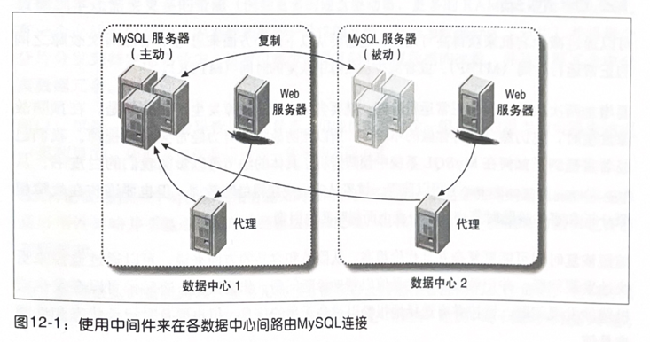

# 第12章 高可用性

本章将讲述我们提到的复制、可扩展性以及高可用性三个主题中的第三个。归根结底，高可用性实际上意味着“更少的岩机时间"。然而糟糕的是，高可用性经常和其他相关的概念混淆，例如冗余、保障数据不丢失，以及负载均衡。我们希望之前的两章已经为清楚地理解高可用性做了足够的铺垫。跟其他两章一样，这一章也不仅仅是关注高可用性的内容，一些相关的话题也会综合阐述。

## 12.1什么是高可用性

高可用性实际上有点像神秘的野兽。它通常以百分比表示，这本身也是一种暗示：高可用性不是绝对的,只有相对更高的可用性。100%的可用性是不可能达到的。可用性的"9"规则是表示可用性目标最普遍的方法。你可能也知道，“5个9”表示99.999%的正常可用时间。换句话说，每年只允许5分钟的岩机时间。对于大多数应用这已经是令人惊叹的数字，尽管还有一些人试图获得更多的“9"。

每个应用对可用性的需求各不相同。在设定一个可用时间的目标之前，先问问自己，是不是确实需要达到这个目标。可用性每提高一点，所花费的成本都会远超之前，可用性的效果和开销的比例并不是线性的。需要保证多少可用时间，取决于能够承担多少成本。高可用性实际上是在岩机造成的损失与降低岩机时间所花费的成本之间取一个平衡。换句话说，如果需要花大量金钱去获得更好的可用时间，但所带来的收益却很低，可能就不值得去做。总的来说，应用在超过一定的点以后追求更高的可用性是非常困难的，成本也会很高，因此我们建议设定一个更现实的目标并且避免过度设计。幸运的是，建立2个9或3个9的可用时间的目标可能并不困难，具体情况取决于应用。

有时候人们将可用性定义成服务正在运行的时间段。我们认为可用性的定义还应该包括应用是否能以足够好的性能处理请求。有许多方法可以让一个服务器保持运行，但服务并不是真正可用。对一个很大的服务器而言，重启MySQL之后，可能需要几个小时才能充分预热以保证查询请求的响应时间是可以接受的，即使服务器只接收了正常流量的一小部分也是如此。

另一个需要考虑的问题是，即使应用并没有停止服务，但是否可能丢失了数据。如果服务器遭遇灾难性故障，可能多少都会丢失一些数据，例如最近已经写入（最新丢失的)二进制日志但尚未传递到备库的中继日志中的事务。你能够容忍吗？大多数应用能够容忍因为替代方案大多非常昂贵且复杂，或者有一些性能开销。例如，可以使用同步复制，或是将二进制日志放到一个通过DRBD进行复制的设备上，这样就算服务器完全失效也不用担心丢失数据。（但是整个数据中心也有可能会掉电。）

一个良好的应用架构通常可以降低可用性方面的需求，至少对部分系统而言是这样的，良好的架构也更容易做到高可用。将应用中重要和不重要的部分进行分离可以节约不少工作量和金钱，因为对于一个更小的系统改进可用性会更容易。可以通过计算“风险敞口（risk exposure)”，将失效概率与失效代价相乘来确认高优先级的风险。画一个简单的风险计算表，以概率、代价和风险敞口作为列，这样很容易找到需要优先处理的项目。

在前一章我们通过讨论如何避免导致糟糕的可扩展性的原因，来推出如何获得更好的可扩展性。这里也会使用相似的方法来讨论可用性，因为我们相信，理解可用性最好的方法就是研究它的反面——岩机时间。接下来的小节我们会讨论为什么会出现岩机。

## 12.2导致岩机的原因
我们经常听到导致数据库岩机最主要的原因是编写的SQL查询性能很差，真的是这样吗？2009 年我们决定分析我们客户的数据库所遇到的问题，以找出那些真正引起岩机的问题,以及如何避免这些问题。结果证实了一些我们已有的猜想，但也否定了一些（错误的）认识，我们从中学到了很多。

我们首先对岩机事件按表现方式而非导致的原因进行分类。一般来说，“运行环境”是排名第一的岩机类别，大约35%的事件属于这一类。运行环境可以看作是支持数据库服务器运行的系统和资源集合，包括操作系统、硬盘以及网络等。性能问题紧随其后，也是约占35%；然后是复制，占20%；最后剩下的10%包含各种类型的数据丢失或损坏，以及其他问题。

我们在一个冗长的白皮书中完整地描述了对客户的宏机事故的分析，并于随后在另一份白皮书中我们对事件按类型进行分类后，确定了导致这些事件的原因。以下是一些需要注意的地方：

- 在运行环境的问题中，最普遍的问题是磁盘空间耗尽。
- 在性能问题中，最普遍的岩机原因确实是运行很槽糕的SOL，但也不一定都是这个原因，比如也有很多问题是由于服务器Bug或错误的行为导致的。
- 糟糕的Schema 和索引设计是第二大影响性能的问题。
- 复制问题通常由于主备数据不一致导致。
- 数据丢失问题通常由于 DROP TABLE的误操作导致，并总是伴随着缺少可用备份的问题。

复制虽然常被人们用来改善可用时间，但却也可能导致岩机。这主要是由于不正确的使用导致的，即便如此，它也阐明了一个普遍的情况：许多高可用性策略可能会产生反作用，我们会在后面讨论这个话题。

现在我们已经知道了主要岩机类别，以及有什么需要注意，下面我们将专门介绍如何获得高可用性。

## 12.3如何实现高可用性
可以通过同时进行以下两步来获得高可用性。首先，可以尝试避免导致岩机的原因来减少岩机时间。许多问题其实很容易避免，例如通过适当的配置、监控，以及规范或安全保障措施来避免人为错误。第二，尽量保证在发生岩机时能够快速恢复。最常见的策略是在系统中制造冗余，并且具备故障转移能力。这两个维度的高可用性可以通过两个相关的度量来确定：平均失效时间（MTBF）和平均恢复时间（MTTR）。一些组织会非常仔细地追踪这些度量值。

第二步——通过冗余快速恢复——很不幸，这里是最应该注意的地方，但预防措施的投资回报率会很高。接下来我们来探讨一些预防措施。

### 12.3.1提升平均失效时间（MTBF）

其实只要尽职尽责地做好一些应做的事情，就可以避免很多岩机。在分类整理岩机事件并追查导致岩机的根源时，我们还发现，很多岩机本来是有一些方法可以避免的。我们发现大部分岩机事件都可以通过全面的常识性系统管理办法来避免。以下是从我们的白皮书中摘录的指导性建议，在白皮书中有我们详细的分析结果。

- 测试恢复工具和流程，包括从备份中恢复数据。
- 遵从最小权限原则。
- 保持系统干净、整洁。
- 使用好的命名和组织约定来避免产生混乱，例如服务器是用于开发还是用于生产环境。
- 谨慎安排升级数据库服务器。
- 在升级前，使用诸如PerconaToolkit 中的pt-upgrade 之类的工具仔细检查系统。
- 使用 InnoDB并进行适当的配置，确保InnoDB是默认存储引擎。如果存储引擎被禁止，服务器就无法启动
- 确认基本的服务器配置是正确的。
- 通过skip_name_resoLve 禁止DNS。
- 除非能证明有效，否则禁用查询缓存。
- 避免使用复杂的特性，例如复制过滤和触发器，除非确实需要
- 监控重要的组件和功能，特别是像磁盘空间和RAID卷状态这样的关键项目，但也要避免误报，只有当确实发生问题时才发送告警。
- 尽量记录服务器的状态和性能指数，如果可能就尽量久地保存。
- 定期检查复制完整性。
- 将备库设置为只读，不要让复制自动启动。
- 定期进行查询语句审查。
- 归档并清理不需要的数据。
- 为文件系统保留一些空间。在GNU/Linux中，可以使用-m选项来为文件系统本身保留空间。还可以在LVM卷组中留下一些空闲空间。或者，更简单的方法，仅仅创建一个巨大的空文件，在文件系统快满时，直接将其删除。
- 养成习惯，评估和管理系统的改变、状态以及性能信息。

我们发现对系统变更管理的缺失是所有导致岩机的事件中最普遍的原因。典型的错误包括粗心的升级导致升级失败并遭遇一些Bug，或是尚未测试就将Schema或查询语句的更改直接运行到线上，或者没有为一些失败的情况制定计划，例如达到了磁盘容量限制。另外一个导致问题的主要原因是缺少严格的评估，例如因为疏忽没有确认备份是否是可以恢复的。最后，可能没有正确地监控MySQL的相关信息。例如缓存命中率报警并不能说明出现问题，并且可能产生大量的误报，这会使监控系统被认为不太有用，于是一些人就会忽略报警。有时候监控系统失效了，甚至没人会注意到，直至你的老板质问你，“为什么Nagios没有告诉我们磁盘已经满了”。

### 12.3.2降低平均恢复时间（MTTR）

之前提到，可以通过减少恢复时间来获得高可用性。事实上，一些人走得远，只专注于减少恢复时间的某个方面：通过在系统中建立冗余来避免系统完全失效，并避免单点失效问题。

在降低恢复时间上进行投资非常重要，一个能够提供冗余和故障转移能力的系统架构，则是降低恢复时间的关键环节。但实现高可用性不单单是一个技术问题，还有许多个人和组织的因素。组织和个人在避免岩机和从岩机事件中恢复的成熟度和能力层次各不相同。

团队成员是最重要的高可用性资产，所以为恢复制定一个好的流程非常重要。拥有熟练技能、应变能力、训练有素的雇员，以及处理紧急事件的详细文档和经过仔细测试的流程，对从岩机中恢复有巨大的作用。但也不能完全依赖工具和系统，因为它们并不能理解实际情况的细微差别，有时候它们的行为在一般情况下是正确的，但在某些场景下却会是个灾难！

对岩机事件进行评估有助于提升组织学习能力，可以帮助避免未来发生相似的错误，但是不要对“事后反思”或“事后的调查分析”期待太高。后见之明被严重曲解，并且一味想找到导致问题的唯一根源，这可能会影响你的判断力"。许多流行的方法，例如“五个为什么”，可能会被过度使用，导致一些人将他们的精力集中在找到唯一的替罪羊。很难去回顾我们解决的问题当时所处的状况，也很难理解真正的原因，因为原因通常是多方面的。因此，尽管事后反思可能是有用的，但也应该对结论有所保留。即使是我们给出的建议，也是基于长期研究导致岩机事件的原因以及如何预防它们所得，并且只是我们的观点而已。

这里我们要反复提醒：所有的岩机事件都是由多方面的失效联合在一起导致的。因此可以通过利用合适的方法确保单点的安全来避免。整个链条必须要打断，而不仅仅是单个环节。例如，那些向我们求助恢复数据的人不仅遭受数据丢失（存储失效，DBA误操作等)，同时还缺少一个可用的备份。

这样说来，当开始调查并尝试阻止失效或加速恢复时，大多数人和组织不应太过于内疚，而是要专注于技术上的一些措施——特别是那些很酷的方法，例如集群系统和冗余架构。这些是有用的，但要记住这些系统依然会失效。事实上，在本书第二版中提到的MMM复制管理，我们已经失去了兴趣，因为它被证明可能导致更多的岩机时间。你应该不会奇怪一组 Perl 脚本会陷于混乱，但即使是特别昂贵并精密设计的系统也会出现灾难性的失效——是的,即使是花费了大量金钱的SAN也是如此。我们已经见过太多的SAN失效。

## 12.4避免单点失效

找到并消除系统中的可能失效的单点，并结合切换到备用组件的机制，这是一种通过减少恢复时间（MTTR）来改善可用性的方法。如果你够聪明，有时候甚至能将实际的恢复时间降低至0，但总的来说这很困难。（即使一些非常引人注目的技术，例如昂贵的负载均衡器，在发现问题并进行反馈时也会导致一定的延迟。）

思考并梳理整个应用，尝试去定位任何可能失效的单点。是一个硬盘驱动器，一台服务器一台交换或路由器，还是某个机架的电源？所有数据都在一个数据中心，或者冗余数据中心是由同一个公司提供的吗？系统中任何不冗余的部分都是一个可能失效的单点。其他比较普遍的单点失效依赖于一些服务，例如DNS、单一网络提供商“、单个云“可用区域”，以及单个电力输送网，其体有哪些取决于你的关注点。

单点失效并不总是能够消除。增加冗余或许也无法做到，因为有些限制无法避开，例如地理位置，预算，或者时间限制等。试着去理解每一个影响可用性的部分，采取一种平衡的观点来看待风险，并首先解决其中影响最大的那个。一些人试图编写一个软件来处理所有的硬件失效，但软件本身导致的岩机时间可能比它节约的还要多。也有人想建立一种“永不沉没”的系统，包括各种冗余，但他们忘记了数据中心可能掉电或失去连接。或许他们彻底忘记了恶意攻击者和程序错误的可能性，这些情况可能会删除或损坏数据——一个不小心执行的DROPTABLE也会产生机时间。

可以采用两种方法来为系统增加冗余：增加空余容量和重复组件。增加容量冗余量通常很简单—可以使用本章或前一章讨论的任何技术。一个提升可用性的方法是创建一个集群或服务器池，并使用负载均衡解决方案。如果一台服务器失效，其他服务器可以接管它的负载。有些人有意识地不使用组件的全部能力，这样可以保留一些“动态余量”来处理因为负载增加或组件失效导致的性能问题。

出于很多方面的考虑会需要冗余组件，并在主要组件失效时能有一个备件来随时替换。冗余组件可以是空闲的网卡、路由器或者硬盘驱动器——任何能想到的可能失效的东西。完全冗余MySQL服务器可能有点困难，因为一个服务器在没有数据时毫无用处。这意味着你必须确保备用服务器能够获得主服务器上的数据。共享或复制存储是一个比较流行的办法，但这真的是一个高可用性架构吗？让我们深入其中看看。

### 12.4.1共享存储或磁盘复制

共享存储能够为数据库服务器和存储解耦合，通常使用的是SAN。使用共享存储时，服务器能够正常挂载文件系统并进行操作。如果服务器挂了，备用服务器可以挂较相同的文件系统，执行需要的恢复操作，并在失效服务器的数据上启动MySQL。这个过程在逻辑上跟修复那台故障的服务器没什么两样，不过更快速，因为备用服务器已经启动，随时可以运行。当开始故障转移时，检查文件系统、复InnoDB以及预热是最有可能遇到延迟的地方，但检测失效本身在许多设置中也会花费很长时间。

共享存储有两个优点：可以避免除存储外的其他任何组件失效所引起的数据丢失，并为非存储组件建立冗余提供可能。因此它有助于减少系统一些部分的可用性需求，这样就可以集中精力关注一小部分组件来获得高可用性。不过，共享存储本身仍是可能失效的单点。如果共享存储失效了，那整个系统也失效了，尽管SAN通常设计良好，但也可能失效，有时候需要特别关注。就算 SAN本身拥有冗余也会失效。

> 主动一主动访问模式的共享存储怎么样？
>
> 在一个SAN、NAS或者集群文件系统上以主动一主动模式运行多个实例怎么样？MySQL不能这么做。因为MySQL并没有被设计成和其他MySQL实例同步对数据的访问，所以无法在同一份数据上开启多个MySQL实例。（如采在一份只读的静态数据上使用MyISAM，技术上是可行的，但我们还没有见过任何实际的应用。）
>
> MySQL的一个名为ScaleDB的存储引擎在底层提供了操作共享存储的API，但我们还没有评估过，也没有见过任何生产环境使用。在写作本书时它还是beta版。

共享存储本身也有风险，如果 MySQL 崩溃等故障导致数据文件损坏，可能会导致备用服务器无法恢复。我们强烈建议在使用共享存储策略时选择 InnoDB存储引擎或其他稳定的 ACID存储引擎。一次崩溃几乎肯定会损坏MyISAM表，需要花费很长时间来修复，并且会丢失数据。我们也强烈建议使用日志型文件系统。我们见过比较严重的情况是，使用非日志型文件系统和SAN（这是文件系统的问题，跟SAN无关）导致数据损坏无法恢复。

磁盘复制技术是另外一个获得跟SAN类似效果的方法。MySQL中最普遍使用的磁盘复制技术是DRBD（http://www.drbd.org），并结合 Linux-HA项目中的工具使用（后面会介绍到）。

DRBD是一个以Linux 内核模块方式实现的块级别同步复制技术。它通过网卡将主服务器的每个块复制到另外一个服务器的块设备上（备用设备)，并在主设备提交块之前记录下来。由于在备用DRBD设备上的写入必须要在主设备上的写入完成之前，因此备用设备的性能至少要和主设备一样，否则就会限制主设备的写入性能。同样，如果正在使用DRBD磁盘复制技术以保证在主设备失效时有一个可随时替换的备用设备，备用服务器的硬件应该跟主服务器的相匹配。带电池写缓存的RAID控制器对DRBD而言几乎是必需的，因为在没有这样的控制器时性能可能会很差。

如果主服务器失效，可以把备用设备提升为主设备。因为DRBD 是在磁盘块层进行复制，而文件系统也可能会不一致。这意味着最好是使用日志型文件系统来做快速恢复。一旦设备恢复完成，MySQL还需要运行自身的恢复。原故障服务器恢复后，会与新的主设备进行同步，并假定自身角色为备用设备。

从如何实际地实现故障转移的角度来看，DRBD和SAN很相似：有一个热备机器，开始提供服务时会使用和故障机器相同的数据。最大的不同是，DRBD是复制存储一不是共享存储——所以当使用DRBD时，获得的是一份复制的数据，而SAN则是使用与故障机器同一物理设备上的相同数据副本。换句话说，磁盘复制技术的数据是冗余的，所以存储和数据本身都不会存在单点失效问题。这两种情况下，当启动备用机器时，MySQL 服务器的缓存都是空的。相比之下，备库的缓存至少是部分预热的。

DRBD有一些很好的特性和功能，可以防止集群软件普遍会遇到的一些问题。一个典型的例子是“脑裂综合征"，在两个节点同时提升自己为主服务器时会发生这种问题。可以通过配置DRBD来防止这种事件发生。但是DRBD也不是一个能满足所有需求的完美解决方案。我们来看看它有哪些缺点：

- DRBD的故障转移无法做到秒级以内。它通常至少需要几秒钟时间来将备用设备提升成主设备，这还不包括任何必要的文件系统恢复和MySQL恢复。
- 它很昂贵，因为必须在主动一被动模式下运行。热备服务器的复制设备因为处于被动模式，无法用于其他任务。当然这是不是缺点取决于看问题的角度。如果你希望获得真正的高可用性并且在发生故障时不能容忍服务降级，就不应该在一台机器上运行两台服务器的负载量，因为如果这么做了，当其中一台发生故障时，就无法处理这些负载了。可以用这些备用服务器做一些其他用途，例如用作备库，但还是会有一些资源浪费。
- 对于 MyISAM表实际上用处不大，因为MyISAM表崩溃后需要花费很长时间来检查和修复。对任何期望获得高可用性的系统而言，MyISAM都不是一个好选择，请使用InnoDB或其他支持快速、安全恢复的存储引擎来代替MyISAM。
- DRBD 无法代替备份。如果磁盘由于蓄意的破坏、误操作、Bug或者其他硬件故障导致数据损坏，DRBD 将无济于事。此时复制的数据只是被损坏数据的完美副本。你需要使用备份（或MySQL延时复制）来避免这些问题。
- 对写操作而言增加了负担。具体会增加多少负担呢？通常可以使用百分比来表示，但这并不是一个好的度量方法。你需要理解写入时增加的延迟主要由网络往返开销和远程服务器存储导致，特别是对于小的写入而言延迟会更大。尽管增加的延迟可能也就0.3ms，这看起来比在本地磁盘上I/O的4～10ms的延迟要小很多，但却是正常的带有写缓存的RAID控制器的延迟的3～4倍。使用DRBD导致服务器变慢最常见的原因是MySQL使用InnoDB并采取了完全持久化模式“，这会导致许多小的写入和 fsync(）调用，通过DRBD 同步时会非常慢。

我们倾向于只使用DRBD复制存放二进制日志的设备。如果主动节点失效，可以在被动节点上开启一个日志服务器，然后对失效主库的所有备库应用这些二进制日志。接下来可以选择其中一个备库提升为主库，以代替失效的系统。

说到底，共享存储和磁盘复制与其说是高可用性（低岩机时间）解决方案，不如说是一种保证数据安全的方法。只要拥有数据，就可以从故障中恢复，并且比无法恢复的情况的MTTR更低。（即使是很长的恢复时间也比不能恢复要快。）但是相比于备用服务器启动并一直运行的架构，大多数共享存储或磁盘复制架构会增加MTTR。有两种启用备用设备并运行的方法：我们在第10章讨论的标准的 MySQL复制，以及接下来会讨论的同步复制。

### 12.4.2MySQL同步复制

当使用同步复制时，主库上的事务只有在至少一个备库上提交后才能认为其执行完成。这实现了两个目标：当服务器崩溃时没有提交的事务会丢失，并且至少有一个备库拥有实时的数据副本。大多数同步复制架构运行在主动-主动模式。这意味着每个服务器在任何时候都是故障转移的候选者，这使得通过冗余获得高可用性更加容易。

这的意思应该是innodb_flush_Log_at_trx_commit=1的情况。一在写作本书时，MySQL本身并不支持同步复制，但有两个基于MySQL的集群解决方案支持同步复制。你还可以阅读第10章、第11章和第13章讨论的其他产品，例如Continuent Tungsten 以及Clustrix，这些都相当有意思。

#### 1.MySQL Cluster

MySQL 中的同步复制首先出现在 MySQL Cluster（NDB Cluster）。它在所有节点上进行同步的主-主复制。这意味着可以在任何节点上写入，这些节点拥有等同的读写能力。每一行都是冗余存储的，这样即使丢失了一个节点，也不会丢失数据，并且集群仍然能提供服务。尽管MySQL Cluster还不是适用于所有应用的完美解决方案，但正如我们在前一章提到的，在最近的版本中它做了非常快速的改进，现在已经拥有大量的新特性和功能：非索引数据的磁盘存储、增加数据节点能够在线扩展、使用ndbinfo表来管理集群、配置和管理集群的脚本、多线程操作、下推（push-down）的关联操作（现在称为自适应查询本地化)、能够处理 BLOB列和很多列的表、集中式的用户管理，以及通过像memcached协议一样的NDBAPI来实现NoSQL访问。在下一个版本中将包含最终一致运行模式，包括为跨数据中心的主动-主动复制提供事务冲突检测和跨WAN解决方案。简而言之，MySQL Cluster 是一项引人注目的技术。

现在至少有两个为简化集群部署和管理提供附加产品的供应商：Oracle 针对 MySQLCluster 的服务支持包含了 MySQL Cluster Manager 工具；Severalnines 提供了 ClusterControl工具（htp://www.severalnines.com），该工具还能够帮助部署和管理复制集群。

#### 2.PerconaXtraDBCluster

Percona XtraDB Cluster 是一个相对比较新的技术，基于已有的 XtraDB（InnoDB）存储引擎增加了同步复制和集群特性，而不是通过一个新的存储引擎或外部服务器来实现。它是基于 Galera（支持在集群中跨节点复制写操作）实现的注"，这是一个在集群中不同节点复制写操作的库。跟MySQLCluster 类似，Percona XtraDB Cluster 提供同步多主库复制12，支持真正的任意节点写人能力，能够在节点失效时保证数据零丢失（持久性，ACID中的D)，另外还提供高可用性，在整个集群没有失效的情况下，就算单个节点失效也没有关系。

Galera 作为底层技术，使用一种被称为写入集合（write-set）复制的技术。写入集合实际上被作为基于行的二进制日志事件进行编码，目的是在集群中的节点间传输并进行更新，但是这不要求二进制日志是打开的。

Percona XtraDB Cluster的速度很快。跨节点复制实际上比没有集群还要快，因为在完全持久性模式下，写入远程RAM比写入本地磁盘要快。如果你愿意，可以选择通过降低每个节点的持久性来获得更好的性能，并且可以依赖于多个节点上的数据副本来获得持久性。NDB也是基于同样的原理实现的。集群在整体上的持久性并没有降低，仅仅是降低了本地节点的持久性。除此之外，还支持行级别的并发（多线程）复制，这样就可以利用多个CPU核心来执行写入集合。这些特性结合起来使得Percona XtraDB Cluster非常适合云计算环境，因为云计算环境中的CPU和磁盘通常比较慢。

在集群中通过设置auto_increment_offset和auto_increment _increment来实现自增健，以使节点间不会生成冲突的主键值。锁机制和标准 InnoDB完全相同，使用的是乐观并发控制。当事务提交时，所有的更新是序列化的，并在节点间传输，同时还有一个检测过程，以保证一旦发生更新冲突，其中一些更新操作需要丢弃。这样如果许多节点同时修改同样的数据，可能产生大量的死锁和回滚。

PerconaXtraDBCluster只要集群内在线的节点数不少于“法定人数（quorum）”就能保证服务的高可用性。如果发现某个节点不属于“法定人数”中的一员，就会从集群中将其踢出。被踢出的节点在再次加入集群前必须重新同步。因此集群也无法处理“脑裂综合征”；如果出现脑裂则集群会停正服务。在一个只有两个节点的集群中，如果其中一个节点失效，剩下的一个节点达不到“法定人数”，集群将停止服务，所以实际上最少需要三个节点才能实现高可用的集群。

PerconaXtraDBCluster有许多优点：

- 提供了基于 InnoDB 的透明集群，所以无须转换到另外的技术，例如NDB这样完全不同的技术需要很多学习成本和管理。
- 提供了真正的高可用性，所有节点等效，并在任何时候提供读写服务。相比较而言，MySQL 内建的异步复制和半同步复制必须要有一个主库，并且不能保证数据被复制到备库，也无法保证备库数据是最新的并能够随时提升为主库。
- 节点失效时保证数据不丢失。实际上，由于所有的节点都拥有全部数据，因此可以丢失任意一个节点而不会丢失数据（即使集群出现脑裂并停止工作）。这和NDB不同，NDB通过节点组进行分区，当在一个节点组中的所有服务器失效时就可能丢失数据。
- 备库不会延迟，因为在事务提交前，写人集合已经在集群的所有节点上传播并被确认了。
- 因为是使用基于行的日志事件在备库上进行更新，所以执行写入集合比直接执行更新的开销要小很多，就和使用基于行的复制差不多。当结合多线程应用的写入集合时，可以使其比MySQL 本身的复制更具备可扩展性。

当然我们也需要提及Percona XtraDB Cluster 的一些缺点：

- 它很新，因此还没有足够的经验来证明其优点和缺点，也缺乏合适的使用案例。
- 整个集群的写入速度由最差的节点决定。因此所有的节点最好拥有相同的硬件配置，如果一个节点慢下来（例如，RAID卡做了一次batery-learn 循环），所有的节点都会慢下来。如果一个节点接收写人操作变慢的可能性为P，那么有3个节点的集群变慢的可能性为3P。
- 没有 NDB那样节省空间，因为每个节点都需要保存全部数据，而不是仅仅一部分。但另一方面，它基于Percona XtraDB（InnoDB的增强版本），也就没有NDB关于磁盘数据限制的担忧。
- 当前不支持一些在异步复制中可以做的操作，例如在备库上离线修改schema，然后将其提升为主库，然后在其他节点上重复离线修改操作。当前可替代的选择是使用诸如Percona Toolkit 中的在线 schema 修改工具。不过滚动式 schema升级（rollingschema upgrade）在写作本书时也即将发布。
- 当向集群中增加一个新节点时，需要复制所有的数据，还需要跟上不断进行的写入操作，所以一个拥有大量写入的大型集群很难进行扩容。这实际上限制了集群的数据大小。我们无法确定具体的数据。但悲观地估计可能低至100GB或更小，也可能会大得多。这一点需要时间和经验来证明。
- 复制协议在写入时对网络波动比较敏感，这可能导致节点停止并从集群中踢出。所以我们推荐使用高性能网络，另外还需要很好的冗余。如果没有可靠的网络，可能会导致需要频繁地将节点加入到集群中。这需要重新同步数据。在写本书时，有一个几乎接近可用的特性，即通过增量状态传输来避免完全复制数据集，因此未来这并不是一个问题。还可以配置Galera 以容忍更大的网络延迟（以延迟故障检测为代价)，另外更加可靠的算法也计划在未来的版本中实现。
- 如果没有仔细关注，集群可能会增长得太大，以至于无法重启失效节点，就像在一个合理的时间范围内，如果在日常工作中没有定期做恢复演练，备份也会变得太过庞大而无法用于恢复。我们需要更多的实践经验来了解它事实上是如何工作的。
- 由于在事务提交时需要进行跨节点通信，写入会更慢，随着集群中增加的节点越来越多，死锁和回滚也会更加频繁。（参阅前一章了解为什么会发生这种情况。）

Percona XtraDB Cluster 和Galera 都处于其生命周期的早期，正在被快速地修改和改进。在写作本书时，正在进行或即将进行的改进包括群体行为、安全性、同步性、内存管理、状态转移等。未来还可以为离线节点执行诸如滚动式schema 变更的操作。

### 12.4.3基于复制的冗余

复制管理器是使用标准MySQL复制来创建冗余的工具。尽管可以通过复制来改善可用性，但也有一些“玻璃天花板”会阻止MySQL当前版本的异步复制和半同步复制张得和真正的同步复制相同的结果。复制无法保证实时的故障转移和数据零丢失，也无法将所有节点等同对待。

复制管理器通常监控和管理三件事：应用和MySQL间的通信、MySQL服务器的健康度以及 MySQL服务器间的复制关系。它们既可以修改负载均衡的配置，也可以在必要的时候转移虚拟IP 地址以使应用连接到合适的服务器上，还能够在一个伪集群中操纵复制以选择一个服务器作为写人节点。大体上操作并不复杂：只需要确定写人不会发送到一个还没有准备好提供写服务的服务器上，并保证当需要提升一台备库为主库时记录下正确的复制坐标。

这听起来在理论上是可行的，但我们的经验表明实际上并不总是能有效工作。事实上这非常糟糕，有些时候最好有一些轻量级的工具集来帮助从常见的故障中恢复并以很少的开销获得较高的可用性。不幸的是，在写作本书时我们还没有听说任何一个好的工具集可以可靠地完成这一点。稍后我们会介绍两个复制管理器，其中一个很新，而另外一个则有很多问题。

我们发现很多人试图去写自己的复制管理器。他们常常会陷入很多人已经遭遇过的陷阱。自己去写一个复制管理器并不是好主意。异步组件有大量的故障形式，很多你从未亲身经历过，其中一些甚至无法理解，并且程序也无法适当处理，因此从这些异步组件中得到正确的行为相当困难，并且可能遭遇数据丢失的危险。事实上，机器刚开始出现问题时，由一个经验丰富的人来解决是很快的，但如果其他人做了一些错误的修复操作则可能导致问题更严重。

我们要提到的第一个复制管理器是MMM（http://mysql-mmm.org），本书的作者对于该工具集是否适用于生产环境部署的意见并不一致（尽管该工具的原作者也承认它并不可靠）。我们中有些人认为它在一些人工一故障转移模式下的场景中比较有用，而有些人甚至从不使用这个工具。我们的许多客户在自动一故障转移模式下使用该工具时确实遇到了许多严重的问题。它会导致健康的服务器离线，也可能将写入发送到错误的地点，并将备库移动到错误的坐标。有时混乱就接而至。

另外一个比较新一点的工具是 Yoshinori Matsunobu的 MHA工具集（hutp://code.googlecom/p/mysql-master-ha/)。它和MMM一样是一组脚本，使用相同的通用技术来建立一个伪集群，但它不是一个完全的替换者；它不会去做太多的事情，并且依赖于Pacemaker 来转移虚拟IP地址。一个主要的不同是，MHA有一个很好的测试集，可以防止一些 MMM遇到过的问题。除此之外，我们对该工具集还没有更多的认识，我们只和Yoshinori 讨论过，但还没有真正使用过。

基于复制的冗余最终来说好坏参半。只有在可用性的重要性远比一致性或数据零丢失保证更重要时才推荐使用。例如，一些人并不会真的从他们的网站功能中获利，而是从它的可用性中赚钱。谁会在乎是否出现了故障导致一张照片丢失了几条评论或其他什么东西呢？只要广告收益继续滚滚而来，可能并不值得花更多成本去实现真正的高可用性。但还是可以通过复制来建立“尽可能的”高可用性，当遇到一些很难处理的严重岩机时可能会有所帮助。这是一个大赌注，并且可能对大多数人而言太过于冒险，除非是那些老成（或者专业）的用户。

问题是许多用户不知道如何去证明自己有资格并评估复制“轮盘赌”是否适合他们。这有两个方面的原因。第一，他们并没有看到“玻璃天花板",错误地认为一组虚拟IP地址、复制以及管理脚本能够实现真正的高可用性。第二，他们低估了技术的复杂度，因此也低估了严重故障发生后从中恢复的难度。一些人认为他们能够使用基于复制的冗余技术，但随后他们可能会更希望选择一个有更强保障的简单系统。

其他一些类型的复制，例如DRBD或者SAN，也有它们的缺点——请不要认为我们将这些技术说得无所不能而把MySQL自身的复制贬得一团糟，那不是我们的本意。你可以为DRBD写出低质量的故障转移脚本，这很简单，就像为 MySQL 复制编写脚本一样。主要的区别是MySQL 复制非常复杂，有很多非常细小的差别，并且不会阻止你干坏事。

## 12.5故障转移和故障恢复

冗余是很好的技术，但实际上只有在遇到故障需要恢复时才会用到。（见鬼，这可以用备份来实现)。冗余一点儿也不会增加可用性或减少岩机。在故障转移的过程中，高可用性是建立在冗余的基础上。当有一个组件失效，但存在冗余时，可以停止使用发生故障的组件，而使用冗余备件。冗余和故障转移结合可以帮助更快地恢复，如你所知，MTTR的减少将降低岩机时间并改善可用性。

在继续这个话题之前，我们先来定义一些术语。我们统一使用“故障转移（failover)"有些人使用“回退”（fallback）表达同一意思。有时候也有人说“切换（switchover）"，以表明一次计划中的切换而不是故障后的应对措施。我们也会使用“故障恢复”来表示故障转移的反面。如果系统拥有故障恢复能力，故障转移就是一个双向过程：当服务器A失效，服务器B代替它，在修复服务器A后可以再替换回来。

故障转移比仅仅从故障中恢复更好。也可以针对一些情况制订故障转移计划，例如升级、schema 变更、应用修改，或者定期维护，当发生故障时可以根据计划进行故障转移来减少岩机时间(改善可用性)。

你需要确定故障转移到底需要多快，也要知道在一次故障转移后替换一个失效组件应该多快。在你恢复系统耗尽的备件容量之前，会出现冗余不足，并面临额外风险。因此，拥有一个备件并不能消除即时替换失效组件的需求。构建一个新的备用服务器，安装操作系统，并复制数据的最新副本，可以多快呢？有足够的备用机器吗？你可能需要不止一台以上。

故障转移的缘由各不相同。我们已经讨论了其中的一些，因为负载均衡和故障转移在很多方面很相似，它们之间的分界线比较模糊。总的来说，我们认为一个完全的故障转移解决方案至少能够监控并自动替换组件。它对应用应该是透明的。负载均衡不需要提供这些功能。

在UNIX领域，故障转移常常使用High Availability Linux项目（http://linux-ha.org）提供的工具来完成，该项目可在许多类UNIX系统上运行，而不仅仅是Linux。Linux-HA栈在最近几年明显多了很多新特性。现在大多数人认为Pacemaker是栈中的一个主要组件。Pacemaker替代了老的心跳工具。还有其他一些工具实现了IP托管和负载均衡功能。可以将它们跟DRBD和/或者LVS结合起来使用。

故障转移最重要的部分就是故障恢复。如果服务器间不能自如切换，故障转移就是一个死胡同，只能是延缓岩机时间而已。这也是我们倾向于对称复制布局，例如双主配置，而不会选择使用三台或更多的联合主库（co-master）来进行环形复制的原因。如果配置是对等的，故障转移和故障恢复就是在相反方向上的相同操作。（值得一提的是 DRBD具有内建的故障恢复功能。）

在一些应用中，故障转移和故障恢复需要尽量快速并具备原子性。即便这不是决定性的，不依靠那些不受你控制的东西也依然是个好主意，例如DNS变更或者应用程序配置文件。一些问题直到系统变得更加庞大时才会显现出来，例如当应用程序强制重启以及原子性需求出现时。

由于负载均衡和故障转移两者联系较紧密，有些硬件和软件是同时为这两个目的设计的，因此我们建议所选择的任何负载均衡技术应该都提供故障转移功能。这也是我们建议避免使用DNS和修改代码来做负载均衡的真实原因。如果为负载均衡采用了这些策略，就需要做一些额外的工作：当需要高可用性时，不得不重写受影响的代码。

以下小节讨论了一些比较普遍的故障转移技术。可以手动执行或使用工具来实现。

### 12.5.1提升备库或切换角色

提升一台备库为主库，或者在一个主一主复制结构中调换主动和被动角色，这些都是许多MySQL故障转移策略很重要的一部分。具体细节参见第10章。正如本章之前提到的，我们不能认定自动化工具总能在所有的情况下做正确的事情——或者至少以我们的名誉担保没有这样的工具。

你不应该假定在发生故障时能够立刻切换到被动备库，这要看具体的工作负载。备库会重放主库的写入，但如果不用来提供读操作，就无法进行预热来为生产环境负载提供服务。如果希望有一个随时能承担读负载的备库，就要不断地“训练”它，既可以将其用于分担工作负载，也可以将生产环境的读查询镜像到备库上。我们有时候通过监听TCP流量，截取出其中的SELECT查询，然后在备库上重放来实现这个目的。Percona Toolkit中有一些工具可以做到这一点。

### 12.5.2虚拟IP地址或IP接管

可以为需要提供特定服务的MySQL实例指定一个逻辑IP地址。当MySQL实例失效时，可以将IP地址转移到另一台MySQL服务器上。这和我们在前一章提到的思想本质上是相同的，唯一的不同是现在是用于故障转移，而不是负载均衡。

这种方法的好处是对应用透明。它会中断已有的连接，但不要求修改配置。有时候还可以原子地转移IP地址，保证所有的应用在同一时间看到这一变更。当服务器在可用和不可用状态间“摇摆”时，这一点尤其重要。

以下是它的一些不足之处：

- 需要把所有的IP地址定义在同一网段，或者使用网络桥接。
- 改变IP地址需要系统root权限。
- 有时候还需要更新ARP缓存。有些网络设备可能会把ARP信息保存太久，以致无法即时将一个IP地址切换到另一个 MAC地址上。我们看到过很多网络设备或其他组件不配合切换的例子，结果系统的许多部分可能无法确定IP地址到底在哪里。
- 需要确定网络硬件支持快速IP接管。有些硬件需要克隆 MAC地址后才能工作。
- 有些服务器即使完全丧失功能也会保持持有IP地址，所以可能需要从物理上关闭或断开网络连接。这就是为人所熟知的“击中其他节点的头部”（shoot the other nodein the head，简称STONITH)。它还有一个更加微妙并且比较官方的名字：击剑(fencing）。

浮动IP 地址和IP接管能够很好地应付彼此临近（也就是在同一子网内）的机器之间的故障转移。但是最后需要提醒的是，这种策略并不总是万无一失，还取决于网络硬件等因素。

> 等待更新扩散
>
> 经常有这种情况，在某一层定义了一个冗余后，需要等待低层执行一些改变。在本章前面的篇幅里，我们指出通过DNS修改服务器是一个很脆弱的解决方案，因为DNS的更新扩散速度很慢，改变IP地址可给予你史多的控制，但在一个LAN中的IP地址同样依赖于更低层——ARP——来扩散更新。

### 12.5.3中间件解决方案

可以使用代理、端口转发、网络地址转换（NAT）或者硬件负载均衡来实现故障转移和故障恢复。这些都是很好的解决方案，不像其他方法可能会引入一些不确定性（所有系统组件认同哪一个是主库吗？它能够及时并原子地更改吗？），它们是控制应用和服务器间连接的中枢。但是，它们自身也引入了单点失效，需要准备冗余来避免这个问题。

使用这样的解决方案，你可以将一个远程数据中心设置成看起来好像和应用在同一个网络里。这样就可以使用诸如浮动IP地址这样的技术让应用和一个完全不同的数据中心开始通信。你可以配置每个数据中心的每台应用服务器，通过它自己的中间件连接，将流量路由到活跃数据中心的机器上。图12-1描述了这种配置。

如果活跃数据中心安装的MySQL 彻底崩溃了，中间件可以路由流量到另外一个数据中心的服务器池中，应用无须知道这个变化。

这种配置方法的主要缺点是在一个数据中心的Apache 服务器和另外一个数据中心的MySQL服务器之间的延迟比较大。为了缓和这个问题，可以把 Web服务器设置为重定向模式。这样通信都会被重定向到放置活跃MySQL服务器的数据中心。还可以使用HTTP代理来实现这一目标。

图12-1显示了如何使用代理来连接MySQL服务器，也可以将这个方法和许多别的中间件架构结合在一起，例如LVS和硬件负载均衡器。

### 12.5.4在应用中处理故障转移

有时候让应用来处理故障转移会更简单或者更加灵活。例如，如果应用遇到一个错误，这个错误外部观察者正常情况下是无法察觉的，例如关于数据库损坏的错误日志信息，那么应用可以自己来处理故障转移过程。

虽然把故障转移处理过程整合到应用中看起来比较吸引人，但可能没有想象中那么有效。大多数应用有许多组件，例如cron任务、配置文件，以及用不同语言编写的脚本。将故障转移整合到应用中可能导致应用变得太过笨拙，尤其是当应用增大并变得更加复杂时。

但是将监控构建到应用中是一个好主意，当需要时，能够立刻开始故障转移过程。应用应该也能够管理用户体验，例如提供降级功能，并显示给用户合适的信息。

## 12.6总结

可以通过减少岩机来获得高可用性，这需要从以下两个方面来思考：增加两次故障之间的正常运行时间（MTBF)，或者减少从故障中恢复的时间（MTTR）。

要增加两次故障之间的正常运行时间，就要尝试去防止故障发生。悲剧的是，在预防故障发生时，它仍然会觉得你做的不够多，所以预防故障的努力经常会被忽视掉。我们已经着重提到了如何在MySQL系统中预防岩机；具体的细节可以参阅我们的白皮书，从http://www.percona.com 上可以获得。试着从岩机中获得经验教训，但也要谨防在故障根源分析和事后检验时集中在某一点上而忽略其他因素。

缩短恢复时间可能更复杂并且代价很高。从简单和容易的方面来说，可以通过监控来更快地发现问题，并记录大量的度量值以帮助诊断问题。作为回报，有时候可以在发生岩机前就发现问题。监控并有选择地报警以避免无用的信息，但也要及时记录状态和性能度量值。

另外一个减少恢复时间的策略是为系统建立元条，并使系统具备故障转移能力，这样当故障发生时，可以在冗余组件间进行切换。不幸的是，冗余会让系统变得相当复杂。现在应用不再是集中化的，而是分布式的，这意味着协调、同步、CAP定理、拜占庭将军问题，以及所有其他各种杂乱的东西。这也是像 NDB Cluster这样的系统很难创建并且很难提供足够的通用性来为所有的工作负载提供服务的原因。但这种情况正在改善，也许到本书第四版的时候我们就可以称赞一个或多个集群数据库了。

本章和前面两章提及的话题常常被放在一起讨论：复制、可扩展性，以及高可用性。我们已经尽量将它们独立开来，因为这有助于理清这些话题的不同之处。那么这三章有哪些关联之处呢？

在其应用增长时，人们一般希望从他们的数据库中知道三件事：

- 他们希望能够增加容量来处理新增的负载而不会损失性能。
- 他们希望保证不丢失已提交的事务。
- 他们希望应用能一直在线并处理事务，这样他们就能够一直赚钱。

为了达到这些目的，人们常常首先增加冗余。结合故障转移机制，通过最小化MTTR来提供高可用性。这些冗余还提供了空闲容量，可以为更多的负载提供服务。

当然，除了必要的资源外，还必须要有一份数据副本。这有助于在损失服务器时避免失数据，从而增强持久性。生成数据副本的唯一办法是通过某种方法进行复制。不幸的是，数据副本可能会引入不一致。处理这个问题需要在节点间协调和通信。这给系统带来了额外的负担；这也是系统或多或少存在扩展性问题的原因。

数据副本还需要更多的资源（例如更多的硬盘驱动器，更多的RAM），这会增加开销。有一个办法可以减少资源消耗和维护一致性的开销，就是为数据分区（分片）并将每个分片分发到特定的系统中。这可以减少需要复制的重复数据的次数，并从资源冗余中分离数据冗余。

所以，尽管一件事总会导致另外一件事，但我们是在讨论一组相关的观点和实践来达成一系列目的。他们不仅仅是讲述同一件事的不同方式。

最后，需要选择一个对你和应用有意义的策略。决定选择一个完全的端到端（end-to-end)高可用性策略并不能通过简单的经验法则来处理，但我们给出的一些粗略的指引也许会有所帮助。

为了获得很短的岩机时间，需要冗余服务器能够及时地接管应用的工作负较。它们必须在线并一直执行查询，而不仅仅是备用，因此它们是“预热”过的，处于随时可用的状态。

如果需要很强的可用性保证，就需要诸如MySQL Cluster、Percona XtaDB Cluster，或者 Clustrix 这样的集群产品。如果能容忍在故障转移过程中稍微慢一些，标准的 MySQL复制也是个很好的选择。要谨慎使用自动化故障转移机制；如果没有按照正确的方式工作，它们可能会破坏数据。

如果不是很在意故障转移花费的时间，但希望避免数据丢失，就需要一些强力保证数据的冗余——例如，同步复制。在存储层，这可以通过廉价的DRBD来实现，或者使用两个昂贵的SAN来进行同步复制。也可以选择在数据库层复制数据，可以使用的技术包括 MySQL Cluster、Percona XtraDB Cluster 或者 Clustrix。也可以使用一些中间件，例如 Tungsten Replicator。如果不需要强有力的保护，并且希望尽量保证简单，那么正常的异步复制或半同步复制在开销合理时可能是很好的选择。

或者也可以将应用放到云中。为什么不呢？这样难道不是能够立刻获得高可用性和无限扩展能力吗？下一章将继续探讨这个问题。