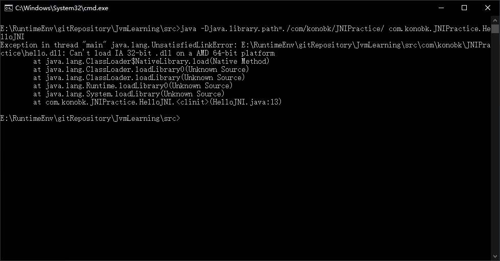
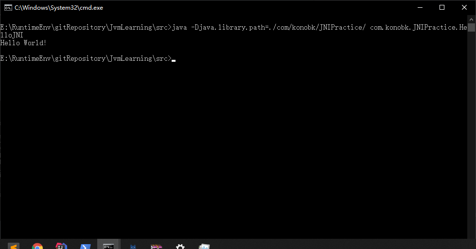

# JNI实践

# 引言

有的时候我们需要使用本地代码（C/C++）来克服Java中的内存管理和性能问题，Java通过JNI机制来支持内地代码的使用。
想要比较好地理解JNI是比较难的，因为它包含了两种语言和运行时机制。
在继续之前，我应该假设你具备以下知识点和技能：

1. java
2. C/C++和gcc编译器
3. 对于windows而言，熟悉Gygwin或者MinGW
4. 对于IDE而言，熟悉Eclipse C/C++ Development Tool (CDT)

# 开始

## 使用C来实现JNI

步骤1，编写一个使用C实现函数的java类，HelloJNI.java：

```java
public class HelloJNI {

    static {
        // Load native library at runtime
        // hello.dll (Windows) or libhello.so (Unixes)
        System.loadLibrary("hello");
    }

    // Declare a native method sayHello() that receives nothing and returns void
    public native void sayHello();

    // Test Driver
    public static void main(String[] args) {
        new HelloJNI().sayHello();  // invoke the native method
    }
}
```

上面代码的静态代码块在这个类被类加载器加载的时候调用了System.loadLibrary()方法来加载一个native库“hello”（这个库中实现了sayHello函数）。这个库在windows品台上对应了“hello.dll”，而在类UNIX平台上对应了“libhello.so”。这个库应该包含在Java的库路径（使用java.library.path系统变量表示）上，否则这个上面的程序会抛出UnsatisfiedLinkError错误。你应该使用VM的参数-Djava.library.path=path_to_lib来指定包含native库的路径。
接下来，我们使用native关键字将sayHello()方法声明为本地实例方法，这就很明显地告诉JVM：这个方法实现在另外一个语言中（C/C++），请去那里寻找他的实现。注意，一个native方法不包含方法体，只有声明。上面代码中的main方法实例化了一个HelloJJNI类的实例，然后调用了本地方法sayHello()。
下面，我们编译HelloJNI.java成HelloJNI.class

```sh
javac HelloJNI.java
```

接下来，我们利用上面生成的class文件生成用于编写C/C++代码的头文件，使用jdk中的javah工具完成（**这里需要退到src下面带上包名才能导出，原因未知**）：

```sh
javah com.konobk.JNIPractice.HelloJNI
```

上面的命令执行完之后生成了HelloJNI.h：

```C
/* DO NOT EDIT THIS FILE - it is machine generated */
#include <jni.h>
/* Header for class com_konobk_JNIPractice_HelloJNI */

#ifndef _Included_com_konobk_JNIPractice_HelloJNI
#define _Included_com_konobk_JNIPractice_HelloJNI
#ifdef __cplusplus
extern "C" {
#endif
/*
 * Class:     com_konobk_JNIPractice_HelloJNI
 * Method:    sayHello
 * Signature: ()V
 */
JNIEXPORT void JNICALL Java_com_konobk_JNIPractice_HelloJNI_sayHello
  (JNIEnv *, jobject);

#ifdef __cplusplus
}
#endif
#endif

```

我们看到，上面的头文件中生成了一个Java_HelloJNI_sayHello的C函数：

```C
JNIEXPORT void JNICALL Java_HelloJNI_sayHello(JNIEnv *, jobject);
```

将java的native方法转换成C函数声明的规则是这样的：`Java_{package_and_classname}_{function_name}(JNI arguments)`。包名中的点换成单下划线。需要说明的是生成函数中的两个参数：

1. JNIEnv *：这是一个指向JNI运行环境的指针，后面我们会看到，我们通过这个指针访问JNI函数
2. jobject：这里指代java中的this对象

下面我们给出的例子中没有使用上面的两个参数，不过后面我们的例子会使用的。到目前为止，你可以先忽略JNIEXPORT和JNICALL这两个玩意。
上面头文件中有一个extern “C”，同时上面还有C++的条件编译语句，这么一来大家就明白了，这里的函数声明是要告诉C++编译器：这个函数是C函数，请使用C函数的签名协议规则去编译！因为我们知道C++的函数签名协议规则和C的是不一样的，因为C++支持重写和重载等面向对象的函数语法。
接下来，我们给出C语言的实现，以实现上面的函数：
C语言实现：

```c
#include <jni.h>
#include <stdio.h>
#include "HelloJNI.h"

// Implementation of native method sayHello() of HelloJNI class
JNIEXPORT void JNICALL Java_HelloJNI_sayHello(JNIEnv *env, jobject thisObj) {
   printf("Hello World!\n");
   return;
}
```

将上面的代码保存为HelloJNI.c。jni.h头文件在 “\include” 和 “\include\win32”目录下，这里的JAVA_HOME是指你的JDK安装目录。
这段C代码的作用很简单，就是在终端上打印Hello Word！这句话。
下面我们编译这段代码，使用GCC编译器：
对于windows上的MinGW：

```sh
> set JAVA_HOME=C:\Program Files\Java\jdk1.7.0_{xx}
      // Define and Set environment variable JAVA_HOME to JDK installed directory
      // I recommend that you set JAVA_HOME permanently, via "Control Panel" ⇒ "System" ⇒ "Environment Variables"
> echo %JAVA_HOME%
      // In Windows, you can refer a environment variable by adding % prefix and suffix 
> gcc -Wl,--add-stdcall-alias -I"%JAVA_HOME%\include" -I"%JAVA_HOME%\include\win32" -shared -o hello.dll HelloJNI.c
      // Compile HellJNI.c into shared library hello.dll
```

分步编译：

```sh
// Compile-only with -c flag. Output is HElloJNI.o
> gcc -c -I"%JAVA_HOME%\include" -I"%JAVA_HOME%\include\win32" HelloJNI.c

// Link into shared library "hello.dll"
> gcc -Wl,--add-stdcall-alias -shared -o hello.dll HelloJNI.o
```

下面，我们使用nm命令来查看生成hello.dll中的函数：

```sh
> nm hello.dll | grep say
624011d8 T _Java_HelloJNI_sayHello@8
```


接下来，让我们运行一下上面的代码吧：

```sh
> java -Djava.library.path=./com/konobk/JNIPractice/ com.konobk.JNIPractice.HelloJNI

```

**坑一**



我安装的gcc是32位的，我们要重新生成一个64位的。我们需要使用-Djava.library.path来指定加载库的位置，因为可能报出java.lang.UnsatisfiedLinkError错误.




## 使用C/C++混合实现JNI

第一步：编写一个使用本地代码的java类：HelloJNICpp.java

```java
public class HelloJNICpp {
   static {
      System.loadLibrary("hello"); // hello.dll (Windows) or libhello.so (Unixes)
   }

   // Native method declaration
   private native void sayHello();

   // Test Driver
   public static void main(String[] args) {
      new HelloJNICpp().sayHello();  // Invoke native method
   }
}
```

同样地，我们使用javac来编译这个代码：

```sh
> javac HelloJNICpp.java
```

步骤2：生成C/C++的头文件

```sh
> javah HelloJNICpp
```

上面命令会生成一个HelloJNICpp.h的文件，并且这个文件中声明了这个本地函数：

```c
JNIEXPORT void JNICALL Java_HelloJNICpp_sayHello(JNIEnv *, jobject);
```

步骤3：C/C++编码实现，HelloJNICppImpl.h, HelloJNICppImpl.cpp, 和 HelloJNICpp.c
这里，我们使用C++来实现真正的函数（”HelloJNICppImpl.h” 和 “HelloJNICppImpl.cpp”），而使用C来和java进行交互。（译者注：这样就可以把JNI的代码逻辑和我们真正的业务逻辑分离开了！）
C++头文件：”HelloJNICppImpl.h”

```c
#ifndef _HELLO_JNI_CPP_IMPL_H
#define _HELLO_JNI_CPP_IMPL_H

#ifdef __cplusplus
        extern "C" {
#endif
        void sayHello ();
#ifdef __cplusplus
        }
#endif

#
```

C++的代码实现：”HelloJNICppImpl.cpp”

```c
#include "HelloJNICppImpl.h"
#include  <iostream>

using namespace std;

void sayHello () {
    cout << "Hello World from C++!" << endl;
    return;
}
```

C代码实现和Java的交互：”HelloJNICpp.c”

```c
#include <jni.h>
#include "HelloJNICpp.h"
#include "HelloJNICppImpl.h"

JNIEXPORT void JNICALL Java_HelloJNICpp_sayHello (JNIEnv *env, jobject thisObj) {
    sayHello();  // invoke C++ function
    return;
}
```

讲上面的代码编译成一个共享库（在windows上是hello.dll）。
使用windows上的MinGW GCC：

```sh
> set JAVA_HOME=C:\Program Files\Java\jdk1.7.0_{xx}
> g++ -Wl,--add-stdcall-alias -I"%JAVA_HOME%\include" -I"%JAVA_HOME%\include\win32" 
      -shared -o hello.dll HelloJNICpp.c HelloJNICppImpl.cpp
```

步骤4：运行java代码

```sh
> java HelloJNICpp
or
> java -Djava.library.path=. HelloJNICpp123
```

## 在Eclipse中开发JNI

这部分作者写的非常易懂，由于个人时间问题，就不翻译了，大家看看就明白（其实就是一些Eclipse的设置问题，没有什么复杂的），或者百度看国内的也行。（抱歉了！）
原文链接：https://www3.ntu.edu.sg/home/ehchua/programming/java/JavaNativeInterface.html

# JNI基础知识

上面我们简单演示了怎么使用JNI，现在我们来系统梳理一下JNI中涉及的基本知识。
JNI定义了以下数据类型，这些类型和Java中的数据类型是一致的：

1. Java原始类型：jint, jbyte, jshort, jlong, jfloat, jdouble, jchar, jboolean这些分别对应这java的int, byte, short, long, float, double, char and boolean。
2. Java引用类型：jobject用来指代java.lang.Object，除此之外，还定义了以下子类型：
   a. jclass for java.lang.Class.
   b. jstring for java.lang.String.
   c. jthrowable for java.lang.Throwable.
   d. jarray对java的array。java的array是一个指向8个基本类型array的引用类型。于是，JNI中就有8个基本类型的array：jintArray, jbyteArray, jshortArray, jlongArray, jfloatArray, jdoubleArray, jcharArray 和 jbooleanArray，还有一个就是指向Object的jobjectarray。

Native函数会接受上面类型的参数，并且也会返回上面类型的返回值。然而，本地函数（C/C++）是需要按照它们自己的方式处理类型的（比如C中的string，就是char *)。因此，需要在JNI类型和本地类型之间进行转换。通常来讲，本地函数需要：

1. 加收JNI类型的参数（从java代码中传来）
2. 对于JNI类型参数，需要讲这些数据转换或者拷贝成本地数据类型，比如将jstring转成char *, jintArray转成C的int[]。需要注意的是，原始的JNI类型，诸如jint，jdouble之类的不用进行转换，可以直接使用，参与计算。
3. 进行数据操作，以本地的方式
4. 创建一个JNI的返回类型，然后讲结果数据拷贝到这个JNI数据中
5. returnJNI类型数据

这其中最麻烦的事莫过于在JNI类型（如jstring, jobject, jintArray, jobjectArray）和本地类型（如C-string, int[]）之间进行转换这件事情了。不过所幸的是，JNI环境已经为我们定义了很多的接口函数来做这种烦人的转换。（译者注：这里就需要使用上面我们提到的JNIEnv*那个参数了！）

# 在Java和Native代码之间传递参数和返回值

## 传递基本类型

传递java的基本类型是非常简单而直接的，一个jxxx之类的类型已经定义在本地系统中了，比如：jint, jbyte, jshort, jlong, jfloat, jdouble, jchar 和 jboolean分别对应java的int, byte, short, long, float, double, char 和 boolean基本类型。
Java JNI 程序：TestJNIPrimitive.java

```java
public class TestJNIPrimitive {
   static {
      System.loadLibrary("myjni"); // myjni.dll (Windows) or libmyjni.so (Unixes)
   }

   // Declare a native method average() that receives two ints and return a double containing the average
   private native double average(int n1, int n2);

   // Test Driver
   public static void main(String args[]) {
      System.out.println("In Java, the average is " + new TestJNIPrimitive().average(3, 2));
   }
}
```

这个JNI程序加载了myjni.dll（windows）库或者libmyjni.so（类UNIX）库。并且声明了一个native方法，这个方法接受两个int类型的参数，并且返回一个double类型的返回值，这个值是两个int型数的平均值。mian方法调用了average函数。
下面，我们将上面的java代码编译成TestJNIPrimitive.class，进而生成C/C++头文件TestJNIPrimitive.h：

```sh
> javac TestJNIPrimitive.java
> javah TestJNIPrimitive       // Output is TestJNIPrimitive.h
```

### C实现：TestJNIPrimitive.c

头文件TestJNIPrimitive.h中包含了一个函数声明：

```c
JNIEXPORT jdouble JNICALL Java_TestJNIPrimitive_average(JNIEnv *, jobject, jint, jint);
```

可以看到，这里的jint和jdouble分别表示java中的int和double。
jni.h（windows上是win32/jni_mh.h）头文件包含了这些数据类型的定义，同时多了一个jsize的定义：

```c
// In "win\jni_mh.h" - machine header which is machine dependent
typedef long            jint;
typedef __int64         jlong;
typedef signed char     jbyte;

// In "jni.h"
typedef unsigned char   jboolean;
typedef unsigned short  jchar;
typedef short           jshort;
typedef float           jfloat;
typedef double          jdouble;
typedef jint            jsize;
```

有趣的是，jint对应到C的long类型（至少是32bit的），而不是C的int类型（至少是16bit的）。于是，在C代码中要使用jint而不是int是很重要的。同时，CygWin不支持__int64类型。
TestJNIPrimitive.c的实现如下：

```c
#include <jni.h>
#include <stdio.h>
#include "TestJNIPrimitive.h"

JNIEXPORT jdouble JNICALL Java_TestJNIPrimitive_average
          (JNIEnv *env, jobject thisObj, jint n1, jint n2) {
   jdouble result;
   printf("In C, the numbers are %d and %d\n", n1, n2);
   result = ((jdouble)n1 + n2) / 2.0;
   // jint is mapped to int, jdouble is mapped to double
   return result;
}
```

然后，我们编译代码成一个共享库：

```sh
// MinGW GCC under Windows
> set JAVA_HOME={jdk-installed-directory}
> gcc -Wl,--add-stdcall-alias -I"%JAVA_HOME%\include" -I"%JAVA_HOME%\include\win32" -shared -o myjni.dll TestJNIPrimitive.c
```

最后，我们运行这个java代码：

```sh
> java TestJNIPrimitive
```

### C++实现 TestJNIPrimitive.cpp

代码如下：

```c
#include <jni.h>
#include <iostream>
#include "TestJNIPrimitive.h"
using namespace std;

JNIEXPORT jdouble JNICALL Java_TestJNIPrimitive_average
          (JNIEnv *env, jobject obj, jint n1, jint n2) {
   jdouble result;
   cout << "In C++, the numbers are " << n1 << " and " << n2 << endl;
   result = ((jdouble)n1 + n2) / 2.0;
   // jint is mapped to int, jdouble is mapped to double
   return result;
}
```

使用g++来编译上面的代码：

```sh
// MinGW GCC under Windows
> g++ -Wl,--add-stdcall-alias -I"%JAVA_HOME%\include" -I"%JAVA_HOME%\include\win32" -shared -o myjni.dll TestJNIPrimitive.cpp
```

## 传递字符串

Java JNI 程序：TestJNIString.java

```java
public class JNIString {

    static {
        System.loadLibrary("konobk"); // konobk.dll (Windows) or libkonobk.so (Unixes)
    }

    // Native method that receives a Java String and return a Java String
    private static native String sayHello(String name);

    public static void main(String args[]) {
        String result = sayHello("konobk");
        System.out.println("In Java, the returned string is: " + result);
    }
}
```

上面的代码声明了一个native函数sayHello，这个函数接受一个java的String，然后返回一个Java string，main方法调用了sayHello函数。
然后，我们编译上面的代码，并且生成C/C++的头文件：

```sh
> javac JNIString.java
> javah JNIString
```

### C代码实现：JNIString.c

上面的头文件com_konobk_JNIPractice_stringPractice_JNIString.h声明了这样的一个函数：

```c
JNIEXPORT jstring JNICALL Java_com_konobk_JNIPractice_stringPractice_JNIString_sayHello
  (JNIEnv *, jclass, jstring);
```

JNI定义了jstring类型应对java的String类型。上面声明中的最后一个参数jstring就是来自Java代码中的String参数，同时，返回值也是一个jstring类型。
传递一个字符串比传递基本类型要复杂的多，因为java的String是一个对象，而C的string是一个NULL结尾的char数组。因此，我们需要将Java的String对象转换成C的字符串表示形式：char *。
前面我们提到，JNI环境指针JNIEnv *已经为我们定义了非常丰富的接口函数用来处理数据的转换：

1. 调用const char* GetStringUTFChars(JNIEnv*, jstring, jboolean*)来将JNI的jstring转换成C的char *
2. 调用jstring NewStringUTF(JNIEnv*, char*)来将C的char *转换成JNI的jstring
   因此我们的C程序基本过程如下：
   1. 使用GetStringUTFChars()函数来将jstring转换成char *
   2. 然后进行需要的数据处理
   3. 使用NewStringUTF()函数来将char *转换成jstring，并且返回

```c
#include <jni.h>
#include <stdio.h>
#include "com_konobk_JNIPractice_stringPractice_JNIString.h"

JNIEXPORT jstring JNICALL Java_com_konobk_JNIPractice_stringPractice_JNIString_sayHello(JNIEnv *env, jobject thisObj, jstring inJNIStr) {
   // Step 1: Convert the JNI String (jstring) into C-String (char*)
   const char *inCStr = (*env)->GetStringUTFChars(env, inJNIStr, NULL);
   if (NULL == inCStr) return NULL;

   // Step 2: Perform its intended operations
   printf("In C, the received string is: %s\n", inCStr);
   (*env)->ReleaseStringUTFChars(env, inJNIStr, inCStr);  // release resources

   // Prompt user for a C-string
   char outCStr[128];
   printf("Enter a String: ");
   scanf("%s", outCStr);    // not more than 127 characters

   // Step 3: Convert the C-string (char*) into JNI String (jstring) and return
   return (*env)->NewStringUTF(env, outCStr);
}
```

将上面的代码编译成共享库：

```sh
// MinGW GCC under Windows
> gcc -Wl,--add-stdcall-alias -I"%JAVA_HOME%\include" -I"%JAVA_HOME%\include\win32" -shared -o konobk.dll JNIString.c
```

最后，运行代码：

```sh
E:\RuntimeEnv\gitRepository\JvmLearning\src>java -Djava.library.path=./com/konobk/JNIPractice/stringPractice/ com.konobk.JNIPractice.stringPractice.JNIString
In C, the received string is: konobk
Enter a String: hi
In Java, the returned string is: hi
```

### JNI中的string转换函数

上面我们展示了两个函数，现在我们全面梳理下JNI为我们提供的函数。JNI支持Unicode（16bit字符）和UTF-8（使用1~3字节的编码）转化。一般而言，我们应该在C/C++中使用UTF-8的编码方式。
JNI系统提供了如下关于字符串处理的函数（一共两组，UTF8和Unicode）：

```c
// UTF-8 String (encoded to 1-3 byte, backward compatible with 7-bit ASCII)
// Can be mapped to null-terminated char-array C-string
const char * GetStringUTFChars(JNIEnv *env, jstring string, jboolean *isCopy);
   // Returns a pointer to an array of bytes representing the string in modified UTF-8 encoding.
void ReleaseStringUTFChars(JNIEnv *env, jstring string, const char *utf);
   // Informs the VM that the native code no longer needs access to utf.
jstring NewStringUTF(JNIEnv *env, const char *bytes);
   // Constructs a new java.lang.String object from an array of characters in modified UTF-8 encoding.
jsize GetStringUTFLength(JNIEnv *env, jstring string);
   // Returns the length in bytes of the modified UTF-8 representation of a string.
void GetStringUTFRegion(JNIEnv *env, jstring str, jsize start, jsize length, char *buf);
   // Translates len number of Unicode characters beginning at offset start into modified UTF-8 encoding 
   // and place the result in the given buffer buf.

// Unicode Strings (16-bit character)
const jchar * GetStringChars(JNIEnv *env, jstring string, jboolean *isCopy);
   // Returns a pointer to the array of Unicode characters
void ReleaseStringChars(JNIEnv *env, jstring string, const jchar *chars);
   // Informs the VM that the native code no longer needs access to chars.
jstring NewString(JNIEnv *env, const jchar *unicodeChars, jsize length);
   // Constructs a new java.lang.String object from an array of Unicode characters.
jsize GetStringLength(JNIEnv *env, jstring string);
   // Returns the length (the count of Unicode characters) of a Java string.
void GetStringRegion(JNIEnv *env, jstring str, jsize start, jsize length, jchar *buf);
   // Copies len number of Unicode characters beginning at offset start to the given buffer buf
```

GetStringUTFChars()函数可以将jstring转成char *，这个函数会返回NULL，如果系统的内容分配失败的话。因此，好的做法是检查这个函数的返回是不是NULL。第三个参数是isCopy，这个参数是一个in-out参数，传进去的是一个指针，函数结束的时候指针的内容会被修改。如果内容是JNI_TRUE的话，那么代表返回的数据是jstring数据的一个拷贝，反之，如果是JNI_FALSE的话，就说明返回的字符串就是直接指向那个String对象实例的。在这种情况下，本地代码不应该随意修改string中的内容，因为修改会代码Java中的修改。JNI系统会尽量保证返回的是直接引用，如果不能的话，那就返回一个拷贝。通常，我们很少关心修改这些string ，因此我们这里一般传递NULL给isCopy参数。
必须要注意的是，当你不在需要GetStringUTFChars返回的字符串的时候，一定记得调用ReleaseStringUTFChars()函数来将内存资源释放！否则会内存泄露！并且上层java中的GC也不能进行！
另外，在GetStringUTFChars和ReleaseStringUTFChars不能block！
NewStringUTF()函数可以从char *字符串得到jstring。
关于更详细的描述，请参考Java Native Interface Specification：http://docs.oracle.com/javase/7/docs/technotes/guides/jni/index.html

### C++实现：TestJNIString.cpp

```c
#include <jni.h>
#include <iostream>
#include <string>
#include "TestJNIString.h"
using namespace std;

JNIEXPORT jstring JNICALL Java_TestJNIString_sayHello(JNIEnv *env, jobject thisObj, jstring inJNIStr) {
   // Step 1: Convert the JNI String (jstring) into C-String (char*)
   const char *inCStr = env->GetStringUTFChars(inJNIStr, NULL);
   if (NULL == inCStr) return NULL;

   // Step 2: Perform its intended operations
   cout << "In C++, the received string is: " << inCStr << endl;
   env->ReleaseStringUTFChars(inJNIStr, inCStr);  // release resources

   // Prompt user for a C++ string
   string outCppStr;
   cout << "Enter a String: ";
   cin >> outCppStr;

   // Step 3: Convert the C++ string to C-string, then to JNI String (jstring) and return
   return env->NewStringUTF(outCppStr.c_str());
}
```

使用g++编译上面的代码：

```sh
// MinGW GCC under Windows
> g++ -Wl,--add-stdcall-alias -I"<JAVA_HOME>\include" -I"<JAVA_HOME>\include\win32" -shared -o myjni.dll TestJNIString.cpp
```

需要注意的是，在C++中，本地string类的函数调用语法不一样。在C++中，我们使用env->来调用，而不是(env*)->。同时，在C++函数中不需要JNIEnv*这个参数了。

## 传递基本类型的数组

JNI 代码：TestJNIPrimitiveArray.java

```java
public class TestJNIPrimitiveArray {
   static {
      System.loadLibrary("myjni"); // myjni.dll (Windows) or libmyjni.so (Unixes)
   }

   // Declare a native method sumAndAverage() that receives an int[] and
   //  return a double[2] array with [0] as sum and [1] as average
   private native double[] sumAndAverage(int[] numbers);

   // Test Driver
   public static void main(String args[]) {
      int[] numbers = {22, 33, 33};
      double[] results = new TestJNIPrimitiveArray().sumAndAverage(numbers);
      System.out.println("In Java, the sum is " + results[0]);
      System.out.println("In Java, the average is " + results[1]);
   }
}
```

### C语言实现：TestJNIPrimitiveArray.c

头文件TestJNIPrimitiveArray.h包含以下函数声明：

```c
JNIEXPORT jdoubleArray JNICALL Java_TestJNIPrimitiveArray_average (JNIEnv *, jobject, jintArray);
```

在Java中，array是指一种类型，类似于类。一共有9种java的array，8个基本类型的array和一个object的array。JNI针对java的基本类型都定义了相应的array：jintArray, jbyteArray, jshortArray, jlongArray, jfloatArray, jdoubleArray, jcharArray, jbooleanArray，并且也有面向object的jobjectArray。
同样地，你需要在JNI array和Native array之间进行转换，JNI系统已经为我们提供了一系列的接口函数：

1. 使用jint* GetIntArrayElements(JNIEnv *env, jintArray a, jboolean *iscopy)将jintarray转换成C的jint[]
2. 使用jintArray NewIntArray(JNIEnv *env, jsize len)函数来分配一个len字节大小的空间，然后再使用void SetIntArrayRegion(JNIEnv *env, jintArray a, jsize start, jsize len, const jint *buf)函数讲jint[]中的数据拷贝到jintArray中去。

一共有8对类似上面的函数，分别对应java的8个基本数据类型。
因此，native程序需要：

1. 接受来自java的JNI array，然后转换成本地array
2. 进行需要的数据操作
3. 将需要返回的数据转换成jni的array，然后返回

下面是C代码实现的TestJNIPrimitiveArray.c：

```c
#include <jni.h>
#include <stdio.h>
#include "TestJNIPrimitiveArray.h"

JNIEXPORT jdoubleArray JNICALL Java_TestJNIPrimitiveArray_sumAndAverage
          (JNIEnv *env, jobject thisObj, jintArray inJNIArray) {
   // Step 1: Convert the incoming JNI jintarray to C's jint[]
   jint *inCArray = (*env)->GetIntArrayElements(env, inJNIArray, NULL);
   if (NULL == inCArray) return NULL;
   jsize length = (*env)->GetArrayLength(env, inJNIArray);

   // Step 2: Perform its intended operations
   jint sum = 0;
   int i;
   for (i = 0; i < length; i++) {
      sum += inCArray[i];
   }
   jdouble average = (jdouble)sum / length;
   (*env)->ReleaseIntArrayElements(env, inJNIArray, inCArray, 0); // release resources

   jdouble outCArray[] = {sum, average};

   // Step 3: Convert the C's Native jdouble[] to JNI jdoublearray, and return
   jdoubleArray outJNIArray = (*env)->NewDoubleArray(env, 2);  // allocate
   if (NULL == outJNIArray) return NULL;
   (*env)->SetDoubleArrayRegion(env, outJNIArray, 0 , 2, outCArray);  // copy
   return outJNIArray;
}
```

### JNI基本类型的array函数

JNI基本类型的array（jintArray, jbyteArray, jshortArray, jlongArray, jfloatArray, jdoubleArray, jcharArray 和 jbooleanArray）函数如下：

```c
// ArrayType: jintArray, jbyteArray, jshortArray, jlongArray, jfloatArray, jdoubleArray, jcharArray, jbooleanArray
// PrimitiveType: int, byte, short, long, float, double, char, boolean
// NativeType: jint, jbyte, jshort, jlong, jfloat, jdouble, jchar, jboolean
NativeType * Get<PrimitiveType>ArrayElements(JNIEnv *env, ArrayType array, jboolean *isCopy);
void Release<PrimitiveType>ArrayElements(JNIEnv *env, ArrayType array, NativeType *elems, jint mode);
void Get<PrimitiveType>ArrayRegion(JNIEnv *env, ArrayType array, jsize start, jsize length, NativeType *buffer);
void Set<PrimitiveType>ArrayRegion(JNIEnv *env, ArrayType array, jsize start, jsize length, const NativeType *buffer);
ArrayType New<PrimitiveType>Array(JNIEnv *env, jsize length);
void * GetPrimitiveArrayCritical(JNIEnv *env, jarray array, jboolean *isCopy);
void ReleasePrimitiveArrayCritical(JNIEnv *env, jarray array, void *carray, jint mode);
```

同样地，在get函数和release函数之间也不能always block。

# 访问Java对象变量和回调Java方法

## 访问Java对象实例的变量

JNI程序：TestJNIInstanceVariable.java

```java
public class TestJNIInstanceVariable {
   static {
      System.loadLibrary("myjni"); // myjni.dll (Windows) or libmyjni.so (Unixes)
   }

   // Instance variables
   private int number = 88;
   private String message = "Hello from Java";

   // Declare a native method that modifies the instance variables
   private native void modifyInstanceVariable();

   // Test Driver   
   public static void main(String args[]) {
      TestJNIInstanceVariable test = new TestJNIInstanceVariable();
      test.modifyInstanceVariable();
      System.out.println("In Java, int is " + test.number);
      System.out.println("In Java, String is " + test.message);
   }
}
```

这个类包含了两个private实例变量，一个int，一个String对象。然后我们在main中调用本地函数modifyInstanceVariable来修改这两个变量。
C代码实现：TestJNIInstanceVariable.c

```c
#include <jni.h>
#include <stdio.h>
#include "TestJNIInstanceVariable.h"

JNIEXPORT void JNICALL Java_TestJNIInstanceVariable_modifyInstanceVariable
          (JNIEnv *env, jobject thisObj) {
   // Get a reference to this object's class
   jclass thisClass = (*env)->GetObjectClass(env, thisObj);

   // int
   // Get the Field ID of the instance variables "number"
   jfieldID fidNumber = (*env)->GetFieldID(env, thisClass, "number", "I");
   if (NULL == fidNumber) return;

   // Get the int given the Field ID
   jint number = (*env)->GetIntField(env, thisObj, fidNumber);
   printf("In C, the int is %d\n", number);

   // Change the variable
   number = 99;
   (*env)->SetIntField(env, thisObj, fidNumber, number);

   // Get the Field ID of the instance variables "message"
   jfieldID fidMessage = (*env)->GetFieldID(env, thisClass, "message", "Ljava/lang/String;");
   if (NULL == fidMessage) return;

   // String
   // Get the object given the Field ID
   jstring message = (*env)->GetObjectField(env, thisObj, fidMessage);

   // Create a C-string with the JNI String
   const char *cStr = (*env)->GetStringUTFChars(env, message, NULL);
   if (NULL == cStr) return;

   printf("In C, the string is %s\n", cStr);
   (*env)->ReleaseStringUTFChars(env, message, cStr);

   // Create a new C-string and assign to the JNI string
   message = (*env)->NewStringUTF(env, "Hello from C");
   if (NULL == message) return;

   // modify the instance variables
   (*env)->SetObjectField(env, thisObj, fidMessage, message);
}
```

为了访问对象中的变量，我们需要：

1. 调用GetObjectClass()获得目标对象的类引用
2. 从上面获得的类引用中获得Field ID来访问变量，你需要提供这个变量的名字，变量的描述符（也称为签名）。对于java类而言，描述符是这样的形式：“Lfully-qualified-name;”(注意最后有一个英文半角分号)，其中的包名点号换成斜杠(/)，比如java的Stirng类的描述符就是“Ljava/lang/String;”。对于基本类型而言，I代表int，B代表byte，S代表short，J代表long，F代表float，D代表double，C代表char，Z代表boolean。对于array而言，使用左中括号”[“来表示，比如“[Ljava/lang/Object;”表示Object的array，“[I”表示int型的array。
3. 基于上面获得的Field ID，使用GetObjectField() 或者 Get_primitive-type_Field()函数来从中解析出我们想要的数据
4. 使用SetObjectField() 或者 Set_primitive-type_Field()函数来修改变量
   JNI中用来访问实例变量的函数有：

```c
jclass GetObjectClass(JNIEnv *env, jobject obj);
   // Returns the class of an object.

jfieldID GetFieldID(JNIEnv *env, jclass cls, const char *name, const char *sig);
  // Returns the field ID for an instance variable of a class.

NativeType Get<type>Field(JNIEnv *env, jobject obj, jfieldID fieldID);
void Set<type>Field(JNIEnv *env, jobject obj, jfieldID fieldID, NativeType value);
  // Get/Set the value of an instance variable of an object
  // <type> includes each of the eight primitive types plus Object.
```

## 访问类中的static变量

访问类中的static变量类似于上面访问普通的实例变量，只是我们这里使用的函数是GetStaticFieldID(), Get|SetStaticObjectField(), Get|SetStatic_Primitive-type_Field()。
JNI 程序： TestJNIStaticVariable.java

```java
public class TestJNIStaticVariable {
   static {
      System.loadLibrary("myjni"); // nyjni.dll (Windows) or libmyjni.so (Unixes)
   }

   // Static variables
   private static double number = 55.66;

   // Declare a native method that modifies the static variable
   private native void modifyStaticVariable();

   // Test Driver
   public static void main(String args[]) {
      TestJNIStaticVariable test = new TestJNIStaticVariable();
      test.modifyStaticVariable();
      System.out.println("In Java, the double is " + number);
   }
}
```

C语言实现：C Implementation - TestJNIStaticVariable.c

```c
#include <jni.h>
#include <stdio.h>
#include "TestJNIStaticVariable.h"

JNIEXPORT void JNICALL Java_TestJNIStaticVariable_modifyStaticVariable
          (JNIEnv *env, jobject thisObj) {
   // Get a reference to this object's class
   jclass cls = (*env)->GetObjectClass(env, thisObj);

   // Read the int static variable and modify its value
   jfieldID fidNumber = (*env)->GetStaticFieldID(env, cls, "number", "D");
   if (NULL == fidNumber) return;
   jdouble number = (*env)->GetStaticDoubleField(env, cls, fidNumber);
   printf("In C, the double is %f\n", number);
   number = 77.88;
   (*env)->SetStaticDoubleField(env, cls, fidNumber, number);
}
```

JNI中用来访问类中的static变量的函数如下：

```c
jfieldID GetStaticFieldID(JNIEnv *env, jclass cls, const char *name, const char *sig);
  // Returns the field ID for a static variable of a class.

NativeType GetStatic<type>Field(JNIEnv *env, jclass clazz, jfieldID fieldID);
void SetStatic<type>Field(JNIEnv *env, jclass clazz, jfieldID fieldID, NativeType value);
  // Get/Set the value of a static variable of a class.
  // <type> includes each of the eight primitive types plus Object.
```

## 回调实例的普通和static方法

你可以在native代码中回调java中的普通或者static的方法。下面是实例：
JNI程序：TestJNICallBackMethod.java

```java
public class TestJNICallBackMethod {
   static {
      System.loadLibrary("myjni"); // myjni.dll (Windows) or libmyjni.so (Unixes)
   }

   // Declare a native method that calls back the Java methods below
   private native void nativeMethod();

   // To be called back by the native code
   private void callback() {
      System.out.println("In Java");
   }

   private void callback(String message) {
      System.out.println("In Java with " + message);
   }

   private double callbackAverage(int n1, int n2) {
      return ((double)n1 + n2) / 2.0;
   }

   // Static method to be called back
   private static String callbackStatic() {
      return "From static Java method";
   }

   // Test Driver 
   public static void main(String args[]) {
      new TestJNICallBackMethod().nativeMethod();
   }
}
```

这个类中声明了一个native函数nativeMethod()，并且在main方法中调用了这个函数。nativeMethod()这个函数会回调这个类中定义的各种方法。
C语言实现：TestJNICallBackMethod.c

```c
#include <jni.h>
#include <stdio.h>
#include "TestJNICallBackMethod.h"

JNIEXPORT void JNICALL Java_TestJNICallBackMethod_nativeMethod
          (JNIEnv *env, jobject thisObj) {

   // Get a class reference for this object
   jclass thisClass = (*env)->GetObjectClass(env, thisObj);

   // Get the Method ID for method "callback", which takes no arg and return void
   jmethodID midCallBack = (*env)->GetMethodID(env, thisClass, "callback", "()V");
   if (NULL == midCallBack) return;
   printf("In C, call back Java's callback()\n");
   // Call back the method (which returns void), baed on the Method ID
   (*env)->CallVoidMethod(env, thisObj, midCallBack);

   jmethodID midCallBackStr = (*env)->GetMethodID(env, thisClass,
                               "callback", "(Ljava/lang/String;)V");
   if (NULL == midCallBackStr) return;
   printf("In C, call back Java's called(String)\n");
   jstring message = (*env)->NewStringUTF(env, "Hello from C");
   (*env)->CallVoidMethod(env, thisObj, midCallBackStr, message);

   jmethodID midCallBackAverage = (*env)->GetMethodID(env, thisClass,
                                  "callbackAverage", "(II)D");
   if (NULL == midCallBackAverage) return;
   jdouble average = (*env)->CallDoubleMethod(env, thisObj, midCallBackAverage, 2, 3);
   printf("In C, the average is %f\n", average);

   jmethodID midCallBackStatic = (*env)->GetStaticMethodID(env, thisClass,
                                 "callbackStatic", "()Ljava/lang/String;");
   if (NULL == midCallBackStatic) return;
   jstring resultJNIStr = (*env)->CallStaticObjectMethod(env, thisClass, midCallBackStatic);
   const char *resultCStr = (*env)->GetStringUTFChars(env, resultJNIStr, NULL);
   if (NULL == resultCStr) return;
   printf("In C, the returned string is %s\n", resultCStr);
   (*env)->ReleaseStringUTFChars(env, resultJNIStr, resultCStr);
}
```

为了能够回调实例中的方法，我们需要：

1. 通过GetObjectClass()函数获得这个实例的类对象
2. 从上面获得类对象中，调用GetMethodID()函数来获得Method ID，Method ID表示了实例中的某个方法的抽象。你需要提供这个方法的名字和签名信息，签名规则和变量类似。签名的格式是这样的：(parameters)return-type。如果我们实在觉得jni的签名不好记忆的话，我们可以是用JDK为我们提供的工具javap来获得某个class类中的所有方法的签名，使用-s选项表示打印签名，-p表示显示private成员：

```sh
> javap --help
> javap -s -p TestJNICallBackMethod
  .......
  private void callback();
    Signature: ()V

  private void callback(java.lang.String);
    Signature: (Ljava/lang/String;)V

  private double callbackAverage(int, int);
    Signature: (II)D

  private static java.lang.String callbackStatic();
    Signature: ()Ljava/lang/String;
  .......
```

从上面的输出我们可以清楚地看到类中每一个方法的签名。

3. 基于上面我们获得的Method ID，我们可以调用_Primitive-type_Method() 或者 CallVoidMethod() 或者 CallObjectMethod()来调用这个方法。如果某个方法需要参数的话，就在后面跟上参数即可。
4. 如果想要调用一个static方法的话，使用GetMethodID(), CallStatic_Primitive-type_Method(), CallStaticVoidMethod() 或者 CallStaticObjectMethod()。
   JNI中用来回调实例和static方法的所有函数（两类，普通的和static的）：

```c
jmethodID GetMethodID(JNIEnv *env, jclass cls, const char *name, const char *sig);
   // Returns the method ID for an instance method of a class or interface.

NativeType Call<type>Method(JNIEnv *env, jobject obj, jmethodID methodID, ...);
NativeType Call<type>MethodA(JNIEnv *env, jobject obj, jmethodID methodID, const jvalue *args);
NativeType Call<type>MethodV(JNIEnv *env, jobject obj, jmethodID methodID, va_list args);
   // Invoke an instance method of the object.
   // The <type> includes each of the eight primitive and Object.

jmethodID GetStaticMethodID(JNIEnv *env, jclass cls, const char *name, const char *sig);
   // Returns the method ID for an instance method of a class or interface.

NativeType CallStatic<type>Method(JNIEnv *env, jclass clazz, jmethodID methodID, ...);
NativeType CallStatic<type>MethodA(JNIEnv *env, jclass clazz, jmethodID methodID, const jvalue *args);
NativeType CallStatic<type>MethodV(JNIEnv *env, jclass clazz, jmethodID methodID, va_list args);
   // Invoke an instance method of the object.
   // The <type> includes each of the eight primitive and Object.
```

## 回调复写的父类实例方法

JNI提供了一系列的形如 CallNonvirtual_Type_Method()之类的函数来调用父类实例的方法：

1. 首先获得Method ID，使用GetMethodID()
2. 基于上获得的Method ID，通过调用 CallNonvirtual_Type_Method()函数来调用相应的方法，并且在参数中给出object，父类和参数列表。

JNI中用来访问父类方法的函数：

```c
NativeType CallNonvirtual<type>Method(JNIEnv *env, jobject obj, jclass cls, jmethodID methodID, ...);
NativeType CallNonvirtual<type>MethodA(JNIEnv *env, jobject obj, jclass cls, jmethodID methodID, const jvalue *args);
NativeType CallNonvirtual<type>MethodV(JNIEnv *env, jobject obj, jclass cls, jmethodID methodID, va_list args);
```

# 创建Object和Object arrays

你可以在native代码中构造jobject和jobjectarray，通过调用NewObject() 和 newObjectArray()函数，然后讲它们返回给java代码。

## 回调Java构造器来创建一个新的java对象

回调一个构造器和回调其他的方法是类似的，首先通过init作为方法名，V作为返回值来获得Method ID，然后通过NewObject()函数来构建一个java类对象。
JNI程序：TestJavaConstructor.java

```java
public class TestJNIConstructor {
   static {
      System.loadLibrary("myjni"); // myjni.dll (Windows) or libmyjni.so (Unixes)
   }

   // Native method that calls back the constructor and return the constructed object.
   // Return an Integer object with the given int.
   private native Integer getIntegerObject(int number);

   public static void main(String args[]) {
      TestJNIConstructor obj = new TestJNIConstructor();
      System.out.println("In Java, the number is :" + obj.getIntegerObject(9999));
   }
}
```

这个类声明了一个getIntegerObject的native方法，这个方法接受一个int的数据，然后在native代码中创建一个Integer类型的对象，其中的值就是这个值。
C代码实现：TestJavaConstructor.c

```c
#include <jni.h>
#include <stdio.h>
#include "TestJNIConstructor.h"

JNIEXPORT jobject JNICALL Java_TestJNIConstructor_getIntegerObject
          (JNIEnv *env, jobject thisObj, jint number) {
   // Get a class reference for java.lang.Integer
   jclass cls = (*env)->FindClass(env, "java/lang/Integer");

   // Get the Method ID of the constructor which takes an int
   jmethodID midInit = (*env)->GetMethodID(env, cls, "<init>", "(I)V");
   if (NULL == midInit) return NULL;
   // Call back constructor to allocate a new instance, with an int argument
   jobject newObj = (*env)->NewObject(env, cls, midInit, number);

   // Try runnning the toString() on this newly create object
   jmethodID midToString = (*env)->GetMethodID(env, cls, "toString", "()Ljava/lang/String;");
   if (NULL == midToString) return NULL;
   jstring resultStr = (*env)->CallObjectMethod(env, newObj, midToString);
   const char *resultCStr = (*env)->GetStringUTFChars(env, resultStr, NULL);
   printf("In C: the number is %s\n", resultCStr);

   return newObj;
}
```

JNI中用于创建对象（jobject）的函数有：

```c
jclass FindClass(JNIEnv *env, const char *name);

jobject NewObject(JNIEnv *env, jclass cls, jmethodID methodID, ...);
jobject NewObjectA(JNIEnv *env, jclass cls, jmethodID methodID, const jvalue *args);
jobject NewObjectV(JNIEnv *env, jclass cls, jmethodID methodID, va_list args);
   // Constructs a new Java object. The method ID indicates which constructor method to invoke

jobject AllocObject(JNIEnv *env, jclass cls);
  // Allocates a new Java object without invoking any of the constructors for the object.
```

## 对象（object）的array

JNI程序：TestJNIObjectArray.java

```java
import java.util.ArrayList;

public class TestJNIObjectArray {
   static {
      System.loadLibrary("myjni"); // myjni.dll (Windows) or libmyjni.so (Unixes)
   }
   // Native method that receives an Integer[] and
   //  returns a Double[2] with [0] as sum and [1] as average
   private native Double[] sumAndAverage(Integer[] numbers);

   public static void main(String args[]) {
      Integer[] numbers = {11, 22, 32};  // auto-box
      Double[] results = new TestJNIObjectArray().sumAndAverage(numbers);
      System.out.println("In Java, the sum is " + results[0]);  // auto-unbox
      System.out.println("In Java, the average is " + results[1]);
   }
}
```

为了简单起见，这个类声明了一个native方法，这个方法接受一个Integer类型的array，然后在本地代码中计算这个array中的数的和与平均数，然后讲这两个数以Double array的形式返回。
C代码实现：TestJNIObjectArray.c

```c
#include <jni.h>
#include <stdio.h>
#include "TestJNIObjectArray.h"

JNIEXPORT jobjectArray JNICALL Java_TestJNIObjectArray_sumAndAverage
          (JNIEnv *env, jobject thisObj, jobjectArray inJNIArray) {
   // Get a class reference for java.lang.Integer
   jclass classInteger = (*env)->FindClass(env, "java/lang/Integer");
   // Use Integer.intValue() to retrieve the int
   jmethodID midIntValue = (*env)->GetMethodID(env, classInteger, "intValue", "()I");
   if (NULL == midIntValue) return NULL;

   // Get the value of each Integer object in the array
   jsize length = (*env)->GetArrayLength(env, inJNIArray);
   jint sum = 0;
   int i;
   for (i = 0; i < length; i++) {
      jobject objInteger = (*env)->GetObjectArrayElement(env, inJNIArray, i);
      if (NULL == objInteger) return NULL;
      jint value = (*env)->CallIntMethod(env, objInteger, midIntValue);
      sum += value;
   }
   double average = (double)sum / length;
   printf("In C, the sum is %d\n", sum);
   printf("In C, the average is %f\n", average);

   // Get a class reference for java.lang.Double
   jclass classDouble = (*env)->FindClass(env, "java/lang/Double");

   // Allocate a jobjectArray of 2 java.lang.Double
   jobjectArray outJNIArray = (*env)->NewObjectArray(env, 2, classDouble, NULL);

   // Construct 2 Double objects by calling the constructor
   jmethodID midDoubleInit = (*env)->GetMethodID(env, classDouble, "<init>", "(D)V");
   if (NULL == midDoubleInit) return NULL;
   jobject objSum = (*env)->NewObject(env, classDouble, midDoubleInit, (double)sum);
   jobject objAve = (*env)->NewObject(env, classDouble, midDoubleInit, average);
   // Set to the jobjectArray
   (*env)->SetObjectArrayElement(env, outJNIArray, 0, objSum);
   (*env)->SetObjectArrayElement(env, outJNIArray, 1, objAve);

   return outJNIArray;
}
```

不像基本数据类型的array那样，你需要使用Get|SetObjectArrayElement()函数来处理每一个元素。
JNI提供了创建对象array（jobjectArray）的函数如下：

```c
jobjectArray NewObjectArray(JNIEnv *env, jsize length, jclass elementClass, jobject initialElement);
   // Constructs a new array holding objects in class elementClass.
   // All elements are initially set to initialElement.

jobject GetObjectArrayElement(JNIEnv *env, jobjectArray array, jsize index);
   // Returns an element of an Object array.

void SetObjectArrayElement(JNIEnv *env, jobjectArray array, jsize index, jobject value);
   // Sets an element of an Object array.
```

# 本地和全局引用

管理引用是编写高效程序的关键。比如，我们会在本地代码中经常使用FindClass(), GetMethodID(), GetFieldID()来会的一个jclass，jmethodID和jfieldID。其实这些变量应该只是在第一次的时候获取，之后直接使用就可以了，而不用每次都去获取一遍，这样可以提高程序执行效率。
JNI讲本地代码中的对象引用分为了两种类型： **本地**和**全局**引用：

1. 本地引用是在本地代码中创建的，并且当函数退出或者返回的时候就被free了。它的有效范围只是这个native函数的内部。你也可以调用DeleteLocalRef()来显式地将某个本地引用作废，这样可以让垃圾回收时能够将这部分回收。作为参数传递到本地函数中的对象引用是本地引用，所有的从JNI函数返回的java对象（jobject）都是本地引用。
2. 全局引用会保留直到程序员调用DeleteGlobalRef()手动free掉他们，你可以使用NewGlobalRef()函数从本地引用创建一个全局引用。
   下面我们给出一个例子。

```java
public class TestJNIReference {
   static {
      System.loadLibrary("myjni"); // myjni.dll (Windows) or libmyjni.so (Unixes)
   }

   // A native method that returns a java.lang.Integer with the given int.
   private native Integer getIntegerObject(int number);

   // Another native method that also returns a java.lang.Integer with the given int.
   private native Integer anotherGetIntegerObject(int number);

   public static void main(String args[]) {
      TestJNIReference test = new TestJNIReference();
      System.out.println(test.getIntegerObject(1));
      System.out.println(test.getIntegerObject(2));
      System.out.println(test.anotherGetIntegerObject(11));
      System.out.println(test.anotherGetIntegerObject(12));
      System.out.println(test.getIntegerObject(3));
      System.out.println(test.anotherGetIntegerObject(13));
   }
}
```

上面的JNI程序声明了两个native函数，这两个都创建并且返回java.lang.Integer对象。在C代码实现中，我们需要获得java.lang.Integer的类引用，然后我们从中找到构造器的method ID，然后调用构造器。然而，我们希望，将我们获得的class引用和Method ID缓存起来，这样我们下次在使用的时候就不用再次去获取了。
下面是我们的C代码，我们希望这样可以OK（然而事实是不行！！！）：

```c
#include <jni.h>
#include <stdio.h>
#include "TestJNIReference.h"

// Global Reference to the Java class "java.lang.Integer"
static jclass classInteger;
static jmethodID midIntegerInit;

jobject getInteger(JNIEnv *env, jobject thisObj, jint number) {

   // Get a class reference for java.lang.Integer if missing
   if (NULL == classInteger) {
      printf("Find java.lang.Integer\n");
      classInteger = (*env)->FindClass(env, "java/lang/Integer");
   }
   if (NULL == classInteger) return NULL;

   // Get the Method ID of the Integer's constructor if missing
   if (NULL == midIntegerInit) {
      printf("Get Method ID for java.lang.Integer's constructor\n");
      midIntegerInit = (*env)->GetMethodID(env, classInteger, "<init>", "(I)V");
   }
   if (NULL == midIntegerInit) return NULL;

   // Call back constructor to allocate a new instance, with an int argument
   jobject newObj = (*env)->NewObject(env, classInteger, midIntegerInit, number);
   printf("In C, constructed java.lang.Integer with number %d\n", number);
   return newObj;
}

JNIEXPORT jobject JNICALL Java_TestJNIReference_getIntegerObject
          (JNIEnv *env, jobject thisObj, jint number) {
   return getInteger(env, thisObj, number);
}

JNIEXPORT jobject JNICALL Java_TestJNIReference_anotherGetIntegerObject
          (JNIEnv *env, jobject thisObj, jint number) {
   return getInteger(env, thisObj, number);
}
```

在上面的程序中，我们调用FindClass()获得了java.lang.Integer类引用，然后把它保存在一个全局静态的变量中。然而，在第二次调用中这个引用却无效了（并不是NULL）。这是因为FindClass()返回的是本地类引用，一旦当getInteger函数返回的时候，这个局部引用就失效了。
为了解决这个问题，我们需要从局部引用中创建一个全局引用，然后再赋值给全局static变量：

```c
// Get a class reference for java.lang.Integer if missing
if (NULL == classInteger) {
   printf("Find java.lang.Integer\n");
   // FindClass returns a local reference
   jclass classIntegerLocal = (*env)->FindClass(env, "java/lang/Integer");
   // Create a global reference from the local reference
   classInteger = (*env)->NewGlobalRef(env, classIntegerLocal);
   // No longer need the local reference, free it!
   (*env)->DeleteLocalRef(env, classIntegerLocal);
}
```

需要注意的是，**jmethodID和jfieldID并不是jobject，因此他们不能创建一个全局引用！！**

