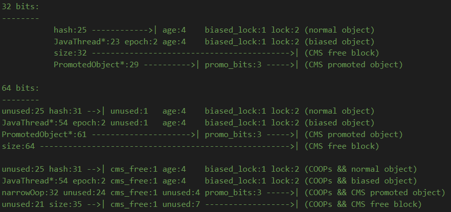
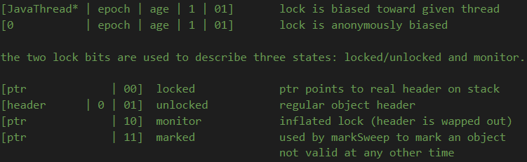

# 探究synchronized实现

在读到《深入理解Java虚拟机》的锁升级部分时，感觉自己没有读透这部分知识点，于是在网上搜索相关文章介绍，但是感觉和书中以及认知中的有出入。所以决定来看看JVM代码中到底是如何实现synchronized的，不过自身知识技术有限，文中出现的错误理解恳请大佬们指出。文中大部分内容参照大佬@[farmerjohngit](https://github.com/farmerjohngit)的[文章](https://github.com/farmerjohngit/myblog/issues/12)，外加一些自己的理解和补充。

## 准备

- JVM源码版本为`jdk8u202-b02`，[地址](http://hg.openjdk.java.net/jdk8u/jdk8u/hotspot/file/9ce27f0a4683)
- 趁手的阅读工具

## synchronized简介

Java中提供了两种实现同步的基础语义：`synchronized`方法和`synchronized`块， 我们来看个demo：

```java
public class SyncTest {
    public void syncBlock(){
        synchronized (this){
            System.out.println("hello block");
        }
    }
    public synchronized void syncMethod(){
        System.out.println("hello method");
    }
}
```

然后我们将其编译为`class`文件，再用`javap -v`命令查看class文件对应的JVM字节码信息，我们只看关键方法：

```java
{
  ··· ···

  public void syncBlock();
    descriptor: ()V
    flags: ACC_PUBLIC
    Code:
      stack=2, locals=3, args_size=1
         0: aload_0
         1: dup
         2: astore_1
         3: monitorenter          // monitorenter指令进入同步块
         4: getstatic     #2                  // Field java/lang/System.out:Ljava/io/PrintStream;
         7: ldc           #3                  // String hello block
         9: invokevirtual #4                  // Method java/io/PrintStream.println:(Ljava/lang/String;)V
        12: aload_1
        13: monitorexit           // monitorexit指令推出同步块
        14: goto          22
        17: astore_2
        18: aload_1
        19: monitorexit           // 异常处理：monitorexit指令退出同步块，保证了使用monitorenter指令进入同步块后一定会使用monitorexit指令退出
        20: aload_2
        21: athrow
        22: return
      Exception table:
         from    to  target type
             4    14    17   any
            17    20    17   any
      LineNumberTable:
        line 3: 0
        line 4: 4
        line 5: 12
        line 6: 22
      StackMapTable: number_of_entries = 2
        frame_type = 255 /* full_frame */
          offset_delta = 17
          locals = [ class SyncTest, class java/lang/Object ]
          stack = [ class java/lang/Throwable ]
        frame_type = 250 /* chop */
          offset_delta = 4

  public synchronized void syncMethod();
    descriptor: ()V
    flags: ACC_PUBLIC, ACC_SYNCHRONIZED    // 添加了ACC_SYNCHRONIZED标记
    Code:
      stack=2, locals=1, args_size=1
         0: getstatic     #2                  // Field java/lang/System.out:Ljava/io/PrintStream;
         3: ldc           #5                  // String hello method
         5: invokevirtual #4                  // Method java/io/PrintStream.println:(Ljava/lang/String;)V
         8: return
      LineNumberTable:
        line 8: 0
        line 9: 8
}
```

对于`synchronized`关键字而言，`javac`在编译时，会生成对应的`monitorenter`和`monitorexit`指令分别对应`synchronized`同步块的进入和退出。第二个`monitorexit`用在异常处理的代码块中，可以看见虽然我们的demo没有做`try-finally`但是编译器为我们隐式的生成了`try-finally`代码，用于保证一定会调用`monitorexit`指令退出。

而对于`synchronized`方法而言，`javac`为其生成了一个`ACC_SYNCHRONIZED`关键字，在JVM进行方法调用时，发现调用的方法被`ACC_SYNCHRONIZED`修饰，则会先尝试获得锁。

### 锁的几种形式

传统的锁（也就是下文要说的重量级锁）依赖于系统的同步函数，在linux上使用`mutex`互斥锁，最底层实现依赖于`futex`，关于`futex`可以看大佬@[farmerjohngit](https://github.com/farmerjohngit)的[文章](https://github.com/farmerjohngit/myblog/issues/8)，这些同步函数都涉及到用户态和内核态的切换、进程的上下文切换，成本较高。对于加了`synchronized`关键字但**运行时并没有多线程竞争，或两个线程接近于交替执行的情况**，使用传统锁机制无疑效率是会比较低的。

在JDK 1.6之前,`synchronized`只有传统的锁机制，因此给开发者留下了`synchronized`关键字相比于其他同步机制性能不好的印象。

在JDK 1.6引入了两种新型锁机制：偏向锁和轻量级锁，它们的引入是为了解决在没有多线程竞争或基本没有竞争的场景下因使用传统锁机制带来的性能开销问题。

在看这几种锁机制的实现前，我们先来了解下对象头，它是实现多种锁机制的基础。

### 对象头

因为在Java中任意对象都可以用作锁，因此必定要有一个映射关系，存储该对象以及其对应的锁信息（比如当前哪个线程持有锁，哪些线程在等待）。一种很直观的方法是，用一个全局map，来存储这个映射关系，但这样会有一些问题：需要对map做线程安全保障，不同的`synchronized`之间会相互影响，性能差；另外当同步对象较多时，该map可能会占用比较多的内存。

所以最好的办法是将这个映射关系存储在对象头中，因为对象头本身也有一些hashcode、GC相关的数据，所以如果能将锁信息与这些信息**共存**在对象头中就好了。

在JVM中，对象在内存中除了本身的数据外还会有个对象头，对于普通对象而言，其对象头中有两类信息：`mark word`和类型指针。另外对于数组而言还会有一份记录数组长度的数据。

类型指针是指向该对象所属类对象的指针，`mark word`用于存储对象的HashCode、GC分代年龄、锁状态等信息。在32位系统上`mark word`长度为32bit，64位系统上长度为64bit。为了能在有限的空间里存储下更多的数据，其存储格式是不固定的，在32位/64位系统上各状态的格式如下：



可以看到锁信息也是存在于对象的`mark word`中的。当对象状态为偏向锁（biasable）时，`mark word`存储的是偏向的线程ID；当状态为轻量级锁（lightweight locked）时，`mark word`存储的是指向线程栈中`Lock Record`的指针；当状态为重量级锁（inflated）时，为指向堆中的monitor对象的指针。

不同类型锁定下的状态信息：




## 偏向锁

### 偏向锁入口

由于synchronized实现是通过插入`monitorenter`和`monitorexit`指令实现的，所以我们需要在源码中找到对`monitorenter`命令解析的地方。在HotSpot的中有两处地方对`monitorenter`指令进行解析：一个是在[bytecodeInterpreter.cpp#1816](http://hg.openjdk.java.net/jdk8u/jdk8u/hotspot/file/9ce27f0a4683/src/share/vm/interpreter/bytecodeInterpreter.cpp#l1816) ，另一个是在[templateTable_x86_64.cpp#3667](http://hg.openjdk.java.net/jdk8u/jdk8u/hotspot/file/9ce27f0a4683/src/cpu/x86/vm/templateTable_x86_64.cpp#l3667)。

前者是JVM中的字节码解释器(`bytecodeInterpreter`)，用C++实现了每条JVM指令（如`monitorenter`、`invokevirtual`等），其优点是实现相对简单且容易理解，缺点是执行慢。后者是模板解释器(`templateInterpreter`)，其对每个指令都写了一段对应的汇编代码，启动时将每个指令与对应汇编代码入口绑定，可以说是效率做到了极致。

在HotSpot中，只用到了模板解释器，字节码解释器根本就没用到，R大的[读书笔记](https://book.douban.com/annotation/31407691/)中说的很清楚了，大家可以看看，这里不再赘述。

所以`montorenter`的解析入口在模板解释器中，其代码位于[templateTable_x86_64.cpp#3667](http://hg.openjdk.java.net/jdk8u/jdk8u/hotspot/file/9ce27f0a4683/src/cpu/x86/vm/templateTable_x86_64.cpp#l3667)。通过调用路径：`templateTable_x86_64#monitorenter`->`interp_masm_x86_64#lock_object`进入到偏向锁入口`macroAssembler_x86#biased_locking_enter`，在这里大家可以看到会生成对应的汇编代码。需要注意的是，不是说每次解析`monitorenter`指令都会调用`biased_locking_enter`,而是只会在JVM启动的时候调用该方法生成汇编代码，之后对指令的解析是通过直接执行汇编代码。

其实`bytecodeInterpreter`的逻辑和`templateInterpreter`的逻辑是大同小异的，因为`templateInterpreter`中都是汇编代码，比较晦涩，所以看`bytecodeInterpreter`的实现会便于理解一点。`templateInterpreter`对比**除了[栈结构](http://hg.openjdk.java.net/jdk8u/jdk8u/hotspot/file/9ce27f0a4683/src/cpu/x86/vm/frame_x86.hpp#l36)不同外，其他逻辑大致相同**，所以下文**就按bytecodeInterpreter中的代码对偏向锁逻辑进行讲解**。`templateInterpreter`的汇编代码讲解可以看这篇[文章](https://zhuanlan.zhihu.com/p/34662715)，其实汇编源码中都有英文注释，了解了汇编几个基本指令的作用再结合注释理解起来也不是很难。

### 偏向锁获取流程

下面开始偏向锁获取流程分析，代码在[bytecodeInterpreter.cpp#1816](http://hg.openjdk.java.net/jdk8u/jdk8u/hotspot/file/9ce27f0a4683/src/share/vm/interpreter/bytecodeInterpreter.cpp#l1816)。**注意本文代码都有所删减**。

```c++
CASE(_monitorenter): {
        // 从栈顶取出对象，该对象就是锁对象
        oop lockee = STACK_OBJECT(-1);
        // derefing's lockee ought to provoke implicit null check
        CHECK_NULL(lockee);
        // code 1:找到一个空闲的Lock Record
        BasicObjectLock* limit = istate->monitor_base();
        BasicObjectLock* most_recent = (BasicObjectLock*) istate->stack_base();
        BasicObjectLock* entry = NULL;
        while (most_recent != limit ) {
          if (most_recent->obj() == NULL) entry = most_recent;
          else if (most_recent->obj() == lockee) break;
          most_recent++;
        }
        // 如果能够找到空闲的Lock Record
        if (entry != NULL) {
          // code 2:将Lock Record的obj指针指向锁对象
          entry->set_obj(lockee);
          int success = false;
          uintptr_t epoch_mask_in_place = (uintptr_t)markOopDesc::epoch_mask_in_place; // epoch 掩码

          markOop mark = lockee->mark(); // 取出对象头中的mark word
          intptr_t hash = (intptr_t) markOopDesc::no_hash;
          // code 3:如果锁对象的mark word为偏向模式 （低三位 = 101）
          if (mark->has_bias_pattern()) {
            uintptr_t thread_ident; // 线程标识
            uintptr_t anticipated_bias_locking_value; // 偏向锁 标识值
            thread_ident = (uintptr_t)istate->thread(); // 线程标识赋值
            // 第一部分 ((uintptr_t)lockee->klass()->prototype_header() | thread_ident)
            //          = 当前线程id + prototype_header中的（epoch + 分代年龄（全为0） + 偏向锁标志 + 锁标志位） 头结构
            // 第二部分 ^ (uintptr_t)mark 将上面计算得到的结果与锁对象的markOop进行异或，相等的位全部被置为0，只剩下不相等的位。
            // 第三部分 & ~((uintptr_t) 将上面异或得到的结果中分代年龄给忽略掉。
            // 总结    当前能够创建出来最新的 偏向当前线程的头结构 与 锁对象头结构的差异位 （不包含 age）
            anticipated_bias_locking_value =
              (((uintptr_t)lockee->klass()->prototype_header() | thread_ident) ^ (uintptr_t)mark) &
              ~((uintptr_t) markOopDesc::age_mask_in_place);
            // code 4:如果偏向的线程是自身且epoch等于class的epoch | 完全一致 这是重入
            if  (anticipated_bias_locking_value == 0) {
              success = true;
            } // code 5:如果锁偏向标志位是不可偏向的则需要撤销偏向
            else if ((anticipated_bias_locking_value & markOopDesc::biased_lock_mask_in_place) != 0) { // 说明类与对象的低三位不一致
              // try revoke bias
              markOop header = lockee->klass()->prototype_header(); // 最新的原型头 （至少不是 偏向的）
              if (hash != markOopDesc::no_hash) {
                header = header->copy_set_hash(hash);
              }
              // 把对象mark word 设置成最新的原型头
              if (Atomic::cmpxchg_ptr(header, lockee->mark_addr(), mark) == mark) {
                if (PrintBiasedLockingStatistics)
                  (*BiasedLocking::revoked_lock_entry_count_addr())++;
              }
            } // code 6:如果epoch不等于class中的epoch，则尝试重偏向
            else if ((anticipated_bias_locking_value & epoch_mask_in_place) !=0) {
              // 构造一个偏向当前线程的mark word （经过上一分支的判断，锁类型已经确定是偏向锁了）
              markOop new_header = (markOop) ( (intptr_t) lockee->klass()->prototype_header() | thread_ident);
              if (hash != markOopDesc::no_hash) {
                new_header = new_header->copy_set_hash(hash);
              }
              // CAS替换对象头的mark word
              if (Atomic::cmpxchg_ptr((void*)new_header, lockee->mark_addr(), mark) == mark) {
                if (PrintBiasedLockingStatistics)
                  (* BiasedLocking::rebiased_lock_entry_count_addr())++;
              } // 重偏向失败，代表存在多线程竞争，则调用monitorenter方法进行锁升级
              else {
                CALL_VM(InterpreterRuntime::monitorenter(THREAD, entry), handle_exception);
              }
              success = true;
            }
            else {
              // code 7:走到这里说明当前要么偏向别的线程，要么是匿名偏向（即没有偏向任何线程）
              // 构建一个匿名偏向的mark word
              markOop header = (markOop) ((uintptr_t) mark & ((uintptr_t)markOopDesc::biased_lock_mask_in_place |
                                                              (uintptr_t)markOopDesc::age_mask_in_place |
                                                              epoch_mask_in_place));
              if (hash != markOopDesc::no_hash) {
                header = header->copy_set_hash(hash);
              }
              // 创建一个偏向当前线程的匿名偏向mark word （其实就是将该对象原本的偏向线程替换成自己）
              markOop new_header = (markOop) ((uintptr_t) header | thread_ident);
              // debugging hint
              DEBUG_ONLY(entry->lock()->set_displaced_header((markOop) (uintptr_t) 0xdeaddead);)
              // 如果原本对象头是匿名偏向就有机会替换成功
              if (Atomic::cmpxchg_ptr((void*)new_header, lockee->mark_addr(), header) == header) {
                if (PrintBiasedLockingStatistics)
                  (* BiasedLocking::anonymously_biased_lock_entry_count_addr())++;
              } // 如果修改失败说明存在多线程竞争 或者 原本是偏向别的线程，所以进入monitorenter方法
              else {
                CALL_VM(InterpreterRuntime::monitorenter(THREAD, entry), handle_exception);
              }
              success = true;
            }
          }

          // code 8:success = false 说明对象一定不是偏向模式的，开始轻量级锁逻辑
          if (!success) {
            // 构造一个无锁状态的Displaced Mark Word，并将Lock Record的lock指向它
            markOop displaced = lockee->mark()->set_unlocked();
            entry->lock()->set_displaced_header(displaced);
            // 如果指定了-XX:+UseHeavyMonitors，则call_vm=true，代表禁用偏向锁和轻量级锁
            bool call_vm = UseHeavyMonitors;
            // 利用CAS将对象头的mark word替换为指向Lock Record的指针 （只有无锁才能设置成功）
            if (call_vm || Atomic::cmpxchg_ptr(entry, lockee->mark_addr(), displaced) != displaced) {
              // 判断是不是锁重入  clear_lock_bits 清除最后两位锁标志位
              if (!call_vm && THREAD->is_lock_owned((address) displaced->clear_lock_bits())) {
                // 如果是重入的话只需要将Lock Record的Displaced Mark Word设置为null，起到一个锁重入计数的作用。
                entry->lock()->set_displaced_header(NULL);
              } else { // 锁升级
                CALL_VM(InterpreterRuntime::monitorenter(THREAD, entry), handle_exception);
              }
            }
          }
          UPDATE_PC_AND_TOS_AND_CONTINUE(1, -1);
        } else {
          // code 9:lock record不够，重新执行
          istate->set_msg(more_monitors);
          UPDATE_PC_AND_RETURN(0); // Re-execute
        }
      }
```

`code 1` `limit`和`most_recent`的含义可参照下图的`interpreter_state.stack_base`和`interpreter_state.stack_base`。这部分的代码目的是从当前线程的栈中找到一个空闲的`Lock Record`（即代码中的BasicObjectLock），判断`Lock Record`是否空闲的依据是看其`obj`字段是否为null。并且这里是按内存地址**从低到高**找到一个`最接近limit 或 拥有该锁对象的Lock Record` 的空闲的 Lock Record。

`code 2` 获取到`Lock Record`后，首先要做的就是为其obj字段赋值指向锁对象。

`code 3` 判断锁对象的`mark word`是否是偏向模式，即低3位是否为101。

`code 4` `anticipated_bias_locking_value == 0` 说明偏向的线程是自身且epoch等于class的epoch，这是重入的场景，除了设置`success = true`外什么都不需要做。

`code 5` `(anticipated_bias_locking_value & markOopDesc::biased_lock_mask_in_place) != 0` 代表class的prototype_header或对象的`mark word`中偏向模式是关闭的，又因为能走到这已经通过了`mark->has_bias_pattern()`判断，即对象的`mark word`中偏向模式是开启的，那也就是说class的prototype_header不是偏向模式，需要撤销锁。

插入介绍一下完成CAS指令的`cmpxchg_ptr`方法第1个参数是预期修改后的值，第2个参数是修改的对象，第3个参数是预期原值，方法返回实际原值，如果等于预期原值则说明修改成功。

这里通过CAS将对象mark work设置成最新的原型头。

`code 6` 如果epoch已过期，则需要重偏向，利用CAS指令将锁对象的`mark word`替换为一个偏向当前线程且epoch为类的epoch的新的`mark word`来实现重偏向。如果CAS失败代表存在多线程竞争，则调用monitorenter方法进行锁升级。最后设置`success = true`。

`code 7` 走到这里说明当前要么偏向别的线程，要么是匿名偏向（即没有偏向任何线程）。然后尝试使用CAS将对象头修改为偏向自身的mark word，如果当前是匿名偏向则能修改成功，否则进入锁升级的逻辑。最后设置`success = true`。

`code 8` 这一步已经是轻量级锁的逻辑了。从上图的`mark word`的格式可以看到，轻量级锁中`mark word`存的是指向`Lock Record`的指针。这里构造一个无锁状态的`mark word`，然后存储到`Lock Record`（`Lock Record`的格式可以看第一篇文章）。设置`mark word`是无锁状态的原因是：轻量级锁解锁时是将对象头的`mark word`设置为`Lock Record`中的`Displaced Mark Word`，所以创建时设置为无锁状态，解锁时直接用CAS替换就好了。

如果对为什么直接将mark word设置成指向`Lock Record`的地址值还能保证低2位为00，存在疑惑的话可以前往轻量级锁章节了解。偏向锁章节就不展开补充了。

`code 9` `Lock Record`不够，重新执行

以上是偏向锁加锁的流程（包括部分轻量级锁的加锁流程），如果`偏向模式关闭`、`当前锁已偏向其他线程`、`获取偏向锁的过程中存在并发冲突`，都会进入到`InterpreterRuntime::monitorenter`方法， 在该方法中会对偏向锁撤销和升级。

### 偏向锁的撤销

这里说的撤销是指在获取偏向锁的过程因为不满足条件导致要将锁对象改为非偏向锁状态；释放是指退出同步块时的过程，释放锁的逻辑会在下一小节阐述。请读者注意本文中**撤销与释放的区别**。

如果获取偏向锁失败会进入到[InterpreterRuntime::monitorenter](http://hg.openjdk.java.net/jdk8u/jdk8u/hotspot/file/9ce27f0a4683/src/share/vm/interpreter/interpreterRuntime.cpp#l608)方法

```c++
IRT_ENTRY_NO_ASYNC(void, InterpreterRuntime::monitorenter(JavaThread* thread, BasicObjectLock* elem))
  ...
  Handle h_obj(thread, elem->obj());
  assert(Universe::heap()->is_in_reserved_or_null(h_obj()),
         "must be NULL or an object");
  if (UseBiasedLocking) {
    // Retry fast entry if bias is revoked to avoid unnecessary inflation
    ObjectSynchronizer::fast_enter(h_obj, elem->lock(), true, CHECK);
  } else {
    ObjectSynchronizer::slow_enter(h_obj, elem->lock(), CHECK);
  }
  ...
IRT_END
```

可以看到如果开启了JVM偏向锁，首先会进入到`ObjectSynchronizer::fast_enter`方法中，如果偏向锁撤销了，那就可以避免不必要的锁膨胀了。

```c++
void ObjectSynchronizer::fast_enter(Handle obj, BasicLock* lock, bool attempt_rebias, TRAPS) {
 if (UseBiasedLocking) {
    if (!SafepointSynchronize::is_at_safepoint()) {
      BiasedLocking::Condition cond = BiasedLocking::revoke_and_rebias(obj, attempt_rebias, THREAD);
      if (cond == BiasedLocking::BIAS_REVOKED_AND_REBIASED) {
        return;
      }
    } else {
      assert(!attempt_rebias, "can not rebias toward VM thread");
      BiasedLocking::revoke_at_safepoint(obj);
    }
    assert(!obj->mark()->has_bias_pattern(), "biases should be revoked by now");
 }

 slow_enter (obj, lock, THREAD) ;
}
```

如果是正常的Java线程，会走上面的逻辑进入到`BiasedLocking::revoke_and_rebias`方法，如果是VM线程则会走到下面的`BiasedLocking::revoke_at_safepoint`。我们主要看`BiasedLocking::revoke_and_rebias`方法。这个方法的主要作用像它的方法名：撤销或者重偏向，第一个参数封装了锁对象和当前线程，第二个参数代表是否允许重偏向，这里是true。

```c++
BiasedLocking::Condition BiasedLocking::revoke_and_rebias(Handle obj, bool attempt_rebias, TRAPS) {
  assert(!SafepointSynchronize::is_at_safepoint(), "must not be called while at safepoint");
    
  markOop mark = obj->mark();
  if (mark->is_biased_anonymously() && !attempt_rebias) {
     // code 1:如果是匿名偏向且attempt_rebias==false会走到这里，如锁对象的hashcode方法被调用会出现这种情况，需要撤销偏向锁。
    markOop biased_value       = mark;
    markOop unbiased_prototype = markOopDesc::prototype()->set_age(mark->age()); // 创建一个非偏向且age和当前对象一致的mark word
    markOop res_mark = (markOop) Atomic::cmpxchg_ptr(unbiased_prototype, obj->mark_addr(), mark); // CAS替换当前对象头中的mark word
    if (res_mark == biased_value) {
      return BIAS_REVOKED; // 替换成功 返回偏向锁撤销
    }
  } else if (mark->has_bias_pattern()) {
    // 锁对象开启了偏向模式会走到这里
    Klass* k = obj->klass();
    markOop prototype_header = k->prototype_header();
    //code 2:如果对应class关闭了偏向模式
    if (!prototype_header->has_bias_pattern()) {
      markOop biased_value       = mark;
      markOop res_mark = (markOop) Atomic::cmpxchg_ptr(prototype_header, obj->mark_addr(), mark);
      assert(!(*(obj->mark_addr()))->has_bias_pattern(), "even if we raced, should still be revoked");
      return BIAS_REVOKED;
    //code 3:如果epoch过期
    } else if (prototype_header->bias_epoch() != mark->bias_epoch()) {
      if (attempt_rebias) { // 如果尝试重偏向 JAVA线程限定
        assert(THREAD->is_Java_thread(), "");
        markOop biased_value       = mark;
        markOop rebiased_prototype = markOopDesc::encode((JavaThread*) THREAD, mark->age(), prototype_header->bias_epoch()); // 创建一个偏向当前线程的对象头
        markOop res_mark = (markOop) Atomic::cmpxchg_ptr(rebiased_prototype, obj->mark_addr(), mark);
        if (res_mark == biased_value) {
          return BIAS_REVOKED_AND_REBIASED;
        }
      } else {
        markOop biased_value       = mark;
        markOop unbiased_prototype = markOopDesc::prototype()->set_age(mark->age()); // 创建一个非偏向的mark word
        markOop res_mark = (markOop) Atomic::cmpxchg_ptr(unbiased_prototype, obj->mark_addr(), mark);
        if (res_mark == biased_value) {
          return BIAS_REVOKED;
        }
      }
    }
  }
  //code 4:批量重偏向与批量撤销的逻辑
  HeuristicsResult heuristics = update_heuristics(obj(), attempt_rebias);
  if (heuristics == HR_NOT_BIASED) {
    return NOT_BIASED;
  } else if (heuristics == HR_SINGLE_REVOKE) {
    //code 5:撤销单个线程
    Klass *k = obj->klass();
    markOop prototype_header = k->prototype_header();
    if (mark->biased_locker() == THREAD &&
        prototype_header->bias_epoch() == mark->bias_epoch()) {
      // 走到这里说明需要撤销的是偏向当前线程的锁，当调用Object#hashcode方法时会走到这一步
      // 因为只要遍历当前线程的栈就好了，所以不需要等到safepoint再撤销。
      ResourceMark rm;
      if (TraceBiasedLocking) {
        tty->print_cr("Revoking bias by walking my own stack:");
      }
      BiasedLocking::Condition cond = revoke_bias(obj(), false, false, (JavaThread*) THREAD);
      ((JavaThread*) THREAD)->set_cached_monitor_info(NULL);
      assert(cond == BIAS_REVOKED, "why not?");
      return cond;
    } else {
      // 下面代码最终会在VM线程中的safepoint调用revoke_bias方法
      VM_RevokeBias revoke(&obj, (JavaThread*) THREAD);
      VMThread::execute(&revoke);
      return revoke.status_code();
    }
  }
  
  assert((heuristics == HR_BULK_REVOKE) ||
         (heuristics == HR_BULK_REBIAS), "?");
   //code6:批量撤销、批量重偏向的逻辑
  VM_BulkRevokeBias bulk_revoke(&obj, (JavaThread*) THREAD,
                                (heuristics == HR_BULK_REBIAS),
                                attempt_rebias);
  VMThread::execute(&bulk_revoke);
  return bulk_revoke.status_code();
}
```

`code 1` 如果是匿名偏向且attempt_rebias==false会走到这里，如锁对象的hashcode方法被调用会出现这种情况，需要撤销偏向锁。首先创建一个非偏向且age和当前对象一致的mark word，随后尝试用CAS替换当前对象头中的mark word，替换成功返回偏向锁撤销，替换失败接批量重偏向与批量撤销的逻辑。

`code 2` 如果对应class关闭了偏向模式，则尝试使用原型头替换对象头。替换成功返回偏向锁撤销，替换失败接批量重偏向与批量撤销的逻辑。

`code 3` 如果epoch过期。`attempt_rebias = true` 则创建一个偏向当前线程的对象头尝试重偏向，否则创建一个非偏向的mark word尝试撤销偏向。CAS失败接批量重偏向与批量撤销的逻辑。

`code 4` 批量重偏向与批量撤销的逻辑，首先会先去更新一下试探算法计数。在该方法中如果对象头不是偏向模式则直接返回头为非偏向模式。如果重偏向锁撤销次数大于等于20(默认)且小于40(默认)且不是第一次批量撤销 且距离上一次批量撤销时间大于 25000ms，则会重置该计数。计数达到40(默认)触发批量撤销，计数达到20(默认)触发批量重偏向，否则则作为单条撤销。(下面批量重偏向和批量撤销小结有详解)

`code 5` 如果要撤销的锁偏向的是当前线程则直接调用`revoke_bias`撤销偏向锁，否则会将该操作push到VM Thread中等到`safepoint`的时候再执行。

关于VM Thread这里介绍下：在JVM中有个专门的VM Thread，该线程会源源不断的从VMOperationQueue中取出请求，比如GC请求。对于需要`safepoint`的操作（VM_Operationevaluate_at_safepoint返回true）必须要等到所有的Java线程进入到`safepoint`才开始执行。 关于`safepoint`可以参考下这篇[文章](https://blog.csdn.net/ITer_ZC/article/details/41892567)。

`code 6` 批量撤销、批量重偏向的逻辑，交给VM Thread去执行。

接下来我们着重分析下`revoke_bias`方法。第一个参数为锁对象，第2、3个参数为都为false

```c++
static BiasedLocking::Condition revoke_bias(oop obj, bool allow_rebias, bool is_bulk, JavaThread* requesting_thread) {
  markOop mark = obj->mark();
  // 如果没有开启偏向模式，则直接返回NOT_BIASED
  if (!mark->has_bias_pattern()) {
    ...
    return BiasedLocking::NOT_BIASED;
  }

  uint age = mark->age();
  // 构建两个mark word，一个是匿名偏向模式（101），一个是无锁模式（001）
  markOop   biased_prototype = markOopDesc::biased_locking_prototype()->set_age(age); // 匿名偏向模式（101）对象头
  markOop unbiased_prototype = markOopDesc::prototype()->set_age(age); // 无锁模式（001）对象头

  ...

  JavaThread* biased_thread = mark->biased_locker();
  if (biased_thread == NULL) {
     // code 1:匿名偏向。当调用锁对象的hashcode()方法可能会导致走到这个逻辑
     // 如果不允许重偏向，则将对象的mark word设置为无锁模式
    if (!allow_rebias) {
      obj->set_mark(unbiased_prototype);
    }
    ...
    return BiasedLocking::BIAS_REVOKED;
  }

  // code 2：判断偏向线程是否还存活
  bool thread_is_alive = false;
  // 如果当前线程就是偏向线程 
  if (requesting_thread == biased_thread) {
    thread_is_alive = true;
  } else {
     // 遍历当前jvm的所有线程，如果能找到，则说明偏向的线程还存活
    for (JavaThread* cur_thread = Threads::first(); cur_thread != NULL; cur_thread = cur_thread->next()) {
      if (cur_thread == biased_thread) {
        thread_is_alive = true;
        break;
      }
    }
  }
  // code 3:如果偏向的线程已经不存活了
  if (!thread_is_alive) {
    // 允许重偏向则将对象mark word设置为匿名偏向状态，否则设置为无锁状态
    if (allow_rebias) {
      obj->set_mark(biased_prototype);
    } else {
      obj->set_mark(unbiased_prototype);
    }
    ...
    return BiasedLocking::BIAS_REVOKED;
  }

  // code 4:线程还存活则遍历线程栈中所有的Lock Record
  GrowableArray<MonitorInfo*>* cached_monitor_info = get_or_compute_monitor_info(biased_thread);
  BasicLock* highest_lock = NULL;
  for (int i = 0; i < cached_monitor_info->length(); i++) {
    MonitorInfo* mon_info = cached_monitor_info->at(i);
    // 如果能找到对应的Lock Record说明偏向的线程还在执行同步代码块中的代码
    if (mon_info->owner() == obj) {
      ...
      // 需要升级为轻量级锁，直接修改偏向线程栈中的Lock Record。为了处理锁重入的case，在这里将Lock Record的Displaced Mark Word设置为null，第一个Lock Record会在下面的代码中再处理
      markOop mark = markOopDesc::encode((BasicLock*) NULL);
      highest_lock = mon_info->lock();
      highest_lock->set_displaced_header(mark);
    } else {
      ...
    }
  }
  if (highest_lock != NULL) {
    // code 5:修改第一个Lock Record为无锁状态，然后将obj的mark word设置为指向该Lock Record的指针
    highest_lock->set_displaced_header(unbiased_prototype);
    obj->release_set_mark(markOopDesc::encode(highest_lock));
    ...
  } else {
    // code 6:走到这里说明偏向线程已经不在同步块中了
    ...
    if (allow_rebias) {
       //设置为匿名偏向状态
      obj->set_mark(biased_prototype);
    } else {
      // 将mark word设置为无锁状态
      obj->set_mark(unbiased_prototype);
    }
  }

  return BiasedLocking::BIAS_REVOKED;
}
```

`code 1` 当前对象头是匿名偏向。当调用锁对象的hashcode()方法可能会导致走到这个逻辑，如果不允许重新偏向，则将对象的mark word设置为无锁模式

`code 2` 判断偏向的线程是否存活。两种情况：当前的线程就是偏向线程；遍历当前jvm的所有线程，如果能找到，则说明偏向的线程还存活；

`code 3` 如果偏向线程已经不存活了。允许重偏向则将对象mark word设置为匿名偏向状态，否则设置为无锁状态。

`code 4` 线程还存活则遍历线程栈中所有的Lock Record。如果能找到对应的Lock Record说明偏向的线程还在执行同步代码块中的代码，需要升级为轻量级锁，直接修改偏向线程栈中的Lock Record。为了处理锁重入的case，在这里将obj指向锁对象的`Lock Record`的`Displaced Mark Word`设置为null，第一个`Lock Record`会在下面的代码中再处理。

`code 5` 修改第一个Lock Record为无锁状态，然后将obj的mark word设置为指向该Lock Record的指针

`code 6` 偏向线程存活但已退出同步块。允许重偏向则将对象mark word设置为匿名偏向状态，否则设置为无锁状态。

需要注意下，当调用锁对象的`Object#hash`或`System.identityHashCode()`方法会导致该对象的偏向锁或轻量级锁升级。这是因为在Java中一个对象的hashcode是在调用这两个方法时才生成的，如果是无锁状态则存放在`mark word`中，如果是重量级锁则存放在对应的monitor中，而偏向锁是没有地方能存放该信息的，所以必须升级。

#### 总结

当进入偏向锁的撤销流程后，只有epoch过期尝试重偏向成功才会直接获取到锁返回，否则都会进入`slow_enter`方法。

### 偏向锁的释放

偏向锁的释放入口在[bytecodeInterpreter.cpp#1923](http://hg.openjdk.java.net/jdk8u/jdk8u/hotspot/file/9ce27f0a4683/src/share/vm/interpreter/bytecodeInterpreter.cpp#l1923)

``` c++
CASE(_monitorexit): {
  oop lockee = STACK_OBJECT(-1);
  CHECK_NULL(lockee);
  // derefing's lockee ought to provoke implicit null check
  // find our monitor slot
  BasicObjectLock* limit = istate->monitor_base();
  BasicObjectLock* most_recent = (BasicObjectLock*) istate->stack_base();
  // 从低往高遍历栈的Lock Record
  while (most_recent != limit ) {
    // 如果Lock Record关联的是该锁对象
    if ((most_recent)->obj() == lockee) {
      BasicLock* lock = most_recent->lock();
      markOop header = lock->displaced_header();
      // 释放Lock Record
      most_recent->set_obj(NULL);
      // 如果是偏向模式，仅仅释放Lock Record就好了。否则要走轻量级锁or重量级锁的释放流程
      if (!lockee->mark()->has_bias_pattern()) {
        bool call_vm = UseHeavyMonitors;
        // header!=NULL说明不是重入，则需要将Displaced Mark Word CAS到对象头的Mark Word
        if (header != NULL || call_vm) {
          if (call_vm || Atomic::cmpxchg_ptr(header, lockee->mark_addr(), lock) != lock) {
            // CAS失败或者是重量级锁则会走到这里，先将obj还原，然后调用monitorexit方法
            most_recent->set_obj(lockee);
            CALL_VM(InterpreterRuntime::monitorexit(THREAD, most_recent), handle_exception);
          }
        }
      }
      //执行下一条命令
      UPDATE_PC_AND_TOS_AND_CONTINUE(1, -1);
    }
    //处理下一条Lock Record
    most_recent++;
  }
  // Need to throw illegal monitor state exception
  CALL_VM(InterpreterRuntime::throw_illegal_monitor_state_exception(THREAD), handle_exception);
  ShouldNotReachHere();
}
```

面的代码结合注释理解起来应该不难，偏向锁的释放很简单，只要将对应`Lock Record`释放就好了，而轻量级锁则需要将`Displaced Mark Word`替换到对象头的mark word中。如果CAS失败或者是重量级锁则进入到`InterpreterRuntime::monitorexit`方法中。该方法会在轻量级与重量级锁的文章中讲解。

### 批量重偏向和批量撤销

批量重偏向和批量撤销的背景可以看上面，相关实现在`BiasedLocking::revoke_and_rebias`中：

``` c++
BiasedLocking::Condition BiasedLocking::revoke_and_rebias(Handle obj, bool attempt_rebias, TRAPS) {
  ...
  //code 1：重偏向的逻辑
  HeuristicsResult heuristics = update_heuristics(obj(), attempt_rebias);
  // 非重偏向的逻辑
  ...
      
  assert((heuristics == HR_BULK_REVOKE) ||
         (heuristics == HR_BULK_REBIAS), "?");  
   //code 2：批量撤销、批量重偏向的逻辑
  VM_BulkRevokeBias bulk_revoke(&obj, (JavaThread*) THREAD,
                                (heuristics == HR_BULK_REBIAS),
                                attempt_rebias);
  VMThread::execute(&bulk_revoke);
  return bulk_revoke.status_code();
}
```

在每次撤销偏向锁的时候都通过`update_heuristics`方法记录下来，以类为单位，当某个类的对象撤销偏向次数达到一定阈值的时候JVM就认为该类不适合偏向模式或者需要重新偏向另一个对象，`update_heuristics`就会返回`HR_BULK_REVOKE`或`HR_BULK_REBIAS`。进行批量撤销或批量重偏向。

先看`update_heuristics`方法。

``` C++
static HeuristicsResult update_heuristics(oop o, bool allow_rebias) {
  markOop mark = o->mark();
  //如果不是偏向模式直接返回
  if (!mark->has_bias_pattern()) {
    return HR_NOT_BIASED;
  }
 
  // 锁对象的类
  Klass* k = o->klass();
  // 当前时间
  jlong cur_time = os::javaTimeMillis();
  // 该类上一次批量撤销的时间
  jlong last_bulk_revocation_time = k->last_biased_lock_bulk_revocation_time();
  // 该类偏向锁撤销的次数
  int revocation_count = k->biased_lock_revocation_count();
  // BiasedLockingBulkRebiasThreshold是重偏向阈值（默认20），BiasedLockingBulkRevokeThreshold是批量撤销阈值（默认40），BiasedLockingDecayTime是开启一次新的批量重偏向距离上次批量重偏向的后的延迟时间，默认25000。也就是开启批量重偏向后，经过了一段较长的时间（>=BiasedLockingDecayTime），撤销计数器才超过阈值，那我们会重置计数器。
  if ((revocation_count >= BiasedLockingBulkRebiasThreshold) &&
      (revocation_count <  BiasedLockingBulkRevokeThreshold) &&
      (last_bulk_revocation_time != 0) &&
      (cur_time - last_bulk_revocation_time >= BiasedLockingDecayTime)) {
    k->set_biased_lock_revocation_count(0);
    revocation_count = 0;
  }

  // 自增撤销计数器
  if (revocation_count <= BiasedLockingBulkRevokeThreshold) {
    revocation_count = k->atomic_incr_biased_lock_revocation_count();
  }
  // 如果达到批量撤销阈值则返回HR_BULK_REVOKE
  if (revocation_count == BiasedLockingBulkRevokeThreshold) {
    return HR_BULK_REVOKE;
  }
  // 如果达到批量重偏向阈值则返回HR_BULK_REBIAS
  if (revocation_count == BiasedLockingBulkRebiasThreshold) {
    return HR_BULK_REBIAS;
  }
  // 没有达到阈值则撤销单个对象的锁
  return HR_SINGLE_REVOKE;
}
```

当达到阈值的时候就会通过VM 线程在`safepoint`调用`bulk_revoke_or_rebias_at_safepoint`, 参数`bulk_rebias`如果是true代表是批量重偏向否则为批量撤销。`attempt_rebias_of_object`代表对操作的锁对象`o`是否运行重偏向，这里是`true`。

``` c++
static BiasedLocking::Condition bulk_revoke_or_rebias_at_safepoint(oop o,
                                                                   bool bulk_rebias,
                                                                   bool attempt_rebias_of_object,
                                                                   JavaThread* requesting_thread) {
  ...
  jlong cur_time = os::javaTimeMillis();
  o->klass()->set_last_biased_lock_bulk_revocation_time(cur_time);


  Klass* k_o = o->klass();
  Klass* klass = k_o;

  if (bulk_rebias) {
    // 批量重偏向的逻辑
    if (klass->prototype_header()->has_bias_pattern()) {
      // 自增前类中的的epoch
      int prev_epoch = klass->prototype_header()->bias_epoch();
      // code 1：类中的epoch自增
      klass->set_prototype_header(klass->prototype_header()->incr_bias_epoch());
      int cur_epoch = klass->prototype_header()->bias_epoch();

      // code 2：遍历所有线程的栈，更新类型为该klass的所有锁实例的epoch
      for (JavaThread* thr = Threads::first(); thr != NULL; thr = thr->next()) {
        GrowableArray<MonitorInfo*>* cached_monitor_info = get_or_compute_monitor_info(thr);
        for (int i = 0; i < cached_monitor_info->length(); i++) {
          MonitorInfo* mon_info = cached_monitor_info->at(i);
          oop owner = mon_info->owner();
          markOop mark = owner->mark();
          if ((owner->klass() == k_o) && mark->has_bias_pattern()) {
            // We might have encountered this object already in the case of recursive locking
            assert(mark->bias_epoch() == prev_epoch || mark->bias_epoch() == cur_epoch, "error in bias epoch adjustment");
            owner->set_mark(mark->set_bias_epoch(cur_epoch));
          }
        }
      }
    }

    // 接下来对当前锁对象进行重偏向
    revoke_bias(o, attempt_rebias_of_object && klass->prototype_header()->has_bias_pattern(), true, requesting_thread);
  } else {
    ...

    // code 3：批量撤销的逻辑，将类中的偏向标记关闭，markOopDesc::prototype()返回的是一个关闭偏向模式的prototype
    klass->set_prototype_header(markOopDesc::prototype());

    // code 4：遍历所有线程的栈，撤销该类所有锁的偏向
    for (JavaThread* thr = Threads::first(); thr != NULL; thr = thr->next()) {
      GrowableArray<MonitorInfo*>* cached_monitor_info = get_or_compute_monitor_info(thr);
      for (int i = 0; i < cached_monitor_info->length(); i++) {
        MonitorInfo* mon_info = cached_monitor_info->at(i);
        oop owner = mon_info->owner();
        markOop mark = owner->mark();
        if ((owner->klass() == k_o) && mark->has_bias_pattern()) {
          revoke_bias(owner, false, true, requesting_thread);
        }
      }
    }

    // 撤销当前锁对象的偏向模式
    revoke_bias(o, false, true, requesting_thread);
  }

  ...
  
  BiasedLocking::Condition status_code = BiasedLocking::BIAS_REVOKED;

  if (attempt_rebias_of_object &&
      o->mark()->has_bias_pattern() &&
      klass->prototype_header()->has_bias_pattern()) {
    // 构造一个偏向请求线程的mark word
    markOop new_mark = markOopDesc::encode(requesting_thread, o->mark()->age(),
                                           klass->prototype_header()->bias_epoch());
    // 更新当前锁对象的mark word
    o->set_mark(new_mark);
    status_code = BiasedLocking::BIAS_REVOKED_AND_REBIASED;
    ...
  }

  ...

  return status_code;
}
```

该方法分为两个逻辑：批量重偏向和批量撤销。

先看批量重偏向，分为两步：

`code 1` 将类中的撤销计数器自增1，之后当该类已存在的实例获得锁时，就会尝试重偏向，相关逻辑在`偏向锁获取流程`小节中。

`code 2` 处理当前正在被使用的锁对象，通过遍历所有存活线程的栈，找到所有正在使用的偏向锁对象，然后更新它们的epoch值。也就是说不会重偏向正在使用的锁，否则会破坏锁的线程安全性。

批量撤销逻辑如下：

`code 3`将类的偏向标记关闭，之后当该类已存在的实例获得锁时，就会升级为轻量级锁；该类新分配的对象的`mark word`则是无锁模式。

`code 4`处理当前正在被使用的锁对象，通过遍历所有存活线程的栈，找到所有正在使用的偏向锁对象，然后撤销偏向锁。


## 轻量级锁

### 轻量级锁获取流程

下面开始轻量级锁获取流程分析，代码在[bytecodeInterpreter.cpp#1816](http://hg.openjdk.java.net/jdk8u/jdk8u/hotspot/file/9ce27f0a4683/src/share/vm/interpreter/bytecodeInterpreter.cpp#l1816)。

```c++
CASE(_monitorenter): {
        ··· ···
        // 上面的代码中出现 偏向已关闭、已偏向其他线程、获取锁时并发冲突都会调用InterpreterRuntime::monitorenter

          // success = false 说明对象一定不是偏向模式的
          if (!success) {
            // 构造一个无锁状态的Displaced Mark Word，并设置到Lock Record的lock中
            markOop displaced = lockee->mark()->set_unlocked();
            entry->lock()->set_displaced_header(displaced);
            // 如果指定了-XX:+UseHeavyMonitors，则call_vm=true，代表禁用偏向锁和轻量级锁
            bool call_vm = UseHeavyMonitors;
            // 利用CAS将对象头的mark word替换为指向Lock Record的指针 （只有无锁才能设置成功）
            if (call_vm || Atomic::cmpxchg_ptr(entry, lockee->mark_addr(), displaced) != displaced) {
              // 判断是不是锁重入  clear_lock_bits 清除最后两位锁标志位
              if (!call_vm && THREAD->is_lock_owned((address) displaced->clear_lock_bits())) {
                // 如果是重入的话只需要将Lock Record的Displaced Mark Word设置为null，起到一个锁重入计数的作用。
                entry->lock()->set_displaced_header(NULL);
              } else { // 锁升级
                CALL_VM(InterpreterRuntime::monitorenter(THREAD, entry), handle_exception);
              }
            }
          }
          UPDATE_PC_AND_TOS_AND_CONTINUE(1, -1);
        } else {
          // lock record不够，重新执行
          istate->set_msg(more_monitors);
          UPDATE_PC_AND_RETURN(0); // Re-execute
        }
      }
```

这段代码的主要逻辑是：将锁对象头设为解锁（最低位设置成1）的值设置到`Lock Record`的`lock`中，这里只是取锁对象头作为模板，并不会改变对象头中的mark word。在未禁用偏向锁和轻量级锁的情况下，尝试用CAS将对象头的mark word替换为指向Lock Record的指针，只有无锁才有可能设置成功（因为无锁的最低位本身就是1所以和displaced一致）。CAS失败或者禁用偏向锁和轻量级锁的场景下，判断是否是重入的情况（即判断去除低两位的锁标志位后的地址是否在栈上且未禁用偏向锁和轻量级锁），如果是重入只需要将`Lock Record`中的`Displaced Mark Word`设置为Null，起到一个锁重入计数的作用。否则不是重入或禁用偏向锁和轻量级锁的场景下进行锁升级。

#### 如何保证Lock Record的地址低2位为00

```c++
class BasicObjectLock VALUE_OBJ_CLASS_SPEC {
  friend class VMStructs;
 private:
  BasicLock _lock;                               // the lock, must be double word aligned
  oop       _obj;                                // object holds the lock;            

 public:
  // Manipulation
  oop      obj() const                                { return _obj;  }
  void set_obj(oop obj)                               { _obj = obj; }
  BasicLock* lock()                                   { return &_lock; }

··· ···
};
```

进入BasicObjectLock（即Lock Record）我们可以看到他拥有两个私有成员：一个是`_lock`，`_lock`中有一个名为`_displaced_header`的成员变量，即`Displaced Mark Word`。这是一个指针，这个指针的值就是`Displaced Mark Word`（野指针）。但是这个值和保证BasicObjectLock（即Lock Record）地址的低两位为00有什么联系呢？

重点在于，`_lock`后面的注释说明必须**双字对齐**。

由于是从16位体系结构扩展成32位的，Intel用术语“**字**”(word)表示16位数据类型。因为，32位数为“**双字**”(double words)，64位数为“**四字**”(quad words)。同时对字、双字、四字来说，自然边界分别是偶数地址、可以**被4整除的地址**、可以被8整除的地址。

因为存在对齐，所以每一个BasicObjectLock（即Lock Record）的起始地址都是可以被4整除的，这就意味着第2位一定是00。

为什么JVM选择在线程栈中添加`Displaced Mark word`为null的`Lock Record`来表示重入计数呢？首先锁重入次数是一定要记录下来的，因为每次解锁都需要对应一次加锁，解锁次数等于加锁次数时，该锁才真正的被释放，也就是在解锁时需要用到说锁重入次数的。一个简单的方案是将锁重入次数记录在对象头的`mark word`中，但`mark word`的大小是有限的，已经存放不下该信息了。另一个方案是只创建一个`Lock Record`并在其中记录重入次数，Hotspot没有这样做的原因我猜是考虑到效率有影响：每次重入获得锁都需要遍历该线程的栈找到对应的`Lock Record`，然后修改它的值。

所以最终Hotspot选择每次获得锁都添加一个`Lock Record`来表示锁的重入。

接下来看看`InterpreterRuntime::monitorenter`方法

```c++
IRT_ENTRY_NO_ASYNC(void, InterpreterRuntime::monitorenter(JavaThread* thread, BasicObjectLock* elem))
  ...
  Handle h_obj(thread, elem->obj());
  assert(Universe::heap()->is_in_reserved_or_null(h_obj()),
         "must be NULL or an object");
  if (UseBiasedLocking) {
    // Retry fast entry if bias is revoked to avoid unnecessary inflation
    ObjectSynchronizer::fast_enter(h_obj, elem->lock(), true, CHECK);
  } else {
    ObjectSynchronizer::slow_enter(h_obj, elem->lock(), CHECK);
  }
  ...
IRT_END
```

`fast_enter`的流程在偏向锁小节已经分析过，如果当前是偏向模式且偏向的线程还在使用锁，那会将锁的`mark word`改为轻量级锁的状态，同时会将偏向的线程栈中的`Lock Record`修改为轻量级锁对应的形式。代码位置在[biasedLocking.cpp#212](http://hg.openjdk.java.net/jdk8u/jdk8u/hotspot/file/9ce27f0a4683/src/share/vm/runtime/biasedLocking.cpp#l212)。

```c++
 // 线程还存活则遍历线程栈中所有的Lock Record
  GrowableArray<MonitorInfo*>* cached_monitor_info = get_or_compute_monitor_info(biased_thread);
  BasicLock* highest_lock = NULL;
  for (int i = 0; i < cached_monitor_info->length(); i++) {
    MonitorInfo* mon_info = cached_monitor_info->at(i);
    // 如果能找到对应的Lock Record说明偏向的线程还在执行同步代码块中的代码
    if (mon_info->owner() == obj) {
      ...
      // 需要升级为轻量级锁，直接修改偏向线程栈中的Lock Record。为了处理锁重入的case，在这里将Lock Record的Displaced Mark Word设置为null，第一个Lock Record会在下面的代码中再处理
      markOop mark = markOopDesc::encode((BasicLock*) NULL);
      highest_lock = mon_info->lock();
      highest_lock->set_displaced_header(mark);
    } else {
      ...
    }
  }
  if (highest_lock != NULL) {
    // 修改第一个Lock Record为无锁状态，然后将obj的mark word设置为指向该Lock Record的指针
    highest_lock->set_displaced_header(unbiased_prototype);
    obj->release_set_mark(markOopDesc::encode(highest_lock));
    ...
  } else {
    ...
  }
```

假定正在使用偏向锁的线程为A，与之发生竞争的线程为B。“乐于助人”的B线程在发现冲突且A线程尚未释放锁后会“贴心”的帮A线程升级为轻量级锁，随后自己进入`slow_enter`方法。

```c++
void ObjectSynchronizer::slow_enter(Handle obj, BasicLock* lock, TRAPS) {
  markOop mark = obj->mark();
  assert(!mark->has_bias_pattern(), "should not see bias pattern here");
  // 判断是否是无锁状态 （低三位 001）
  if (mark->is_neutral()) {
    //设置Displaced Mark Word并替换对象头的mark word
    lock->set_displaced_header(mark);
    if (mark == (markOop) Atomic::cmpxchg_ptr(lock, obj()->mark_addr(), mark)) {
      TEVENT (slow_enter: release stacklock) ;
      return ;
    }
  } else
  if (mark->has_locker() && THREAD->is_lock_owned((address)mark->locker())) {
    assert(lock != mark->locker(), "must not re-lock the same lock");
    assert(lock != (BasicLock*)obj->mark(), "don't relock with same BasicLock");
    // 如果是重入，则设置Displaced Mark Word为null
    lock->set_displaced_header(NULL);
    return;
  }

  ...
  // 走到这一步说明已经是存在多个线程竞争锁了 需要膨胀为重量级锁
  lock->set_displaced_header(markOopDesc::unused_mark());
  ObjectSynchronizer::inflate(THREAD, obj())->enter(THREAD);
}

```

此时如果A线程还为释放锁，则B线程会帮助A线程膨胀到重量级锁，随后进入到重量级锁逻辑。

### 轻量级锁释放流程

```c++
CASE(_monitorexit): {
  oop lockee = STACK_OBJECT(-1);
  CHECK_NULL(lockee);
  // derefing's lockee ought to provoke implicit null check
  // find our monitor slot
  BasicObjectLock* limit = istate->monitor_base();
  BasicObjectLock* most_recent = (BasicObjectLock*) istate->stack_base();
  // 从低往高遍历栈的Lock Record
  while (most_recent != limit ) {
    // 如果Lock Record关联的是该锁对象
    if ((most_recent)->obj() == lockee) {
      BasicLock* lock = most_recent->lock();
      markOop header = lock->displaced_header();
      // 释放Lock Record
      most_recent->set_obj(NULL);
      // 如果是偏向模式，仅仅释放Lock Record就好了。否则要走轻量级锁or重量级锁的释放流程
      if (!lockee->mark()->has_bias_pattern()) {
        bool call_vm = UseHeavyMonitors;
        // header!=NULL说明不是重入，则需要将Displaced Mark Word CAS到对象头的Mark Word
        if (header != NULL || call_vm) {
          if (call_vm || Atomic::cmpxchg_ptr(header, lockee->mark_addr(), lock) != lock) {
            // CAS失败或者是重量级锁则会走到这里，先将obj还原，然后调用monitorexit方法
            most_recent->set_obj(lockee);
            CALL_VM(InterpreterRuntime::monitorexit(THREAD, most_recent), handle_exception);
          }
        }
      }
      //执行下一条命令
      UPDATE_PC_AND_TOS_AND_CONTINUE(1, -1);
    }
    //处理下一条Lock Record
    most_recent++;
  }
  // Need to throw illegal monitor state exception
  CALL_VM(InterpreterRuntime::throw_illegal_monitor_state_exception(THREAD), handle_exception);
  ShouldNotReachHere();
}
```

轻量级锁释放时需要将`Displaced Mark Word`替换到对象头的`mark word`中。如果CAS失败或者是重量级锁则进入到`InterpreterRuntime::monitorexit`方法中。

```c++
//%note monitor_1
IRT_ENTRY_NO_ASYNC(void, InterpreterRuntime::monitorexit(JavaThread* thread, BasicObjectLock* elem))
 
  Handle h_obj(thread, elem->obj());
  ...
  ObjectSynchronizer::slow_exit(h_obj(), elem->lock(), thread);
  //释放Lock Record
  elem->set_obj(NULL);
  ...
IRT_END
```

`monitorexit`调用完`slow_exit`方法后,就释放`Lock Record`。

```c++
void ObjectSynchronizer::slow_exit(oop object, BasicLock* lock, TRAPS) {
  fast_exit (object, lock, THREAD) ;
}
void ObjectSynchronizer::fast_exit(oop object, BasicLock* lock, TRAPS) {
  ...
  markOop dhw = lock->displaced_header();
  markOop mark ;
  if (dhw == NULL) {
     // 重入锁，什么也不做
   	 ...
     return ;
  }

  mark = object->mark() ;

  // 如果是mark word==Displaced Mark Word即轻量级锁，CAS替换对象头的mark word
  if (mark == (markOop) lock) {
     assert (dhw->is_neutral(), "invariant") ;
     if ((markOop) Atomic::cmpxchg_ptr (dhw, object->mark_addr(), mark) == mark) {
        TEVENT (fast_exit: release stacklock) ;
        return;
     }
  }
  //走到这里说明是重量级锁或者解锁时发生了竞争，膨胀后调用重量级锁的exit方法。
  ObjectSynchronizer::inflate(THREAD, object)->exit (true, THREAD) ;
}
```

该方法中先判断是不是轻量级锁（lock也是LockRecord的起始地址），如果是轻量级锁则将替换`mark word`，否则膨胀为重量级锁并调用`exit`方法，相关逻辑将在重量级锁的小节中讲解。


## 重量级锁

### 重量级的膨胀和加锁流程

当出现多个线程同时竞争锁时，会进入到`synchronizer.cpp#slow_enter`方法

```c++
void ObjectSynchronizer::slow_enter(Handle obj, BasicLock* lock, TRAPS) {
  markOop mark = obj->mark();
  assert(!mark->has_bias_pattern(), "should not see bias pattern here");
  // 如果是无锁状态
  if (mark->is_neutral()) {
    lock->set_displaced_header(mark);
    if (mark == (markOop) Atomic::cmpxchg_ptr(lock, obj()->mark_addr(), mark)) {
      TEVENT (slow_enter: release stacklock) ;
      return ;
    }
    // Fall through to inflate() ...
  } else
  // 如果是轻量级锁重入
  if (mark->has_locker() && THREAD->is_lock_owned((address)mark->locker())) {
    assert(lock != mark->locker(), "must not re-lock the same lock");
    assert(lock != (BasicLock*)obj->mark(), "don't relock with same BasicLock");
    lock->set_displaced_header(NULL);
    return;
  }

 ...
 

  // 这时候需要膨胀为重量级锁，膨胀前，设置Displaced Mark Word为一个特殊值，代表该锁正在用一个重量级锁的monitor
  lock->set_displaced_header(markOopDesc::unused_mark());
  //先调用inflate膨胀为重量级锁，该方法返回一个ObjectMonitor对象，然后调用其enter方法
  ObjectSynchronizer::inflate(THREAD, obj())->enter(THREAD);
}
```

在`inflate`中完成膨胀过程。

``` c++
ObjectMonitor * ATTR ObjectSynchronizer::inflate (Thread * Self, oop object) {
  ...

  for (;;) {
      const markOop mark = object->mark() ;
      assert (!mark->has_bias_pattern(), "invariant") ;
    
      // mark是以下状态中的一种：
      // *  Inflated（重量级锁状态）     - 直接返回
      // *  Stack-locked（轻量级锁状态） - 膨胀
      // *  INFLATING（膨胀中）    - 忙等待直到膨胀完成
      // *  Neutral（无锁状态）      - 膨胀
      // *  BIASED（偏向锁）       - 非法状态，在这里不会出现

      // CASE: inflated
      if (mark->has_monitor()) {
          // 已经是重量级锁状态了，直接返回
          ObjectMonitor * inf = mark->monitor() ;
          ...
          return inf ;
      }

      // CASE: inflation in progress
      if (mark == markOopDesc::INFLATING()) {
         // 正在膨胀中，说明另一个线程正在进行锁膨胀，continue重试
         TEVENT (Inflate: spin while INFLATING) ;
         // 在该方法中会进行spin/yield/park等操作完成自旋动作 
         ReadStableMark(object) ;
         continue ;
      }
 
      if (mark->has_locker()) {
          // 当前轻量级锁状态，先分配一个ObjectMonitor对象，并初始化值
          ObjectMonitor * m = omAlloc (Self) ;
          
          m->Recycle();
          m->_Responsible  = NULL ;
          m->OwnerIsThread = 0 ;
          m->_recursions   = 0 ;
          m->_SpinDuration = ObjectMonitor::Knob_SpinLimit ;   // Consider: maintain by type/class
		  // 将锁对象的mark word设置为INFLATING (0)状态 
          markOop cmp = (markOop) Atomic::cmpxchg_ptr (markOopDesc::INFLATING(), object->mark_addr(), mark) ;
          if (cmp != mark) {
             omRelease (Self, m, true) ;
             continue ;       // Interference -- just retry
          }

          // 栈中的displaced mark word
          markOop dmw = mark->displaced_mark_helper() ;
          assert (dmw->is_neutral(), "invariant") ;

          // 设置monitor的字段
          m->set_header(dmw) ;
          // owner为Lock Record
          m->set_owner(mark->locker());
          m->set_object(object);
          ...
          // 将锁对象头设置为重量级锁状态
          object->release_set_mark(markOopDesc::encode(m));

         ...
          return m ;
      }

      // CASE: neutral
  	 
      // 分配以及初始化ObjectMonitor对象
      ObjectMonitor * m = omAlloc (Self) ;
      // prepare m for installation - set monitor to initial state
      m->Recycle();
      m->set_header(mark);
      // owner为NULL
      m->set_owner(NULL);
      m->set_object(object);
      m->OwnerIsThread = 1 ;
      m->_recursions   = 0 ;
      m->_Responsible  = NULL ;
      m->_SpinDuration = ObjectMonitor::Knob_SpinLimit ;       // consider: keep metastats by type/class
	  // 用CAS替换对象头的mark word为重量级锁状态
      if (Atomic::cmpxchg_ptr (markOopDesc::encode(m), object->mark_addr(), mark) != mark) {
          // 不成功说明有另外一个线程在执行inflate，释放monitor对象
          m->set_object (NULL) ;
          m->set_owner  (NULL) ;
          m->OwnerIsThread = 0 ;
          m->Recycle() ;
          omRelease (Self, m, true) ;
          m = NULL ;
          continue ;
          // interference - the markword changed - just retry.
          // The state-transitions are one-way, so there's no chance of
          // live-lock -- "Inflated" is an absorbing state.
      }

      ...
      return m ;
  }
}

```

`inflate`中是一个for循环，主要是为了处理多线程同时调用inflate的情况。然后会根据锁对象的状态进行不同的处理：

1.已经是重量级状态，说明膨胀已经完成，直接返回

2.如果是轻量级锁则需要进行膨胀操作

3.如果是膨胀中状态，则进行忙等待

4.如果是无锁状态则需要进行膨胀操作

其中轻量级锁和无锁状态需要进行膨胀操作，轻量级锁膨胀流程如下：

1.调用`omAlloc`分配一个`ObjectMonitor`对象(以下简称monitor)，在`omAlloc`方法中会先从线程私有的`monitor`集合`omFreeList`中分配对象，如果`omFreeList`中已经没有`monitor`对象，则从JVM全局的`gFreeList`中分配一批`monitor`到`omFreeList`中。

2.初始化`monitor`对象

3.将状态设置为膨胀中（INFLATING）状态

4.设置`monitor`的header字段为`displaced mark word`，owner字段为`Lock Record`，obj字段为锁对象

5.设置锁对象头的`mark word`为重量级锁状态，指向第一步分配的`monitor`对象

无锁状态下的膨胀流程如下：

1.调用`omAlloc`分配一个`ObjectMonitor`对象(以下简称monitor)

2.初始化`monitor`对象

3.设置`monitor`的header字段为` mark word`，owner字段为`null`，obj字段为锁对象

4.设置锁对象头的`mark word`为重量级锁状态，指向第一步分配的`monitor`对象


膨胀完成之后，会调用`enter`方法获得锁

```c++
void ATTR ObjectMonitor::enter(TRAPS) {
   
  Thread * const Self = THREAD ;
  void * cur ;
  // 尝试将_owner设置为当前线程
  cur = Atomic::cmpxchg_ptr (Self, &_owner, NULL) ;
  // owner为null代表无锁状态，如果能CAS设置成功，则当前线程直接获得锁
  if (cur == NULL) {
     ...
     return ;
  }
  // 如果是重入的情况
  if (cur == Self) {
     // TODO-FIXME: check for integer overflow!  BUGID 6557169.
     _recursions ++ ;
     return ;
  }
  // 当前线程是之前持有轻量级锁的线程。由轻量级锁膨胀且第一次调用enter方法，那cur是指向Lock Record的指针
  if (Self->is_lock_owned ((address)cur)) {
    assert (_recursions == 0, "internal state error");
    // 重入计数重置为1
    _recursions = 1 ;
    // 设置owner字段为当前线程（之前owner是指向Lock Record的指针）
    _owner = Self ;
    OwnerIsThread = 1 ;
    return ;
  }

  ...

  // 在调用系统的同步操作之前，先尝试自旋获得锁
  if (Knob_SpinEarly && TrySpin (Self) > 0) {
     ...
     //自旋的过程中获得了锁，则直接返回
     Self->_Stalled = 0 ;
     return ;
  }

  ...

  { 
    ...

    for (;;) {
      jt->set_suspend_equivalent();
      // 在该方法中调用系统同步操作
      EnterI (THREAD) ;
      ...
    }
    Self->set_current_pending_monitor(NULL);
    
  }

  ...

}

```

1. 如果当前是无锁状态、锁重入、当前线程是之前持有轻量级锁的线程则进行简单操作后返回。
2. 先自旋尝试获得锁，这样做的目的是为了减少执行操作系统同步操作带来的开销
3. 调用`EnterI`方法获得锁或阻塞

`EnterI`方法比较长，在看之前，我们先阐述下其大致原理：

一个`ObjectMonitor`对象包括这么几个关键字段：cxq，EntryList ，WaitSet，owner。

其中cxq ，EntryList ，WaitSet都是由ObjectWaiter的链表结构，owner指向持有锁的线程。

当一个线程尝试获得锁时，如果该锁已经被占用，则会将该线程封装成一个`ObjectWaiter`对象插入到cxq的队列的队首，然后调用`park`函数挂起当前线程。在linux系统上，`park`函数底层调用的是gclib库的`pthread_cond_wait`，JDK的`ReentrantLock`底层也是用该方法挂起线程的。

当线程释放锁时，会从cxq或EntryList中挑选一个线程唤醒，被选中的线程叫做`Heir presumptive`即假定继承人（应该是这样翻译），就是图中的`Ready Thread`，假定继承人被唤醒后会尝试获得锁，但`synchronized`是非公平的，所以假定继承人不一定能获得锁（这也是它叫"假定"继承人的原因）。

如果线程获得锁后调用`Object#wait`方法，则会将线程加入到WaitSet中，当被`Object#notify`唤醒后，会将线程从WaitSet移动到cxq或EntryList中去。需要注意的是，当调用一个锁对象的`wait`或`notify`方法时，**如当前锁的状态是偏向锁或轻量级锁则会先膨胀成重量级锁**。

`synchronized`的`monitor`锁机制和JDK的`ReentrantLock`与`Condition`是很相似的，`ReentrantLock`也有一个存放等待获取锁线程的链表，`Condition`也有一个类似`WaitSet`的集合用来存放调用了`await`的线程。如果你之前对`ReentrantLock`有深入了解，那理解起`monitor`应该是很简单。

回到代码上，开始分析`EnterI`方法：

```c++
void ATTR ObjectMonitor::EnterI (TRAPS) {
    Thread * Self = THREAD ;
    ...
    // 尝试获得锁
    if (TryLock (Self) > 0) {
        ...
        return ;
    }

    DeferredInitialize () ;
 
	// 自旋
    if (TrySpin (Self) > 0) {
        ...
        return ;
    }
    
    ...
	
    // 将线程封装成node节点中
    ObjectWaiter node(Self) ;
    Self->_ParkEvent->reset() ;
    node._prev   = (ObjectWaiter *) 0xBAD ;
    node.TState  = ObjectWaiter::TS_CXQ ;

    // 将node节点插入到_cxq队列的头部，cxq是一个单向链表
    ObjectWaiter * nxt ;
    for (;;) {
        node._next = nxt = _cxq ;
        if (Atomic::cmpxchg_ptr (&node, &_cxq, nxt) == nxt) break ;

        // CAS失败的话 再尝试获得锁，这样可以降低插入到_cxq队列的频率
        if (TryLock (Self) > 0) {
            ...
            return ;
        }
    }

	// SyncFlags默认为0，如果没有其他等待的线程，则将_Responsible设置为自己
    if ((SyncFlags & 16) == 0 && nxt == NULL && _EntryList == NULL) {
        Atomic::cmpxchg_ptr (Self, &_Responsible, NULL) ;
    }


    TEVENT (Inflated enter - Contention) ;
    int nWakeups = 0 ;
    int RecheckInterval = 1 ;

    for (;;) {

        if (TryLock (Self) > 0) break ;
        assert (_owner != Self, "invariant") ;

        ...

        // park self
        if (_Responsible == Self || (SyncFlags & 1)) {
            // 当前线程是_Responsible时，调用的是带时间参数的park
            TEVENT (Inflated enter - park TIMED) ;
            Self->_ParkEvent->park ((jlong) RecheckInterval) ;
            // Increase the RecheckInterval, but clamp the value.
            RecheckInterval *= 8 ;
            if (RecheckInterval > 1000) RecheckInterval = 1000 ;
        } else {
            //否则直接调用park挂起当前线程
            TEVENT (Inflated enter - park UNTIMED) ;
            Self->_ParkEvent->park() ;
        }

        if (TryLock(Self) > 0) break ;

        ...
        
        if ((Knob_SpinAfterFutile & 1) && TrySpin (Self) > 0) break ;

       	...
        // 在释放锁时，_succ会被设置为EntryList或_cxq中的一个线程
        if (_succ == Self) _succ = NULL ;

        // Invariant: after clearing _succ a thread *must* retry _owner before parking.
        OrderAccess::fence() ;
    }

   // 走到这里说明已经获得锁了

    assert (_owner == Self      , "invariant") ;
    assert (object() != NULL    , "invariant") ;
  
	// 将当前线程的node从cxq或EntryList中移除
    UnlinkAfterAcquire (Self, &node) ;
    if (_succ == Self) _succ = NULL ;
	if (_Responsible == Self) {
        _Responsible = NULL ;
        OrderAccess::fence();
    }
    ...
    return ;
}
```

主要步骤有3步：

1. 将当前线程插入到cxq队列的队首
2. 然后park当前线程
3. 当被唤醒后再尝试获得锁

这里需要特别说明的是`_Responsible`和`_succ`两个字段的作用：

当竞争发生时，选取一个线程作为`_Responsible`，`_Responsible`线程调用的是有时间限制的`park`方法，其目的是防止出现`搁浅`现象。

`_succ`线程是在线程释放锁是被设置，其含义是`Heir presumptive`，也就是我们上面说的假定继承人。

### 重量级锁的释放

重量级锁释放的代码在`ObjectMonitor::exit`：

```c++
void ATTR ObjectMonitor::exit(bool not_suspended, TRAPS) {
   Thread * Self = THREAD ;
   // 如果_owner不是当前线程
   if (THREAD != _owner) {
     // 当前线程是之前持有轻量级锁的线程。由轻量级锁膨胀后还没调用过enter方法，_owner会是指向Lock Record的指针。
     if (THREAD->is_lock_owned((address) _owner)) {
       assert (_recursions == 0, "invariant") ;
       _owner = THREAD ;
       _recursions = 0 ;
       OwnerIsThread = 1 ;
     } else {
       // 异常情况:当前不是持有锁的线程
       TEVENT (Exit - Throw IMSX) ;
       assert(false, "Non-balanced monitor enter/exit!");
       if (false) {
          THROW(vmSymbols::java_lang_IllegalMonitorStateException());
       }
       return;
     }
   }
   // 重入计数器还不为0，则计数器-1后返回
   if (_recursions != 0) {
     _recursions--;        // this is simple recursive enter
     TEVENT (Inflated exit - recursive) ;
     return ;
   }

   // _Responsible设置为null
   if ((SyncFlags & 4) == 0) {
      _Responsible = NULL ;
   }

   ...

   for (;;) {
      assert (THREAD == _owner, "invariant") ;

      // Knob_ExitPolicy默认为0
      if (Knob_ExitPolicy == 0) {
         // code 1：先释放锁，这时如果有其他线程进入同步块则能获得锁
         OrderAccess::release_store_ptr (&_owner, NULL) ;   // drop the lock
         OrderAccess::storeload() ;                         // See if we need to wake a successor
         // code 2：如果没有等待的线程或已经有假定继承人
         if ((intptr_t(_EntryList)|intptr_t(_cxq)) == 0 || _succ != NULL) {
            TEVENT (Inflated exit - simple egress) ;
            return ;
         }
         TEVENT (Inflated exit - complex egress) ;

         // code 3：要执行之后的操作需要重新获得锁，即设置_owner为当前线程
         if (Atomic::cmpxchg_ptr (THREAD, &_owner, NULL) != NULL) {
            return ;
         }
         TEVENT (Exit - Reacquired) ;
      } 
      ...

      ObjectWaiter * w = NULL ;
      // code 4：根据QMode的不同会有不同的唤醒策略，默认为0
      int QMode = Knob_QMode ;
	 
      if (QMode == 2 && _cxq != NULL) {
          // QMode == 2 : cxq中的线程有更高优先级，直接唤醒cxq的队首线程
          w = _cxq ;
          assert (w != NULL, "invariant") ;
          assert (w->TState == ObjectWaiter::TS_CXQ, "Invariant") ;
          ExitEpilog (Self, w) ;
          return ;
      }

      if (QMode == 3 && _cxq != NULL) {
          // 将cxq中的元素插入到EntryList的末尾
          w = _cxq ;
          for (;;) {
             assert (w != NULL, "Invariant") ;
             ObjectWaiter * u = (ObjectWaiter *) Atomic::cmpxchg_ptr (NULL, &_cxq, w) ;
             if (u == w) break ;
             w = u ;
          }
          assert (w != NULL              , "invariant") ;

          ObjectWaiter * q = NULL ;
          ObjectWaiter * p ;
          for (p = w ; p != NULL ; p = p->_next) {
              guarantee (p->TState == ObjectWaiter::TS_CXQ, "Invariant") ;
              p->TState = ObjectWaiter::TS_ENTER ;
              p->_prev = q ;
              q = p ;
          }

          // Append the RATs to the EntryList
          // TODO: organize EntryList as a CDLL so we can locate the tail in constant-time.
          ObjectWaiter * Tail ;
          for (Tail = _EntryList ; Tail != NULL && Tail->_next != NULL ; Tail = Tail->_next) ;
          if (Tail == NULL) {
              _EntryList = w ;
          } else {
              Tail->_next = w ;
              w->_prev = Tail ;
          }

          // Fall thru into code that tries to wake a successor from EntryList
      }

      if (QMode == 4 && _cxq != NULL) {
          // 将cxq插入到EntryList的队首
          w = _cxq ;
          for (;;) {
             assert (w != NULL, "Invariant") ;
             ObjectWaiter * u = (ObjectWaiter *) Atomic::cmpxchg_ptr (NULL, &_cxq, w) ;
             if (u == w) break ;
             w = u ;
          }
          assert (w != NULL              , "invariant") ;

          ObjectWaiter * q = NULL ;
          ObjectWaiter * p ;
          for (p = w ; p != NULL ; p = p->_next) {
              guarantee (p->TState == ObjectWaiter::TS_CXQ, "Invariant") ;
              p->TState = ObjectWaiter::TS_ENTER ;
              p->_prev = q ;
              q = p ;
          }

          // Prepend the RATs to the EntryList
          if (_EntryList != NULL) {
              q->_next = _EntryList ;
              _EntryList->_prev = q ;
          }
          _EntryList = w ;

          // Fall thru into code that tries to wake a successor from EntryList
      }

      w = _EntryList  ;
      if (w != NULL) {
          // 如果EntryList不为空，则直接唤醒EntryList的队首元素
          assert (w->TState == ObjectWaiter::TS_ENTER, "invariant") ;
          ExitEpilog (Self, w) ;
          return ;
      }

      // EntryList为null，则处理cxq中的元素
      w = _cxq ;
      if (w == NULL) continue ;

      // 因为之后要将cxq的元素移动到EntryList，所以这里将cxq字段设置为null
      for (;;) {
          assert (w != NULL, "Invariant") ;
          ObjectWaiter * u = (ObjectWaiter *) Atomic::cmpxchg_ptr (NULL, &_cxq, w) ;
          if (u == w) break ;
          w = u ;
      }
      TEVENT (Inflated exit - drain cxq into EntryList) ;

      assert (w != NULL              , "invariant") ;
      assert (_EntryList  == NULL    , "invariant") ;


      if (QMode == 1) {
         // QMode == 1 : 将cxq中的元素转移到EntryList，并反转顺序
         ObjectWaiter * s = NULL ;
         ObjectWaiter * t = w ;
         ObjectWaiter * u = NULL ;
         while (t != NULL) {
             guarantee (t->TState == ObjectWaiter::TS_CXQ, "invariant") ;
             t->TState = ObjectWaiter::TS_ENTER ;
             u = t->_next ;
             t->_prev = u ;
             t->_next = s ;
             s = t;
             t = u ;
         }
         _EntryList  = s ;
         assert (s != NULL, "invariant") ;
      } else {
         // QMode == 0 or QMode == 2‘
         // 将cxq中的元素转移到EntryList
         _EntryList = w ;
         ObjectWaiter * q = NULL ;
         ObjectWaiter * p ;
         for (p = w ; p != NULL ; p = p->_next) {
             guarantee (p->TState == ObjectWaiter::TS_CXQ, "Invariant") ;
             p->TState = ObjectWaiter::TS_ENTER ;
             p->_prev = q ;
             q = p ;
         }
      }


      // _succ不为null，说明已经有个继承人了，所以不需要当前线程去唤醒，减少上下文切换的比率
      if (_succ != NULL) continue;

      w = _EntryList  ;
      // 唤醒EntryList第一个元素
      if (w != NULL) {
          guarantee (w->TState == ObjectWaiter::TS_ENTER, "invariant") ;
          ExitEpilog (Self, w) ;
          return ;
      }
   }
}
```

在进行必要的锁重入判断以及自旋优化后，进入到主要逻辑：

`code 1` 设置owner为null，即释放锁，这个时刻其他的线程能获取到锁。这里是一个非公平锁的优化；

`code 2` 如果当前没有等待的线程则直接返回就好了，因为不需要唤醒其他线程。或者如果说succ不为null，代表当前已经有个"醒着的"继承人线程，那当前线程不需要唤醒任何线程；

`code 3` 当前线程重新获得锁，因为之后要操作cxq和EntryList队列以及唤醒线程；

`code 4`根据QMode的不同，会执行不同的唤醒策略；

根据QMode的不同，有不同的处理方式：

1. QMode = 2且cxq非空：取cxq队列队首的ObjectWaiter对象，调用ExitEpilog方法，该方法会唤醒ObjectWaiter对象的线程，然后立即返回，后面的代码不会执行了；
2. QMode = 3且cxq非空：把cxq队列插入到EntryList的尾部；
3. QMode = 4且cxq非空：把cxq队列插入到EntryList的头部；
4. QMode = 0：暂时什么都不做，继续往下看；

只有QMode=2的时候会提前返回，等于0、3、4的时候都会继续往下执行：

1.如果EntryList的首元素非空，就取出来调用ExitEpilog方法，该方法会唤醒ObjectWaiter对象的线程，然后立即返回；
2.如果EntryList的首元素为空，就将cxq的所有元素放入到EntryList中，然后再从EntryList中取出来队首元素执行ExitEpilog方法，然后立即返回；
