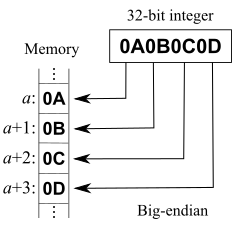
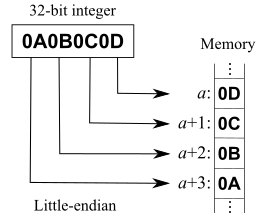

# 字节序

**字节顺序**，又称**端序**或**尾序**（英语：**Endianness**），在[计算机科学](https://zh.wikipedia.org/wiki/计算机科学)领域中，指[电脑内存](https://zh.wikipedia.org/wiki/存储器)中或在数字通信链路中，组成[多字节的字](https://zh.wikipedia.org/wiki/字_(计算机))的[字节](https://zh.wikipedia.org/wiki/字节)的排列顺序。

在几乎所有的机器上，多字节对象都被存储为连续的字节序列。例如在[C语言](https://zh.wikipedia.org/wiki/C语言)中，一个类型为`int`的变量`x`地址为`0x100`，那么其对应地址表达式`&x`的值为`0x100`。且`x`的四个字节将被存储在[电脑内存](https://zh.wikipedia.org/wiki/存储器)的`0x100, 0x101, 0x102, 0x103`位置。[[1\]](https://zh.wikipedia.org/wiki/字节序#cite_note-1)

字节的排列方式有两个通用规则。例如，将一个多位数的低位放在较小的地址处，高位放在较大的地址处，则称**小端序**；反之则称**大端序**。在网络应用中，字节序是一个必须被考虑的因素，因为不同机器类型可能采用不同标准的字节序，所以均按照网络标准转化。

例如假设上述变量`x`类型为`int`，位于地址`0x100`处，它的值为`0x01234567`，地址范围为`0x100~0x103`字节，其内部排列顺序依赖于机器的类型。大端法从首位开始将是：`0x100: 0x01, 0x101: 0x23,..`。而小端法将是：`0x100: 0x67, 0x101: 0x45,..`。

## 大端序

**大端序**（英：big-endian）或称**大尾序**。



- *数据以8bit为单位*:

| *地址增长方向* → |        |        |        |        |       |
| ---------------- | ------ | ------ | ------ | ------ | ----- |
| `...`            | `0x0A` | `0x0B` | `0x0C` | `0x0D` | `...` |

示例中，最高位字节是`0x0A` 存储在最低的内存地址处。下一个字节`0x0B`存在后面的地址处。正类似于十六进制字节从左到右的阅读顺序。

- *数据以16bit为单位*:

| *地址增长方向* → |          |          |       |
| ---------------- | -------- | -------- | ----- |
| `...`            | `0x0A0B` | `0x0C0D` | `...` |

最高的16bit单元`0x0A0B`存储在低位。

## 小端序

**小端序**（英：little-endian）或称**小尾序**。



- *数据以8bit为单位*:

| *地址增长方向* → |        |        |        |        |       |
| ---------------- | ------ | ------ | ------ | ------ | ----- |
| `...`            | `0x0D` | `0x0C` | `0x0B` | `0x0A` | `...` |

最低位字节是`0x0D` 存储在最低的内存地址处。后面字节依次存在后面的地址处。

- *数据以16bit为单位*:

| *地址增长方向* → |          |          |       |
| ---------------- | -------- | -------- | ----- |
| `...`            | `0x0C0D` | `0x0A0B` | `...` |

最低的16bit单元`0x0C0D`存储在低位。

- *更改地址的增长方向*:

当更改地址的增长方向，使之由右至左时，表格更具有可阅读性。

| ← *地址增长方向* |        |        |        |        |       |
| ---------------- | ------ | ------ | ------ | ------ | ----- |
| `...`            | `0x0A` | `0x0B` | `0x0C` | `0x0D` | `...` |

最低有效位（LSB）是`0x0D` 存储在最低的内存地址处。后面字节依次存在后面的地址处。

| ← *地址增长方向* |          |          |       |
| ---------------- | -------- | -------- | ----- |
| `...`            | `0x0A0B` | `0x0C0D` | `...` |

最低的16bit单元`0x0C0D`存储在低位。

## 混合序

**混合序**（英：middle-endian）具有更复杂的顺序。以[PDP-11](https://zh.wikipedia.org/wiki/PDP-11)为例，0x0A0B0C0D被存储为：

- *32bit在PDP-11的存储方式*

| *地址增长方向* → |        |        |        |        |       |
| ---------------- | ------ | ------ | ------ | ------ | ----- |
| `...`            | `0x0B` | `0x0A` | `0x0D` | `0x0C` | `...` |

可以看作高16bit和低16bit以大端序存储，但16bit内部以小端存储。

# 处理器体系

- [x86](https://zh.wikipedia.org/wiki/X86)、[MOS Technology 6502](https://zh.wikipedia.org/wiki/MOS_Technology_6502)、[Z80](https://zh.wikipedia.org/wiki/Z80)、[VAX](https://zh.wikipedia.org/wiki/VAX)、[PDP-11](https://zh.wikipedia.org/wiki/PDP-11)等处理器为小端序；
- [Motorola 6800](https://zh.wikipedia.org/wiki/Motorola_6800)、[Motorola 68000](https://zh.wikipedia.org/wiki/Motorola_68000)、[PowerPC 970](https://zh.wikipedia.org/w/index.php?title=PowerPC_970&action=edit&redlink=1)、[System/370](https://zh.wikipedia.org/w/index.php?title=System/370&action=edit&redlink=1)、[SPARC](https://zh.wikipedia.org/wiki/SPARC)（除V9外）等处理器为大端序；
- [ARM](https://zh.wikipedia.org/wiki/ARM)、[PowerPC](https://zh.wikipedia.org/wiki/PowerPC)（除PowerPC 970外）、[DEC Alpha](https://zh.wikipedia.org/wiki/DEC_Alpha)、[SPARC V9](https://zh.wikipedia.org/wiki/SPARC)、[MIPS](https://zh.wikipedia.org/wiki/MIPS)、[PA-RISC](https://zh.wikipedia.org/wiki/PA-RISC)及[IA64](https://zh.wikipedia.org/wiki/IA64)的字节序是可配置的。

# 网络序

网络传输一般采用大端序，也被称之为**网络字节序**，或**网络序**。[IP](https://zh.wikipedia.org/wiki/IP地址)协议中定义大端序为网络字节序。

[Berkeley套接字](https://zh.wikipedia.org/wiki/Berkeley套接字)定义了一组转换函数，用于16和32bit整数在网络序和**本机字节序**之间的转换。htonl，htons用于本机序转换到网络序；ntohl，ntohs用于网络序转换到本机序。

# Java中的字节序问题

Java 中由于 JVM 的存在,因此Java中的字节序是**大端序(Big-Endian)**.

# byte&0xFF

在看java.io.Bits时发现取byte的数据做拼接时对每一位都&0xFF不太理解。查阅资料后发现&0xFF的作用是过滤JVM类型转换后对补码补位后的值。

demo：

```java
class Test {
    public static void main(String[] args) {
        byte b = -127;
        System.out.println(b);
        System.out.println(b & 0xFF);
    }
}
```

Result:

```java
Connected to the target VM, address: '127.0.0.1:53225', transport: 'socket'
-127
129
Disconnected from the target VM, address: '127.0.0.1:53225', transport: 'socket'

Process finished with exit code 0
```

是不是很奇怪为什么&0xFF以后输出的值反而变了？

我们知道计算机中存储的值为反码。

-127 的反码是 1000 0001。而在JVM中是没有byte类型的所以在使用的时候会有相应的转换，这里由于使用`System.out.println()` 方法直接输出所以转成了int类型。int比byte多了3个字节，而这三个字节不做处理的话值就是错误的了，JVM作了一个补位（按符号位补位）的处理将高位全部填充为1。这样11111111 11111111 111111111 10000001（补码）表达的依旧是-127。

看到这里小伙伴们应该就知道为什么要&0xFF了吧，为的就是保留补位前的二进制值来做位运算。
