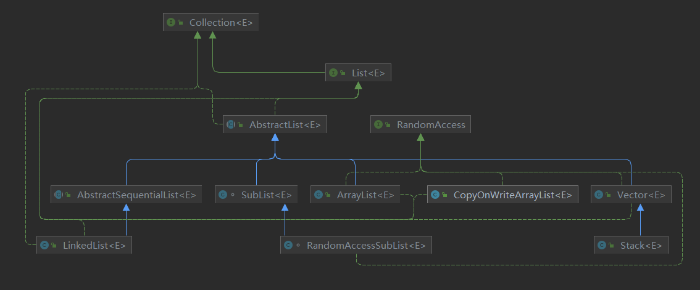
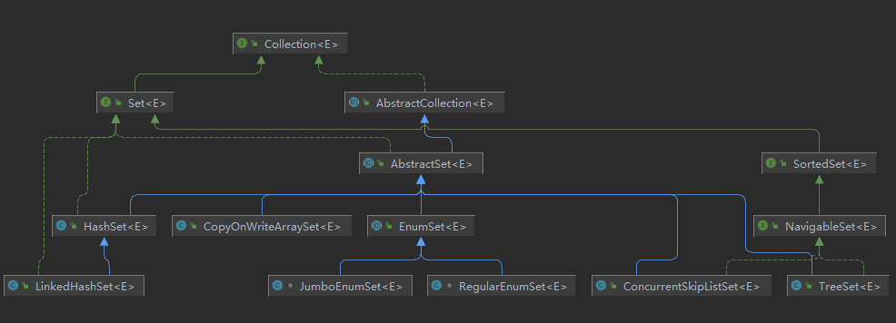
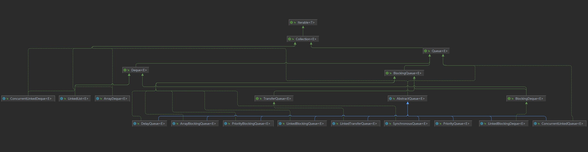
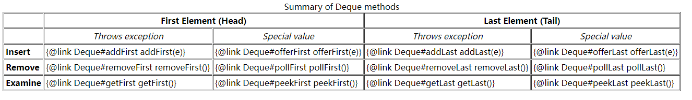
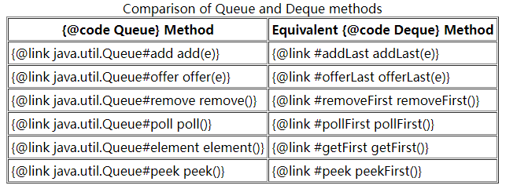
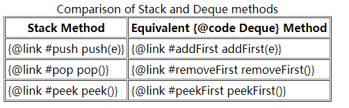
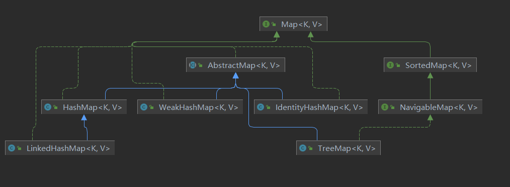

# List

## 继承关系



### ArrayList

- 非同步容器
- 构造时`new ArrayList<?>(0)`容器引用`EMPTY_ELEMENTDATA`； `new ArrayList<?>`容器引用`DEFAULTCAPACITY_EMPTY_ELEMENTDATA`。这两个都是静态的空容器。
  - `public void ensureCapacity(int minCapacity)` 公开扩容方法，如果发现容器引用的是`DEFAULTCAPACITY_EMPTY_ELEMENTDATA`则入参`minCapacity`要求的最小容量小于`DEFAULT_CAPACITY`时不进行扩容
  - `private void ensureCapacityInternal(int minCapacity)`私有扩容方法，如果发现容器引用的是`DEFAULTCAPACITY_EMPTY_ELEMENTDATA`则最小扩容大小为`DEFAULT_CAPACITY`也就是10
- 扩容大小：判断扩大当前容器的一半大小是否满足需求，若该大小不满足需求则将入参最小容量作为扩容的大小，若扩容后的容量大于`MAX_ARRAY_SIZE = Integer.MAX_VALUE - 8`则调用`hugeCapacity(int minCapacity)`最大化容器

- 在`HotSpots`虚拟机中数组的最大容量为`Integer.MAX_VALUE - 8`

## Vector

- 同步容器
- 初始默认容量为10，增长容量若设置为 <= 0，则每次扩容都使得容量翻倍
- 最大容量为`Integer.MAX_VALUE - 8`

# Set

## 继承关系



Set最重要的特点是不允许存在equals相等的元素

## HashSet

- 非同步容器
- 是HashMap的封装，因此不宜设置过大的初始容器大小或过小的填装因子。默认初始容量为16，填装因子为0.75
- 元素的顺序是按照字典序来排列的

## LinkedHashSet

- 继承自HashSet，但是实现是使用`LinkedHashMap`，因此元素可以以插入顺序排列 

## EnumSet

- 不允许null元素，非同步容器
  - 子类`RegularEnumSet`在枚举类大小 <=  64 时使用，使用`long`位映射`枚举.ordinal()`来表示该枚举是否被添加进集合中
  - 子类`JumboEnumSet`在枚举类大小 > 64时使用，使用`long`数组来做映射
  - 以上两个子类中的long映射枚举下标是从低位开始映射的，1为在集合中，0为不在集合。

##  SortedSet

- `subSet` 方法获取到的是左闭右开的区间，可以通过`+  \0`来调整

  - ```java
    // 左闭右闭
    SortedSet<String> sub = s.subSet(low, high+"\0"); 
    // 左开右开
    SortedSet<String> sub = s.subSet(low+"\0", high); 
    ```

## NavigableSet

- 扩展了`SortedSet`，多了lower` ， `floor` ， `ceiling`和`higher等方法
- 还提供了降序的迭代器

## TreeSet

- 是有序Set的实现类，使用的TreeMap

# Queue

## 继承关系



- 基于Collection，定义了倾向于实现带优先级的队列接口
- 定义了三对功能相同，行为不同的方法（前者在执行动作遇到限制时抛出运行时异常，后者在执行动作遇到限制时正常返回）
  - add | offer ：插入一个元素
  - remove  | poll  ： 获取首部元素（移除元素）
  - element | peek ： 获取首部元素（不移除元素）
- 通常不建议实现类实现插入`null` ，一般在peek一个空队列的时候返回null来表示这个队列是空的

## AbstractQueue

- 队列的骨架，在不覆写的情况下默认不支持取出null的元素

## PriorityQueue

- 不支持null元素

- 非同步容器

- 无边界限制的自扩容容器，初始默认大小11，扩容规则：容器小于64则+2；否则扩大一半

- 以数组的形式构造父子节点的关系。x（下标）位置的节点的子节点是2x和2x + 1

- 迭代器读到的顺序和`poll`出来的顺序不一定是一致的

  - ```java
    public static void priorityQueueOrderTest() {
            PriorityQueue<Integer> queue = new PriorityQueue<>(Integer::compareTo);
            queue.add(1);
            queue.add(3);
            queue.add(2);
            System.out.println("iterator:");
            queue.iterator().forEachRemaining(System.out::println);
            System.out.println("poll:");
            System.out.println(queue.poll());
            System.out.println(queue.poll());
            System.out.println(queue.poll());
        }
    
    
    iterator:
    1
    3
    2
    poll:
    1
    2
    3
    ```

  - 同级子节点不要求：左子节点小于等于右子节点，每次需要比较的时候会选择同级子节点中较小的一个节点作为代表。

# Deque

- 继承自`Queue`接口，是一个双端队列接口，能够同时操作首尾两端，可实现FIFO或LIFO
- 与`Queue`相似的针对无限队列一般使用抛出异常的方法，针对有限队列一般正常返回特殊值来表示错误
  - 
- 与`Queue`接口等价的方法
  - 
- 与`Stack`等价的方法
  - 

## ArrayDeque

- 可扩容的非同步双端队列。默认容量为16，最小容量为8，以两倍的大小扩容，最大为2 ^ 30 elements，只有首位指针重叠时才会双倍扩容
- 不允许放入null

## LinkedList

- 同时实现`List`和`Deque`接口，链表实现。

# Map

- Map中的每一个键都是独一无二的，一个键关联一个值。
- 是否允许放入`null`取决于具体的实现类
- `compute()`的接口函数处理的是Map中（可能）存在的`(k, oldV)`；`merge()`的接口函数处理的是Map中（可能）存在的（oldV, newV）

## 继承结构



## HashMap

- 允许`null`key和`null`value存在的非同步容器

- 超过容量 * 填装因子时以两倍的大小扩容，默认容量`1 << 4`:16，最大容量`1 << 30`；默认一个桶中超过8个节点就会进行树化，一旦树化最小的容量为64，当`rehash`时一个桶中的节点数小于6个时会取消树化

- Hash方法：

  - ```java
    (key == null) ? 0 : (h = key.hashCode()) ^ (h >>> 16)
    ```

### tableSizeFor

```
/**
 * Returns a power of two size for the given target capacity.
 */
static final int tableSizeFor(int cap) {
    int n = cap - 1;
    n |= n >>> 1;
    n |= n >>> 2;
    n |= n >>> 4;
    n |= n >>> 8;
    n |= n >>> 16;
    return (n < 0) ? 1 : (n >= MAXIMUM_CAPACITY) ? MAXIMUM_CAPACITY : n + 1;
}
```

核心思想是，先**将最高有效位以及其后的位都变为1**，最后再+1，就进位到前一位变成1，其后所有的满2变0。以此取到最接近入参的最大幂。

### getNode

``` java
	/**
     * Implements Map.get and related methods
     *
     * @param hash hash for key
     * @param key the key
     * @return the node, or null if none
     */
    final Node<K,V> getNode(int hash, Object key) {
        Node<K,V>[] tab; Node<K,V> first, e; int n; K k;
        if ((tab = table) != null && (n = tab.length) > 0 &&
            (first = tab[(n - 1) & hash]) != null) {
            if (first.hash == hash && // always check first node
                ((k = first.key) == key || (key != null && key.equals(k))))
                return first;
            if ((e = first.next) != null) {
                if (first instanceof TreeNode)
                    return ((TreeNode<K,V>)first).getTreeNode(hash, key);
                do {
                    if (e.hash == hash &&
                        ((k = e.key) == key || (key != null && key.equals(k))))
                        return e;
                } while ((e = e.next) != null);
            }
        }
        return null;
    }
```

将按照元素的hashcode散列到对应的桶中，总是检查桶中的第一个节点，若命中则直接返回；不命中则看后继节点是不是树节点，是的话以树的方式获取目标元素，否则从第一个节点开始遍历。

###  putVal

```Java
    /**
     * Implements Map.put and related methods
     *
     * @param hash hash for key
     * @param key the key
     * @param value the value to put
     * @param onlyIfAbsent if true, don't change existing value
     * @param evict if false, the table is in creation mode.
     * @return previous value, or null if none
     */
    final V putVal(int hash, K key, V value, boolean onlyIfAbsent,
                   boolean evict) {
        Node<K,V>[] tab; Node<K,V> p; int n, i;
        // 若容器未被初始化，则初始化容器
        if ((tab = table) == null || (n = tab.length) == 0) 
            n = (tab = resize()).length;
        // 散列的桶为空则直接放入
        if ((p = tab[i = (n - 1) & hash]) == null)
            tab[i] = newNode(hash, key, value, null);
        else {
            Node<K,V> e; K k;
            // 散列的桶不为空，根节点就是目标节点
            if (p.hash == hash &&
                ((k = p.key) == key || (key != null && key.equals(k))))
                e = p;
            else if (p instanceof TreeNode) // 桶中的节点已经树化了
                e = ((TreeNode<K,V>)p).putTreeVal(this, tab, hash, key, value);
            else {
                // 遍历链表查找目标节点
                for (int binCount = 0; ; ++binCount) {
                    if ((e = p.next) == null) {
                        p.next = newNode(hash, key, value, null);
                        // 当达桶到树化门槛（TREEIFY_THRESHOLD = 8）时进行转为红黑树
                        if (binCount >= TREEIFY_THRESHOLD - 1) // -1 for 1st
                            treeifyBin(tab, hash);
                        break;
                    }
                    if (e.hash == hash &&
                        ((k = e.key) == key || (key != null && key.equals(k))))
                        break;
                    p = e;
                }
            }
            if (e != null) { // existing mapping for key
                V oldValue = e.value;
                if (!onlyIfAbsent || oldValue == null)
                    e.value = value;
                afterNodeAccess(e);
                return oldValue;
            }
        }
        ++modCount;
        if (++size > threshold)
            resize();
        afterNodeInsertion(evict);
        return null;
    }
```

### resize

```Java
    /**
     * Initializes or doubles table size.  If null, allocates in
     * accord with initial capacity target held in field threshold.
     * Otherwise, because we are using power-of-two expansion, the
     * elements from each bin must either stay at same index, or move
     * with a power of two offset in the new table.
     *
     * @return the table
     */
    final Node<K,V>[] resize() {
        Node<K,V>[] oldTab = table;
        int oldCap = (oldTab == null) ? 0 : oldTab.length;
        int oldThr = threshold;
        int newCap, newThr = 0;
        if (oldCap > 0) {
            if (oldCap >= MAXIMUM_CAPACITY) {
                threshold = Integer.MAX_VALUE;
                return oldTab;
            }
            else if ((newCap = oldCap << 1) < MAXIMUM_CAPACITY &&
                     oldCap >= DEFAULT_INITIAL_CAPACITY)
                newThr = oldThr << 1; // double threshold
        }
        else if (oldThr > 0) // initial capacity was placed in threshold
            newCap = oldThr;
        else {               // zero initial threshold signifies using defaults
            newCap = DEFAULT_INITIAL_CAPACITY;
            newThr = (int)(DEFAULT_LOAD_FACTOR * DEFAULT_INITIAL_CAPACITY);
        }
        if (newThr == 0) {
            float ft = (float)newCap * loadFactor;
            newThr = (newCap < MAXIMUM_CAPACITY && ft < (float)MAXIMUM_CAPACITY ?
                      (int)ft : Integer.MAX_VALUE);
        }
        threshold = newThr;
        @SuppressWarnings({"rawtypes","unchecked"})
            Node<K,V>[] newTab = (Node<K,V>[])new Node[newCap];
        table = newTab;
        if (oldTab != null) {
            for (int j = 0; j < oldCap; ++j) {
                Node<K,V> e;
                if ((e = oldTab[j]) != null) {
                    oldTab[j] = null;
                    if (e.next == null)
                        newTab[e.hash & (newCap - 1)] = e;
                    else if (e instanceof TreeNode) // 切分树化的节点，取消树化？
                        ((TreeNode<K,V>)e).split(this, newTab, j, oldCap);
                    else { // preserve order
                        Node<K,V> loHead = null, loTail = null;
                        Node<K,V> hiHead = null, hiTail = null;
                        Node<K,V> next;
                        do {
                            next = e.next;
                            // (e.hash & oldCap) == 0 意味着即使容器扩展了，hash结束后还是会被分配到低位的桶
                            if ((e.hash & oldCap) == 0) {
                                if (loTail == null)
                                    loHead = e;
                                else
                                    loTail.next = e;
                                loTail = e;
                            }
                            else {
                                if (hiTail == null)
                                    hiHead = e;
                                else
                                    hiTail.next = e;
                                hiTail = e;
                            }
                        } while ((e = next) != null);
                        if (loTail != null) {
                            loTail.next = null;
                            newTab[j] = loHead;
                        }
                        if (hiTail != null) {
                            hiTail.next = null;
                            newTab[j + oldCap] = hiHead;
                        }
                    }
                }
            }
        }
        return newTab;
    }
```

以两倍的大小扩容容器，扩容到`MAXIMUM_CAPACITY`（1  << 30）为极限，将hash处于高位的元素移动到高位。

### treeifyBin

```java
    /**
     * Replaces all linked nodes in bin at index for given hash unless
     * table is too small, in which case resizes instead.
     */
    final void treeifyBin(Node<K,V>[] tab, int hash) {
        int n, index; Node<K,V> e;
       	// 如果容器的容量没有达到MIN_TREEIFY_CAPACITY（64）的话只会resize
        if (tab == null || (n = tab.length) < MIN_TREEIFY_CAPACITY)
            resize();
        else if ((e = tab[index = (n - 1) & hash]) != null) {
            TreeNode<K,V> hd = null, tl = null;
            // 将单向链表节点替换成树节点，并以双向链表的形式暂存
            do {
                TreeNode<K,V> p = replacementTreeNode(e, null);
                if (tl == null)
                    hd = p;
                else {
                    p.prev = tl;
                    tl.next = p;
                }
                tl = p;
            } while ((e = e.next) != null);
            // 以双向链表节点的头开始树化
            if ((tab[index] = hd) != null)
                hd.treeify(tab);
        }
    }
```

### treeify

```java
        /**
         * Forms tree of the nodes linked from this node.
         * @return root of tree
         */
        final void treeify(Node<K,V>[] tab) {
            TreeNode<K,V> root = null;
            for (TreeNode<K,V> x = this, next; x != null; x = next) {
                next = (TreeNode<K,V>)x.next;
                x.left = x.right = null;
                if (root == null) {
                    x.parent = null;
                    x.red = false;
                    root = x;
                }
                else {
                    K k = x.key;
                    int h = x.hash;
                    Class<?> kc = null;
                    for (TreeNode<K,V> p = root;;) {
                        int dir, ph;
                        K pk = p.key;
                        if ((ph = p.hash) > h)
                            dir = -1;
                        else if (ph < h)
                            dir = 1;
                        // 若key不能用于比较或比较的结果为相等，则使用System.identityHashCode()比较
                        else if ((kc == null &&
                                  (kc = comparableClassFor(k)) == null) ||
                                 (dir = compareComparables(kc, k, pk)) == 0)
                            dir = tieBreakOrder(k, pk);

                        TreeNode<K,V> xp = p;
                        if ((p = (dir <= 0) ? p.left : p.right) == null) {
                            x.parent = xp;
                            if (dir <= 0)
                                xp.left = x;
                            else
                                xp.right = x;
                            root = balanceInsertion(root, x);
                            break;
                        }
                    }
                }
            }
            moveRootToFront(tab, root);
```

将链表转化成红黑树

### untreeify

```java
        /**
         * Returns a list of non-TreeNodes replacing those linked from
         * this node.
         */
        final Node<K,V> untreeify(HashMap<K,V> map) {
            Node<K,V> hd = null, tl = null;
            for (Node<K,V> q = this; q != null; q = q.next) {
                Node<K,V> p = map.replacementNode(q, null);
                if (tl == null)
                    hd = p;
                else
                    tl.next = p;
                tl = p;
            }
            return hd;
        }
```

将树化的节点取消树化，还原成链表

### putTreeVal

```java
        /**
         * Tree version of putVal.
         */
        final TreeNode<K,V> putTreeVal(HashMap<K,V> map, Node<K,V>[] tab,
                                       int h, K k, V v) {
            Class<?> kc = null;
            boolean searched = false;
            // 找到真正的root节点
            TreeNode<K,V> root = (parent != null) ? root() : this;
            for (TreeNode<K,V> p = root;;) {
                int dir, ph; K pk;
                if ((ph = p.hash) > h)
                    dir = -1;
                else if (ph < h)
                    dir = 1;
                else if ((pk = p.key) == k || (k != null && k.equals(pk))) // 当前节点就是目标节点 直接返回
                    return p;
                else if ((kc == null &&
                          (kc = comparableClassFor(k)) == null) ||
                         (dir = compareComparables(kc, k, pk)) == 0) { // key无法比较或者比较的结果是相等
                    if (!searched) {
                        TreeNode<K,V> q, ch;
                        searched = true;
                        //  从左子节点或者右子节点中查找目标key，若找到则直接返回
                        if (((ch = p.left) != null &&
                             (q = ch.find(h, k, kc)) != null) ||
                            ((ch = p.right) != null &&
                             (q = ch.find(h, k, kc)) != null))
                            return q;
                    }
                    dir = tieBreakOrder(k, pk);
                }

                TreeNode<K,V> xp = p;
                if ((p = (dir <= 0) ? p.left : p.right) == null) {
                    // 同时维护了双向链表
                    Node<K,V> xpn = xp.next;
                    TreeNode<K,V> x = map.newTreeNode(h, k, v, xpn);
                    if (dir <= 0)
                        xp.left = x;
                    else
                        xp.right = x;
                    xp.next = x;
                    x.parent = x.prev = xp;
                    if (xpn != null)
                        ((TreeNode<K,V>)xpn).prev = x;
                    // 确保root节点是桶的第一个节点
                    moveRootToFront(tab, balanceInsertion(root, x));
                    return null;
                }
            }
        }
```

### removeTreeNode

```java
        /**
         * Removes the given node, that must be present before this call.
         * This is messier than typical red-black deletion code because we
         * cannot swap the contents of an interior node with a leaf
         * successor that is pinned by "next" pointers that are accessible
         * independently during traversal. So instead we swap the tree
         * linkages. If the current tree appears to have too few nodes,
         * the bin is converted back to a plain bin. (The test triggers
         * somewhere between 2 and 6 nodes, depending on tree structure).
         */
        final void removeTreeNode(HashMap<K,V> map, Node<K,V>[] tab,
                                  boolean movable) {
            int n;
            if (tab == null || (n = tab.length) == 0)
                return;
            int index = (n - 1) & hash;
            TreeNode<K,V> first = (TreeNode<K,V>)tab[index], root = first, rl;
            TreeNode<K,V> succ = (TreeNode<K,V>)next, pred = prev;
            if (pred == null)
                tab[index] = first = succ;
            else
                pred.next = succ;
            if (succ != null)
                succ.prev = pred;
            if (first == null)
                return;
            if (root.parent != null)
                root = root.root();
            // 当树中节点小于2的时候取消树化
            if (root == null || root.right == null ||
                (rl = root.left) == null || rl.left == null) {
                tab[index] = first.untreeify(map);  // too small
                return;
            }
            TreeNode<K,V> p = this, pl = left, pr = right, replacement;
            if (pl != null && pr != null) {
                TreeNode<K,V> s = pr, sl;
                while ((sl = s.left) != null) // find successor 寻找后继节点，后面主要是将后继节点与p也就是当前节点交换
                    s = sl;
                boolean c = s.red; s.red = p.red; p.red = c; // swap colors
                TreeNode<K,V> sr = s.right;
                TreeNode<K,V> pp = p.parent;
                if (s == pr) { // p was s's direct parent
                    p.parent = s;
                    s.right = p;
                }
                else {
                    TreeNode<K,V> sp = s.parent;
                    if ((p.parent = sp) != null) {
                        if (s == sp.left)
                            sp.left = p;
                        else
                            sp.right = p;
                    }
                    if ((s.right = pr) != null)
                        pr.parent = s;
                }
                p.left = null;
                if ((p.right = sr) != null)
                    sr.parent = p;
                if ((s.left = pl) != null)
                    pl.parent = s;
                if ((s.parent = pp) == null)
                    root = s;
                else if (p == pp.left)
                    pp.left = s;
                else
                    pp.right = s;
                if (sr != null)
                    replacement = sr;
                else
                    replacement = p;
            }
            else if (pl != null)
                replacement = pl;
            else if (pr != null)
                replacement = pr;
            else
                replacement = p;
            if (replacement != p) {
                TreeNode<K,V> pp = replacement.parent = p.parent;
                if (pp == null)
                    root = replacement;
                else if (p == pp.left)
                    pp.left = replacement;
                else
                    pp.right = replacement;
                p.left = p.right = p.parent = null;
            }

            TreeNode<K,V> r = p.red ? root : balanceDeletion(root, replacement);

            if (replacement == p) {  // detach
                TreeNode<K,V> pp = p.parent;
                p.parent = null;
                if (pp != null) {
                    if (p == pp.left)
                        pp.left = null;
                    else if (p == pp.right)
                        pp.right = null;
                }
            }
            if (movable)
                moveRootToFront(tab, r);
        }
```

### split

```java
        /**
         * Splits nodes in a tree bin into lower and upper tree bins,
         * or untreeifies if now too small. Called only from resize;
         * see above discussion about split bits and indices.
         *
         * @param map the map
         * @param tab the table for recording bin heads
         * @param index the index of the table being split
         * @param bit the bit of hash to split on
         */
        final void split(HashMap<K,V> map, Node<K,V>[] tab, int index, int bit) {
            TreeNode<K,V> b = this;
            // Relink into lo and hi lists, preserving order
            TreeNode<K,V> loHead = null, loTail = null;
            TreeNode<K,V> hiHead = null, hiTail = null;
            int lc = 0, hc = 0;
            for (TreeNode<K,V> e = b, next; e != null; e = next) {
                next = (TreeNode<K,V>)e.next;
                e.next = null;
                if ((e.hash & bit) == 0) {
                    if ((e.prev = loTail) == null)
                        loHead = e;
                    else
                        loTail.next = e;
                    loTail = e;
                    ++lc;
                }
                else {
                    if ((e.prev = hiTail) == null)
                        hiHead = e;
                    else
                        hiTail.next = e;
                    hiTail = e;
                    ++hc;
                }
            }

            if (loHead != null) {
                if (lc <= UNTREEIFY_THRESHOLD)
                    tab[index] = loHead.untreeify(map);
                else {
                    tab[index] = loHead;
                    if (hiHead != null) // (else is already treeified)
                        loHead.treeify(tab);
                }
            }
            if (hiHead != null) {
                if (hc <= UNTREEIFY_THRESHOLD)
                    tab[index + bit] = hiHead.untreeify(map);
                else {
                    tab[index + bit] = hiHead;
                    if (loHead != null)
                        hiHead.treeify(tab);
                }
            }
        }
```

与resize按照hash的高低重新分配位置类似，因为红黑树维护了双向链表，这里就分成高低两条链表 ，若链表的长度过小则会取消树化。

## LinkedHashMap

- 继承自HashMap，使用双向链表实现Map接口，带来了可预期的顺序
- 非同步容器
- 构造方法` LinkedHashMap(int initialCapacity,float loadFactor,boolean accessOrder)`的accessOrder控制预期顺序：true是access-order（重复插入元素在队尾）；false是insertion-order（重复插入元素位置不变）
