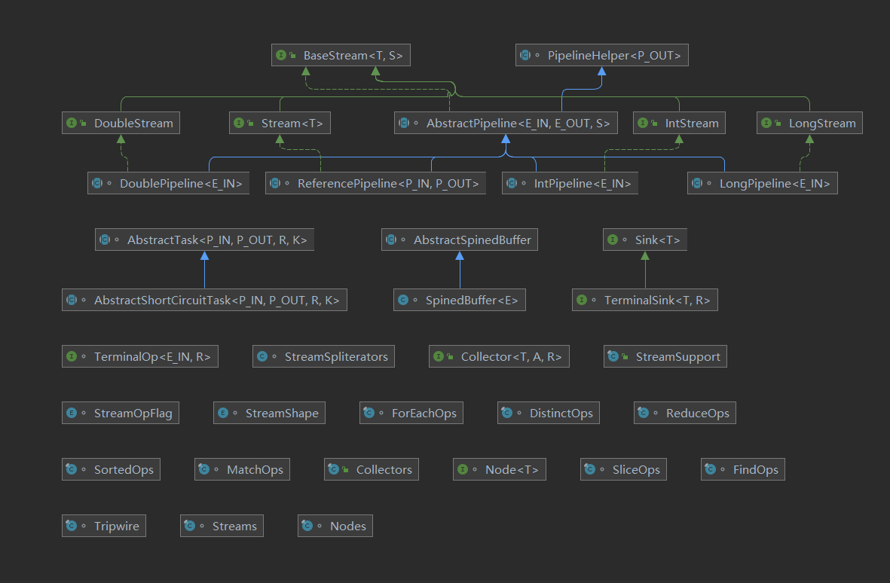
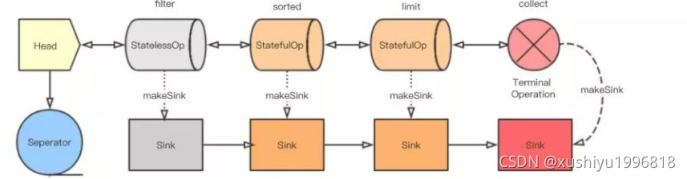
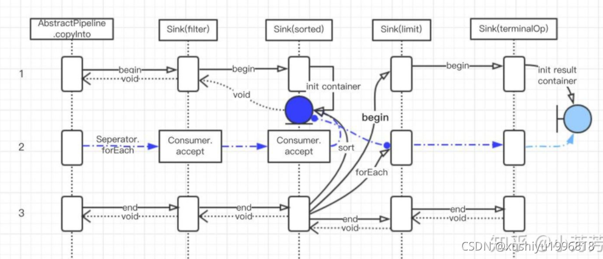

> Streams是懒加载的，只有在终结操作倍初始化后才会在源数据上执行计算，并且只有需要的元素才会被消费使用。

## 流与集合的差异

- 集合
  - 关注其元素的有效管理与访问
- 流
  - 不提供直接访问或操作其元素的手段
  - 关注声明性的描述其源和将在该源上进行聚合的计算操作

##  依赖图



### BaseStream<T, S extends BaseStream<T, S>>

流的顶级接口。是对流元素的封装，屏蔽了直接访问或者操作元素的手段。

- 遍历元素的方法
  - Iterator<T> iterator()
  - Spliterator<T> spliterator()
- 不同的流操作模式
  - S sequential()
  - S parallel()
  - S unordered()
  - S onClose(Runnable closeHandler)
    - 继承自`AutoCloseable`接口，因此有 `close()` 方法，子类实现中需要在`close()`方法中调用closeHandler

### PipelineHelper<P_OUT>

该类描述了整个流流水线，包括初始化阶段，中间操作，终结操作。

### AbstractPipeline<E_IN, E_OUT, S extends BaseStream<E_OUT, S>>

流水线的抽象基类。即整条流水线中每个阶段的基类，链接了上一个阶段与下一个阶段，同时也保存了一个指向首阶段的指针。

### Stream<T> extends BaseStream<T, Stream<T>>

定义了我们熟悉的filter、map、distinct、sorted、reduce、collect等操作方法。

提供了of、empty等静态方法来生成一个流

### ReferencePipeline<P_IN, P_OUT>

提供了`Stream`接口中的基础实现，其中的静态内部类`Head<E_IN, E_OUT> extends ReferencePipeline<E_IN, E_OUT>`作为该抽象类的实现类，与其同级的还有两种抽象操作类`StatelessOp<E_IN, E_OUT> extends ReferencePipeline<E_IN, E_OUT>` 与 `StatefulOp<E_IN, E_OUT> extends ReferencePipeline<E_IN, E_OUT>`。

ReferencePipeline提供的基础实现正是通过覆写两种抽象操作类实现的。

### Sink<T> extends Consumer<T>

水槽，形象的说明了流中的一个阶段：begin()通知水槽，有多少量的水流要来了，做好准备；accept()打开水龙头将水流放入水槽进行操作；end()所有水流处理完毕，打开塞子将水流灌到下一个水槽；

Sink的阶段分类：

- initial state
- active state

initial阶段指在调用begin()前 及 end()后，剩下都处于active阶段

### TerminalOp<E_IN, R>

终结操作接口

- evaluateParallel
- evaluateSequential

## StatelessOp 与 StatefulOp 的区别

- StatelessOp 
  - 无状态操作的Sink接收到通知或者数据，处理完会马上传递给下一个Sink（accept（）方法）
- StatefulOp
  - 有状态操作的Sink则像有一个缓冲区一样，它会等所有数据处理完毕以后才开始一个个的传给下游Sink

## 启动流水线

流水线组装好了，现在就该启动流水线了。这里的核心方法是 wrapAndCopyInto，根据方法名也能看出来这里应该做了两件事，wrapSink() 和 copyInto()。

### wrapSink()

将最后一个节点创建的 Sink 传入，并且看到里面有个 for 循环。
```java
@Override
    @SuppressWarnings("unchecked")
    final <P_IN> Sink<P_IN> wrapSink(Sink<E_OUT> sink) {
        Objects.requireNonNull(sink);

        for ( @SuppressWarnings("rawtypes") AbstractPipeline p=AbstractPipeline.this; p.depth > 0; p=p.previousStage) {
            sink = p.opWrapSink(p.previousStage.combinedFlags, sink);
        }
        return (Sink<P_IN>) sink;
    }
```


每个节点都记录了上一节点的引用( previousStage )和每一个节点的深度(depth )。

所以这个 for 循环是从最后一个节点开始，到第二个节点结束。每一次循环都是将上一节点的 combinedFlags 和当前的 Sink 包起来生成一个新的 Sink 。这和前面拼接各个操作很类似，只不过拼接的是 Sink 的实现类的实例，方向相反。



### `copyInto()`

终于到了要真正开始迭代的时候，这个方法接收两个参数 Sink<P_IN> wrappedSink, Spliterator<P_IN> spliterator 。wrappedSink对应的是Head节点后面的第一个操作节点（它相当于这串 Sink 的头），spliterator 对应着数据源。

这个时候我们回过头看一下 Sink 这个接口，它继承自 Consumer 接口，又定义了begin()、end()、cancellationRequested() 方法。Sink 直译过来是水槽，如果把数据流比作水，那水槽就是水会流过的地方。begin() 用于通知水槽的水要过来了，里面会做一些准备工作，同样 end() 是做一些收尾工作。cancellationRequested() 是原来判断是不是可以停下来了。Consumer 里的accept() 是消费数据的地方。

```java
@Override
    final <P_IN> void copyInto(Sink<P_IN> wrappedSink, Spliterator<P_IN> spliterator) {
        Objects.requireNonNull(wrappedSink);

        if (!StreamOpFlag.SHORT_CIRCUIT.isKnown(getStreamAndOpFlags())) {
            wrappedSink.begin(spliterator.getExactSizeIfKnown());
            spliterator.forEachRemaining(wrappedSink);
            wrappedSink.end();
        }
        else {
            copyIntoWithCancel(wrappedSink, spliterator);
        }
    }
```

有了完整的水槽链，就可以让水流进去了。`copyInto()` 里做了三个动作:

通知第一个水槽（Sink）水要来了，准备一下。

让水流进水槽（Sink）里。

通知第一个水槽（Sink）水流完了，该收尾了。


