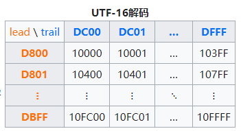
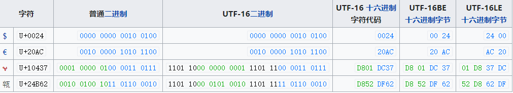
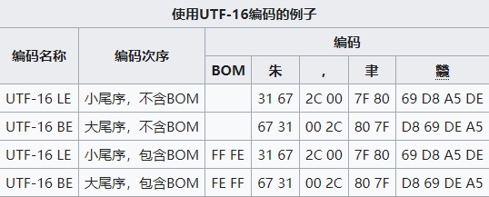

# Unicode 字符编码五层次模型

由[统一码](https://zh.wikipedia.org/wiki/統一碼)和[通用字符集](https://zh.wikipedia.org/wiki/通用字符集)所构成的现代字符编码模型则没有跟从简单字符集的观点。它们将字符编码的概念分为：有哪些字符、它们的[编号](https://zh.wikipedia.org/wiki/编号)、这些[编号](https://zh.wikipedia.org/wiki/编号)如何编码成一系列的“码元”（有限大小的数字）以及最后这些单元如何组成八位字节流。区分这些概念的核心思想是创建一个能够用不同方法来编码的一个通用字符集。为了正确地表示这个模型需要更多比“字符集”和“字符编码”更为精确的术语表示。在Unicode Technical Report (UTR) #17中，现代编码模型分为5个层次，所用的术语列在下面：

1. **抽象字符表**（Abstract character repertoire）是一个系统支持的所有抽象字符的集合。字符表可以是封闭的，即除非创建一个新的标准（ASCII和多数ISO/IEC 8859系列都是这样的例子），否则不允许添加新的符号；字符表也可以是开放的，即允许添加新的符号（统一码和一定程度上[代码页](https://zh.wikipedia.org/wiki/代码页)是这方面的例子）。特定字符表中的字符反映了如何将书写系统分解成线性信息单元的决定。例如拉丁、希腊和斯拉夫字母表分为字母、数字、变音符号、标点和如空格这样的一些少数特殊字符，它们都能按照一种简单的线性序列排列（尽管对它们的处理需要另外的规则，如带有变音符号的字母这样的特定序列如何解释——但这不属于字符表的范畴）。为了方便起见，这样的字符表可以包括预先[编号](https://zh.wikipedia.org/wiki/编号)的[字母](https://zh.wikipedia.org/wiki/字母)和变音符号的组合。其它的书写系统，如阿拉伯语和希伯莱语，由于要适应双向文字和在不同情形下按照不同方式交叉在一起的字形，就使用更为复杂的符号表表示。
2. **编码字符集**（CCS:Coded Character Set）是将字符集{\displaystyle C}中每个字符映射到1个坐标（整数值对：x, y）或者表示为1个非负整数{\displaystyle N}。字符集及码位映射称为编码字符集。例如，在一个给定的字符表中，表示大写拉丁字母“A”的字符被赋予整数65、字符“B”是66，如此继续下去。多个编码字符集可以表示同样的字符表，例如[ISO-8859-1](https://zh.wikipedia.org/wiki/ISO/IEC_8859-1)和IBM的[代码页](https://zh.wikipedia.org/wiki/代码页)037和代码页500含盖同样的字符表但是将字符映射为不同的[整数](https://zh.wikipedia.org/wiki/整数)。由此产生了**编码空间**（encoding space）的概念：简单说就是包含所有字符的表的维度。可以用一对整数来描述，例如：[GB 2312](https://zh.wikipedia.org/wiki/GB_2312)的汉字编码空间是94 x 94。可以用一个整数来描述，例如：ISO-8859-1的编码空间是256。也可以用字符的存储单元尺寸来描述，例如：ISO-8859-1是一个8比特的编码空间。编码空间还可以用其子集来表述，如行、列、面（plane）等。编码空间中的一个位置（position）称为**[码位](https://zh.wikipedia.org/wiki/码位)**（code point）。一个字符所占用的码位称为**码位值**（code point value）。1个编码字符集就是把抽象字符映射为码位值。
3. **字符编码表**（CEF:Character Encoding Form），也称为"storage format"，是将编码字符集的非负整数值（即抽象的码位）转换成有限比特长度的整型值（称为**码元**code units）的序列。这对于定长编码来说是个到自身的映射（null mapping），但对于变长编码来说，该映射比较复杂，把一些码位映射到一个码元，把另外一些码位映射到由多个码元组成的序列。例如，使用16比特长的存储单元保存数字信息，系统每个单元只能够直接表示从0到65,535的数值，但是如果使用多个16位单元就能够表示更大的整数。这就是CEF的作用，它可以把Unicode从0到140万的码空间范围的每个码位映射到单个或多个在0到65,5356范围内的码值。最简单的字符编码表就是单纯地选择足够大的单位，以保证编码字符集中的所有数值能够直接编码（一个码位对应一个码值）。这对于能够用使用八比特组来表示的编码字符集（如多数传统的非CJK的字符集编码）是合理的，对于能够使用十六比特来表示的编码字符集（如早期版本的Unicode）来说也足够合理。但是，随着编码字符集的大小增加（例如，现在的Unicode的字符集至少需要21位才能全部表示），这种直接表示法变得越来越没有效率，并且很难让现有计算机系统适应更大的码值。因此，许多使用新近版本Unicode的系统，或者将Unicode码位对应为可变长度的8位字节序列的[UTF-8](https://zh.wikipedia.org/wiki/UTF-8)，或者将码位对应为可变长度的16位序列的[UTF-16](https://zh.wikipedia.org/wiki/UTF-16)。
4. **字符编码方案**（CES:Character Encoding Scheme），也称作"serialization format"。将定长的整型值（即码元）映射到8位字节序列，以便编码后的数据的文件存储或网络传输。在使用Unicode的场合，使用一个简单的字符来指定字节顺序是[大端序](https://zh.wikipedia.org/wiki/大端序)或者[小端序](https://zh.wikipedia.org/wiki/小端序)（但对于UTF-8来说并不需要专门指明字节序）。然而，有些复杂的字符编码机制（如[ISO/IEC 2022](https://zh.wikipedia.org/wiki/ISO/IEC_2022)）使用控制字符转义序列在几种编码字符集或者用于减小每个单元所用字节数的压缩机制（如[SCSU](https://zh.wikipedia.org/w/index.php?title=SCSU&action=edit&redlink=1)、[BOCU](https://zh.wikipedia.org/w/index.php?title=BOCU&action=edit&redlink=1)和[Punycode](https://zh.wikipedia.org/wiki/Punycode)）之间切换。
5. **传输编码语法**（transfer encoding syntax），用于处理上一层次的字符编码方案提供的字节序列。一般其功能包括两种：一是把字节序列的值映射到一套更受限制的值域内，以满足传输环境的限制，例如Email传输时[Base64](https://zh.wikipedia.org/wiki/Base64)或者[quoted-printable](https://zh.wikipedia.org/wiki/Quoted-printable)，都是把8位的字节编码为7位长的数据；另一是压缩字节序列的值，如[LZW](https://zh.wikipedia.org/wiki/LZW)或者[行程长度编码](https://zh.wikipedia.org/wiki/行程长度编码)等无损压缩技术。

**高层机制**（higher level protocol）提供了额外信息，用于选择Unicode字符的特定变种，如[XML](https://zh.wikipedia.org/wiki/XML)属性xml:lang

**字符映射**（character map）在Unicode中保持了其传统意义：从字符序列到编码后的字节序列的映射，包括了上述的CCS, CEF, CES层次。

# UTF-16

**UTF-16**是[Unicode](https://zh.wikipedia.org/wiki/Unicode)[字符编码五层次模型](https://zh.wikipedia.org/wiki/字符编码#现代编码模型)的第三层：字符编码表（Character Encoding Form，也称为"storage format"）的一种实现方式。即把Unicode字符集的抽象[码位](https://zh.wikipedia.org/wiki/码位)映射为16位长的整数（即[码元](https://zh.wikipedia.org/wiki/码元)）的序列，用于数据存储或传递。Unicode字符的码位，需要1个或者2个16位长的码元来表示，因此这是一个变长表示。

UTF是"Unicode/UCS Transformation Format"的首字母缩写，即把Unicode字符转换为某种格式之意。UTF-16正式定义于[ISO/IEC 10646-1](https://zh.wikipedia.org/wiki/ISO_10646)的附录C，而[RFC](https://zh.wikipedia.org/wiki/RFC)2781也定义了相似的做法。

# UTF-16描述

Unicode的编码空间从U+0000到U+10FFFF，共有1,112,064个码位（code point）可用来映射字符。Unicode的编码空间可以划分为17个平面（plane），每个平面包含216（65,536）个码位。17个平面的码位可表示为从U+xx0000到U+xxFFFF，其中xx表示十六进制值从0016到1016，共计17个平面。第一个平面称为**基本多语言平面**（Basic Multilingual Plane, **BMP**），或称第零平面（Plane 0），其他平面称为**辅助平面**（Supplementary Planes）。基本多语言平面内，从U+D800到U+DFFF之间的码位区段是永久保留不映射到Unicode字符。UTF-16就利用保留下来的0xD800-0xDFFF区块的码位来对辅助平面的字符的码位进行编码。

# 从U+0000至U+D7FF以及从U+E000至U+FFFF的码位

第一个Unicode平面（码位从U+0000至U+FFFF）包含了最常用的字符。该平面被称为基本多语言平面，缩写为*BMP*（Basic Multilingual Plane，BMP）。UTF-16与[UCS-2](https://zh.wikipedia.org/wiki/UCS-2)编码这个范围内的码位为16比特长的单个码元，数值等价于对应的码位。BMP中的这些码位是仅有的可以在UCS-2中表示的码位。

# 从U+10000到U+10FFFF的码位

辅助平面（Supplementary Planes）中的码位，在UTF-16中被编码为**一对**16比特长的码元（即32位，4字节），称作*代理对*（Surrogate Pair），具体方法是：

1. 码位减去 `0x10000`，得到的值的范围为20比特长的 `0...0xFFFFF`。
2. 高位的10比特的值（值的范围为 `0...0x3FF`）被加上 `0xD800` 得到第一个码元或称作高位代理（high surrogate），值的范围是 `0xD800...0xDBFF`。由于高位代理比低位代理的值要小，所以为了避免混淆使用，Unicode标准现在称高位代理为**前导代理**（lead surrogates）。
3. 低位的10比特的值（值的范围也是 `0...0x3FF`）被加上 `0xDC00` 得到第二个码元或称作低位代理（low surrogate），现在值的范围是 `0xDC00...0xDFFF`。由于低位代理比高位代理的值要大，所以为了避免混淆使用，Unicode标准现在称低位代理为**后尾代理**（trail surrogates）。

上述算法可理解为：辅助平面中的码位从U+10000到U+10FFFF，共计FFFFF个，即220=1,048,576个，需要20位来表示。如果用两个16位长的整数组成的序列来表示，第一个整数（称为前导代理）要容纳上述20位的前10位，第二个整数（称为后尾代理）容纳上述20位的后10位。还要能根据16位整数的值直接判明属于前导整数代理的值的范围（210=1024)，还是后尾整数代理的值的范围（也是210=1024）。因此，需要在基本多语言平面中保留不对应于Unicode字符的2048个码位，就足以容纳前导代理与后尾代理所需要的编码空间。这对于基本多语言平面总计65536个码位来说，仅占3.125%。

由于前导代理、后尾代理、BMP中的有效字符的码位，三者互不重叠，搜索是简单的：一个字符编码的一部分不可能与另一个字符编码的不同部分相重叠。这意味着UTF-16是自同步（self-synchronizing）的：可以通过仅检查一个码元来判定给定字符的下一个字符的起始码元。[UTF-8](https://zh.wikipedia.org/wiki/UTF-8)也有类似优点，但许多早期的编码模式就不是这样，必须从头开始分析文本才能确定不同字符的码元的边界。

由于最常有的字符都在基本多文种平面中，许多软件处理代理对的部分往往得不到充分的测试。这导致了一些长期的bug与潜在安全漏洞，它们甚至存在于广为流行且评价颇高的应用软件中[[1\]](https://zh.wikipedia.org/wiki/UTF-16#cite_note-1)。



# 从U+D800到U+DFFF的码位

Unicode标准规定U+D800...U+DFFF的值不对应于任何字符。

但是在使用UCS-2的时代，U+D800...U+DFFF内的值被占用，用于某些字符的映射。但只要不构成代理对，许多UTF-16编码解码还是能把这些不符合Unicode标准的字符映射正确的辨识、转换成合规的码元[[2\]](https://zh.wikipedia.org/wiki/UTF-16#cite_note-2)。按照Unicode标准，这种码元序列本来应算作编码错误。

# 示例：

以U+10437编码（𐐷）为例:

1. `0x10437` 减去 `0x10000`，结果为`0x00437`，二进制为 `0000 0000 0100 0011 0111`
2. 分割它的上10位值和下10位值（使用二进制）：`0000 0000 01` 和 `00 0011 0111`
3. 添加 `0xD800` 到上值，以形成高位：`0xD800 + 0x0001 = 0xD801`
4. 添加 `0xDC00` 到下值，以形成低位：`0xDC00 + 0x0037 = 0xDC37`

- 下表总结了一起示例的转换过程，颜色指示码点位如何分布在所述的UTF-16中。由UTF-16编码过程中加入附加位的以黑色显示。



# UTF-16的编码模式

UTF-16的大尾序和小尾序存储形式都在用。一般来说，以[Macintosh](https://zh.wikipedia.org/wiki/Macintosh)制作或存储的文字使用大尾序格式，以[Microsoft](https://zh.wikipedia.org/wiki/Microsoft)或[Linux](https://zh.wikipedia.org/wiki/Linux)制作或存储的文字使用小尾序格式。

为了弄清楚UTF-16文件的大小尾序，在UTF-16文件的开首，都会放置一个U+FEFF字符作为[Byte Order Mark](https://zh.wikipedia.org/wiki/位元組順序記號)（UTF-16 LE以 `FF FE` 代表，UTF-16 BE以 `FE FF` 代表），以显示这个文本文件是以UTF-16编码，其中U+FEFF字符在UNICODE中代表的意义是 `ZERO WIDTH NO-BREAK SPACE`，顾名思义，它是个没有宽度也没有断字的空白。

以下的例子有四个字符：“朱”（U+6731）、半角逗号（U+002C）、“聿”（U+807F）、“𪚥”（U+2A6A5）。



# UTF-16与UCS-2的关系

UTF-16可看成是UCS-2的[父集](https://zh.wikipedia.org/wiki/父集)。在没有[辅助平面字符](https://zh.wikipedia.org/wiki/Unicode字符平面映射)（surrogate code points）前，UTF-16与UCS-2所指的是同一的意思。但当引入辅助平面字符后，就称为UTF-16了。现在若有软件声称自己支持UCS-2编码，那其实是暗指它不能支持在UTF-16中超过2字节的字集。对于小于0x10000的UCS码，UTF-16编码就等于UCS码。

## Microsoft Windows操作系统内核对Unicode的支持

Windows操作系统内核中的字符表示为UTF-16小尾序，可以正确处理、显示以4字节存储的字符。但是Windows API实际上仅能正确处理UCS-2字符，即仅以2字节存储的，码位小于U+FFFF的Unicode字符。其根源是Microsoft C++语言把 `wchar_t` 数据类型定义为16比特的unsigned short，这就与一个 `wchar_t` 型变量对应一个[宽字符](https://zh.wikipedia.org/wiki/宽字符)、可以存储一个Unicode字符的规定相矛盾。相反，Linux平台的GCC编译器规定一个 `wchar_t` 是4字节长度，可以存储一个UTF-32字符，宁可浪费了很大的存储空间。下例运行于Windows平台的C++程序可说明此点：

```c
// 此源文件在Windows平台上必须保存为Unicode格式（即UTF-16小尾）
// 因为包含的汉字“𪚥”，不能在简体中文版Windows默认的代码页936（即GBK）中表示
// 该汉字在UTF-16小尾序中用4个字节表示
// Windows操作系统能正确显示这样的在UTF-16需用4字节表示的字符
// 但是Windows API不能正确处理这样的在UTF-16需用4字节表示的字符，把它判定为2个UCS-2字符

#include <windows.h>
int main()
{
	const wchar_t lwc[] = L"𪚥";

	MessageBoxW(NULL, lwc, lwc, MB_OK);

	int i = wcslen(lwc);
	printf("%d\n", i);
	int j = lstrlenW(lwc);
	printf("%d\n", j);

	return 0;
}
```

[Windows 9x系统](https://zh.wikipedia.org/wiki/Windows_9x)的API仅支持ANSI字符集，只支持部分的UCS-2转换。1996年发布的[Windows NT 4.0](https://zh.wikipedia.org/wiki/Windows_NT_4.0)的API支持UCS-2。[Windows 2000](https://zh.wikipedia.org/wiki/Windows_2000)开始，Windows系统API开始支持UTF-16，并支持Surrogate Pair；但许多系统控件比如文本框和label等还不支持surrogate pair表示的字符，会显示成两个字符。[Windows 7](https://zh.wikipedia.org/wiki/Windows_7)及更新的系统已经良好地支持了UTF-16，包括Surrogate Pair。

Windows API支持在UTF-16LE（`wchar_t`类型）与UTF-8（代码页CP_UTF8）之间的转码。例如：

```c
#include <windows.h>
int main() {
	char a1[128], a2[128] = { "Hello" };
	wchar_t w = L'页';
	int n1, n2= 5;
	wchar_t w1[128];
	int m1 = 0;

	n1 = WideCharToMultiByte(CP_UTF8, 0, &w, 1, a1, 128, NULL, NULL);
	m1 = MultiByteToWideChar(CP_UTF8, 0, a2, n2, w1, 128);
}
```

