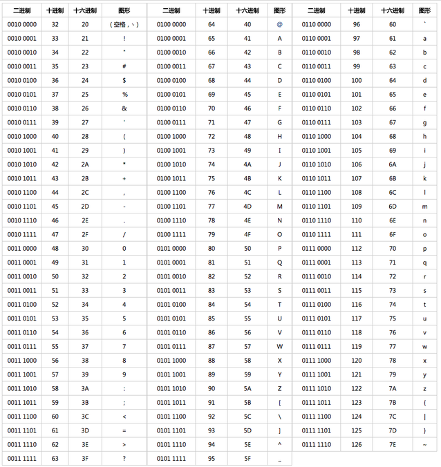
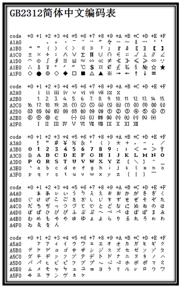
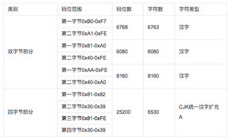
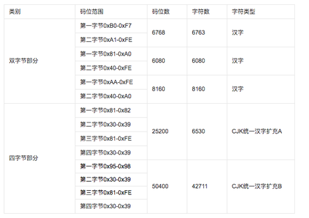
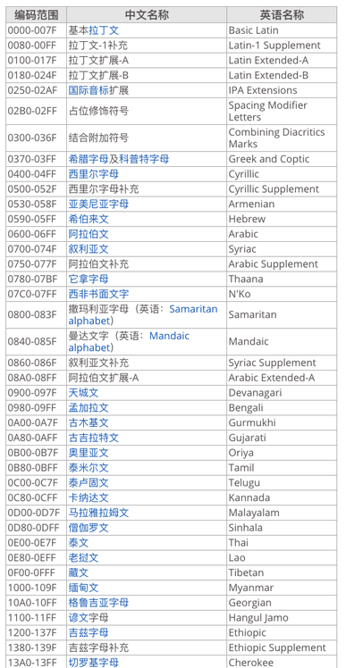

# 字符集和字符编码：ASCII、GB18030、Unicode、UTF-8

> 只要你是做软件开发的，就肯定听说过ASCII、Unicode、UTF-8、GBK这些字符编码，而且字符编码时刻与我们开发相关联。
>
> 它们之间到底有什么区别？为什么会有这么多字符编码？这篇文章我们来看一下它们之间的的关系以及区别。

# 概念

在开始之前，作为程序员，我希望大家能够先理清楚两个概念：**字符集、字符编码**。

很多人搞不清楚这两者的关系与区别，以至于对于字符编码方面的知识了解不深，甚至混乱。

## 字符集

平时我们生活中使用的文字、标点符号、图形符号、数字，这些可以统称为**字符**。

由非常多个字符组合后产生的集合，这个集合称为**字符集**。

也就是说，我们可以人为的根据某个规则归纳一些我们使用的文字、符号，这些文字、符号的集合就称为一个字符集，并且可以根据不同的规则划分不同的字符集。

## 字符编码

那字符编码是什么？

我们知道计算机内部使用的是二进制运算，如果要想让计算机识别我们人类的文字、符号、数字，就需要一个转换规则，把我们人类使用的这些字符转换成计算机认识的二进制，也就是0和1。

这个转换的规则就称为**字符编码**。

# ASCII

## ASCII字符集

由于计算机是美国人发明的，所以最初让计算机为人类工作时，只需让计算机能够识别英文字符即可，所以美国人发明出了ASCII字符集。

ASCII字符集包括可显示字符（英文大小写字符、阿拉伯数字和西文符号）和控制字符（回车键、退格、换行键等）。

## ASCII字符编码

美国人划分好了一个字符集，想让计算机能够识别，怎么办？

此时就需要一套规则，能够把每个字符转换成二进制码位，所以出现了ASCII字符编码规则，这个规则使用8位表示一个字符，共256个字符。

下图展示了部分字符到数字码位编码的规则：

[ASCII字符编码](https://kaito-blog-1253469779.cos.ap-beijing.myqcloud.com/1527575706.png?imageMogr2/thumbnail/!70p)

ASCII字符集最大的缺点就是只能显示26个基本拉丁字母、阿拉伯数字和英式的标点符号，因此只能用于显示现代美国英语。

# GB2312

## GB2312字符集

随着计算机的普及，当中国也有了计算机时，为了可以让计算机显示中文，我们必须也设计一套字符集，以便于计算机显示。

所以就收集收录了中国大陆使用频率最高的的汉字集合，这个集合叫做GB2312字符集。注意，GB2312字符集是不包含繁体和古汉语等方面出现的罕见字的。

GB2312字符集全称《信息交换用汉字编码字符集·基本集》，由中国国家标准总局发布，1981年5月1日开始实施。

## GB2312字符编码

有了GB2312字符集，同样就需要制定一种转换规则，这个规则就是GB2312字符编码。

GB2312字符编码规则：把ASCII字符编码127号之后的奇异符号去掉后，并规定小于127的字符意义与原来相同（兼容ASCII字符编码），但2个大于127的字符连在一起，就表示一个汉字，前面的一个字节（他称之为高字节）从`0xA1`用到`0xF7`，后面一个字节（低字节）从`0xA1`到`0xFE`。

这样就可以组合出大约7000多个简体汉字了，在这些编码里，还把数学符号、罗马希腊的字母、日文的假名们都编进去了，连在ASCII里本来就有的数字、标点、字母都统统重新编了两个字节长的编码，这就是常说的“全角”字符，而原来在127号以下的那些就叫”半角“字符了。

GB2312字符编码表的开始部分：

[GB2312字符编码表的开始部分](https://kaito-blog-1253469779.cos.ap-beijing.myqcloud.com/1527593901.png?imageMogr2/thumbnail/!70p)

# GBK

## GBK字符集

由于GB2312字符集只包含常用的简体汉字，对于繁体汉字和一些罕见字是不支持的，于是为了扩展，又发展出了**GBK字符集**。

GBK字符集完全兼容GB2312字符集，`K`表示对GB2312扩展的意思，这个字符集纳入了对繁体汉字和罕见字符的支持。

## GBK字符编码

GBK字符编码与GB2312字符编码方式相同，只是对其进行了扩展。

但GBK字符编码并非国家标准，只是曾由国家技术监督局标准化司、电子工业部科技与质量监督司公布为”技术规范指导性文件”。也就是说它只是一个行业标准。

# GB18030

## GB18030字符集

随着计算机在中国的逐渐发展，中国又对汉字字符集进行了修正，完全兼容GB2312和GBK字符集，纳入中国国内少数民族的文字，且收录了日韩汉字，是目前为止最全面的汉字字符集，这个字符集就是**GB18030字符集**。

GB18030字符集全称：国家标准GB18030-2005《信息技术 中文编码字符集》，是中华人民共和国现时最新的内码字集，是GB18030-2000《信息技术 信息交换用汉字编码字符集 基本集的扩充》的修订版。

## GB18030字符编码

GB18030字符编码采用多字节编码方式，每个字可以由1个、2个或4个字节组成。

GB18030字符编码有2个版本：

1、GB18030-2000：2000年发布，GBK的取代版本，它的主要特点是在GBK基础上增加了CJK统一汉字扩充A的汉字。

GB18030-2000编码方式如下图：

2、GB18030-2005：2005年发布，在GB18030-2000基础上增加了CJK统一汉字扩充B的汉字。

GB18030-2005编码方式如下图：

如果你只需要使用中文字符集，那么选用GB18030字符编码基本能满足你的需求。

# Unicode

## Unicode字符集

在中国发展出以上字符集合字符编码的同时，计算机也在世界各个国家迅速普及和发展着，每个国家为了使计算机能够显示当地语言和符号，也纷纷设计出了各种字符集和字符编码规则。

每个国家搞一套，在自己国家使用没问题，但随着互联网的兴起，使得各个国家的计算机都接入到互联网，信息的交流和通信越来越多，但由于编码规则不同，很快就出现了不兼容的乱码现象。

为了解决这个问题，迫切需要一个统一的字符集，能够涵盖世界各个国家的文字和符号，这个字符集就是**Unicode字符集**。

Unicode字符集每年都在修订和更新中，持续不断地纳入新的文字和字符。

## Unicode字符编码

有了能纳入全世界文字和字符的字符集，那么也需要一种编码规则进行转换让计算机识别，也就产生了**Unicode字符编码**。

Unicode字符集编码是由一个名为Unicode学术学会(Unicode Consortium)的机构制订的字符编码系统，支持现今世界各种不同语言的书面文本的交换、处理及显示。

该编码于1990年开始研发，1994年正式公布。

Unicode字符编码包含了17个平面，平面0~~平面16，在平面0中已经包含了世界上绝大多数常用的文字符号，例如英文、汉字、韩文、日文、常用字符，都包含在内，这个平面0也称作**基本多文种平面**（Basic Multilingual Plane, BMP）。剩下的平面1~~平面16作为辅助平面，又称**多文种补充平面**（Supplementary Multilingual Plane，SMP）。具体平面信息请参考[这里](https://zh.wikipedia.org/wiki/Unicode字符平面映射)。

我们常用的英文、文字、标点符号的编码基本覆盖在平面0，这个平面目前使用16位的编码空间，也就是每个字符占用2个字符。

这里要纠正一个概念，网上许多文章介绍这个编码时提到只有16位，最多包含65536个字符，这其实是错误的，说的是第一个平面有这么多，其他平面也包含非常多的字符，只不过不常用而已。

Unicode字符编码不是必须采用2个字节编码的，最长可以使用4个字节编码，也就是32位，理论上能表示2^32个字符，覆盖一切语言所用的符号。

部分Unicode字符编码如下：

[部分Unicode字符编码](https://kaito-blog-1253469779.cos.ap-beijing.myqcloud.com/1527598289.png?imageMogr2/thumbnail/!70p)

## Unicode字符编码缺点

Unicode字符编码的优点是能覆盖世界上任何一种语言所用的文字符号，但缺点也很明显，我们常用的文字字符都是采用2个字节16位编码，这在进行字符存储和网络传输时，消耗的资源是比较大的。

例如，如果一个仅包含基本7位ASCII字符的Unicode文件，如果每个字符都使用2字节的Unicode编码传输，其第一字节的8位始终为0，这就造成了比较大的浪费。

为了解决这个问题，节省存储空间、提高网络传输效率，提出了**Unicode转换格式**（Unicode Transformation Format），简称**UTF**。

**UTF-32、UTF-16、UTF-8都是为了转换Unicode码所制定的各种转换方案**。

# UTF-8

UTF-8编码规则采变长字节进行编码，具体规则如下：

- 对于ASCII码中的符号，使用单字节编码，其编码值与ASCII值相同
- 其它字符用多个字节来编码（假设用N个字节），多字节编码需满足：第一个字节的前N位都为1，第N+1位为0，后面N-1个字节的前两位都为10，这N个字节中其余位全部用来存储Unicode中的码位值

| 字节数 | Unicode范围   | UTF-8编码                           |
| ------ | ------------- | ----------------------------------- |
| 1      | 000000-00007F | 0xxxxxxx                            |
| 2      | 000080-0007FF | 110xxxxx 10xxxxxx                   |
| 3      | 000800-00FFFF | 1110xxxx 10xxxxxx 10xxxxxx          |
| 4      | 010000-10FFFF | 11110xxx 10xxxxxx 10xxxxxx 10xxxxxx |

使用1-4个字节编码的覆盖程度：

- 128个ASCII字符只需1个字节编码
- 带有附加符号的拉丁文、希腊文、西里尔字母、亚美尼亚语、希伯来文、阿拉伯文、叙利亚文及它拿字母则需要2个字节编码
- 基本多文种平面（BMP）中的字符（这包含了大部分常用字）使用3个字节编码
- 极少使用辅助平面的字符使用4字节编码。

根据这个规则，在处理ASCII字符时因为空间小，效率非常高。对于我们经常使用的文字和字符最多只需要3个字节编码，只有极少数字符才会采用4个字节编码。

# 总结

简单总结字符集和字符编码相关的联系与区别：

- 字符集是多个字符组成的集合，字符编码是把字符集转换为计算机可识别的转换规则
- ASCII字符集和字符编码是美国人最早使用计算机时发明的，它只包含了英文、标点和一些控制字符
- GB2312字符集和字符编码是中国人制定的汉字字符标准，后来又扩展和修订出GBK和GB18030标准，目前GB18030是最全的汉字字符集
- Unicode字符集是为了覆盖世界各国字符文字而制定的，它的编码规则能够使得任何一个字符都对应一个唯一的二进制码位
- 由于Unicode字符编码是定长编码，每个字符占用的空间较大，对于存储和传输产生很大浪费，于是推出了Unicode转换格式，即UTF。UTF-32、UTF-16、UTF-8都是为了转换Unicode码所制定的各种转换方案
- UTF-8采用变长字节进行字符编码，根据Unicode字符范围进行不同字节的编码方案，大大减少编码字节的大小，提升了使用效率