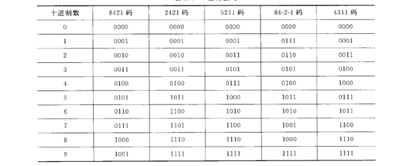

# 计算机系统基础（五）十进制数的表示

> 我们知道计算机中数字都是使用的二进制表示和运算，对于我们熟悉的十进制数字，可以通过数值进制公式进行转换后计算和显示。
>
> 但除了这种编码方式之外，计算机有时为了显示和计算方便，对十进制还定义了新的编码方式：ASCII码字符表示、BCD码表示。这篇文章我们来了解一下这2种编码方式的特点。

# ASCCI码字符表示

如果只是对十进制数进行打印或显示，那么可以把十进制数看成字符串，直接用ASCII码表示，0~~9分别对应ASCII码的30H~~39H，这种表示方式，1位十进制用8位二进制数表示。

用ASCII码表示的十进制又分为**前分隔数字串**和**后嵌入数字串**。

## 前分隔数字串

前分隔数字串将符号位单独用一个字节表示，放在数字串之前。

正号（+）用ASCII码2B(H)表示，符号（-）用2D(H)表示。

例如十进制数+236用前分隔数字串表示为`0010 1011 0011 0010 0011 0011 0011 0110`，对应的十六进制为`2B 32 33 36`，在内存中占用4个字节。

十进制数-2369用前分隔数字串表示为`0010 1101 0011 0010 0011 0011 0011 0110 0011 1001`，对应的十六进制为`2D 32 33 36 39`，在内存中占用5个字节。

可见，十进制数每增加一位，就要多一个字节表示对应数字。

## 后嵌入数字串

后嵌入数字串的符号位不单独用一个字节表示，而是嵌入到最低一位数字的ASCII码中。

正数的最低一位数字编码不变，负数的最低一位数字编码的高4位由原来的`0011`变为`0111`。

同样是上面2个数字，+236用后嵌入数字串方式表示为`0011 0010 0011 0011 0011 0110`，对应的十六进制为`32 33 36`，在内存中占用3个字节。

十进制-2369用后嵌入数字串方式表示为`0011 0010 0011 0011 0011 0110 0111 1001`，对应的十六进制为`32 33 36 79`，在内存中占用4个字节。

后嵌入数字串方式比前分隔数字串方式少占用一个字节，但对于负数来说，最低一位数字不是采用十进制数字的ASCII码，所以在显示或打印前必须先转换成可打印字符编码。

用ASCII码表示十进制是为了方便十进制数的输入和输出，但这种方式对于十进制数的计算很不方便。如果要对这种十进制数字进行计算，则必须要转换成二进制数或用BCD码表示十进制了。

# BCD码表示

在数据输入输出量很大的商用领域，由于涉及到非常多的十进制数字计算，如果每次都要转换为二进制计算，再转换回十进制显示，那么这之间会对硬件的运算造成较大压力。如何解决这个问题，BCD码就是一种解决大量十进制数输入、输出、运算的场景的一种编码方式。计算机中可用专门的逻辑线路对BCD码进行计算。

十进制0~9共10个数字，因此可用4位二进制位表示即可。4位二进制位可以组合出16种状态，所以从16种状态中选取10种状态就可以表示十进制数，并且可以产生多种BCD码。

BCD码又分为有权BCD码和无权BCD码。

## 有权BCD码

有权码是指表示每个十进制数位的4个二进制位，都有一个确定的权，以下是常用的几种有权码方案：

其中最常用的编码是842码，它选取4位二进制数并按顺序取前10个代码与十进制数字对应，每位权从左到右分贝为8、4、2、1，因此称为8421码。

## 无权BCD码

与有权码相对应，每个十进制位没有确定的权，这种编码叫做无权码。

无权码方案中用的较多的是余3码和格码：

余3码是在8421码的基础上，把每个代码都加0011形成的，优点是执行十进制数加法时，能正确进位，且减法运算提供便利。

格雷码规则是任何两个相邻的代码只有一个二进制位的状态不同，其余3个二进制必须相同，这样设计的好处在于从一个编码变到下一个编码试，只有一位发生变化，变码速度最快，利于电路的设计和运行。

使用BCD码会耗费更多的设备量，所以通常情况下，计算机内部一般使用二进制数进行数据的表示和运算。

# 总结

我们总结十进制数的编码方案：

- 十进制数字除了用数值进制转换编码外，还可以用ASCII码和BCD码进行编码和运算
- ASCII码一般用于输入和输出的表示，转换位数一一对应，简单直观
- BCD码则用于大量商业运算领域，减少十进制和二进制大量转换而提出的编码方案
- 计算机内部一般还是使用二进制数对数据进行表示和运算，我们对十进制数的编码方案了解即可