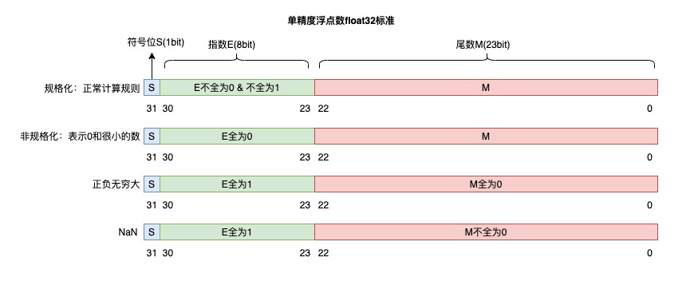

# 计算机系统基础-浮点数

在上一篇文章中，我们主要介绍了在计算机中使用定点数表示数字的方式。

简单回顾一下，简单来说，用定点数表示数字时，会约定小数点的位置固定不变，整数部分和小数部分分别转换为二进制，就是定点数的结果。

但用定点数表示小数时，存在数值范围、精度范围有限的缺点，所以在计算机中，我们一般使用「浮点数」来表示小数。

这篇文章，我们就来详细看一下浮点数到底是如何表示小数的，以及浮点数的的范围和精度有多大。

# 什么是浮点数？

首先，我们需要理解什么是浮点数？

之前我们学习了定点数，其中「定点」指的是约定小数点位置固定不变。那浮点数的「浮点」就是指，其小数点的位置是可以是**漂浮不定**的。

这怎么理解呢？

其实，浮点数是采用科学计数法的方式来表示的，例如十进制小数 8.345，用科学计数法表示，可以有多种方式：

``` console
8.345 = 8.345 * 10^0
8.345 = 83.45 * 10^-1
8.345 = 834.5 * 10^-2
...
```

看到了吗？用这种科学计数法的方式表示小数时，小数点的位置就变得「漂浮不定」了，这就是相对于定点数，浮点数名字的由来。

使用同样的规则，对于二进制数，我们也可以用科学计数法表示，也就是说把基数 10 换成 2 即可。

# 浮点数如何表示数字？

我们已经知道，浮点数是采用科学计数法来表示一个数字的，它的格式可以写成这样：

```
V = (-1)^S * M * R^E
```

其中各个变量的含义如下：

- S：符号位，取值 0 或 1，决定一个数字的符号，0 表示正，1 表示负
- M：尾数，用小数表示，例如前面所看到的 8.345 * 10^0，8.345 就是尾数
- R：基数，表示十进制数 R 就是 10，表示二进制数 R 就是 2
- E：指数，用整数表示，例如前面看到的 10^-1，-1 即是指数

如果我们要在计算机中，用浮点数表示一个数字，只需要确认这几个变量即可。

假设现在我们用 32 bit 表示一个浮点数，把以上变量按照一定规则，填充到这些 bit 上就可以了：


假设我们定义如下规则来填充这些 bit：

- 符号位 S 占 1 bit
- 指数 E 占 10 bit
- 尾数 M 占 21 bit

按照这个规则，将十进制数 25.125 转换为浮点数，转换过程就是这样的（D代表十进制，B代表二进制）：

1. 整数部分：25(D) = 11001(B)
2. 小数部分：0.125(D) = 0.001(B)
3. 用二进制科学计数法表示：25.125(D) = 11001.001(B) = 1.1001001 * 2^4(B)

所以符号位 S = 0，尾数 M = 1.001001(B)，指数 E = 4(D) = 100(B)。

按照上面定义的规则，填充到 32 bit 上，就是这样：


浮点数的结果就出来了，是不是很简单？

但这里有个问题，我们刚才定义的规则，符号位 S 占 1 bit，指数位 E 占 10 bit，尾数 M 占 21 bit，这个规则是我们拍脑袋随便定义出来的。

如果你也想定一个新规则，例如符号位 S 占 1 bit，指数位 E 这次占 5 bit，尾数 M 占 25 bit，是否也可以？当然可以。

按这个规则来，那浮点数表示出来就是这样：

我们可以看到，指数和尾数分配的位数不同，会产生以下情况：

1. 指数位越多，尾数位则越少，其表示的范围越大，但精度就会变差，反之，指数位越少，尾数位则越多，表示的范围越小，但精度就会变好
2. 一个数字的浮点数格式，会因为定义的规则不同，得到的结果也不同，表示的范围和精度也有差异

早期人们提出浮点数定义时，就是这样的情况，当时有很多计算机厂商，例如IBM、微软等，每个计算机厂商会定义自己的浮点数规则，不同厂商对同一个数表示出的浮点数是不一样的。

这就会导致，一个程序在不同厂商下的计算机中做浮点数运算时，需要先转换成这个厂商规定的浮点数格式，才能再计算，这也必然加重了计算的成本。

那怎么解决这个问题呢？业界迫切需要一个统一的浮点数标准。

# 浮点数标准

直到1985年，IEEE 组织推出了浮点数标准，就是我们经常听到的 **IEEE754 浮点数标准**，这个标准统一了浮点数的表示形式，并提供了 2 种浮点格式：

- 单精度浮点数 float：32 位，符号位 S 占 1 bit，指数 E 占 8 bit，尾数 M 占 23 bit
- 双精度浮点数 float：64 位，符号位 S 占 1 bit，指数 E 占 11 bit，尾数 M 占 52 bit

为了使其表示的数字范围、精度最大化，浮点数标准还对指数和尾数进行了规定：

1. 尾数 M 的第一位总是 1（因为 1 <= M < 2），因此这个 1 可以省略不写，它是个**隐藏位**，这样单精度 23 位尾数可以表示了 24 位有效数字，双精度 52 位尾数可以表示 53 位有效数字
2. 指数 E 是个无符号整数，表示 float 时，一共占 8 bit，所以它的取值范围为 0 ~ 255。但因为指数可以是负的，所以规定在存入 E 时在它原本的值加上一个**中间数** 127，这样 E 的取值范围为 -127 ~ 128。表示 double 时，一共占 11 bit，存入 E 时加上中间数 1023，这样取值范围为 -1023 ~ 1024。

除了规定尾数和指数位，还做了以下规定：

- 指数 E 非全 0 且非全 1：规格化数字，按上面的规则正常计算
- 指数 E 全 0，尾数非 0：非规格化数，尾数隐藏位不再是 1，而是 0(M = 0.xxxxx)，这样可以表示 0 和很小的数
- 指数 E 全 1，尾数全 0：正无穷大/负无穷大（正负取决于 S 符号位）
- 指数 E 全 1，尾数非 0：NaN(Not a Number)

[](https://kaito-blog-1253469779.cos.ap-beijing.myqcloud.com/2020/12/16090749848677.jpg)

# 标准浮点数的表示

有了这个统一的浮点数标准，我们再把 25.125 转换为标准的 float 浮点数：

1. 整数部分：25(D) = 11001(B)
2. 小数部分：0.125(D) = 0.001(B)
3. 用二进制科学计数法表示：25.125(D) = 11001.001(B) = 1.1001001 * 2^4(B)

所以 S = 0，尾数 M = 1.001001 = 001001(去掉1，隐藏位)，指数 E = 4 + 127(中间数) = 135(D) = 10000111(B)。填充到 32 bit 中，如下：

[](https://kaito-blog-1253469779.cos.ap-beijing.myqcloud.com/2020/12/16090678516830.jpg)

这就是标准 32 位浮点数的结果。

如果用 double 表示，和这个规则类似，指数位 E 用 11 bit 填充，尾数位 M 用 52 bit 填充即可。

# 浮点数为什么有精度损失？

我们再来看一下，平时经常听到的浮点数会有精度损失的情况是怎么回事？

如果我们现在想用浮点数表示 0.2，它的结果会是多少呢？

0.2 转换为二进制数的过程为，不断乘以 2，直到不存在小数为止，在这个计算过程中，得到的整数部分从上到下排列就是二进制的结果。

```
0.2 * 2 = 0.4 -> 0
0.4 * 2 = 0.8 -> 0
0.8 * 2 = 1.6 -> 1
0.6 * 2 = 1.2 -> 1
0.2 * 2 = 0.4 -> 0（发生循环）
...
```

所以 0.2(D) = 0.00110…(B)。

因为十进制的 0.2 无法精确转换成二进制小数，而计算机在表示一个数字时，宽度是有限的，无限循环的小数存储在计算机时，只能被截断，所以就会导致小数精度发生损失的情况。

# 浮点数的范围和精度有多大？

最后，我们再来看一下，用浮点数表示一个数字，其范围和精度能有多大？

以单精度浮点数 float 为例，它能表示的最大二进制数为 +1.1.11111…1 * 2^127（小数点后23个1），而二进制 1.11111…1 ≈ 2，所以 float 能表示的最大数为 2^128 = 3.4 * 10^38，即 float 的表示范围为：-3.4 * 10^38 ~ 3.4 * 10 ^38。

它能表示的精度有多小呢？

float 能表示的最小二进制数为 0.0000….1（小数点后22个0，1个1），用十进制数表示就是 1/2^23。

用同样的方法可以算出，double 能表示的最大二进制数为 +1.111…111（小数点后52个1） * 2^1023 ≈ 2^1024 = 1.79 * 10^308，所以 double 能表示范围为：-1.79 * 10^308 ~ +1.79 * 10^308。

double 的最小精度为：0.0000…1(51个0，1个1)，用十进制表示就是 1/2^52。

从这里可以看出，虽然浮点数的范围和精度也有限，但其范围和精度都已非常之大，所以在计算机中，对于小数的表示我们通常会使用浮点数来存储。

# float特殊值

我们知道float存储浮点数的形式是(±)1.b x 2 c 2^c2 
c
 ，因为尾数位前面一直是个1，所以无论b和c取什么样的值，都无法得到0，所以在float的表示方法中有一些特殊的约定，用来表示0已经其他的情况。

float的内存表示指数位数有8位，范围是[0, 255]，考虑偏移量实际的指数范围是[-127,128]，但实际情况下指数位表示一般数字时不允许同时取0或者同时取1，也就是指数位的实际范围是[-126,127]，而指数取-127和128时有其特殊含义，具体看下面表格：


# 总结

这篇文章我们主要讲了数字的浮点数表示方式，总结如下：

1. 浮点数一般用科学计数法表示
2. `float`的精度是保证至少`7`位有效数字是准确的
3. 把科学计数法中的变量，填充到固定 bit 中，即是浮点数的结果
4. 在浮点数提出的早期，各个计算机厂商各自制定自己的浮点数规则，导致不同厂商对于同一个数字的浮点数表示各不相同，在计算时还需要先进行转换才能进行计算
5. 后来 IEEE 组织提出了浮点数的标准，统一了浮点数的格式，并规定了单精度浮点数 float 和双精度浮点数 double，从此以后各个计算机厂商统一了浮点数的格式，一直延续至今
6. 浮点数在表示小数时，由于十进制小数在转换为二进制时，存在无法精确转换的情况，而在固定 bit 的计算机中存储时会被截断，所以浮点数表示小数可能存在精度损失
7. 浮点数在表示一个数字时，其范围和精度非常大，所以我们平时使用的小数，在计算机中通常用浮点数来存储